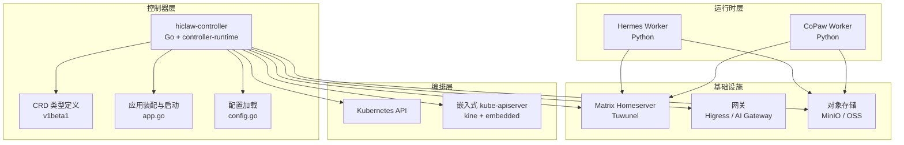
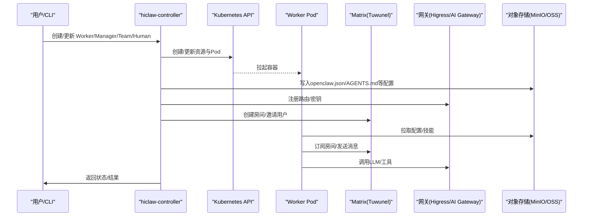
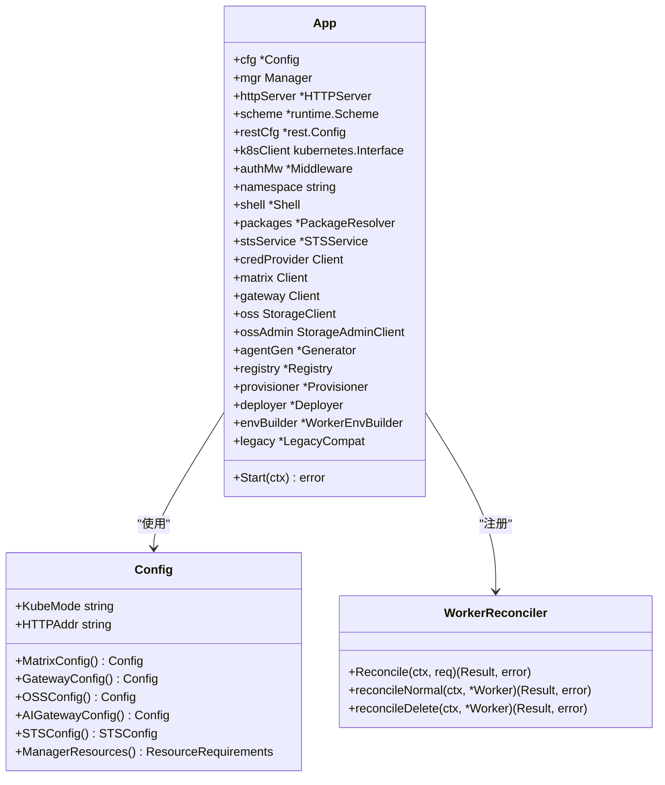
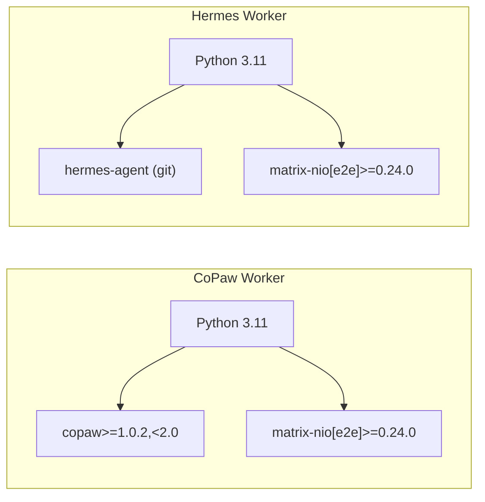
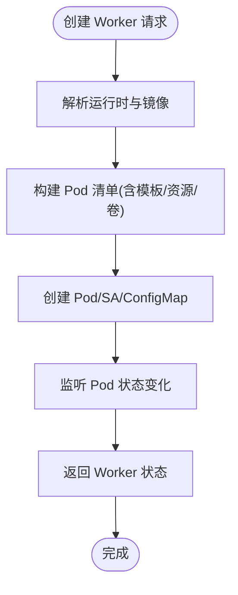
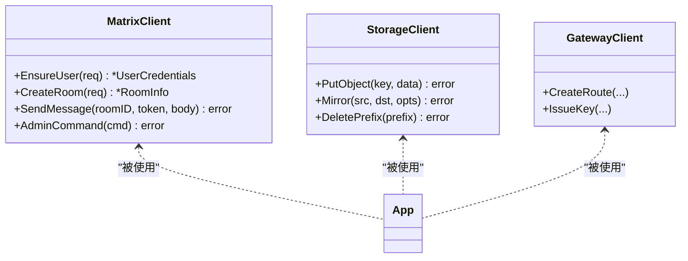
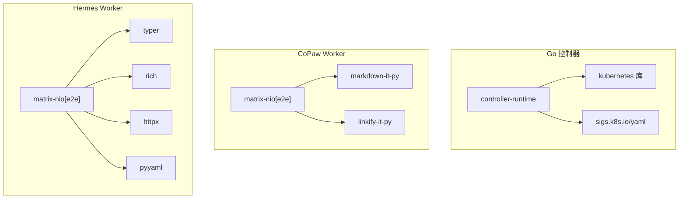

# 技术栈介绍

<cite>
**本文档引用的文件**
- [hiclaw-controller/go.mod](file://hiclaw-controller/go.mod)
- [hiclaw-controller/cmd/controller/main.go](file://hiclaw-controller/cmd/controller/main.go)
- [hiclaw-controller/Dockerfile](file://hiclaw-controller/Dockerfile)
- [hiclaw-controller/api/v1beta1/types.go](file://hiclaw-controller/api/v1beta1/types.go)
- [hiclaw-controller/internal/app/app.go](file://hiclaw-controller/internal/app/app.go)
- [hiclaw-controller/internal/config/config.go](file://hiclaw-controller/internal/config/config.go)
- [hiclaw-controller/internal/controller/worker_controller.go](file://hiclaw-controller/internal/controller/worker_controller.go)
- [hiclaw-controller/internal/backend/kubernetes.go](file://hiclaw-controller/internal/backend/kubernetes.go)
- [hiclaw-controller/internal/matrix/client.go](file://hiclaw-controller/internal/matrix/client.go)
- [hiclaw-controller/internal/executor/package.go](file://hiclaw-controller/internal/executor/package.go)
- [hiclaw-controller/internal/service/deployer.go](file://hiclaw-controller/internal/service/deployer.go)
- [hiclaw-controller/internal/oss/client.go](file://hiclaw-controller/internal/oss/client.go)
- [copaw/pyproject.toml](file://copaw/pyproject.toml)
- [copaw/Dockerfile](file://copaw/Dockerfile)
- [hermes/pyproject.toml](file://hermes/pyproject.toml)
- [hermes/Dockerfile](file://hermes/Dockerfile)
</cite>

## 目录
1. [引言](#引言)
2. [项目结构](#项目结构)
3. [核心组件](#核心组件)
4. [架构总览](#架构总览)
5. [详细组件分析](#详细组件分析)
6. [依赖关系分析](#依赖关系分析)
7. [性能考虑](#性能考虑)
8. [故障排查指南](#故障排查指南)
9. [结论](#结论)
10. [附录](#附录)

## 引言
本文件系统化梳理 HiClaw 的技术栈与实现，重点阐述：
- Go 在控制器开发中的优势与应用边界（基于 controller-runtime 的声明式控制循环）
- Python 在 Worker 运行时中的角色与生态（CoPaw、Hermes 两大 Worker 基座）
- Kubernetes 在容器编排中的核心地位与多后端支持
- 关键依赖库与框架的作用与意义（controller-runtime、kubernetes 库、matrix-nio 等）
- 技术选型原则：性能、可维护性、生态平衡
- 组件间的耦合关系与集成方式
- 版本兼容性与升级路径
- 面向不同技术背景读者的学习资源与背景知识

## 项目结构
HiClaw 采用“控制器 + 多运行时 Worker + 编排平台”的分层架构：
- 控制器层：hiclaw-controller（Go），负责 CRD 资源的生命周期管理、基础设施编排、配置下发与状态收敛
- 运行时层：copaw 与 hermes（Python）两大 Worker 基座，承载智能体代理能力
- 编排层：Kubernetes（含嵌入式模式），统一调度与资源管理
- 基础设施：Matrix 即时通讯、Higress/AI Gateway 网关、MinIO/OSS 对象存储

图表来源
- [hiclaw-controller/cmd/controller/main.go:16-36](file://hiclaw-controller/cmd/controller/main.go#L16-L36)
- [hiclaw-controller/internal/app/app.go:81-108](file://hiclaw-controller/internal/app/app.go#L81-L108)
- [hiclaw-controller/internal/config/config.go:207-356](file://hiclaw-controller/internal/config/config.go#L207-L356)

章节来源
- [hiclaw-controller/cmd/controller/main.go:16-36](file://hiclaw-controller/cmd/controller/main.go#L16-L36)
- [hiclaw-controller/internal/app/app.go:81-108](file://hiclaw-controller/internal/app/app.go#L81-L108)
- [hiclaw-controller/internal/config/config.go:207-356](file://hiclaw-controller/internal/config/config.go#L207-L356)

## 核心组件
- 控制器核心（Go）
  - 使用 controller-runtime 构建声明式控制器，围绕 Worker/Team/Human/Manager 四类 CRD 实现全生命周期管理
  - 内置 HTTP API 服务，提供 CLI 与外部系统对接
  - 支持嵌入式与生产级两种运行模式，分别内置 kube-apiserver 或接入集群
- Worker 运行时（Python）
  - CoPaw 与 Hermes 两大基座，均通过 Python 包管理与镜像构建
  - 以矩阵通信为统一入口，结合对象存储同步工作空间
- 编排与基础设施
  - Kubernetes 后端统一调度；Docker 后端用于嵌入式场景
  - Matrix/Tuwunel 提供即时通讯；Higress/AI Gateway 提供路由与网关能力；MinIO/OSS 提供对象存储

章节来源
- [hiclaw-controller/api/v1beta1/types.go:63-140](file://hiclaw-controller/api/v1beta1/types.go#L63-L140)
- [hiclaw-controller/internal/controller/worker_controller.go:30-55](file://hiclaw-controller/internal/controller/worker_controller.go#L30-L55)
- [hiclaw-controller/internal/backend/kubernetes.go:47-59](file://hiclaw-controller/internal/backend/kubernetes.go#L47-L59)
- [hiclaw-controller/internal/matrix/client.go:16-87](file://hiclaw-controller/internal/matrix/client.go#L16-L87)
- [hiclaw-controller/internal/oss/client.go:5-33](file://hiclaw-controller/internal/oss/client.go#L5-L33)

## 架构总览
控制器通过 controller-runtime 与 Kubernetes API 交互，按需创建/更新/删除 Worker/Manager/Team/Human 资源对应的 Pod/SA/ConfigMap 等对象，并将配置写入对象存储，由 Worker 侧通过矩阵通道与网关进行协作。

图表来源
- [hiclaw-controller/internal/app/app.go:432-496](file://hiclaw-controller/internal/app/app.go#L432-L496)
- [hiclaw-controller/internal/backend/kubernetes.go:151-313](file://hiclaw-controller/internal/backend/kubernetes.go#L151-L313)
- [hiclaw-controller/internal/service/deployer.go:135-258](file://hiclaw-controller/internal/service/deployer.go#L135-L258)
- [hiclaw-controller/internal/matrix/client.go:254-332](file://hiclaw-controller/internal/matrix/client.go#L254-L332)
- [hiclaw-controller/internal/oss/client.go:5-33](file://hiclaw-controller/internal/oss/client.go#L5-L33)

## 详细组件分析

### 控制器核心（Go）
- 初始化与装配
  - 通过 app.New 串联 Scheme、Infra Clients、Backends、Controller Manager、Auth、Service Layer、Reconcilers、HTTP Server 等模块
  - 支持嵌入式模式（内置 kube-apiserver + kine）与生产模式（incluster）
- 配置体系
  - 从环境变量解析多维度配置（网关、存储、矩阵、模型、可观测性等），并生成 Worker 环境变量默认值
- 控制器与资源
  - Worker/Team/Human/Manager 四类 Reconciler 将期望状态收敛到实际状态，处理生命周期、暴露端口、权限注入等
- 后端抽象
  - Kubernetes 与 Docker 双后端，统一 Worker 生命周期接口，便于在不同部署形态间切换

图表来源
- [hiclaw-controller/internal/app/app.go:41-79](file://hiclaw-controller/internal/app/app.go#L41-L79)
- [hiclaw-controller/internal/config/config.go:19-162](file://hiclaw-controller/internal/config/config.go#L19-L162)
- [hiclaw-controller/internal/controller/worker_controller.go:33-55](file://hiclaw-controller/internal/controller/worker_controller.go#L33-L55)

章节来源
- [hiclaw-controller/internal/app/app.go:81-175](file://hiclaw-controller/internal/app/app.go#L81-L175)
- [hiclaw-controller/internal/config/config.go:207-356](file://hiclaw-controller/internal/config/config.go#L207-L356)
- [hiclaw-controller/internal/controller/worker_controller.go:57-151](file://hiclaw-controller/internal/controller/worker_controller.go#L57-L151)

### Worker 运行时（Python）
- CoPaw Worker
  - 基于 Python 3.11，安装 copaw 及相关依赖，提供矩阵适配与技能同步能力
  - 通过 MinIO 客户端与控制器交互，拉取配置与技能
- Hermes Worker
  - 基于 hermes-agent，通过适配层替换底层传输，保留 mautrix 能力并叠加 HiClaw 策略钩子
  - 支持更丰富的多媒体与工具链能力

图表来源
- [copaw/pyproject.toml:12-17](file://copaw/pyproject.toml#L12-L17)
- [hermes/pyproject.toml:12-25](file://hermes/pyproject.toml#L12-L25)

章节来源
- [copaw/pyproject.toml:12-17](file://copaw/pyproject.toml#L12-L17)
- [hermes/pyproject.toml:12-25](file://hermes/pyproject.toml#L12-L25)

### Kubernetes 编排与后端
- Kubernetes 后端
  - 通过 Pod/SA/ConfigMap 等原语创建 Worker 容器，注入服务账号令牌与运行时环境
  - 支持资源限制与覆盖、主机别名、模板覆盖等高级特性
- Docker 后端（嵌入式）
  - 在控制器容器内通过 Docker Socket 管理 Worker 容器，适合本地开发与演示

图表来源
- [hiclaw-controller/internal/backend/kubernetes.go:151-313](file://hiclaw-controller/internal/backend/kubernetes.go#L151-L313)

章节来源
- [hiclaw-controller/internal/backend/kubernetes.go:47-146](file://hiclaw-controller/internal/backend/kubernetes.go#L47-L146)

### 基础设施集成
- Matrix（Tuwunel）
  - 提供用户注册、房间创建/加入/离开、消息发送、管理员命令等能力
  - 通过缓存管理员令牌与房间 ID，降低重复认证开销
- 网关（Higress/AI Gateway）
  - 通过控制器配置路由与消费者密钥，为 Worker 提供统一的 LLM/工具访问入口
- 对象存储（MinIO/OSS）
  - 作为 Worker 工作空间与配置中心，支持镜像同步、增量更新与清理

图表来源
- [hiclaw-controller/internal/matrix/client.go:16-87](file://hiclaw-controller/internal/matrix/client.go#L16-L87)
- [hiclaw-controller/internal/oss/client.go:5-33](file://hiclaw-controller/internal/oss/client.go#L5-L33)
- [hiclaw-controller/internal/app/app.go:209-261](file://hiclaw-controller/internal/app/app.go#L209-L261)

章节来源
- [hiclaw-controller/internal/matrix/client.go:16-87](file://hiclaw-controller/internal/matrix/client.go#L16-L87)
- [hiclaw-controller/internal/oss/client.go:5-33](file://hiclaw-controller/internal/oss/client.go#L5-L33)
- [hiclaw-controller/internal/app/app.go:209-261](file://hiclaw-controller/internal/app/app.go#L209-L261)

## 依赖关系分析
- Go 控制器依赖
  - controller-runtime：构建控制器与客户端
  - kubernetes 库：与集群交互
  - yaml：CRD 与配置序列化
- Python Worker 依赖
  - matrix-nio：矩阵通信
  - markdown-it-py/linkify-it-py：消息渲染与链接识别
  - 其他：typer、rich、httpx、pyyaml 等

图表来源
- [hiclaw-controller/go.mod:5-18](file://hiclaw-controller/go.mod#L5-L18)
- [copaw/pyproject.toml:12-17](file://copaw/pyproject.toml#L12-L17)
- [hermes/pyproject.toml:12-25](file://hermes/pyproject.toml#L12-L25)

章节来源
- [hiclaw-controller/go.mod:5-18](file://hiclaw-controller/go.mod#L5-L18)
- [copaw/pyproject.toml:12-17](file://copaw/pyproject.toml#L12-L17)
- [hermes/pyproject.toml:12-25](file://hermes/pyproject.toml#L12-L25)

## 性能考虑
- 控制器层面
  - 使用 controller-runtime 的缓存与索引机制，减少对 API Server 的轮询压力
  - 通过字段索引（如团队成员名）加速反向查询
  - 嵌入式模式下，仅在领导者选举成功后再执行初始化，避免重复初始化
- 运行时层面
  - Python Worker 使用 jemalloc 减少内存碎片
  - 对象存储采用 mc 镜像同步，避免频繁小文件读写
- 编排层面
  - Kubernetes 后端支持资源请求/限制与模板覆盖，保障资源隔离与弹性

章节来源
- [hiclaw-controller/internal/app/app.go:298-336](file://hiclaw-controller/internal/app/app.go#L298-L336)
- [hiclaw-controller/internal/backend/kubernetes.go:386-429](file://hiclaw-controller/internal/backend/kubernetes.go#L386-L429)
- [copaw/Dockerfile:44-48](file://copaw/Dockerfile#L44-L48)

## 故障排查指南
- 控制器启动失败
  - 检查嵌入式模式数据目录与 CRD 目录是否正确挂载
  - 确认控制器名称与命名空间配置是否满足 leader election 要求
- Worker 无法上线
  - 核对对象存储端点与凭据是否正确
  - 检查矩阵服务器连通性与注册令牌
- 网关路由异常
  - 确认消费者密钥与路由配置是否一致
- Python Worker 启动报错
  - 检查 Python 版本与依赖安装（matrix-nio、markdown-it-py 等）
  - 确认 jemalloc 预加载与 mc 包装脚本可用

章节来源
- [hiclaw-controller/Dockerfile:57-58](file://hiclaw-controller/Dockerfile#L57-L58)
- [hiclaw-controller/internal/config/config.go:565-596](file://hiclaw-controller/internal/config/config.go#L565-L596)
- [hiclaw-controller/internal/matrix/client.go:227-252](file://hiclaw-controller/internal/matrix/client.go#L227-L252)
- [copaw/Dockerfile:116-131](file://copaw/Dockerfile#L116-L131)
- [hermes/Dockerfile:151-174](file://hermes/Dockerfile#L151-L174)

## 结论
HiClaw 的技术栈在“声明式控制器 + 多运行时 Worker + 统一编排平台”上实现了高内聚、低耦合的分布式智能体编排体系。Go 在控制器层提供了稳定高效的控制回路与基础设施编排能力；Python 在 Worker 层提供了灵活易扩展的智能体基座；Kubernetes 则提供了统一的资源与网络抽象。通过对象存储、矩阵与网关的协同，系统在性能、可维护性与生态兼容之间取得了良好平衡。

## 附录

### 技术选型原则与考量
- 性能
  - 控制器：缓存、索引、领导者模式减少冲突
  - 运行时：jemalloc、镜像同步、资源限制
- 可维护性
  - 声明式 CRD + controller-runtime，状态收敛清晰
  - 分层模块化设计，职责分离明确
- 生态平衡
  - Go 生态（controller-runtime、kubernetes 库）成熟稳定
  - Python 生态（matrix-nio、copaw/hermes）丰富且活跃
  - Kubernetes 生态（Higress/AI Gateway、MinIO/OSS）广泛可用

### 组件间技术耦合关系与集成方式
- 控制器与 Kubernetes：通过 controller-runtime 与 client-go 进行资源编排
- 控制器与基础设施：通过矩阵、网关、对象存储客户端进行集成
- 控制器与 Worker：通过对象存储同步配置，通过矩阵进行通信
- Worker 与基础设施：通过矩阵与网关进行消息与工具调用

章节来源
- [hiclaw-controller/internal/app/app.go:190-261](file://hiclaw-controller/internal/app/app.go#L190-L261)
- [hiclaw-controller/internal/service/deployer.go:135-258](file://hiclaw-controller/internal/service/deployer.go#L135-L258)
- [hiclaw-controller/internal/matrix/client.go:16-87](file://hiclaw-controller/internal/matrix/client.go#L16-L87)
- [hiclaw-controller/internal/oss/client.go:5-33](file://hiclaw-controller/internal/oss/client.go#L5-L33)

### 版本兼容性与升级路径
- Go 语言与依赖
  - Go 版本：1.25
  - controller-runtime：0.21
  - Kubernetes 库：0.35.x
- Python 运行时
  - CoPaw：Python >= 3.10
  - Hermes：Python >= 3.11
- 升级建议
  - 控制器：先升级 Go 与 controller-runtime，再升级 Kubernetes 库
  - Worker：先升级 Python 与依赖，再升级镜像
  - 基础设施：确保对象存储、矩阵、网关版本兼容

章节来源
- [hiclaw-controller/go.mod:3-18](file://hiclaw-controller/go.mod#L3-L18)
- [copaw/pyproject.toml:11-11](file://copaw/pyproject.toml#L11-L11)
- [hermes/pyproject.toml:11-11](file://hermes/pyproject.toml#L11-L11)

### 学习资源与背景知识
- Go
  - controller-runtime 官方文档与示例
  - Kubernetes 客户端库与 CRD 开发指南
- Python
  - matrix-nio 文档与示例
  - pip/setuptools 与虚拟环境管理
- Kubernetes
  - Pod/ServiceAccount/ConfigMap/Ingress 基础概念
  - 资源清单与控制器模式
- 基础设施
  - Matrix 即时通讯协议与房间管理
  - Higress/AI Gateway 路由与密钥管理
  - MinIO/OSS 对象存储与权限策略