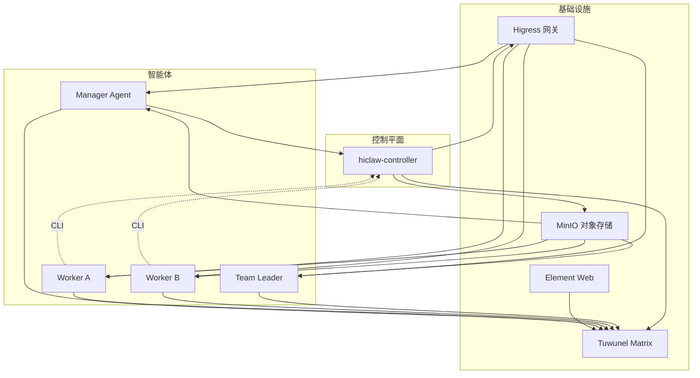
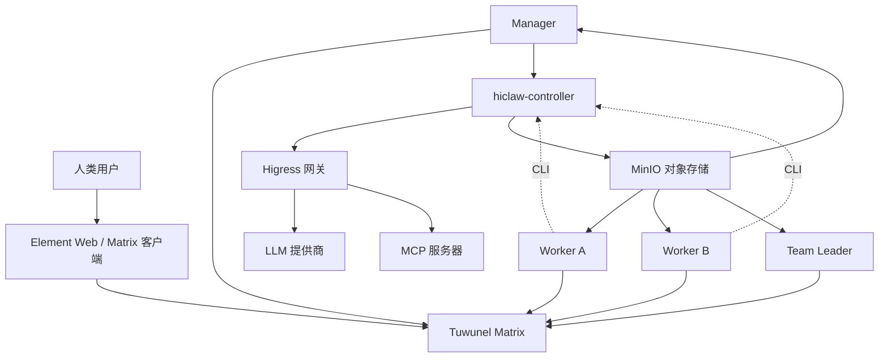
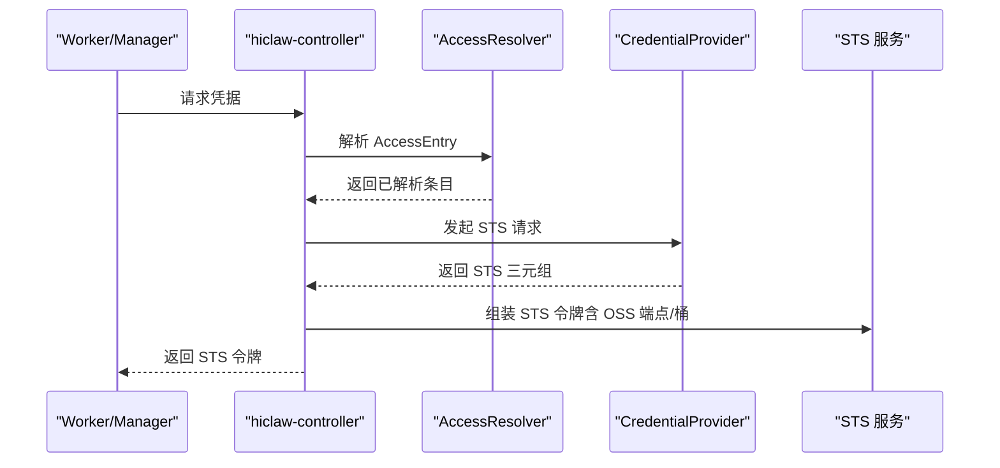
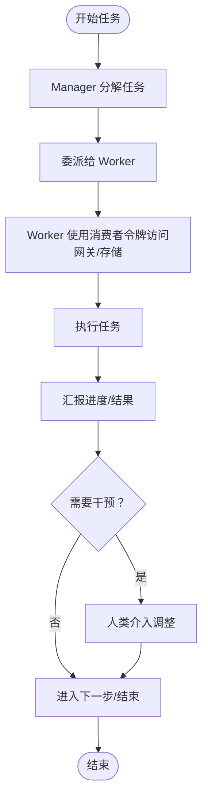
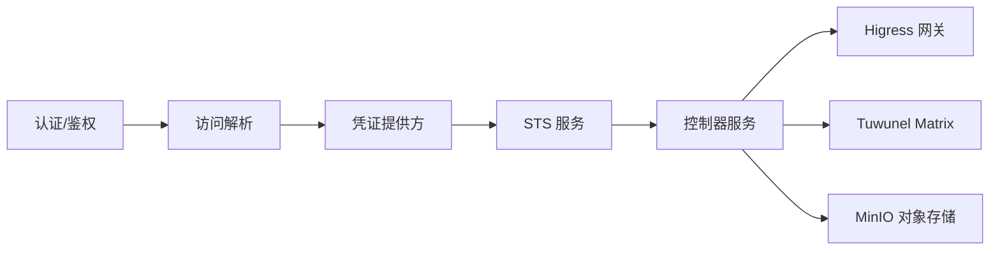

# 核心价值与理念

<cite>
**本文引用的文件**
- [README.md](file://README.md)
- [docs/architecture.md](file://docs/architecture.md)
- [hiclaw-controller/internal/credentials/sts.go](file://hiclaw-controller/internal/credentials/sts.go)
- [hiclaw-controller/internal/credentials/types.go](file://hiclaw-controller/internal/credentials/types.go)
- [hiclaw-controller/internal/credprovider/types.go](file://hiclaw-controller/internal/credprovider/types.go)
- [hiclaw-controller/internal/credprovider/client.go](file://hiclaw-controller/internal/credprovider/client.go)
- [hiclaw-controller/internal/server/credentials_handler.go](file://hiclaw-controller/internal/server/credentials_handler.go)
- [hiclaw-controller/internal/service/credentials.go](file://hiclaw-controller/internal/service/credentials.go)
- [hiclaw-controller/internal/accessresolver/resolver.go](file://hiclaw-controller/internal/accessresolver/resolver.go)
- [hiclaw-controller/internal/gateway/types.go](file://hiclaw-controller/internal/gateway/types.go)
- [hiclaw-controller/internal/matrix/types.go](file://hiclaw-controller/internal/matrix/types.go)
- [hiclaw-controller/internal/oss/types.go](file://hiclaw-controller/internal/oss/types.go)
- [copaw/README.md](file://copaw/README.md)
- [hermes/README.md](file://hermes/README.md)
</cite>

## 目录
1. [引言](#引言)
2. [项目结构](#项目结构)
3. [核心组件](#核心组件)
4. [架构总览](#架构总览)
5. [详细组件分析](#详细组件分析)
6. [依赖关系分析](#依赖关系分析)
7. [性能考量](#性能考量)
8. [故障排查指南](#故障排查指南)
9. [结论](#结论)
10. [附录](#附录)

## 引言
本文件系统性阐述 HiClaw 作为开源多智能体协作平台的核心价值与理念，聚焦以下关键主张：
- 企业级安全：通过“消费者令牌”隔离真实凭据，实现零凭据暴露的安全模型
- 完全私有化部署：自建 Matrix、Higress 网关、MinIO，消除供应商锁定与数据收割风险
- 人类在回路（Human-in-the-Loop）：所有协作过程可见、可干预，无黑箱操作
- Manager-Workers 架构：以 Manager 为中心编排多个 Worker，实现智能体间自主协作，无需人工持续监督单个 Worker
- 多运行时协同：OpenClaw、CoPaw、Hermes 在同一 IM 房间内协作，各司其职，互补优势

## 项目结构
HiClaw 采用分层与模块化组织方式：
- 控制平面（hiclaw-controller）：Kubernetes 原生控制面，负责 Worker/Manager/Team/Human 资源的声明式管理、生命周期编排、凭据发放、网关路由与策略下发
- 运行时（Manager 与 Worker）：轻量容器镜像，内置 Agent 运行时与技能生态，通过共享存储与网关进行可信交互
- 基础设施（Higress 网关、Tuwunel Matrix、MinIO、Element Web）：统一对外提供 AI 流量代理、即时通讯、对象存储与前端访问

图表来源
- [docs/architecture.md:19-82](file://docs/architecture.md#L19-L82)

章节来源
- [docs/architecture.md:1-235](file://docs/architecture.md#L1-L235)
- [README.md:13-52](file://README.md#L13-L52)

## 核心组件
- 控制器（hiclaw-controller）
  - 负责 CRD（Worker/Manager/Team/Human）的协调与生命周期管理
  - 提供凭据服务（STS）、网关消费者与路由管理、矩阵用户与房间管理、对象存储策略与同步
- 管理员（Manager Agent）
  - 协调任务、团队与人员，编排 Worker 执行具体工作；在 Matrix 房间中保持全程可见与可干预
- 工作者（Worker）
  - 任务执行单元，使用“消费者令牌”访问网关与存储，不持有真实凭据
- 基础设施
  - Higress：AI 网关与 API 网关，集中管理消费密钥与路由
  - Tuwunel：Matrix 自托管服务器，支持端到端加密与房间策略
  - MinIO：共享对象存储，持久化 Worker 工作空间与共享任务树
  - Element Web：零配置浏览器客户端

章节来源
- [docs/architecture.md:10-16](file://docs/architecture.md#L10-L16)
- [README.md:26-30](file://README.md#L26-L30)

## 架构总览
HiClaw 将“基础设施”“控制平面”“智能体”三层解耦：
- 基础设施层：Higress、Tuwunel、MinIO、Element Web 由控制器统一编排或以 Helm 子图形式托管
- 控制平面：控制器负责资源编排、凭据发放、路由授权、矩阵房间与用户管理
- 智能体层：Manager 与 Worker 通过 Matrix 通信，经 Higress 访问上游 LLM 与 MCP 服务，通过 MinIO 共享状态

图表来源
- [docs/architecture.md:23-82](file://docs/architecture.md#L23-L82)

章节来源
- [docs/architecture.md:1-235](file://docs/architecture.md#L1-L235)

## 详细组件分析

### 企业级安全：消费者令牌与零凭据暴露
HiClaw 的安全模型以“消费者令牌”为核心，Worker 仅持有短期、受控的令牌，真实凭据（如 API Key、GitHub PAT）由网关集中管理，无法被 Worker 或攻击者直接获取。

- 凭据发放链路
  - Worker/Manager 向控制器发起凭据请求
  - 控制器解析访问条目（AccessEntry），生成针对对象存储与 AI 网关的最小权限策略
  - 通过凭证提供方（Credential Provider）签发短期 STS 三元组
  - 返回包含 OSS 端点与桶名的令牌，Worker 使用该令牌访问 MinIO 与网关

图表来源
- [hiclaw-controller/internal/server/credentials_handler.go:21-42](file://hiclaw-controller/internal/server/credentials_handler.go#L21-L42)
- [hiclaw-controller/internal/credentials/sts.go:63-89](file://hiclaw-controller/internal/credentials/sts.go#L63-L89)
- [hiclaw-controller/internal/credprovider/client.go:43-84](file://hiclaw-controller/internal/credprovider/client.go#L43-L84)
- [hiclaw-controller/internal/accessresolver/resolver.go:55-78](file://hiclaw-controller/internal/accessresolver/resolver.go#L55-L78)

- 关键要点
  - STS 令牌包含短期凭据与静态 OSS 端点/桶信息，不携带真实密钥
  - 访问条目在控制器侧被解析为最小权限策略，避免过度授权
  - 凭证提供方只在受控环境中存在，且仅用于签发短期令牌

章节来源
- [README.md:42-43](file://README.md#L42-L43)
- [hiclaw-controller/internal/credentials/types.go:3-12](file://hiclaw-controller/internal/credentials/types.go#L3-L12)
- [hiclaw-controller/internal/credprovider/types.go:20-74](file://hiclaw-controller/internal/credprovider/types.go#L20-L74)
- [hiclaw-controller/internal/credentials/sts.go:12-53](file://hiclaw-controller/internal/credentials/sts.go#L12-L53)
- [hiclaw-controller/internal/oss/types.go:16-38](file://hiclaw-controller/internal/oss/types.go#L16-L38)

### 完全私有化部署：自建基础设施，消除供应商锁定
HiClaw 支持两种部署形态：
- 本地嵌入式（Embedded）：控制器容器内集成 Higress、Tuwunel、MinIO、Element Web 与控制器进程，适合单机快速体验
- Kubernetes 原生（Helm Chart）：Higress、Tuwunel、MinIO、Element Web 作为独立子图或外部服务，适合生产与多区域部署

- 私有化优势
  - 自建 Matrix 与 MinIO，避免第三方数据采集与二次利用
  - 可按需替换 AI 网关与 MCP 服务，避免供应商锁定
  - 通过 Helm Values 配置镜像仓库与网络出口，降低地域与合规风险

章节来源
- [docs/architecture.md:104-116](file://docs/architecture.md#L104-L116)
- [README.md:110-118](file://README.md#L110-L118)
- [README.md:44](file://README.md#L44)

### 人类在回路：全程可见、随时干预
- Matrix 房间即协作现场：Manager、Worker 与人类共同参与，消息时间线公开透明
- 人类可随时介入：在任务执行过程中提出修改意见、调整策略、终止流程
- 心跳与状态：Manager 通过心跳与状态上报，确保人类可感知协作进展

章节来源
- [README.md:46-48](file://README.md#L46-L48)
- [docs/architecture.md:119-126](file://docs/architecture.md#L119-L126)

### Manager-Workers 架构：智能体自治协作，减少人工监督
- Manager 职责
  - 任务分解与委派、团队与人员管理、房间与策略治理、与网关/存储/矩阵的集成
- Worker 职责
  - 执行具体任务，使用消费者令牌访问网关与存储，保持无状态与可替换
- 自主协作
  - 通过 Matrix mentions 实现跨 Worker 协作，Manager 作为中枢协调，无需人工持续监督每个 Worker

图表来源
- [README.md:21](file://README.md#L21)
- [docs/architecture.md:140-162](file://docs/architecture.md#L140-L162)

章节来源
- [README.md:15-17](file://README.md#L15-L17)
- [docs/architecture.md:140-162](file://docs/architecture.md#L140-L162)

### 多运行时协同：OpenClaw/CoPaw/Hermes 各司其职
- OpenClaw/CoPaw：通用型 Agent，擅长任务编排与工具调用
- Hermes：自主编码 Agent，具备终端沙箱、自我改进能力与持久记忆
- 协同方式：在同一 Matrix 房间内通过 mentions 协作，策略与加密策略统一，保证一致的运营行为

章节来源
- [README.md:29](file://README.md#L29)
- [copaw/README.md:1-18](file://copaw/README.md#L1-L18)
- [hermes/README.md:1-82](file://hermes/README.md#L1-L82)

## 依赖关系分析
- 控制器内部模块
  - 认证与鉴权：从请求上下文提取调用者身份（角色、名称、团队）
  - 访问解析：将 CR 中的访问条目解析为凭证提供方可接受的最小权限集合
  - 凭证提供：向 Sidecar 发起 STS 请求，返回短期令牌
  - 服务编排：管理矩阵用户/房间、对象存储策略、网关消费者与路由
- 外部依赖
  - Higress：AI 网关与 MCP 服务路由
  - Tuwunel：Matrix 服务器
  - MinIO：对象存储与共享工作区
  - Element Web：浏览器客户端

图表来源
- [hiclaw-controller/internal/accessresolver/resolver.go:55-78](file://hiclaw-controller/internal/accessresolver/resolver.go#L55-L78)
- [hiclaw-controller/internal/credprovider/client.go:43-84](file://hiclaw-controller/internal/credprovider/client.go#L43-L84)
- [hiclaw-controller/internal/credentials/sts.go:63-89](file://hiclaw-controller/internal/credentials/sts.go#L63-L89)
- [hiclaw-controller/internal/server/credentials_handler.go:21-42](file://hiclaw-controller/internal/server/credentials_handler.go#L21-L42)

章节来源
- [hiclaw-controller/internal/accessresolver/resolver.go:1-345](file://hiclaw-controller/internal/accessresolver/resolver.go#L1-L345)
- [hiclaw-controller/internal/credprovider/types.go:1-75](file://hiclaw-controller/internal/credprovider/types.go#L1-L75)
- [hiclaw-controller/internal/credentials/sts.go:1-90](file://hiclaw-controller/internal/credentials/sts.go#L1-L90)
- [hiclaw-controller/internal/server/credentials_handler.go:1-43](file://hiclaw-controller/internal/server/credentials_handler.go#L1-L43)

## 性能考量
- 轻量化镜像与可替换 Worker：Worker 为无状态容器，便于弹性扩缩容与故障恢复
- 共享存储与增量同步：通过 MinIO 与 mc 镜像同步，降低多智能体协作中的令牌消耗
- 网关聚合与路由缓存：Higress 集中管理路由与消费者，减少重复鉴权开销
- 端到端加密与策略一致性：统一的 Matrix 加密策略与房间策略，降低通信与合规成本

章节来源
- [README.md:25](file://README.md#L25)
- [docs/architecture.md:127-137](file://docs/architecture.md#L127-L137)

## 故障排查指南
- 日志导出与分析
  - 导出 Matrix 消息日志与 Agent 会话日志，结合代码库进行根因分析
- 常见问题定位
  - 凭据相关：检查凭据服务是否可用、STS 请求是否成功、AccessEntry 是否正确解析
  - 网关与路由：确认消费者密钥与允许列表、AI 路由是否存在
  - 矩阵与房间：核对用户注册令牌、房间别名与成员状态
  - 对象存储：验证桶与前缀权限、镜像同步策略

章节来源
- [README.md:355-378](file://README.md#L355-L378)
- [hiclaw-controller/internal/server/credentials_handler.go:21-42](file://hiclaw-controller/internal/server/credentials_handler.go#L21-L42)
- [hiclaw-controller/internal/gateway/types.go:11-37](file://hiclaw-controller/internal/gateway/types.go#L11-L37)
- [hiclaw-controller/internal/matrix/types.go:15-55](file://hiclaw-controller/internal/matrix/types.go#L15-L55)
- [hiclaw-controller/internal/oss/types.go:46-53](file://hiclaw-controller/internal/oss/types.go#L46-L53)

## 结论
HiClaw 以“消费者令牌”“私有化部署”“人类在回路”“Manager-Workers 架构”“多运行时协同”五大理念构建企业级多智能体协作平台。通过严格的凭据隔离与最小权限策略，实现零凭据暴露的安全模型；通过自建基础设施与声明式资源管理，消除供应商锁定与数据收割风险；通过 Matrix 房间与可见性设计，保障人类全程可控与可干预；通过 Manager 的中枢编排与 Worker 的自治协作，降低人工监督成本，提升整体协作效率与稳定性。

## 附录
- 术语
  - 消费者令牌：由控制器签发的短期凭据，用于访问网关与对象存储
  - AccessEntry：在 CR 中声明的访问条目，经解析后转换为最小权限策略
  - STS：安全令牌服务，颁发短期凭据三元组
  - 网关消费者：Higress 中基于密钥的身份实体，用于路由授权
- 参考资料
  - 架构文档：[docs/architecture.md](file://docs/architecture.md)
  - README：[README.md](file://README.md)