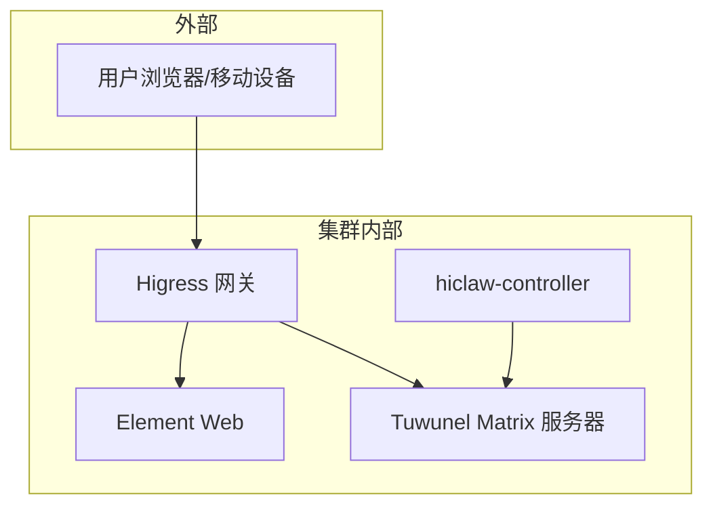
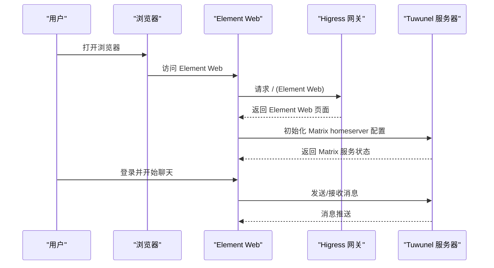
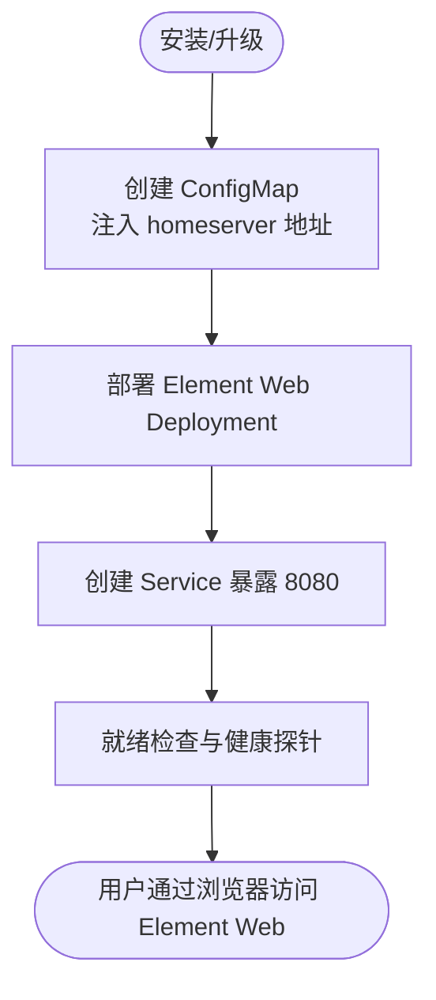
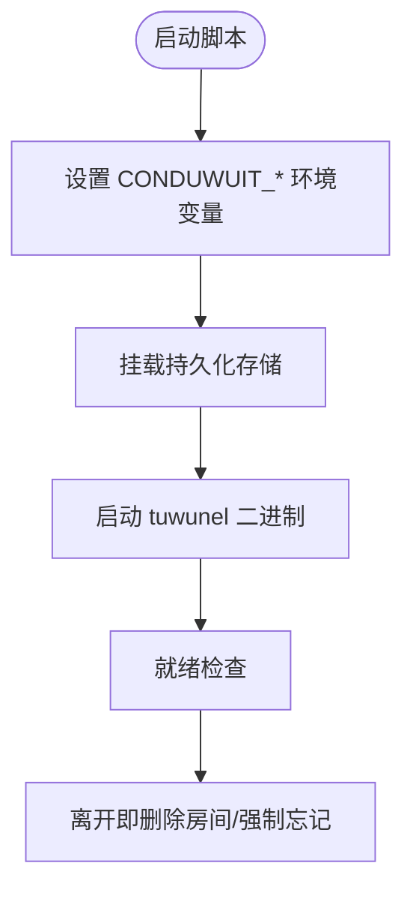
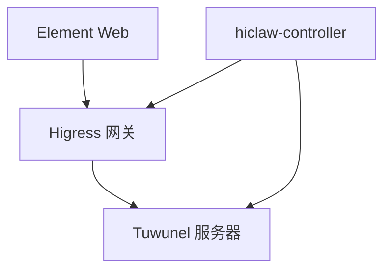

# Element IM 客户端 + Tuwunel 服务器

<cite>
**本文档引用的文件**
- [README.md](file://README.md)
- [helm/hiclaw/values.yaml](file://helm/hiclaw/values.yaml)
- [helm/hiclaw/templates/element-web/deployment.yaml](file://helm/hiclaw/templates/element-web/deployment.yaml)
- [helm/hiclaw/templates/element-web/service.yaml](file://helm/hiclaw/templates/element-web/service.yaml)
- [helm/hiclaw/templates/element-web/configmap.yaml](file://helm/hiclaw/templates/element-web/configmap.yaml)
- [helm/hiclaw/templates/matrix/tuwunel-service.yaml](file://helm/hiclaw/templates/matrix/tuwunel-service.yaml)
- [helm/hiclaw/templates/matrix/tuwunel-statefulset.yaml](file://helm/hiclaw/templates/matrix/tuwunel-statefulset.yaml)
- [manager/scripts/init/start-tuwunel.sh](file://manager/scripts/init/start-tuwunel.sh)
- [install/hiclaw-install.sh](file://install/hiclaw-install.sh)
- [install/hiclaw-apply.sh](file://install/hiclaw-apply.sh)
- [copaw/src/matrix/README.md](file://copaw/src/matrix/README.md)
- [copaw/src/matrix/__init__.py](file://copaw/src/matrix/__init__.py)
- [copaw/src/matrix/channel.py](file://copaw/src/matrix/channel.py)
- [copaw/src/matrix/config.py](file://copaw/src/matrix/config.py)
</cite>

## 目录
1. [简介](#简介)
2. [项目结构](#项目结构)
3. [核心组件](#核心组件)
4. [架构总览](#架构总览)
5. [详细组件分析](#详细组件分析)
6. [依赖关系分析](#依赖关系分析)
7. [性能考虑](#性能考虑)
8. [故障排除指南](#故障排除指南)
9. [结论](#结论)
10. [附录](#附录)

## 简介
本文件面向 Element IM 客户端与 Tuwunel 服务器在 HiClaw 项目中的集成与使用，重点阐述以下方面：
- 零配置 IM 的优势与用户体验提升：通过内置 Element Web 与 Tuwunel，用户无需额外配置即可直接使用 Matrix 协议的即时通讯能力。
- Matrix 协议的去中心化特性：自托管与联邦部署的实现方式，以及如何避免厂商锁定与数据采集风险。
- Tuwunel 作为 Matrix 服务器的配置与管理：包括用户管理、房间权限、消息历史等关键功能。
- Element Web 作为浏览器客户端的优势：跨平台（桌面与移动端）无缝体验，支持多种 Matrix 客户端。
- 从传统企业 IM 平台迁移到 Matrix 的最佳实践与迁移指南。

## 项目结构
HiClaw 通过 Helm Chart 将多个子系统打包部署，其中与 Element IM 客户端和 Tuwunel 服务器直接相关的组件包括：
- Element Web：作为浏览器端 IM 客户端，提供零配置访问。
- Tuwunel：基于 conduwuit 的 Matrix 服务器，提供自托管与联邦能力。
- Gateway：统一入口与路由，配合 Element Web 与 Matrix 服务对外暴露。

图表来源
- [helm/hiclaw/values.yaml](file://helm/hiclaw/values.yaml)
- [helm/hiclaw/templates/element-web/deployment.yaml](file://helm/hiclaw/templates/element-web/deployment.yaml)
- [helm/hiclaw/templates/matrix/tuwunel-statefulset.yaml](file://helm/hiclaw/templates/matrix/tuwunel-statefulset.yaml)

章节来源
- [README.md](file://README.md)
- [helm/hiclaw/values.yaml](file://helm/hiclaw/values.yaml)

## 核心组件
- Element Web：作为零配置的浏览器端 Matrix 客户端，通过 ConfigMap 注入 homeserver 地址，支持移动端与桌面端统一体验。
- Tuwunel：Matrix 服务器，提供自托管与联邦能力，支持注册令牌、媒体兼容、房间版本等配置。
- Gateway：Higress 网关负责统一入口与路由，Element Web 与 Matrix 服务通过网关对外暴露。
- 安装与初始化：一键安装脚本负责环境检测、端口与域名配置、服务启动与就绪检查。

章节来源
- [helm/hiclaw/templates/element-web/configmap.yaml](file://helm/hiclaw/templates/element-web/configmap.yaml)
- [helm/hiclaw/templates/element-web/deployment.yaml](file://helm/hiclaw/templates/element-web/deployment.yaml)
- [helm/hiclaw/templates/matrix/tuwunel-statefulset.yaml](file://helm/hiclaw/templates/matrix/tuwunel-statefulset.yaml)
- [install/hiclaw-install.sh](file://install/hiclaw-install.sh)

## 架构总览
下图展示了 Element Web、Tuwunel 与 Gateway 的交互关系，以及安装与初始化流程：

图表来源
- [helm/hiclaw/templates/element-web/configmap.yaml](file://helm/hiclaw/templates/element-web/configmap.yaml)
- [helm/hiclaw/templates/element-web/deployment.yaml](file://helm/hiclaw/templates/element-web/deployment.yaml)
- [helm/hiclaw/templates/matrix/tuwunel-statefulset.yaml](file://helm/hiclaw/templates/matrix/tuwunel-statefulset.yaml)

章节来源
- [README.md](file://README.md)
- [helm/hiclaw/values.yaml](file://helm/hiclaw/values.yaml)

## 详细组件分析

### Element Web 组件
- 部署与服务：Element Web 通过 Deployment 与 Service 暴露，支持 ConfigMap 注入默认 homeserver 配置。
- 零配置访问：通过 ConfigMap 中的 default_server_config.m.homeserver.base_url 指向 Gateway 的 publicURL，用户无需手动配置即可登录。
- 多端体验：Element Web 支持桌面浏览器与移动端（通过 Element/FluffyChat 等客户端连接同一 Matrix 服务器）。

图表来源
- [helm/hiclaw/templates/element-web/configmap.yaml](file://helm/hiclaw/templates/element-web/configmap.yaml)
- [helm/hiclaw/templates/element-web/deployment.yaml](file://helm/hiclaw/templates/element-web/deployment.yaml)
- [helm/hiclaw/templates/element-web/service.yaml](file://helm/hiclaw/templates/element-web/service.yaml)

章节来源
- [helm/hiclaw/templates/element-web/configmap.yaml](file://helm/hiclaw/templates/element-web/configmap.yaml)
- [helm/hiclaw/templates/element-web/deployment.yaml](file://helm/hiclaw/templates/element-web/deployment.yaml)
- [helm/hiclaw/templates/element-web/service.yaml](file://helm/hiclaw/templates/element-web/service.yaml)

### Tuwunel 服务器组件
- 部署与存储：Tuwunel 通过 StatefulSet 部署，支持持久化存储与副本数配置。
- 关键环境变量：包含服务器名称、数据库路径、监听地址与端口、注册令牌、媒体兼容与房间版本等。
- 生命周期清理：支持离开即删除房间与强制忘记，确保 Agent 生命周期内的房间状态干净。

图表来源
- [helm/hiclaw/templates/matrix/tuwunel-statefulset.yaml](file://helm/hiclaw/templates/matrix/tuwunel-statefulset.yaml)
- [manager/scripts/init/start-tuwunel.sh](file://manager/scripts/init/start-tuwunel.sh)

章节来源
- [helm/hiclaw/templates/matrix/tuwunel-statefulset.yaml](file://helm/hiclaw/templates/matrix/tuwunel-statefulset.yaml)
- [helm/hiclaw/templates/matrix/tuwunel-service.yaml](file://helm/hiclaw/templates/matrix/tuwunel-service.yaml)
- [manager/scripts/init/start-tuwunel.sh](file://manager/scripts/init/start-tuwunel.sh)

### Matrix 协议与去中心化特性
- 去中心化：Matrix 是去中心化的协议，用户可在自己的服务器上托管，或与其他服务器联邦互通，避免厂商锁定与数据采集。
- 自托管：通过 Tuwunel 提供自托管能力，结合 Element Web 实现零配置访问。
- 联邦部署：通过配置不同的 homeserver 地址，用户可连接到其他 Matrix 服务器，实现跨组织协作。

章节来源
- [README.md](file://README.md)

### 用户管理与房间权限
- 用户注册：通过注册令牌（Registration Token）控制用户注册，支持单步注册（无需 UIAA）。
- 房间权限：通过房间版本与策略控制房间权限，支持公共房间与私有房间（需 E2EE 支持）。
- Agent 生命周期：离开即删除房间与强制忘记，确保 Agent 重建后房间状态干净。

章节来源
- [helm/hiclaw/templates/matrix/tuwunel-statefulset.yaml](file://helm/hiclaw/templates/matrix/tuwunel-statefulset.yaml)
- [manager/scripts/init/start-tuwunel.sh](file://manager/scripts/init/start-tuwunel.sh)

### 消息历史与上下文
- 历史缓冲：在群组房间中，非提及消息会被缓冲，用于提供上下文。
- Markdown 渲染：支持 Markdown 到 HTML 的转换，保证消息格式一致。
- 语音与多媒体：支持音频、图像、视频等多媒体消息的上传与下载。

章节来源
- [copaw/src/matrix/README.md](file://copaw/src/matrix/README.md)
- [copaw/src/matrix/channel.py](file://copaw/src/matrix/channel.py)
- [copaw/src/matrix/config.py](file://copaw/src/matrix/config.py)

### Element Web 作为浏览器客户端的优势
- 零配置：通过 ConfigMap 注入 homeserver 地址，用户无需手动配置即可登录。
- 多端体验：支持桌面浏览器与移动端（Element/FluffyChat 等）统一体验。
- 安全性：支持 HTTPS 与 TLS 证书配置，避免明文传输。

章节来源
- [helm/hiclaw/templates/element-web/configmap.yaml](file://helm/hiclaw/templates/element-web/configmap.yaml)
- [install/hiclaw-install.sh](file://install/hiclaw-install.sh)

### 从传统企业 IM 平台迁移到 Matrix 的最佳实践
- 评估与准备：评估现有 IM 平台的用户、房间与权限策略，制定迁移计划。
- 服务器部署：使用 Tuwunel 作为自托管 Matrix 服务器，或与其他 Matrix 服务器联邦。
- 客户端迁移：引导用户使用 Element Web 或 Element/FluffyChat 客户端连接新的 Matrix 服务器。
- 权限与策略：通过房间权限与策略控制访问，确保数据安全。
- 历史与合规：迁移过程中注意消息历史与合规要求，必要时进行数据导出与导入。

章节来源
- [README.md](file://README.md)
- [install/hiclaw-install.sh](file://install/hiclaw-install.sh)

## 依赖关系分析
- Element Web 依赖 Gateway 提供的公共 URL，通过 ConfigMap 注入 homeserver 地址。
- Tuwunel 依赖持久化存储，支持副本数与资源限制配置。
- Gateway 依赖 Higress 子图，提供统一入口与路由。

图表来源
- [helm/hiclaw/values.yaml](file://helm/hiclaw/values.yaml)
- [helm/hiclaw/templates/element-web/configmap.yaml](file://helm/hiclaw/templates/element-web/configmap.yaml)
- [helm/hiclaw/templates/matrix/tuwunel-statefulset.yaml](file://helm/hiclaw/templates/matrix/tuwunel-statefulset.yaml)

章节来源
- [helm/hiclaw/values.yaml](file://helm/hiclaw/values.yaml)

## 性能考虑
- 缓存容量：通过 CONDUWUIT_CACHE_CAPACITY_MODIFIER 提高缓存容量，减少 RocksDB 抖动。
- 数据库连接池：通过 CONDUWUIT_DB_POOL_WORKERS_LIMIT 增加数据库连接池工作线程上限。
- 媒体兼容：开启 CONDUWUIT_ALLOW_LEGACY_MEDIA 与 CONDUWUIT_ALLOW_UNSTABLE_ROOM_VERSIONS，提升兼容性与稳定性。

章节来源
- [helm/hiclaw/templates/matrix/tuwunel-statefulset.yaml](file://helm/hiclaw/templates/matrix/tuwunel-statefulset.yaml)
- [manager/scripts/init/start-tuwunel.sh](file://manager/scripts/init/start-tuwunel.sh)

## 故障排除指南
- Element Web 无法访问：检查 Gateway 的 publicURL 与 Service 暴露，确认 ConfigMap 中的 homeserver 地址正确。
- Matrix 服务未就绪：检查 Tuwunel 的就绪探针与日志，确认数据库路径与注册令牌配置正确。
- 安装脚本问题：查看安装日志，确认端口、域名与镜像仓库配置正确。

章节来源
- [install/hiclaw-install.sh](file://install/hiclaw-install.sh)
- [install/hiclaw-apply.sh](file://install/hiclaw-apply.sh)

## 结论
HiClaw 通过内置的 Element Web 与 Tuwunel，实现了零配置的 Matrix 即时通讯体验，具备去中心化、自托管与联邦部署的优势。借助清晰的 Helm Chart 配置与一键安装脚本，用户可以快速完成部署，并在多端设备上获得一致的聊天体验。对于从传统企业 IM 平台迁移的场景，建议先评估现有策略，再逐步完成服务器部署、客户端迁移与权限配置，确保平滑过渡与合规要求。

## 附录
- 安装与升级：参考安装脚本与 Helm Values，完成环境检测、端口与域名配置、服务启动与就绪检查。
- 资源管理：通过 hiclaw-apply.sh 与声明式 YAML，实现 Worker、Team、Human 等资源的声明式管理。

章节来源
- [install/hiclaw-install.sh](file://install/hiclaw-install.sh)
- [install/hiclaw-apply.sh](file://install/hiclaw-apply.sh)
- [helm/hiclaw/values.yaml](file://helm/hiclaw/values.yaml)