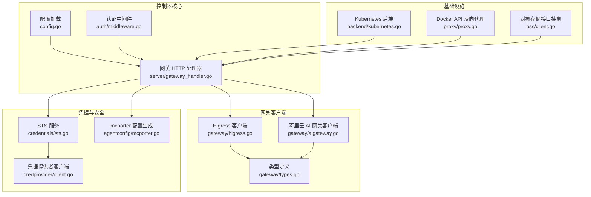
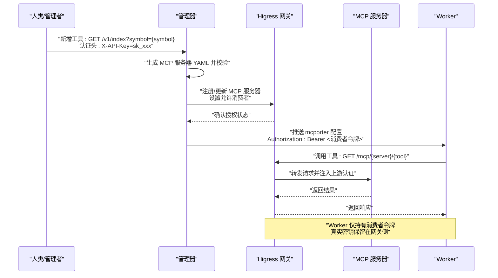
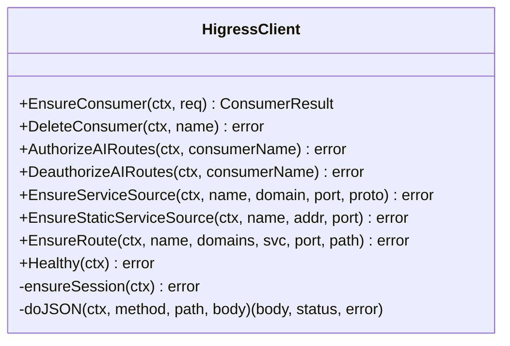
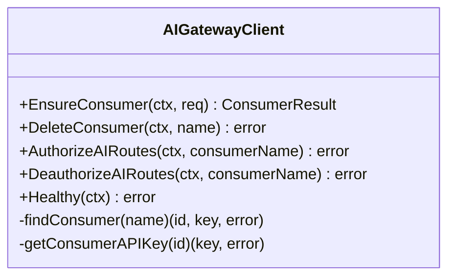
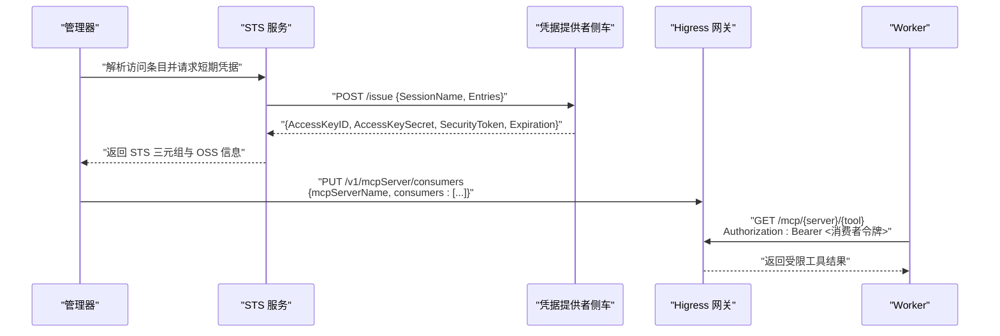
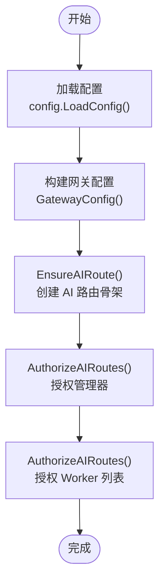
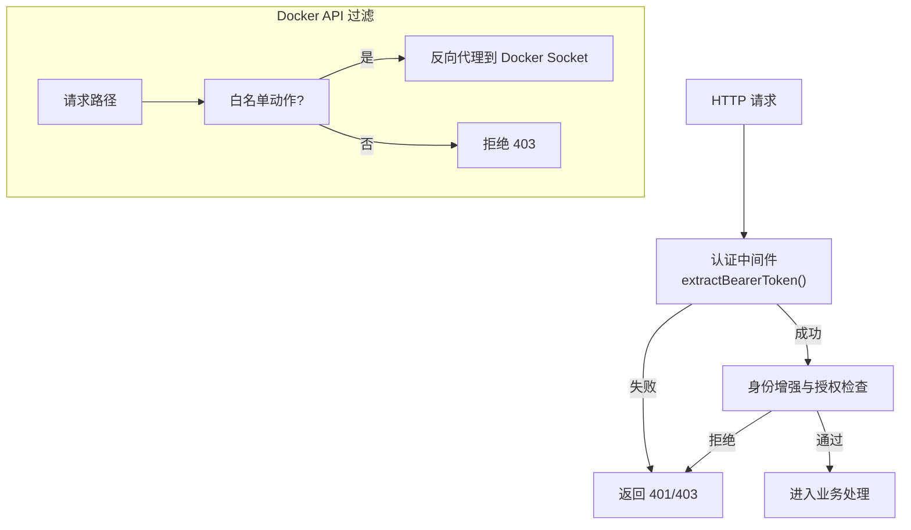
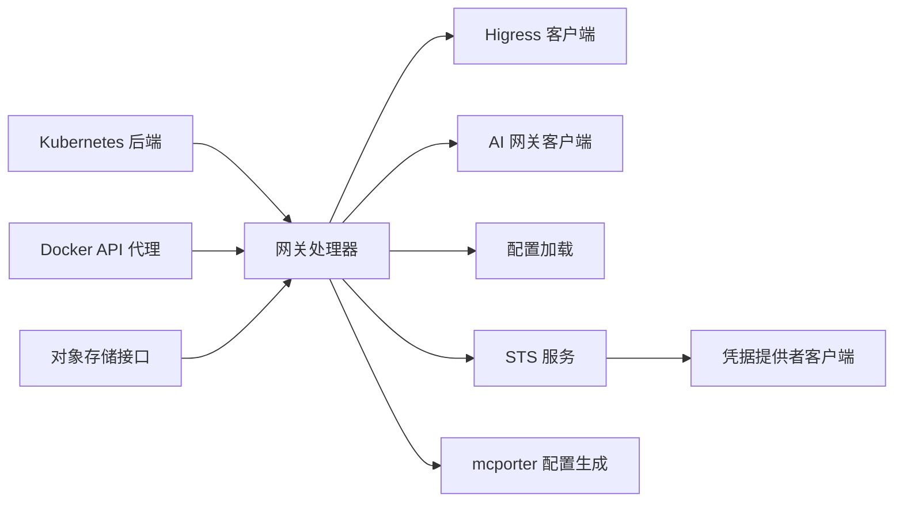

# Higress AI 网关

<cite>
**本文引用的文件**
- [hiclaw-controller/internal/gateway/higress.go](file://hiclaw-controller/internal/gateway/higress.go)
- [hiclaw-controller/internal/gateway/aigateway.go](file://hiclaw-controller/internal/gateway/aigateway.go)
- [hiclaw-controller/internal/gateway/types.go](file://hiclaw-controller/internal/gateway/types.go)
- [hiclaw-controller/internal/credentials/sts.go](file://hiclaw-controller/internal/credentials/sts.go)
- [hiclaw-controller/internal/credprovider/client.go](file://hiclaw-controller/internal/credprovider/client.go)
- [hiclaw-controller/internal/agentconfig/mcporter.go](file://hiclaw-controller/internal/agentconfig/mcporter.go)
- [hiclaw-controller/internal/server/gateway_handler.go](file://hiclaw-controller/internal/server/gateway_handler.go)
- [hiclaw-controller/internal/config/config.go](file://hiclaw-controller/internal/config/config.go)
- [hiclaw-controller/internal/backend/kubernetes.go](file://hiclaw-controller/internal/backend/kubernetes.go)
- [hiclaw-controller/internal/proxy/proxy.go](file://hiclaw-controller/internal/proxy/proxy.go)
- [hiclaw-controller/internal/auth/middleware.go](file://hiclaw-controller/internal/auth/middleware.go)
- [hiclaw-controller/internal/oss/client.go](file://hiclaw-controller/internal/oss/client.go)
- [manager/scripts/lib/gateway-api.sh](file://manager/scripts/lib/gateway-api.sh)
- [manager/agent/skills/mcp-server-management/references/setup-mcp-proxy.md](file://manager/agent/skills/mcp-server-management/references/setup-mcp-proxy.md)
- [blog/hiclaw-1.0.6-release.md](file://blog/hiclaw-1.0.6-release.md)
- [tests/lib/agent-metrics.sh](file://tests/lib/agent-metrics.sh)
</cite>

## 目录
1. [简介](#简介)
2. [项目结构](#项目结构)
3. [核心组件](#核心组件)
4. [架构总览](#架构总览)
5. [详细组件分析](#详细组件分析)
6. [依赖分析](#依赖分析)
7. [性能考虑](#性能考虑)
8. [故障排查指南](#故障排查指南)
9. [结论](#结论)
10. [附录](#附录)

## 简介
本文件面向 Higress AI 网关在 HiClaw 生态中的实现与使用，聚焦以下目标：
- 集中式流量管理：通过 Higress 控制台 API 统一创建消费者、路由与 AI 提供商，实现对 AI 路由与 MCP 服务器的统一编排。
- 降低凭据风险：凭据隔离机制确保 Worker 仅持有“消费者令牌”（Consumer Token），真实密钥始终保存在网关侧，避免泄露面扩大。
- MCP 服务器托管与授权：通过网关控制台接口注册/更新 MCP 服务器，并基于消费者授权列表限制访问范围。
- 负载均衡与缓存策略：结合 Higress 的 AI 路由与上游提供商配置，实现按权重分发与缓存命中优化。
- 安全模型：从身份认证、授权到凭据发放与最小权限原则，形成端到端的安全闭环。
- 配置示例、性能优化与监控指标：提供可操作的部署与运维建议。

## 项目结构
围绕 Higress AI 网关的关键代码位于控制器内部模块，包括网关客户端、凭据服务、代理与后端集成、以及配置加载等。下图展示与网关相关的模块关系与职责划分。

**图表来源**
- [hiclaw-controller/internal/config/config.go:576-583](file://hiclaw-controller/internal/config/config.go#L576-L583)
- [hiclaw-controller/internal/auth/middleware.go:31-49](file://hiclaw-controller/internal/auth/middleware.go#L31-L49)
- [hiclaw-controller/internal/server/gateway_handler.go:12-19](file://hiclaw-controller/internal/server/gateway_handler.go#L12-L19)
- [hiclaw-controller/internal/gateway/higress.go:17-32](file://hiclaw-controller/internal/gateway/higress.go#L17-L32)
- [hiclaw-controller/internal/gateway/aigateway.go:46-58](file://hiclaw-controller/internal/gateway/aigateway.go#L46-L58)
- [hiclaw-controller/internal/gateway/types.go:3-61](file://hiclaw-controller/internal/gateway/types.go#L3-L61)
- [hiclaw-controller/internal/credentials/sts.go:29-53](file://hiclaw-controller/internal/credentials/sts.go#L29-L53)
- [hiclaw-controller/internal/credprovider/client.go:15-41](file://hiclaw-controller/internal/credprovider/client.go#L15-L41)
- [hiclaw-controller/internal/agentconfig/mcporter.go:10-19](file://hiclaw-controller/internal/agentconfig/mcporter.go#L10-L19)
- [hiclaw-controller/internal/backend/kubernetes.go:47-59](file://hiclaw-controller/internal/backend/kubernetes.go#L47-L59)
- [hiclaw-controller/internal/proxy/proxy.go:26-30](file://hiclaw-controller/internal/proxy/proxy.go#L26-L30)
- [hiclaw-controller/internal/oss/client.go:5-33](file://hiclaw-controller/internal/oss/client.go#L5-L33)

**章节来源**
- [hiclaw-controller/internal/config/config.go:207-356](file://hiclaw-controller/internal/config/config.go#L207-L356)
- [hiclaw-controller/internal/auth/middleware.go:31-49](file://hiclaw-controller/internal/auth/middleware.go#L31-L49)
- [hiclaw-controller/internal/server/gateway_handler.go:12-19](file://hiclaw-controller/internal/server/gateway_handler.go#L12-L19)

## 核心组件
- 网关客户端
  - Higress 客户端：封装 Higress 控制台 API，支持消费者创建/删除、AI 路由授权、域/服务源/路由创建与删除、会话登录与健康检查等。
  - 阿里云 AI 网关客户端：封装 APIG SDK，支持消费者创建/删除、授权/撤销授权、健康检查；不负责路由与提供商初始化。
- 凭据与安全
  - STS 服务：根据调用方身份解析访问条目，向凭据提供者侧车发起短期凭据请求，返回 AK/SK/Token 与 OSS 端点/桶信息。
  - 凭据提供者客户端：通过本地回环 HTTP 调用侧车的 /issue 接口，获取短期凭据。
  - mcporter 配置生成：为 Worker/Manager 生成 MCP 服务器配置，注入 Authorization: Bearer <网关消费者令牌>。
- 配置与路由
  - 配置加载：统一读取环境变量，构建 Higress 控制台 URL、管理员凭据、AI 网关参数、存储桶与端点等。
  - 网关处理器：对外暴露 /api/v1/gateway/* 接口，委派给网关客户端执行消费者与授权操作。
- 基础设施
  - Kubernetes 后端：在集群模式下创建/删除/查询 Worker Pod，注入服务账号令牌与运行时环境。
  - Docker API 反向代理：在嵌入式模式下对 Docker API 进行只读与白名单动作过滤，保障安全。
  - 对象存储接口：抽象 MinIO/OSS 操作，支持上传/下载/镜像同步等。

**章节来源**
- [hiclaw-controller/internal/gateway/higress.go:17-32](file://hiclaw-controller/internal/gateway/higress.go#L17-L32)
- [hiclaw-controller/internal/gateway/aigateway.go:46-58](file://hiclaw-controller/internal/gateway/aigateway.go#L46-L58)
- [hiclaw-controller/internal/gateway/types.go:3-61](file://hiclaw-controller/internal/gateway/types.go#L3-L61)
- [hiclaw-controller/internal/credentials/sts.go:29-53](file://hiclaw-controller/internal/credentials/sts.go#L29-L53)
- [hiclaw-controller/internal/credprovider/client.go:15-41](file://hiclaw-controller/internal/credprovider/client.go#L15-L41)
- [hiclaw-controller/internal/agentconfig/mcporter.go:10-19](file://hiclaw-controller/internal/agentconfig/mcporter.go#L10-L19)
- [hiclaw-controller/internal/config/config.go:576-583](file://hiclaw-controller/internal/config/config.go#L576-L583)
- [hiclaw-controller/internal/server/gateway_handler.go:12-19](file://hiclaw-controller/internal/server/gateway_handler.go#L12-L19)
- [hiclaw-controller/internal/backend/kubernetes.go:47-59](file://hiclaw-controller/internal/backend/kubernetes.go#L47-L59)
- [hiclaw-controller/internal/proxy/proxy.go:26-30](file://hiclaw-controller/internal/proxy/proxy.go#L26-L30)
- [hiclaw-controller/internal/oss/client.go:5-33](file://hiclaw-controller/internal/oss/client.go#L5-L33)

## 架构总览
下图展示从“人类/管理者”到“Worker”的完整链路：管理者通过脚本或界面注册 MCP 服务器，网关侧进行凭据隔离与消费者授权，Worker 仅以消费者令牌访问受限工具。

**图表来源**
- [blog/hiclaw-1.0.6-release.md:98-154](file://blog/hiclaw-1.0.6-release.md#L98-L154)
- [manager/scripts/lib/gateway-api.sh:258-287](file://manager/scripts/lib/gateway-api.sh#L258-L287)
- [manager/agent/skills/mcp-server-management/references/setup-mcp-proxy.md:1-47](file://manager/agent/skills/mcp-server-management/references/setup-mcp-proxy.md#L1-L47)
- [hiclaw-controller/internal/agentconfig/mcporter.go:10-19](file://hiclaw-controller/internal/agentconfig/mcporter.go#L10-L19)

## 详细组件分析

### Higress 客户端（自管网关）
- 会话管理：首次登录失败时尝试默认管理员凭据并自动改密，随后使用配置凭据重登，保证初始化幂等。
- 消费者管理：创建消费者并返回“已存在/已创建”状态与 API Key；删除消费者支持幂等。
- AI 路由授权：枚举所有 AI 路由，逐个更新 authConfig.allowedConsumers 字段，触发 WASM 认证重载；冲突时重试。
- 域/服务源/路由：注册域名、DNS 类型服务源与路由，支持静态服务源与路径前缀匹配。
- 健康检查：通过列出消费者验证控制台可达性与凭据有效性。

**图表来源**
- [hiclaw-controller/internal/gateway/higress.go:17-32](file://hiclaw-controller/internal/gateway/higress.go#L17-L32)
- [hiclaw-controller/internal/gateway/higress.go:137-165](file://hiclaw-controller/internal/gateway/higress.go#L137-L165)
- [hiclaw-controller/internal/gateway/higress.go:178-184](file://hiclaw-controller/internal/gateway/higress.go#L178-L184)
- [hiclaw-controller/internal/gateway/higress.go:302-338](file://hiclaw-controller/internal/gateway/higress.go#L302-L338)
- [hiclaw-controller/internal/gateway/higress.go:463-544](file://hiclaw-controller/internal/gateway/higress.go#L463-L544)
- [hiclaw-controller/internal/gateway/higress.go:450-459](file://hiclaw-controller/internal/gateway/higress.go#L450-L459)

**章节来源**
- [hiclaw-controller/internal/gateway/higress.go:34-84](file://hiclaw-controller/internal/gateway/higress.go#L34-L84)
- [hiclaw-controller/internal/gateway/higress.go:137-165](file://hiclaw-controller/internal/gateway/higress.go#L137-L165)
- [hiclaw-controller/internal/gateway/higress.go:178-300](file://hiclaw-controller/internal/gateway/higress.go#L178-L300)
- [hiclaw-controller/internal/gateway/higress.go:302-338](file://hiclaw-controller/internal/gateway/higress.go#L302-L338)
- [hiclaw-controller/internal/gateway/higress.go:450-544](file://hiclaw-controller/internal/gateway/higress.go#L450-L544)

### 阿里云 AI 网关客户端（云平台）
- 仅支持消费者相关操作：创建/删除消费者、授权/撤销授权；路由与提供商初始化由平台侧完成。
- 健康检查：通过列出消费者验证 SDK 凭据与端点可达性。
- 错误处理：并发竞争场景下重查消费者，避免重复创建。

**图表来源**
- [hiclaw-controller/internal/gateway/aigateway.go:46-58](file://hiclaw-controller/internal/gateway/aigateway.go#L46-L58)
- [hiclaw-controller/internal/gateway/aigateway.go:104-151](file://hiclaw-controller/internal/gateway/aigateway.go#L104-L151)
- [hiclaw-controller/internal/gateway/aigateway.go:153-168](file://hiclaw-controller/internal/gateway/aigateway.go#L153-L168)
- [hiclaw-controller/internal/gateway/aigateway.go:170-250](file://hiclaw-controller/internal/gateway/aigateway.go#L170-L250)
- [hiclaw-controller/internal/gateway/aigateway.go:289-303](file://hiclaw-controller/internal/gateway/aigateway.go#L289-L303)

**章节来源**
- [hiclaw-controller/internal/gateway/aigateway.go:16-21](file://hiclaw-controller/internal/gateway/aigateway.go#L16-L21)
- [hiclaw-controller/internal/gateway/aigateway.go:104-168](file://hiclaw-controller/internal/gateway/aigateway.go#L104-L168)
- [hiclaw-controller/internal/gateway/aigateway.go:170-250](file://hiclaw-controller/internal/gateway/aigateway.go#L170-L250)
- [hiclaw-controller/internal/gateway/aigateway.go:289-303](file://hiclaw-controller/internal/gateway/aigateway.go#L289-L303)

### 凭据隔离与 MCP 授权流程
- STS 服务：解析调用方身份与访问条目，向凭据提供者侧车请求短期凭据，返回 AK/SK/Token 与 OSS 信息。
- 凭据提供者客户端：通过本地 HTTP 调用 /issue，解析响应并校验完整性。
- 管理器授权：通过网关控制台 API 更新 MCP 服务器的消费者授权列表，采用“先拉取再合并”的方式减少竞态。
- Worker 配置：mcporter 生成配置时注入 Authorization: Bearer <消费者令牌>，使 Worker 仅能访问被授权的 MCP 服务器。

**图表来源**
- [hiclaw-controller/internal/credentials/sts.go:63-89](file://hiclaw-controller/internal/credentials/sts.go#L63-L89)
- [hiclaw-controller/internal/credprovider/client.go:43-84](file://hiclaw-controller/internal/credprovider/client.go#L43-L84)
- [manager/scripts/lib/gateway-api.sh:258-287](file://manager/scripts/lib/gateway-api.sh#L258-L287)
- [hiclaw-controller/internal/agentconfig/mcporter.go:10-19](file://hiclaw-controller/internal/agentconfig/mcporter.go#L10-L19)

**章节来源**
- [hiclaw-controller/internal/credentials/sts.go:29-53](file://hiclaw-controller/internal/credentials/sts.go#L29-L53)
- [hiclaw-controller/internal/credprovider/client.go:15-41](file://hiclaw-controller/internal/credprovider/client.go#L15-L41)
- [manager/scripts/lib/gateway-api.sh:258-287](file://manager/scripts/lib/gateway-api.sh#L258-L287)
- [hiclaw-controller/internal/agentconfig/mcporter.go:10-19](file://hiclaw-controller/internal/agentconfig/mcporter.go#L10-L19)

### 配置与路由初始化流程
- 配置加载：从环境变量读取 Higress 控制台地址、管理员凭据、AI 网关参数、存储桶与端点等，构造网关与 OSS 配置。
- 网关处理器：对外暴露 /api/v1/gateway/* 接口，委派给具体网关客户端执行消费者与授权操作。
- 初始化顺序：先确保 AI 路由骨架（仅创建，不写 allowedConsumers），再由管理器/工作器通过授权接口更新消费者列表，避免重启导致的授权丢失。

**图表来源**
- [hiclaw-controller/internal/config/config.go:576-583](file://hiclaw-controller/internal/config/config.go#L576-L583)
- [hiclaw-controller/internal/gateway/higress.go:386-448](file://hiclaw-controller/internal/gateway/higress.go#L386-L448)
- [hiclaw-controller/internal/gateway/higress.go:178-184](file://hiclaw-controller/internal/gateway/higress.go#L178-L184)

**章节来源**
- [hiclaw-controller/internal/config/config.go:207-356](file://hiclaw-controller/internal/config/config.go#L207-L356)
- [hiclaw-controller/internal/gateway/higress.go:386-448](file://hiclaw-controller/internal/gateway/higress.go#L386-L448)
- [hiclaw-controller/internal/server/gateway_handler.go:21-53](file://hiclaw-controller/internal/server/gateway_handler.go#L21-L53)

### 安全模型与错误处理
- 身份认证与授权：中间件从请求头提取 Bearer 令牌，进行认证与身份增强，再依据资源与团队信息进行授权检查。
- Docker API 过滤：仅允许白名单动作，其他请求直接拒绝，避免容器逃逸与敏感操作。
- 网关错误处理：Higress 客户端在 401/403 时清理会话缓存并重试；AI 网关客户端对并发创建进行重查与容错。

**图表来源**
- [hiclaw-controller/internal/auth/middleware.go:137-156](file://hiclaw-controller/internal/auth/middleware.go#L137-L156)
- [hiclaw-controller/internal/proxy/proxy.go:54-88](file://hiclaw-controller/internal/proxy/proxy.go#L54-L88)

**章节来源**
- [hiclaw-controller/internal/auth/middleware.go:31-49](file://hiclaw-controller/internal/auth/middleware.go#L31-L49)
- [hiclaw-controller/internal/proxy/proxy.go:54-88](file://hiclaw-controller/internal/proxy/proxy.go#L54-L88)

## 依赖分析
- 组件耦合
  - 网关处理器依赖网关客户端（Higress/AI 网关）与配置加载模块。
  - STS 服务依赖访问解析器与凭据提供者客户端，后者依赖本地 HTTP 客户端。
  - mcporter 配置生成依赖网关消费者令牌与 MCP 服务器清单。
- 外部依赖
  - Higress 控制台 API、阿里云 APIG SDK、Kubernetes API、对象存储（MinIO/OSS）。
- 循环依赖
  - 当前模块间无循环导入，职责清晰：配置 -> 处理器 -> 客户端 -> 外部服务。

**图表来源**
- [hiclaw-controller/internal/server/gateway_handler.go:12-19](file://hiclaw-controller/internal/server/gateway_handler.go#L12-L19)
- [hiclaw-controller/internal/gateway/higress.go:17-32](file://hiclaw-controller/internal/gateway/higress.go#L17-L32)
- [hiclaw-controller/internal/gateway/aigateway.go:46-58](file://hiclaw-controller/internal/gateway/aigateway.go#L46-L58)
- [hiclaw-controller/internal/config/config.go:576-583](file://hiclaw-controller/internal/config/config.go#L576-L583)
- [hiclaw-controller/internal/credentials/sts.go:29-53](file://hiclaw-controller/internal/credentials/sts.go#L29-L53)
- [hiclaw-controller/internal/credprovider/client.go:15-41](file://hiclaw-controller/internal/credprovider/client.go#L15-L41)
- [hiclaw-controller/internal/agentconfig/mcporter.go:10-19](file://hiclaw-controller/internal/agentconfig/mcporter.go#L10-L19)
- [hiclaw-controller/internal/backend/kubernetes.go:47-59](file://hiclaw-controller/internal/backend/kubernetes.go#L47-L59)
- [hiclaw-controller/internal/proxy/proxy.go:26-30](file://hiclaw-controller/internal/proxy/proxy.go#L26-L30)
- [hiclaw-controller/internal/oss/client.go:5-33](file://hiclaw-controller/internal/oss/client.go#L5-L33)

**章节来源**
- [hiclaw-controller/internal/server/gateway_handler.go:12-19](file://hiclaw-controller/internal/server/gateway_handler.go#L12-L19)
- [hiclaw-controller/internal/gateway/higress.go:17-32](file://hiclaw-controller/internal/gateway/higress.go#L17-L32)
- [hiclaw-controller/internal/gateway/aigateway.go:46-58](file://hiclaw-controller/internal/gateway/aigateway.go#L46-L58)
- [hiclaw-controller/internal/credentials/sts.go:29-53](file://hiclaw-controller/internal/credentials/sts.go#L29-L53)
- [hiclaw-controller/internal/credprovider/client.go:15-41](file://hiclaw-controller/internal/credprovider/client.go#L15-L41)
- [hiclaw-controller/internal/agentconfig/mcporter.go:10-19](file://hiclaw-controller/internal/agentconfig/mcporter.go#L10-L19)
- [hiclaw-controller/internal/backend/kubernetes.go:47-59](file://hiclaw-controller/internal/backend/kubernetes.go#L47-L59)
- [hiclaw-controller/internal/proxy/proxy.go:26-30](file://hiclaw-controller/internal/proxy/proxy.go#L26-L30)
- [hiclaw-controller/internal/oss/client.go:5-33](file://hiclaw-controller/internal/oss/client.go#L5-L33)

## 性能考虑
- 并发与重试
  - AI 路由授权采用最大重试次数与随机退避，降低并发写冲突带来的失败率。
  - Higress 客户端在 409 冲突时等待短暂时间后重试，提升稳定性。
- 缓存与会话
  - Higress 客户端缓存会话 Cookie，避免重复登录；遇到 401/403 自动清理并重建会话。
- 资源与网络
  - Kubernetes 后端支持 CPU/内存请求与限制合并，按需覆盖默认资源配额。
  - 对象存储端点规范化，避免将 Higress 网关端口误配为 S3 端点。

**章节来源**
- [hiclaw-controller/internal/gateway/higress.go:202-299](file://hiclaw-controller/internal/gateway/higress.go#L202-L299)
- [hiclaw-controller/internal/gateway/higress.go:546-590](file://hiclaw-controller/internal/gateway/higress.go#L546-L590)
- [hiclaw-controller/internal/backend/kubernetes.go:409-429](file://hiclaw-controller/internal/backend/kubernetes.go#L409-L429)
- [hiclaw-controller/internal/config/config.go:546-563](file://hiclaw-controller/internal/config/config.go#L546-L563)

## 故障排查指南
- 网关不可达
  - 使用健康检查接口验证控制台连通性与凭据有效性；若返回非 200，检查控制台 URL 与管理员凭据。
- 登录失败
  - 若默认管理员凭据可用，系统会自动改密并重登；否则检查配置凭据是否正确。
- 授权冲突
  - AI 路由授权可能因并发写导致 409，客户端会自动重试；如持续失败，检查消费者名称与路由是否存在。
- Docker API 拒绝
  - 仅允许白名单动作，其他请求会被拒绝；确认操作是否在允许范围内。
- MCP 授权未生效
  - 管理器侧采用“先拉取再合并”的方式更新消费者列表，确保最终一致性；如仍不生效，检查消费者令牌与 MCP 服务器名称。

**章节来源**
- [hiclaw-controller/internal/gateway/higress.go:450-459](file://hiclaw-controller/internal/gateway/higress.go#L450-L459)
- [hiclaw-controller/internal/gateway/higress.go:65-83](file://hiclaw-controller/internal/gateway/higress.go#L65-L83)
- [hiclaw-controller/internal/gateway/higress.go:286-292](file://hiclaw-controller/internal/gateway/higress.go#L286-L292)
- [hiclaw-controller/internal/proxy/proxy.go:54-88](file://hiclaw-controller/internal/proxy/proxy.go#L54-L88)
- [manager/scripts/lib/gateway-api.sh:258-287](file://manager/scripts/lib/gateway-api.sh#L258-L287)

## 结论
Higress AI 网关通过统一的控制平面实现了对 AI 路由、MCP 服务器与消费者的集中管理，配合凭据隔离与最小权限原则，有效降低了凭据泄露与越权访问的风险。其设计强调幂等性、重试与会话缓存，兼顾了稳定性与易用性。结合 Kubernetes 后端与对象存储抽象，可在不同部署形态下灵活扩展。

## 附录

### 配置示例（环境变量）
- 网关与凭据
  - HICLAW_GATEWAY_PROVIDER=higress 或 ai-gateway
  - HICLAW_AI_GATEWAY_ADMIN_URL=http://127.0.0.1:8001
  - HICLAW_ADMIN_USER、HICLAW_ADMIN_PASSWORD
  - HICLAW_CREDENTIAL_PROVIDER_URL=http://127.0.0.1:17070
- 存储与区域
  - HICLAW_REGION=cn-hangzhou
  - HICLAW_FS_BUCKET=hiclaw-storage
  - HICLAW_FS_ENDPOINT=http://fs-local.hiclaw.io:9000
- AI 网关（云）
  - HICLAW_GW_GATEWAY_ID、HICLAW_GW_MODEL_API_ID、HICLAW_GW_ENV_ID

**章节来源**
- [hiclaw-controller/internal/config/config.go:236-258](file://hiclaw-controller/internal/config/config.go#L236-L258)
- [hiclaw-controller/internal/config/config.go:576-583](file://hiclaw-controller/internal/config/config.go#L576-L583)
- [hiclaw-controller/internal/config/config.go:585-596](file://hiclaw-controller/internal/config/config.go#L585-L596)

### API 与工作流参考
- 管理器脚本：通过 setup-mcp-proxy.sh 注册/更新 MCP 服务器，支持多种传输与头部注入。
- 管理器授权：通过 /v1/mcpServer/consumers 接口更新消费者授权列表，采用“先拉取再合并”。

**章节来源**
- [manager/agent/skills/mcp-server-management/references/setup-mcp-proxy.md:1-47](file://manager/agent/skills/mcp-server-management/references/setup-mcp-proxy.md#L1-L47)
- [manager/scripts/lib/gateway-api.sh:258-287](file://manager/scripts/lib/gateway-api.sh#L258-L287)

### 监控指标
- 测试框架提供代理指标报告与对比功能，可用于评估 LLM 调用次数、输入/输出/缓存命中与总耗时等。
- 建议在生产环境中对接可观测性系统，采集网关与 Worker 的调用链路与令牌用量。

**章节来源**
- [tests/lib/agent-metrics.sh:926-1019](file://tests/lib/agent-metrics.sh#L926-L1019)
- [tests/lib/agent-metrics.sh:1041-1224](file://tests/lib/agent-metrics.sh#L1041-L1224)