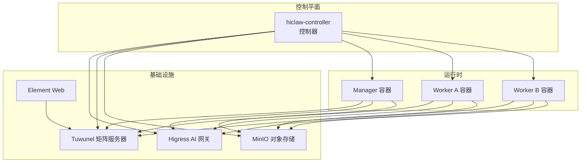
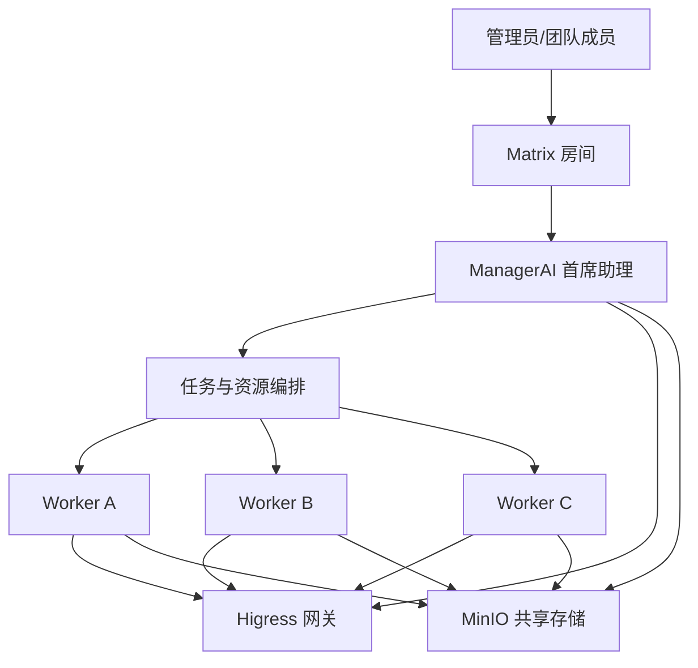
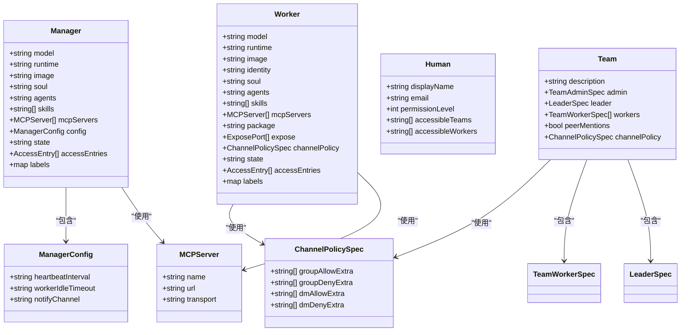
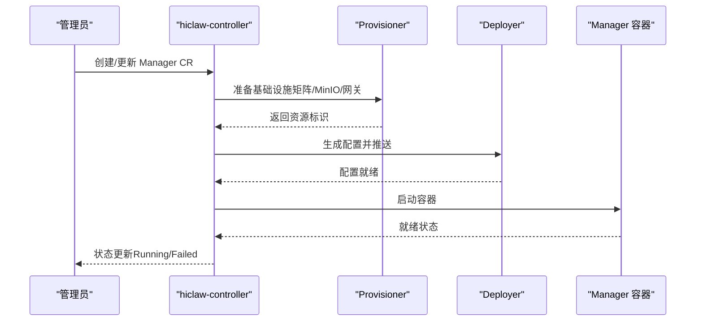
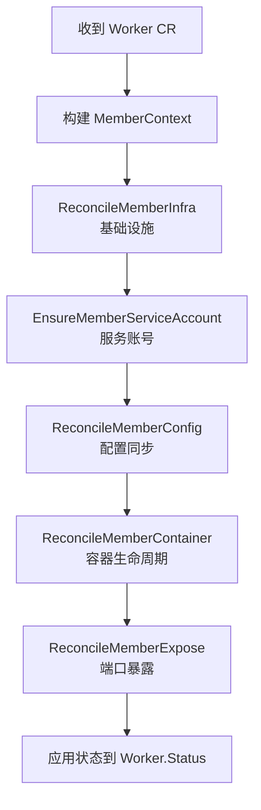
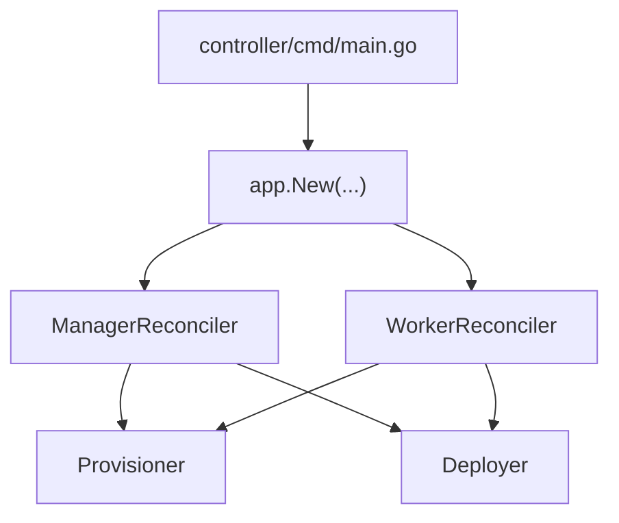

# Manager-Workers 架构

<cite>
**本文引用的文件**
- [README.md](file://README.md)
- [docs/architecture.md](file://docs/architecture.md)
- [docs/manager-guide.md](file://docs/manager-guide.md)
- [docs/worker-guide.md](file://docs/worker-guide.md)
- [docs/k8s-native-agent-orch.md](file://docs/k8s-native-agent-orch.md)
- [hiclaw-controller/api/v1beta1/types.go](file://hiclaw-controller/api/v1beta1/types.go)
- [hiclaw-controller/internal/controller/manager_controller.go](file://hiclaw-controller/internal/controller/manager_controller.go)
- [hiclaw-controller/internal/controller/worker_controller.go](file://hiclaw-controller/internal/controller/worker_controller.go)
- [hiclaw-controller/cmd/controller/main.go](file://hiclaw-controller/cmd/controller/main.go)
- [manager/agent/skills/task-management/SKILL.md](file://manager/agent/skills/task-management/SKILL.md)
- [manager/agent/skills/worker-management/SKILL.md](file://manager/agent/skills/worker-management/SKILL.md)
</cite>

## 目录
1. [简介](#简介)
2. [项目结构](#项目结构)
3. [核心组件](#核心组件)
4. [架构总览](#架构总览)
5. [详细组件分析](#详细组件分析)
6. [依赖分析](#依赖分析)
7. [性能考虑](#性能考虑)
8. [故障排查指南](#故障排查指南)
9. [结论](#结论)
10. [附录](#附录)

## 简介
本文件系统化阐述 HiClaw 的 Manager-Workers 架构：以 Manager 为核心协调者，通过统一的控制平面（hiclaw-controller）集中编排多个 Worker，实现人类与智能体之间的协作，以及企业级团队内的多智能体协同。该架构的关键价值在于：
- 消除对单个 Worker 的人工监督需求：Manager 负责任务委派、状态监控、资源调度与安全策略执行，Worker 在受控环境下自主运行。
- 智能体间协作：通过矩阵房间（Matrix）与共享存储（MinIO），实现跨 Worker 的可见性与可干预性。
- 企业级能力：基于 Kubernetes 原生的声明式资源模型（Worker/Team/Human/Manager CRD），支持多运行时（OpenClaw/CoPaw/Hermes）共存与 MCP 服务治理。

## 项目结构
HiClaw 采用分层与模块化组织方式：
- 控制平面（hiclaw-controller）：基于 controller-runtime 的 Kubernetes 控制器，负责 Worker/Team/Manager/Human 四类资源的声明式编排与生命周期管理。
- 运行时层（Manager/Worker 容器）：轻量级容器镜像，内置 Agent 引擎（OpenClaw/CoPaw/Hermes）、技能系统与 CLI，连接矩阵、访问网关与共享存储。
- 基础设施（Higress 网关、Tuwunel 矩阵服务器、MinIO 对象存储、Element Web）：提供统一的安全代理、通信协议与共享数据持久化。

图表来源
- [docs/architecture.md:23-82](file://docs/architecture.md#L23-L82)

章节来源
- [docs/architecture.md:7-116](file://docs/architecture.md#L7-L116)
- [README.md:13-324](file://README.md#L13-L324)

## 核心组件
- hiclaw-controller：统一的控制平面，负责资源创建、配置同步、容器生命周期与安全策略下发。
- Manager：AI 首席助理，负责任务委派、团队协调、状态监控与人类介入点。
- Worker：任务执行单元，按需创建，状态由共享存储持久化，容器可替换。
- 基础设施：Higress（AI/MCP 网关）、Tuwunel（Matrix）、MinIO（共享存储）、Element Web（IM 客户端）。

章节来源
- [docs/architecture.md:9-16](file://docs/architecture.md#L9-L16)
- [docs/manager-guide.md:13-50](file://docs/manager-guide.md#L13-L50)
- [docs/worker-guide.md:7-12](file://docs/worker-guide.md#L7-L12)

## 架构总览
Manager-Workers 架构在逻辑上分为三层：
- 人类层：管理员与团队成员通过 Matrix 房间与 Manager/Worker 交互。
- 协调层：Manager 作为 AI 首席助理，集中编排任务与资源，执行策略与安全规则。
- 执行层：Worker 通过共享存储与网关完成任务执行，状态可审计、可恢复。

图表来源
- [docs/architecture.md:19-82](file://docs/architecture.md#L19-L82)

章节来源
- [docs/architecture.md:19-82](file://docs/architecture.md#L19-L82)
- [docs/k8s-native-agent-orch.md:40-68](file://docs/k8s-native-agent-orch.md#L40-L68)

## 详细组件分析

### 控制器与资源模型（CRD）
hiclaw-controller 通过 v1beta1 API 提供四类核心资源：
- Worker：执行单元，定义模型、运行时、技能、MCP 服务器、暴露端口、通信策略与生命周期状态。
- Team：协作单元，包含 Leader 与若干 Worker，支持团队级房间与权限策略。
- Human：真实用户，定义显示名、邮箱、权限级别与可访问范围。
- Manager：协调者，定义模型、运行时、技能、MCP 服务器、心跳间隔、空闲超时与通知通道。

图表来源
- [hiclaw-controller/api/v1beta1/types.go:63-447](file://hiclaw-controller/api/v1beta1/types.go#L63-L447)

章节来源
- [hiclaw-controller/api/v1beta1/types.go:63-447](file://hiclaw-controller/api/v1beta1/types.go#L63-L447)
- [docs/k8s-native-agent-orch.md:69-196](file://docs/k8s-native-agent-orch.md#L69-L196)

### Manager 控制器（Reconciler）
ManagerReconciler 负责：
- 基础设施准备（矩阵账号、MinIO 用户与桶、网关消费者）。
- 配置生成（openclaw.json、SOUL/AGENTS 技能等）。
- 容器生命周期（创建/更新/删除）。
- 欢迎消息（首次启动引导）。

图表来源
- [hiclaw-controller/internal/controller/manager_controller.go:126-160](file://hiclaw-controller/internal/controller/manager_controller.go#L126-L160)

章节来源
- [hiclaw-controller/internal/controller/manager_controller.go:31-189](file://hiclaw-controller/internal/controller/manager_controller.go#L31-L189)

### Worker 控制器（Reconciler）
WorkerReconciler 负责：
- 成员上下文构建（MemberContext）。
- 基础设施与配置同步。
- 容器生命周期管理与端口暴露。
- 状态回写（RoomID、容器状态、暴露端口）。

图表来源
- [hiclaw-controller/internal/controller/worker_controller.go:106-151](file://hiclaw-controller/internal/controller/worker_controller.go#L106-L151)

章节来源
- [hiclaw-controller/internal/controller/worker_controller.go:30-407](file://hiclaw-controller/internal/controller/worker_controller.go#L30-L407)

### Manager 作为 AI 首席助理
Manager 的职责包括：
- 任务分解与委派：将复杂任务拆解为可执行子任务，选择合适的 Worker 并在矩阵房间中进行协作。
- 资源分配：根据 Worker 状态与负载动态分配任务；支持自动启停与空闲回收。
- 状态监控：通过心跳、进度日志与任务历史实现可观测性与可恢复性。
- 安全与合规：通过 Higress 网关与消费者令牌隔离真实凭证，确保最小权限与可撤销访问。

章节来源
- [docs/manager-guide.md:158-206](file://docs/manager-guide.md#L158-L206)
- [docs/architecture.md:132-137](file://docs/architecture.md#L132-L137)

### Worker 生命周期与状态管理
Worker 的生命周期由 Manager 统一管理：
- 自动停止：空闲 Worker 在超时后停止以节省资源。
- 自动启动：任务指派前唤醒目标 Worker。
- 自动重建：Manager 重启后检查并重建缺失或配置变更的 Worker。

章节来源
- [docs/worker-guide.md:124-136](file://docs/worker-guide.md#L124-L136)

### 技能系统与协作模式
Manager 与 Worker 通过技能系统实现协作：
- Manager 技能：任务管理、团队管理、工人管理、项目管理、矩阵服务器管理、MCP 服务器管理等。
- Worker 技能：文件同步、任务进度、项目参与、技能检索等。
- 团队协作：Team Leader 作为特殊 Worker，负责团队内任务协调与汇报。

章节来源
- [docs/architecture.md:180-221](file://docs/architecture.md#L180-L221)
- [manager/agent/skills/task-management/SKILL.md:1-30](file://manager/agent/skills/task-management/SKILL.md#L1-L30)
- [manager/agent/skills/worker-management/SKILL.md:1-83](file://manager/agent/skills/worker-management/SKILL.md#L1-L83)

## 依赖分析
- 控制器入口：controller/cmd/main.go 启动 controller-runtime 应用，加载配置并运行。
- 控制器注册：ManagerReconciler 与 WorkerReconciler 注册到 Manager，监听资源事件并触发 Reconcile 循环。
- 资源耦合：Worker/Team/Manager/Human 通过 CRD 彼此关联，控制器通过 Provisioner/Deployer 与后端（Docker/Kubernetes）交互。

图表来源
- [hiclaw-controller/cmd/controller/main.go:16-36](file://hiclaw-controller/cmd/controller/main.go#L16-L36)
- [hiclaw-controller/internal/controller/manager_controller.go:31-62](file://hiclaw-controller/internal/controller/manager_controller.go#L31-L62)
- [hiclaw-controller/internal/controller/worker_controller.go:30-55](file://hiclaw-controller/internal/controller/worker_controller.go#L30-L55)

章节来源
- [hiclaw-controller/cmd/controller/main.go:16-36](file://hiclaw-controller/cmd/controller/main.go#L16-L36)
- [hiclaw-controller/internal/controller/manager_controller.go:31-62](file://hiclaw-controller/internal/controller/manager_controller.go#L31-L62)
- [hiclaw-controller/internal/controller/worker_controller.go:30-55](file://hiclaw-controller/internal/controller/worker_controller.go#L30-L55)

## 性能考虑
- 资源复用：Worker 容器可替换，状态持久化于 MinIO，减少重复计算与缓存失效。
- 端到端优化：Higress 网关支持热重载与细粒度路由，降低延迟与提升吞吐。
- 可观测性：心跳、进度日志与任务历史提供快速恢复与问题定位依据。
- 扩展性：Kubernetes 原生部署模式支持弹性扩缩容与多区域部署。

## 故障排查指南
- 日志定位：Manager Agent、OpenClaw 运行时与基础设施日志可通过容器命令查看。
- 健康检查：通过 Higress 控制台、Tuwunel 与 MinIO 内部健康端点验证服务可用性。
- 会话与恢复：利用每日会话重置策略与任务历史文件实现中断恢复。
- 备份与恢复：通过 Docker 卷备份 MinIO 数据，确保关键配置与任务数据不丢失。

章节来源
- [docs/manager-guide.md:158-206](file://docs/manager-guide.md#L158-L206)
- [docs/manager-guide.md:207-270](file://docs/manager-guide.md#L207-L270)

## 结论
HiClaw 的 Manager-Workers 架构通过声明式资源与控制器编排，实现了人类与智能体的无缝协作与企业级多智能体团队的高效运转。Manager 作为 AI 首席助理，承担任务委派、资源调度与安全治理职责，Worker 则专注于任务执行与结果产出。依托矩阵通信与共享存储，系统具备高度透明性、可审计性与可恢复性，适合在企业环境中落地大规模协作场景。

## 附录

### 使用场景示例
- 任务分解：Manager 接收复杂需求，拆解为子任务并委派给合适 Worker。
- 资源分配：根据 Worker 状态与负载动态分配任务，空闲 Worker 自动回收。
- 状态监控：通过心跳、进度日志与任务历史实现可观测性与可恢复性。
- 人类协作：管理员可在矩阵房间中随时介入，调整方向或提供反馈。

章节来源
- [docs/k8s-native-agent-orch.md:355-392](file://docs/k8s-native-agent-orch.md#L355-L392)
- [manager/agent/skills/task-management/SKILL.md:20-30](file://manager/agent/skills/task-management/SKILL.md#L20-L30)

### 实际部署示例
- 本地单机安装：通过安装脚本一键拉起嵌入式控制器与 Manager/Worker 容器。
- Kubernetes 部署：使用 Helm Chart 部署控制器、网关、矩阵与存储，Manager/Worker 以 Pod 形式运行。
- 声明式资源：通过 Worker/Team/Human/Manager CRD 描述期望状态，控制器自动收敛。

章节来源
- [README.md:110-238](file://README.md#L110-L238)
- [docs/k8s-native-agent-orch.md:491-511](file://docs/k8s-native-agent-orch.md#L491-L511)