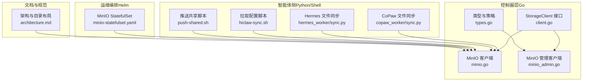
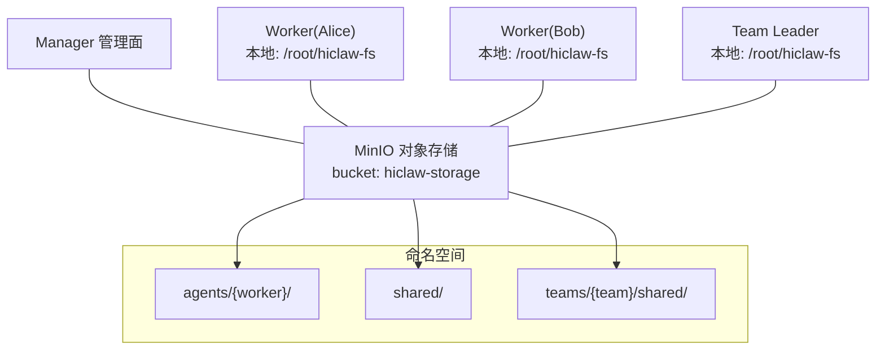
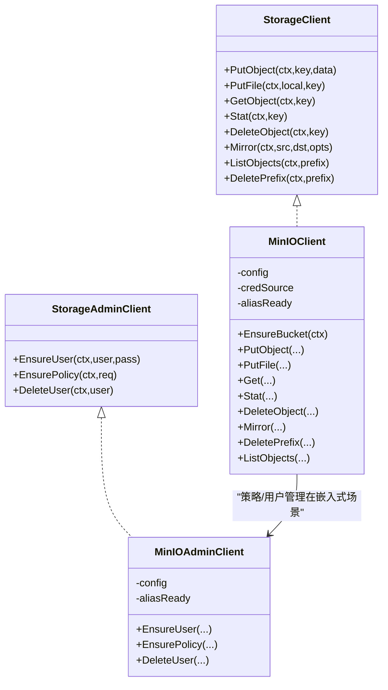
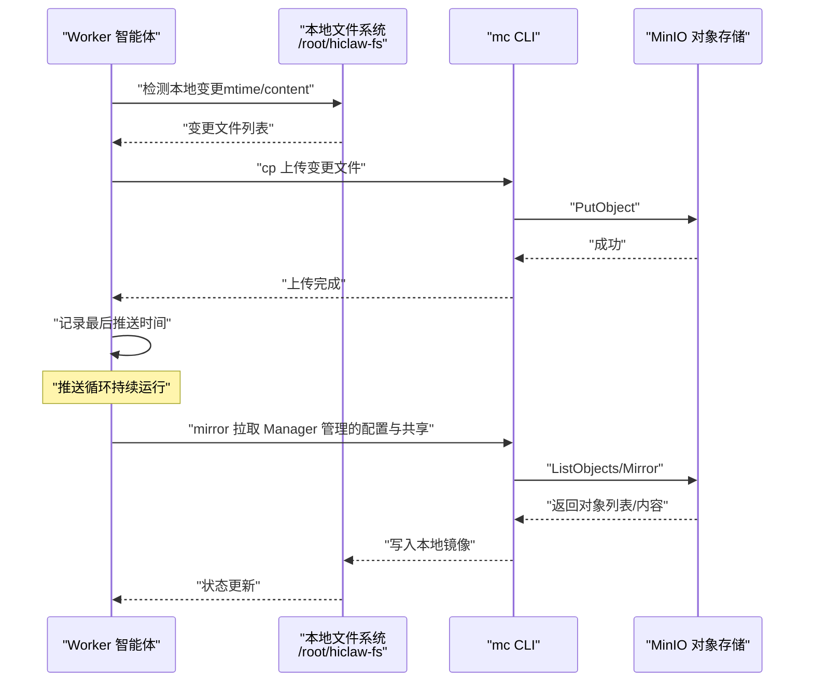
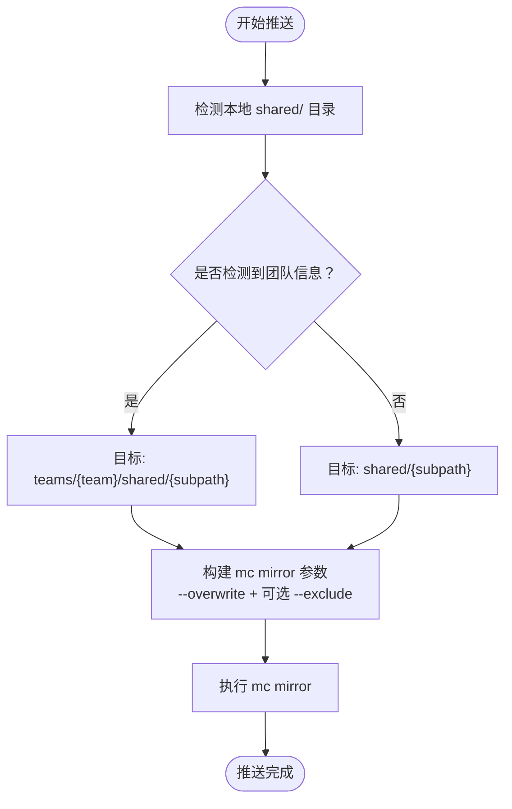
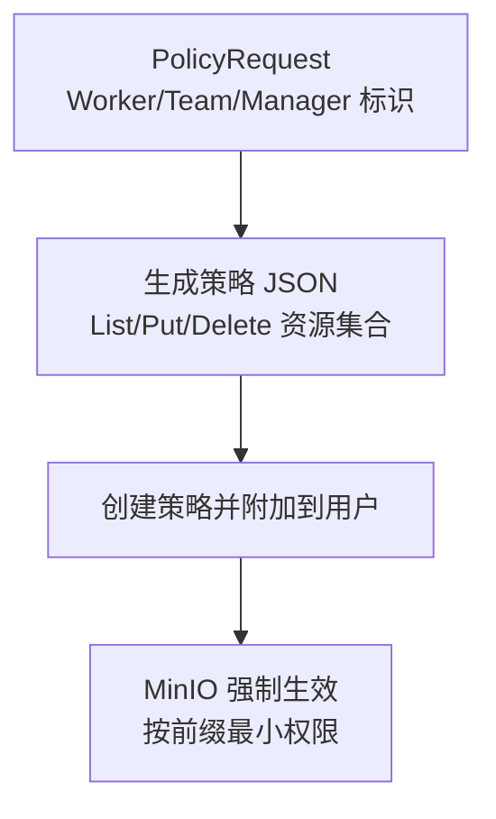
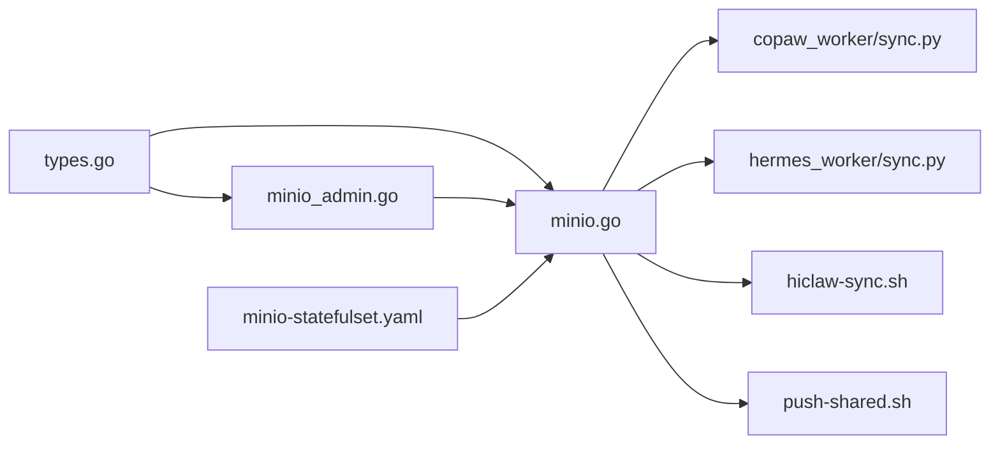

# MinIO 共享文件系统

<cite>
**本文引用的文件**
- [hiclaw-controller/internal/oss/client.go](file://hiclaw-controller/internal/oss/client.go)
- [hiclaw-controller/internal/oss/types.go](file://hiclaw-controller/internal/oss/types.go)
- [hiclaw-controller/internal/oss/minio.go](file://hiclaw-controller/internal/oss/minio.go)
- [hiclaw-controller/internal/oss/minio_admin.go](file://hiclaw-controller/internal/oss/minio_admin.go)
- [copaw/src/copaw_worker/sync.py](file://copaw/src/copaw_worker/sync.py)
- [hermes/src/hermes_worker/sync.py](file://hermes/src/hermes_worker/sync.py)
- [manager/agent/worker-agent/skills/file-sync/scripts/hiclaw-sync.sh](file://manager/agent/worker-agent/skills/file-sync/scripts/hiclaw-sync.sh)
- [manager/agent/hermes-worker-agent/skills/file-sync/scripts/push-shared.sh](file://manager/agent/hermes-worker-agent/skills/file-sync/scripts/push-shared.sh)
- [helm/hiclaw/templates/storage/minio-statefulset.yaml](file://helm/hiclaw/templates/storage/minio-statefulset.yaml)
- [docs/zh-cn/architecture.md](file://docs/zh-cn/architecture.md)
</cite>

## 目录
1. [简介](#简介)
2. [项目结构](#项目结构)
3. [核心组件](#核心组件)
4. [架构总览](#架构总览)
5. [组件详解](#组件详解)
6. [依赖关系分析](#依赖关系分析)
7. [性能与成本优化](#性能与成本优化)
8. [故障排查指南](#故障排查指南)
9. [结论](#结论)
10. [附录：典型使用场景](#附录典型使用场景)

## 简介
本文件系统以 MinIO 为核心，为多智能体协作提供统一的共享存储与同步能力。其关键价值在于：
- 显著降低多智能体协作中的“令牌消耗”：通过集中式对象存储替代频繁的 API 调用或长连接，减少 LLM 推理与外部服务交互次数。
- 统一的文件存储架构：以“agents/{worker}/”“shared/”“teams/{team}/shared/”等命名空间隔离与组织数据。
- 访问控制与权限模型：基于策略的最小权限授权，按工作器、团队与管理端进行路径级访问限制。
- 数据同步策略：采用“谁写谁推”的推送优先模式，结合按需拉取与周期性回拉，确保一致性与低冲突。

## 项目结构
MinIO 共享文件系统在本仓库中由以下层次构成：
- 控制器层（Go）：封装对象存储客户端、管理员客户端、类型定义与策略生成。
- 智能体侧（Python/Shell）：通过 mc CLI 实现文件推送、拉取、镜像与权限刷新。
- 运维编排（Helm）：内置 MinIO 的部署模板，支持持久化与健康检查。
- 文档与规范：架构图与目录布局说明。

图表来源
- [hiclaw-controller/internal/oss/client.go:1-55](file://hiclaw-controller/internal/oss/client.go#L1-L55)
- [hiclaw-controller/internal/oss/types.go:1-53](file://hiclaw-controller/internal/oss/types.go#L1-L53)
- [hiclaw-controller/internal/oss/minio.go:1-268](file://hiclaw-controller/internal/oss/minio.go#L1-L268)
- [hiclaw-controller/internal/oss/minio_admin.go:1-191](file://hiclaw-controller/internal/oss/minio_admin.go#L1-L191)
- [copaw/src/copaw_worker/sync.py:1-634](file://copaw/src/copaw_worker/sync.py#L1-L634)
- [hermes/src/hermes_worker/sync.py:1-339](file://hermes/src/hermes_worker/sync.py#L1-L339)
- [manager/agent/worker-agent/skills/file-sync/scripts/hiclaw-sync.sh:1-49](file://manager/agent/worker-agent/skills/file-sync/scripts/hiclaw-sync.sh#L1-L49)
- [manager/agent/hermes-worker-agent/skills/file-sync/scripts/push-shared.sh:1-61](file://manager/agent/hermes-worker-agent/skills/file-sync/scripts/push-shared.sh#L1-L61)
- [helm/hiclaw/templates/storage/minio-statefulset.yaml:1-79](file://helm/hiclaw/templates/storage/minio-statefulset.yaml#L1-L79)
- [docs/zh-cn/architecture.md:166-189](file://docs/zh-cn/architecture.md#L166-L189)

章节来源
- [hiclaw-controller/internal/oss/client.go:1-55](file://hiclaw-controller/internal/oss/client.go#L1-L55)
- [hiclaw-controller/internal/oss/types.go:1-53](file://hiclaw-controller/internal/oss/types.go#L1-L53)
- [hiclaw-controller/internal/oss/minio.go:1-268](file://hiclaw-controller/internal/oss/minio.go#L1-L268)
- [hiclaw-controller/internal/oss/minio_admin.go:1-191](file://hiclaw-controller/internal/oss/minio_admin.go#L1-L191)
- [copaw/src/copaw_worker/sync.py:1-634](file://copaw/src/copaw_worker/sync.py#L1-L634)
- [hermes/src/hermes_worker/sync.py:1-339](file://hermes/src/hermes_worker/sync.py#L1-L339)
- [manager/agent/worker-agent/skills/file-sync/scripts/hiclaw-sync.sh:1-49](file://manager/agent/worker-agent/skills/file-sync/scripts/hiclaw-sync.sh#L1-L49)
- [manager/agent/hermes-worker-agent/skills/file-sync/scripts/push-shared.sh:1-61](file://manager/agent/hermes-worker-agent/skills/file-sync/scripts/push-shared.sh#L1-L61)
- [helm/hiclaw/templates/storage/minio-statefulset.yaml:1-79](file://helm/hiclaw/templates/storage/minio-statefulset.yaml#L1-L79)
- [docs/zh-cn/architecture.md:166-189](file://docs/zh-cn/architecture.md#L166-L189)

## 核心组件
- 存储接口与客户端
  - StorageClient：抽象 Put/Get/Delete/Mirror/List/Stat 等操作，屏蔽底层实现差异。
  - MinIOClient：基于 mc CLI 的实现，支持静态与动态凭据注入，自动处理别名与前缀。
- 管理接口与策略
  - StorageAdminClient：仅嵌入式 MinIO 使用，负责用户与策略的创建、附加与删除。
  - PolicyRequest：描述按 Worker/Team/Manager 的最小权限策略范围。
- 类型与凭据
  - Config/Credentials/MirrorOptions：统一配置、凭据与镜像选项。
- 智能体同步模块
  - CoPaw/Hermes 文件同步：以 mc 为后端，实现推送（push_local）、拉取（pull_all）、全量镜像（mirror_all）与共享目录策略。
- 运维部署
  - Helm 模板：内置 MinIO StatefulSet，含就绪/存活探针与可选持久卷。

章节来源
- [hiclaw-controller/internal/oss/client.go:1-55](file://hiclaw-controller/internal/oss/client.go#L1-L55)
- [hiclaw-controller/internal/oss/types.go:1-53](file://hiclaw-controller/internal/oss/types.go#L1-L53)
- [hiclaw-controller/internal/oss/minio.go:13-268](file://hiclaw-controller/internal/oss/minio.go#L13-L268)
- [hiclaw-controller/internal/oss/minio_admin.go:13-191](file://hiclaw-controller/internal/oss/minio_admin.go#L13-L191)
- [copaw/src/copaw_worker/sync.py:114-634](file://copaw/src/copaw_worker/sync.py#L114-L634)
- [hermes/src/hermes_worker/sync.py:114-339](file://hermes/src/hermes_worker/sync.py#L114-L339)
- [helm/hiclaw/templates/storage/minio-statefulset.yaml:1-79](file://helm/hiclaw/templates/storage/minio-statefulset.yaml#L1-L79)

## 架构总览
MinIO 共享文件系统围绕“集中式对象存储 + 智能体本地镜像”的双层结构工作：
- 集中式存储：以 bucket 为根，按 agents/{worker}/、shared/、teams/{team}/shared/ 等命名空间组织。
- 智能体镜像：每个 Worker 在本地维护 /root/hiclaw-fs/agents/{worker}/ 与 shared/ 的镜像，通过 mc mirror 同步。
- 权限模型：策略按 Worker 名称与团队/管理端范围限定，避免越权访问。

图表来源
- [docs/zh-cn/architecture.md:166-189](file://docs/zh-cn/architecture.md#L166-L189)
- [copaw/src/copaw_worker/sync.py:301-324](file://copaw/src/copaw_worker/sync.py#L301-L324)
- [hermes/src/hermes_worker/sync.py:302-308](file://hermes/src/hermes_worker/sync.py#L302-L308)

## 组件详解

### 存储客户端与管理客户端
- StorageClient
  - 提供对象读写、状态查询、前缀删除、列表与镜像等能力；镜像时自动应用存储前缀，保证与对象读写一致。
- MinIOClient
  - 支持静态别名与动态凭据注入（云环境 STS），通过 MC_HOST_* 注入临时凭证，避免持久化别名与缓存。
  - 提供 fullPath 前缀拼接，确保路径一致性。
- StorageAdminClient 与策略
  - 为嵌入式 MinIO 提供用户与策略管理；策略按 Worker、Team 与 Manager 范围生成，限制 List/Put/Delete/GitObject 等动作。
- 类型与配置
  - Config/Credentials/MirrorOptions/PolicyRequest 明确了凭据来源、镜像行为与策略范围。

图表来源
- [hiclaw-controller/internal/oss/client.go:5-55](file://hiclaw-controller/internal/oss/client.go#L5-L55)
- [hiclaw-controller/internal/oss/minio.go:13-268](file://hiclaw-controller/internal/oss/minio.go#L13-L268)
- [hiclaw-controller/internal/oss/minio_admin.go:13-191](file://hiclaw-controller/internal/oss/minio_admin.go#L13-L191)

章节来源
- [hiclaw-controller/internal/oss/client.go:1-55](file://hiclaw-controller/internal/oss/client.go#L1-L55)
- [hiclaw-controller/internal/oss/types.go:1-53](file://hiclaw-controller/internal/oss/types.go#L1-L53)
- [hiclaw-controller/internal/oss/minio.go:13-268](file://hiclaw-controller/internal/oss/minio.go#L13-L268)
- [hiclaw-controller/internal/oss/minio_admin.go:13-191](file://hiclaw-controller/internal/oss/minio_admin.go#L13-L191)

### 智能体同步流程（推送优先 + 按需拉取）
- 设计原则
  - “谁写谁推”：本地变更立即推送至 MinIO；通过矩阵 @ 提醒对端拉取，避免并发冲突。
  - 分类职责：Manager 管理的配置与共享目录只读拉取；Worker 自管目录可读写推送。
- 关键流程
  - 推送循环：定期扫描本地变更，按 mtime 与内容差异决定是否上传，排除 Manager 管理项与派生文件。
  - 拉取循环：周期性回拉 Manager 管理的路径作为安全网；收到通知后触发按需拉取。
  - 全量镜像：启动阶段从 MinIO 恢复完整状态，随后以增量为主。
  - 共享目录策略：团队成员从 teams/{team}/shared/ 拉取；非团队成员从全局 shared/ 拉取。

图表来源
- [copaw/src/copaw_worker/sync.py:487-634](file://copaw/src/copaw_worker/sync.py#L487-L634)
- [hermes/src/hermes_worker/sync.py:222-250](file://hermes/src/hermes_worker/sync.py#L222-L250)
- [manager/agent/worker-agent/skills/file-sync/scripts/hiclaw-sync.sh:32-49](file://manager/agent/worker-agent/skills/file-sync/scripts/hiclaw-sync.sh#L32-L49)

章节来源
- [copaw/src/copaw_worker/sync.py:1-634](file://copaw/src/copaw_worker/sync.py#L1-L634)
- [hermes/src/hermes_worker/sync.py:1-339](file://hermes/src/hermes_worker/sync.py#L1-L339)
- [manager/agent/worker-agent/skills/file-sync/scripts/hiclaw-sync.sh:1-49](file://manager/agent/worker-agent/skills/file-sync/scripts/hiclaw-sync.sh#L1-L49)

### 共享目录与团队协作
- 团队共享
  - 团队成员从 teams/{team}/shared/ 拉取与推送，确保团队内知识与产物隔离。
- 全局共享
  - 非团队成员从 shared/ 拉取与推送，用于跨团队通用资料。
- 推送脚本
  - push-shared.sh 自动识别团队上下文，构建正确的 MinIO 目标路径并调用 mc mirror。

图表来源
- [manager/agent/hermes-worker-agent/skills/file-sync/scripts/push-shared.sh:17-61](file://manager/agent/hermes-worker-agent/skills/file-sync/scripts/push-shared.sh#L17-L61)
- [copaw/src/copaw_worker/sync.py:301-311](file://copaw/src/copaw_worker/sync.py#L301-L311)
- [hermes/src/hermes_worker/sync.py:302-308](file://hermes/src/hermes_worker/sync.py#L302-L308)

章节来源
- [manager/agent/hermes-worker-agent/skills/file-sync/scripts/push-shared.sh:1-61](file://manager/agent/hermes-worker-agent/skills/file-sync/scripts/push-shared.sh#L1-L61)
- [copaw/src/copaw_worker/sync.py:301-324](file://copaw/src/copaw_worker/sync.py#L301-L324)
- [hermes/src/hermes_worker/sync.py:302-308](file://hermes/src/hermes_worker/sync.py#L302-L308)

### 访问控制与权限模型
- 最小权限策略
  - 列表权限：允许按前缀列出 agents/{worker}/*、shared/* 以及可选 manager/* 与 teams/{team}/*。
  - 读写权限：允许对 agents/{worker}/*、shared/* 以及可选 manager/*、teams/{team}/* 执行 Get/Put/Delete。
- 动态凭据（云环境）
  - 通过 CredentialSource 在每次 mc 调用时注入 MC_HOST_*，避免持久化别名与令牌缓存。
- 用户与策略生命周期
  - EnsureUser：幂等创建/更新密码。
  - EnsurePolicy：生成策略 JSON 并 attach 至用户。
  - DeleteUser：先解绑/删除策略，再删除用户。

图表来源
- [hiclaw-controller/internal/oss/types.go:46-52](file://hiclaw-controller/internal/oss/types.go#L46-L52)
- [hiclaw-controller/internal/oss/minio_admin.go:57-94](file://hiclaw-controller/internal/oss/minio_admin.go#L57-L94)
- [hiclaw-controller/internal/oss/minio_admin.go:124-176](file://hiclaw-controller/internal/oss/minio_admin.go#L124-L176)

章节来源
- [hiclaw-controller/internal/oss/types.go:16-52](file://hiclaw-controller/internal/oss/types.go#L16-L52)
- [hiclaw-controller/internal/oss/minio_admin.go:57-176](file://hiclaw-controller/internal/oss/minio_admin.go#L57-L176)

## 依赖关系分析
- 控制器层
  - StorageClient/StorageAdminClient 抽象出对象存储与管理能力，MinIOClient/MinIOAdminClient 提供具体实现。
  - 类型与策略定义贯穿于管理与客户端之间，确保策略生成与凭据注入的一致性。
- 智能体层
  - Python 同步模块依赖 mc CLI；Shell 脚本直接调用 mc mirror，二者均受控制器层策略约束。
- 运维层
  - Helm 模板提供 MinIO 集群部署与健康检查，保障存储可用性。

图表来源
- [hiclaw-controller/internal/oss/types.go:1-53](file://hiclaw-controller/internal/oss/types.go#L1-L53)
- [hiclaw-controller/internal/oss/minio.go:1-268](file://hiclaw-controller/internal/oss/minio.go#L1-L268)
- [hiclaw-controller/internal/oss/minio_admin.go:1-191](file://hiclaw-controller/internal/oss/minio_admin.go#L1-L191)
- [copaw/src/copaw_worker/sync.py:1-634](file://copaw/src/copaw_worker/sync.py#L1-L634)
- [hermes/src/hermes_worker/sync.py:1-339](file://hermes/src/hermes_worker/sync.py#L1-L339)
- [manager/agent/worker-agent/skills/file-sync/scripts/hiclaw-sync.sh:1-49](file://manager/agent/worker-agent/skills/file-sync/scripts/hiclaw-sync.sh#L1-L49)
- [manager/agent/hermes-worker-agent/skills/file-sync/scripts/push-shared.sh:1-61](file://manager/agent/hermes-worker-agent/skills/file-sync/scripts/push-shared.sh#L1-L61)
- [helm/hiclaw/templates/storage/minio-statefulset.yaml:1-79](file://helm/hiclaw/templates/storage/minio-statefulset.yaml#L1-L79)

章节来源
- [hiclaw-controller/internal/oss/types.go:1-53](file://hiclaw-controller/internal/oss/types.go#L1-L53)
- [hiclaw-controller/internal/oss/minio.go:1-268](file://hiclaw-controller/internal/oss/minio.go#L1-L268)
- [hiclaw-controller/internal/oss/minio_admin.go:1-191](file://hiclaw-controller/internal/oss/minio_admin.go#L1-L191)
- [copaw/src/copaw_worker/sync.py:1-634](file://copaw/src/copaw_worker/sync.py#L1-L634)
- [hermes/src/hermes_worker/sync.py:1-339](file://hermes/src/hermes_worker/sync.py#L1-L339)
- [manager/agent/worker-agent/skills/file-sync/scripts/hiclaw-sync.sh:1-49](file://manager/agent/worker-agent/skills/file-sync/scripts/hiclaw-sync.sh#L1-L49)
- [manager/agent/hermes-worker-agent/skills/file-sync/scripts/push-shared.sh:1-61](file://manager/agent/hermes-worker-agent/skills/file-sync/scripts/push-shared.sh#L1-L61)
- [helm/hiclaw/templates/storage/minio-statefulset.yaml:1-79](file://helm/hiclaw/templates/storage/minio-statefulset.yaml#L1-L79)

## 性能与成本优化
- 降低令牌消耗
  - 使用 mc mirror 进行批量同步，减少细粒度 API 调用次数；推送优先避免频繁轮询。
  - 动态凭据注入避免缓存与重试风暴，降低鉴权开销。
- 减少网络与存储压力
  - 仅推送变更文件，配合内容比较与 mtime 过滤，避免重复传输。
  - 使用前缀过滤与排除规则（如 credentials/**、特定目录与扩展名），缩小传输范围。
- 镜像与回拉策略
  - 启动阶段全量镜像恢复状态，之后以增量为主；周期性回拉确保一致性。
- 存储高可用
  - 通过 Helm 模板启用持久卷与健康检查，提升可用性与稳定性。

[本节为通用指导，无需特定文件引用]

## 故障排查指南
- 常见问题定位
  - 无法连接 MinIO：检查 Endpoint 与凭据；确认 MC_HOST_* 是否正确注入；验证别名设置。
  - 对象不存在/权限不足：核对策略范围与前缀匹配；确认用户已附加策略。
  - 同步异常：查看推送/拉取日志；确认排除规则未误伤目标文件；检查本地 shared/ 路径解析。
- 关键排查点
  - mc 命令输出与错误码：关注 stderr 中的“Object does not exist”“exit status”等提示。
  - 策略生成：确认 PolicyRequest 的 Worker/Team/Manager 标识正确。
  - 云环境凭据：确保 CredentialSource 返回的三元组有效且未被 URL 解码。

章节来源
- [hiclaw-controller/internal/oss/minio.go:100-136](file://hiclaw-controller/internal/oss/minio.go#L100-L136)
- [hiclaw-controller/internal/oss/minio_admin.go:57-94](file://hiclaw-controller/internal/oss/minio_admin.go#L57-L94)
- [copaw/src/copaw_worker/sync.py:487-634](file://copaw/src/copaw_worker/sync.py#L487-L634)
- [hermes/src/hermes_worker/sync.py:149-170](file://hermes/src/hermes_worker/sync.py#L149-L170)

## 结论
MinIO 共享文件系统通过“集中式存储 + 智能体本地镜像 + 最小权限策略”的组合，在多智能体协作中实现了高效、低成本、可扩展的文件共享与同步。其设计以“谁写谁推”为核心，辅以按需拉取与周期性回拉，既降低了令牌消耗，又保证了数据一致性与安全性。

[本节为总结性内容，无需特定文件引用]

## 附录：典型使用场景
- 代码共享
  - 将公共代码库或参考材料放置于 teams/{team}/shared/base/，各成员按需拉取与更新。
- 日志收集
  - Worker 将任务日志写入 shared/tasks/{task-id}/result.md，Manager 或其他成员统一拉取归档。
- 配置管理
  - Manager 将 openclaw.json、mcporter-servers.json 等放置于 agents/{worker}/，Worker 启动时通过 hiclaw-sync.sh 拉取并合并本地配置。

章节来源
- [docs/zh-cn/architecture.md:166-189](file://docs/zh-cn/architecture.md#L166-L189)
- [manager/agent/worker-agent/skills/file-sync/scripts/hiclaw-sync.sh:32-49](file://manager/agent/worker-agent/skills/file-sync/scripts/hiclaw-sync.sh#L32-L49)
- [manager/agent/hermes-worker-agent/skills/file-sync/scripts/push-shared.sh:39-61](file://manager/agent/hermes-worker-agent/skills/file-sync/scripts/push-shared.sh#L39-L61)