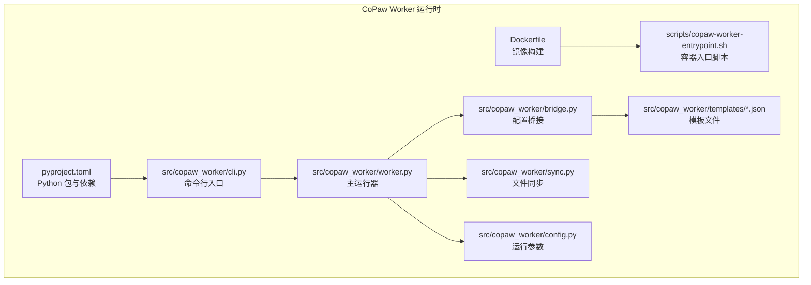
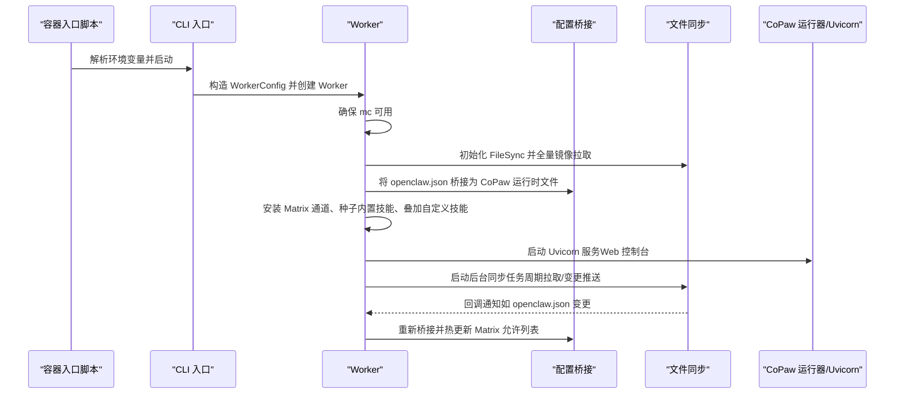
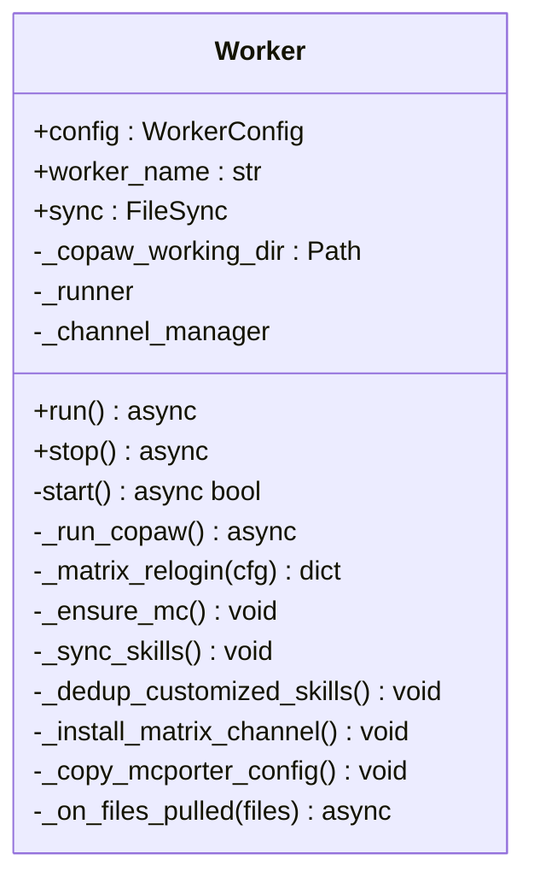
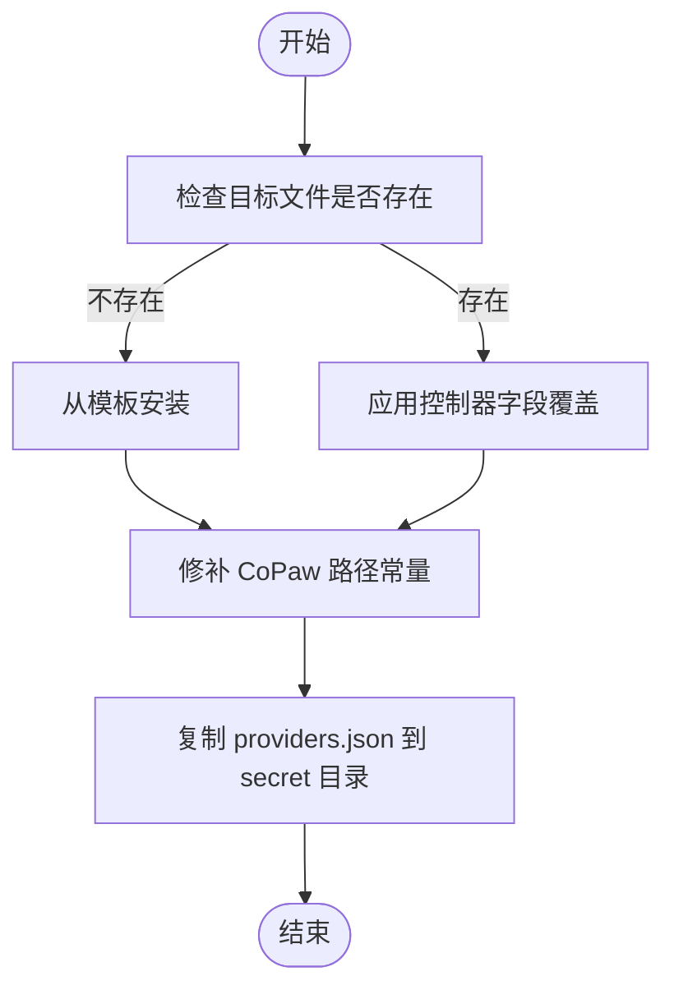
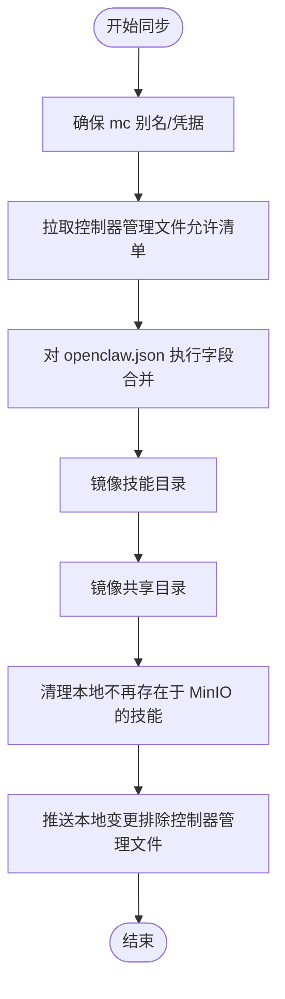
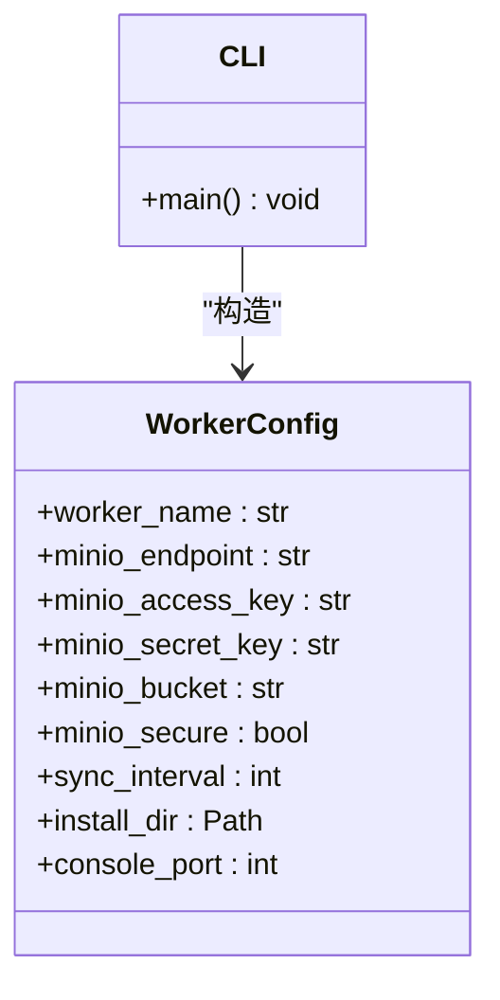
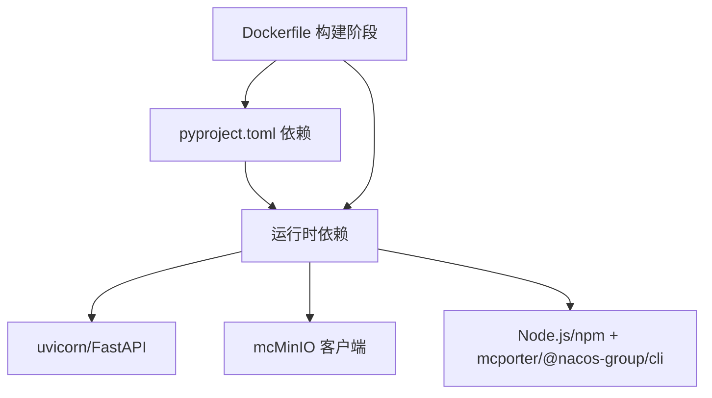

# CoPaw 运行时

<cite>
**本文引用的文件**
- [README.md](file://copaw/README.md)
- [Dockerfile](file://copaw/Dockerfile)
- [pyproject.toml](file://copaw/pyproject.toml)
- [__init__.py](file://copaw/src/copaw_worker/__init__.py)
- [config.py](file://copaw/src/copaw_worker/config.py)
- [cli.py](file://copaw/src/copaw_worker/cli.py)
- [worker.py](file://copaw/src/copaw_worker/worker.py)
- [bridge.py](file://copaw/src/copaw_worker/bridge.py)
- [sync.py](file://copaw/src/copaw_worker/sync.py)
- [agent.manager.json](file://copaw/src/copaw_worker/templates/agent.manager.json)
- [agent.worker.json](file://copaw/src/copaw_worker/templates/agent.worker.json)
- [config.json](file://copaw/src/copaw_worker/templates/config.json)
- [copaw-worker-entrypoint.sh](file://copaw/scripts/copaw-worker-entrypoint.sh)
- [main.go](file://hiclaw-controller/cmd/hiclaw/main.go)
- [quickstart.md](file://docs/quickstart.md)
- [worker-guide.md](file://docs/worker-guide.md)
</cite>

## 目录
1. [简介](#简介)
2. [项目结构](#项目结构)
3. [核心组件](#核心组件)
4. [架构总览](#架构总览)
5. [详细组件分析](#详细组件分析)
6. [依赖关系分析](#依赖关系分析)
7. [性能与可靠性](#性能与可靠性)
8. [部署与配置指南](#部署与配置指南)
9. [操作示例与最佳实践](#操作示例与最佳实践)
10. [故障排查](#故障排查)
11. [结论](#结论)

## 简介
CoPaw 运行时是基于 CoPaw 的轻量级 Worker 容器化运行时，用于在 HiClaw 多智能体协作平台中启动并管理 Worker 智能体。它通过统一的配置桥接（bridge）将控制器侧的 openclaw.json 转换为 CoPaw 的本地运行时文件，并通过 MinIO 提供的 mc 客户端实现双向文件同步，确保 Worker 与控制器之间的配置与技能热更新、会话与任务数据持久化。

CoPaw 运行时的关键优势：
- 以容器化方式提供“无状态 + 可移植”的 Worker 实例，便于大规模弹性扩缩容
- 基于 MinIO 的集中式配置与状态存储，支持跨节点一致性与快速恢复
- 通过 Matrix 通道实现人机与机机协作，支持 E2EE 场景下的设备 ID 刷新与密钥分发
- 采用模板驱动的桥接策略，最小化策略复杂度，提升可维护性与安全性
- 内置可观测性插件集成，便于在云原生环境下进行链路追踪与日志采集

## 项目结构
CoPaw 运行时位于仓库的 copaw 子目录，主要由以下部分组成：
- 构建与打包：Dockerfile、pyproject.toml、scripts/entrypoint
- 运行时核心：worker.py（主流程）、bridge.py（配置桥接）、sync.py（文件同步）
- 配置与模板：config.py（运行参数）、templates/*.json（默认配置模板）
- CLI 入口：cli.py（命令行入口）

**图表来源**
- [Dockerfile:1-132](file://copaw/Dockerfile#L1-L132)
- [copaw-worker-entrypoint.sh:1-144](file://copaw/scripts/copaw-worker-entrypoint.sh#L1-L144)
- [pyproject.toml:1-31](file://copaw/pyproject.toml#L1-L31)
- [cli.py:1-69](file://copaw/src/copaw_worker/cli.py#L1-L69)
- [worker.py:1-545](file://copaw/src/copaw_worker/worker.py#L1-L545)
- [bridge.py:1-703](file://copaw/src/copaw_worker/bridge.py#L1-L703)
- [sync.py:1-634](file://copaw/src/copaw_worker/sync.py#L1-L634)
- [config.py:1-29](file://copaw/src/copaw_worker/config.py#L1-L29)

**章节来源**
- [README.md:1-18](file://copaw/README.md#L1-L18)
- [Dockerfile:1-132](file://copaw/Dockerfile#L1-L132)
- [pyproject.toml:1-31](file://copaw/pyproject.toml#L1-L31)

## 核心组件
- 命令行入口：解析 CLI 参数与环境变量，初始化 Worker 并运行事件循环
- Worker 主流程：负责 mc 安装、全量镜像拉取、配置桥接、通道安装、技能同步、后台同步任务启动
- 配置桥接：将 openclaw.json 映射到 CoPaw 的 config.json、agent.json、providers.json
- 文件同步：基于 mc 的双向同步，支持本地变更推送与远程变更拉取
- 运行参数：封装 Worker 启动所需的核心配置项（MinIO 端点、凭证、桶名、同步间隔、安装目录、控制台端口等）

**章节来源**
- [cli.py:1-69](file://copaw/src/copaw_worker/cli.py#L1-L69)
- [worker.py:1-545](file://copaw/src/copaw_worker/worker.py#L1-L545)
- [bridge.py:1-703](file://copaw/src/copaw_worker/bridge.py#L1-L703)
- [sync.py:1-634](file://copaw/src/copaw_worker/sync.py#L1-L634)
- [config.py:1-29](file://copaw/src/copaw_worker/config.py#L1-L29)

## 架构总览
CoPaw 运行时的整体工作流如下：
- 启动阶段：容器入口脚本读取环境变量，设置时区、准备技能链接、配置可观测性，然后调用 copaw-worker CLI
- 初始化阶段：CLI 创建 WorkerConfig，实例化 Worker；Worker 确保 mc 可用、建立 FileSync、全量镜像拉取 MinIO 上的配置与资源
- 桥接阶段：将 openclaw.json 转换为 CoPaw 的运行时文件（config.json、agent.json、providers.json），并修补路径常量
- 通道与技能：安装 Matrix 通道模块、种子内置技能、叠加从 MinIO 推送的自定义技能
- 运行阶段：启动 Uvicorn 服务作为 Web 控制台与通道服务，同时启动后台同步任务（周期拉取与变更推送）
- 热更新：当 MinIO 中的 openclaw.json 或技能发生变更，触发重新桥接与技能重载

**图表来源**
- [copaw-worker-entrypoint.sh:1-144](file://copaw/scripts/copaw-worker-entrypoint.sh#L1-L144)
- [cli.py:1-69](file://copaw/src/copaw_worker/cli.py#L1-L69)
- [worker.py:1-545](file://copaw/src/copaw_worker/worker.py#L1-L545)
- [bridge.py:1-703](file://copaw/src/copaw_worker/bridge.py#L1-L703)
- [sync.py:1-634](file://copaw/src/copaw_worker/sync.py#L1-L634)

## 详细组件分析

### Worker 类与生命周期
- 负责启动、停止与异常处理
- 在启动时完成 mc 安装、全量镜像拉取、配置桥接、通道与技能安装、后台同步任务启动
- 支持在运行时对配置与技能进行热更新

**图表来源**
- [worker.py:32-545](file://copaw/src/copaw_worker/worker.py#L32-L545)

**章节来源**
- [worker.py:1-545](file://copaw/src/copaw_worker/worker.py#L1-L545)

### 配置桥接（Bridge）
- 将控制器侧的 openclaw.json 映射为 CoPaw 的运行时文件
- 分为“创建阶段”（缺失即从模板复制）与“重启覆盖阶段”（仅覆盖控制器拥有字段）
- 支持端口重映射、容器内/外环境识别、安全默认值固化

**图表来源**
- [bridge.py:155-211](file://copaw/src/copaw_worker/bridge.py#L155-L211)
- [bridge.py:519-648](file://copaw/src/copaw_worker/bridge.py#L519-L648)

**章节来源**
- [bridge.py:1-703](file://copaw/src/copaw_worker/bridge.py#L1-L703)
- [agent.manager.json:1-26](file://copaw/src/copaw_worker/templates/agent.manager.json#L1-L26)
- [agent.worker.json:1-25](file://copaw/src/copaw_worker/templates/agent.worker.json#L1-L25)
- [config.json:1-21](file://copaw/src/copaw_worker/templates/config.json#L1-L21)

### 文件同步（FileSync）
- 使用 mc 客户端进行全量镜像拉取与增量同步
- 支持本地变更推送（排除控制器管理的文件）与远程变更拉取
- 对 openclaw.json 采用字段级合并策略，保留本地非控制器字段

**图表来源**
- [sync.py:225-463](file://copaw/src/copaw_worker/sync.py#L225-L463)
- [sync.py:487-634](file://copaw/src/copaw_worker/sync.py#L487-L634)

**章节来源**
- [sync.py:1-634](file://copaw/src/copaw_worker/sync.py#L1-L634)

### CLI 与运行参数
- CLI 提供 --name、--fs、--fs-key、--fs-secret、--fs-bucket、--sync-interval、--install-dir、--console-port 等选项
- WorkerConfig 封装了 Worker 启动所需的核心参数

**图表来源**
- [config.py:7-29](file://copaw/src/copaw_worker/config.py#L7-L29)
- [cli.py:21-69](file://copaw/src/copaw_worker/cli.py#L21-L69)

**章节来源**
- [cli.py:1-69](file://copaw/src/copaw_worker/cli.py#L1-L69)
- [config.py:1-29](file://copaw/src/copaw_worker/config.py#L1-L29)

## 依赖关系分析
- Python 依赖：copaw、matrix-nio、markdown-it-py、linkify-it-py
- 运行时依赖：uvicorn（FastAPI 服务器）、mc（MinIO 客户端）、Node.js 与 mcporter、Nacos CLI
- 容器镜像：基于 Python 3.11 slim，预装 jemalloc 以降低内存碎片；分层构建以减少依赖重装成本

**图表来源**
- [pyproject.toml:12-17](file://copaw/pyproject.toml#L12-L17)
- [Dockerfile:58-94](file://copaw/Dockerfile#L58-L94)

**章节来源**
- [pyproject.toml:1-31](file://copaw/pyproject.toml#L1-L31)
- [Dockerfile:1-132](file://copaw/Dockerfile#L1-L132)

## 性能与可靠性
- 内存优化：启用 jemalloc 并通过 LD_PRELOAD 减少 Python 内存碎片
- 同步策略：全量镜像拉取保证初始一致性，随后使用周期拉取与变更推送，兼顾实时性与带宽
- 热更新：仅在必要时重建桥接与技能目录，避免重复加载
- 错误隔离：异步任务独立运行，异常记录但不阻塞主流程；Uvicorn 服务可优雅退出

[本节为通用性能讨论，无需特定文件引用]

## 部署与配置指南

### 环境变量（容器内）
- HICLAW_WORKER_NAME：Worker 名称（必填）
- HICLAW_FS_ENDPOINT：MinIO 端点（本地模式必填）
- HICLAW_FS_ACCESS_KEY：MinIO 访问密钥（本地模式必填）
- HICLAW_FS_SECRET_KEY：MinIO 密钥（本地模式必填）
- HICLAW_FS_BUCKET：MinIO 桶名（默认 hiclaw-storage）
- HICLAW_RUNTIME：云模式标记（如 aliyun，使用 RRSA/STS）
- HICLAW_CONSOLE_PORT：Web 控制台端口（默认 8088）
- HICLAW_PORT_GATEWAY：网关端口（用于容器内端口重映射）
- HICLAW_MATRIX_DOMAIN：Matrix 域名（用于合成 user_id）
- TZ：时区（可选）
- COPAW_LOG_LEVEL：CoPaw 日志级别（默认 info）
- HICLAW_CMS_TRACES_ENABLED/HICLAW_CMS_*：LoongSuite 观察性插件配置（可选）

**章节来源**
- [copaw-worker-entrypoint.sh:5-12](file://copaw/scripts/copaw-worker-entrypoint.sh#L5-L12)
- [copaw-worker-entrypoint.sh:36-51](file://copaw/scripts/copaw-worker-entrypoint.sh#L36-L51)
- [copaw-worker-entrypoint.sh:104-123](file://copaw/scripts/copaw-worker-entrypoint.sh#L104-L123)
- [worker.py:139-144](file://copaw/src/copaw_worker/worker.py#L139-L144)

### Docker 镜像构建
- 构建阶段：分层缓存优先安装依赖，再复制源码；最终镜像包含 Python 虚拟环境、Node.js、mcporter、Nacos CLI
- 入口：/opt/hiclaw/scripts/copaw-worker-entrypoint.sh
- 工作目录：/root/.hiclaw-worker

**章节来源**
- [Dockerfile:1-132](file://copaw/Dockerfile#L1-L132)

### 网络与端口
- 控制台端口：默认 8088（可通过 HICLAW_CONSOLE_PORT 覆盖）
- 网关端口：容器内 :8080 通过 HICLAW_PORT_GATEWAY 重映射至宿主机
- MinIO：通过 HICLAW_FS_ENDPOINT 访问，支持 http/https
- Matrix：通过 openclaw.json 中的 homeserver 字段访问

**章节来源**
- [worker.py:189-200](file://copaw/src/copaw_worker/worker.py#L189-L200)
- [bridge.py:67-72](file://copaw/src/copaw_worker/bridge.py#L67-L72)

### 配置文件与模板
- config.json：全局安全与工具扫描默认值（首次生成后不再覆盖）
- agent.{worker|manager}.json：按角色选择模板，包含系统提示文件列表与通道配置
- providers.json：由控制器提供，包含 LLM 供应商与模型信息

**章节来源**
- [config.json:1-21](file://copaw/src/copaw_worker/templates/config.json#L1-L21)
- [agent.worker.json:1-25](file://copaw/src/copaw_worker/templates/agent.worker.json#L1-L25)
- [agent.manager.json:1-26](file://copaw/src/copaw_worker/templates/agent.manager.json#L1-L26)
- [bridge.py:587-648](file://copaw/src/copaw_worker/bridge.py#L587-L648)

## 操作示例与最佳实践

### 智能体创建与启动
- 通过 HiClaw 控制器或 Manager 在 Matrix 中发起创建工作请求，控制器生成 Worker 配置并启动容器
- 容器启动后，入口脚本自动完成 mc 凭据配置、镜像拉取、桥接与同步任务启动

**章节来源**
- [quickstart.md:80-141](file://docs/quickstart.md#L80-L141)
- [copaw-worker-entrypoint.sh:13-144](file://copaw/scripts/copaw-worker-entrypoint.sh#L13-L144)

### 任务执行与状态监控
- 在 Worker 所属房间中发送任务指令，Manager 将任务元数据写入 MinIO，Worker 拉取并执行
- 通过 Web 控制台（默认 8088 端口）查看运行状态与日志

**章节来源**
- [quickstart.md:144-172](file://docs/quickstart.md#L144-L172)
- [worker.py:189-200](file://copaw/src/copaw_worker/worker.py#L189-L200)

### 配置热更新与技能叠加
- 当控制器更新 openclaw.json 或推送新技能时，Worker 会在下次拉取周期或回调中重新桥接与重载
- 自定义技能会覆盖内置同名技能，同时保留内置与控制器推送的技能集合

**章节来源**
- [sync.py:494-504](file://copaw/src/copaw_worker/sync.py#L494-L504)
- [worker.py:494-545](file://copaw/src/copaw_worker/worker.py#L494-L545)

### 最佳实践
- 使用 HICLAW_RUNTIME=aliyun 在云环境中通过 RRSA/STS 自动刷新凭据
- 为每个 Worker 设置独立的 HICLAW_WORKER_NAME 与 MinIO 桶命名空间
- 合理设置 HICLAW_PORT_GATEWAY 以适配容器内服务端口映射
- 开启 COPAW_LOG_LEVEL=debug 以便定位问题，生产环境建议降级
- 通过 HICLAW_CMS_TRACES_ENABLED 集成链路追踪，便于多智能体协作场景下的可观测性

**章节来源**
- [copaw-worker-entrypoint.sh:36-51](file://copaw/scripts/copaw-worker-entrypoint.sh#L36-L51)
- [copaw-worker-entrypoint.sh:104-123](file://copaw/scripts/copaw-worker-entrypoint.sh#L104-L123)
- [worker.py:139-144](file://copaw/src/copaw_worker/worker.py#L139-L144)

## 故障排查
- Worker 启动失败
  - 检查容器日志与入口脚本输出
  - 确认 HICLAW_WORKER_NAME、HICLAW_FS_ENDPOINT、HICLAW_FS_ACCESS_KEY、HICLAW_FS_SECRET_KEY 是否正确
  - 若使用云模式，确认 HICLAW_RUNTIME=aliyun 且 RRSA/STS 凭据可用

- 无法连接 Matrix
  - 使用容器内 curl 测试 homeserver 可达性
  - 核对 openclaw.json 中 channels.matrix 的配置与端口映射

- 无法访问 LLM 网关
  - 使用容器内 curl 测试 AI Gateway 的 /v1/models 接口
  - 核对 openclaw.json 中 models.providers 的 apiKey 与路由授权

- MCP（GitHub）不可用
  - 使用 mcporter 在容器内测试服务器连通性与权限
  - 确认 Worker 的消费者密钥与 Higress 路由一致

- 重置 Worker
  - 删除容器后，向 Manager 请求重新创建；配置与数据仍保存在 MinIO，不会丢失

**章节来源**
- [worker-guide.md:61-123](file://docs/worker-guide.md#L61-L123)
- [worker.py:210-287](file://copaw/src/copaw_worker/worker.py#L210-L287)

## 结论
CoPaw 运行时通过容器化、集中式配置与双向文件同步，为 HiClaw 多智能体协作提供了稳定、可扩展且易于运维的 Worker 执行环境。其模板化的配置桥接策略降低了策略复杂度，结合可观测性与热更新能力，使得在云原生与混合云场景下都能高效地支撑多智能体协同任务的编排与执行。