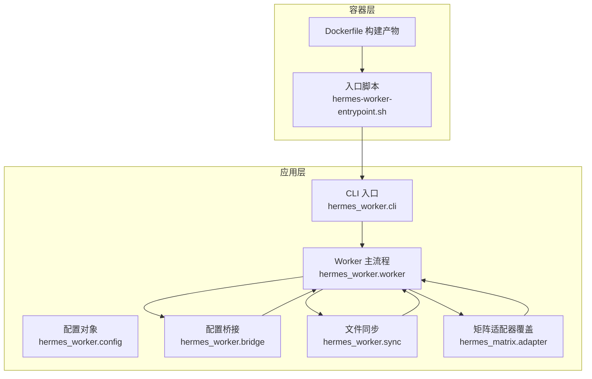
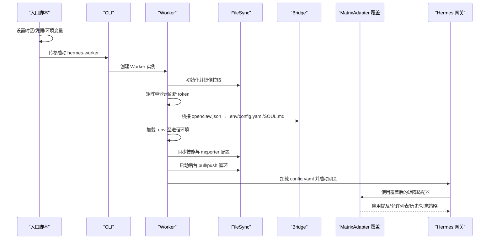
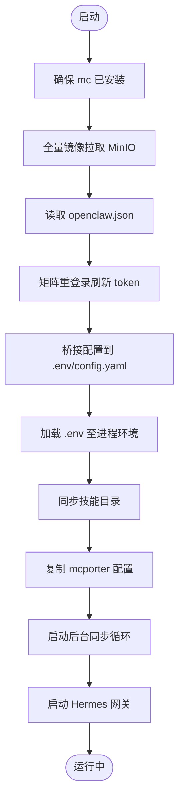
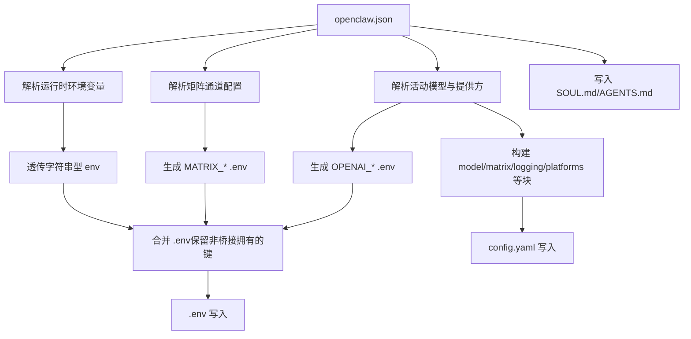
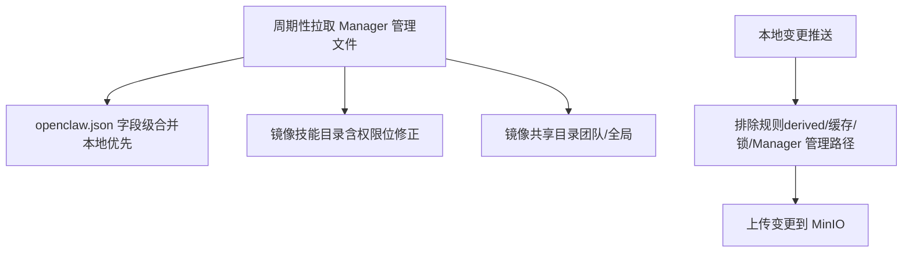
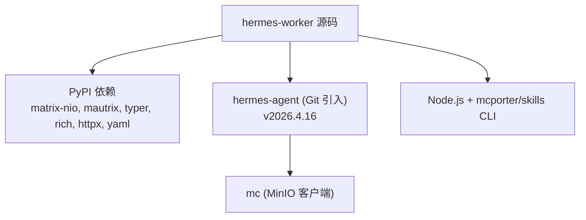

# Hermes 运行时

<cite>
**本文引用的文件**
- [hermes/README.md](file://hermes/README.md)
- [hermes/pyproject.toml](file://hermes/pyproject.toml)
- [hermes/src/hermes_worker/__init__.py](file://hermes/src/hermes_worker/__init__.py)
- [hermes/src/hermes_worker/worker.py](file://hermes/src/hermes_worker/worker.py)
- [hermes/src/hermes_worker/cli.py](file://hermes/src/hermes_worker/cli.py)
- [hermes/src/hermes_worker/config.py](file://hermes/src/hermes_worker/config.py)
- [hermes/src/hermes_worker/bridge.py](file://hermes/src/hermes_worker/bridge.py)
- [hermes/src/hermes_worker/sync.py](file://hermes/src/hermes_worker/sync.py)
- [hermes/src/hermes_matrix/adapter.py](file://hermes/src/hermes_matrix/adapter.py)
- [hermes/scripts/hermes-worker-entrypoint.sh](file://hermes/scripts/hermes-worker-entrypoint.sh)
- [hermes/Dockerfile](file://hermes/Dockerfile)
- [hermes/tests/test_bridge.py](file://hermes/tests/test_bridge.py)
- [hermes/tests/test_policies.py](file://hermes/tests/test_policies.py)
- [blog/hiclaw-1.1.0-release.md](file://blog/hiclaw-1.1.0-release.md)
- [changelog/v1.1.0.md](file://changelog/v1.1.0.md)
- [README.md](file://README.md)
- [README.zh-CN.md](file://README.zh-CN.md)
</cite>

## 目录
1. [简介](#简介)
2. [项目结构](#项目结构)
3. [核心组件](#核心组件)
4. [架构总览](#架构总览)
5. [详细组件分析](#详细组件分析)
6. [依赖关系分析](#依赖关系分析)
7. [性能与资源特性](#性能与资源特性)
8. [安装与配置指南](#安装与配置指南)
9. [使用示例与最佳实践](#使用示例与最佳实践)
10. [安全注意事项](#安全注意事项)
11. [故障排查](#故障排查)
12. [结论](#结论)

## 简介
Hermes 运行时是 HiClaw 的第三种 Worker 运行时，基于 hermes-agent（v0.10.0，git 标签 v2026.4.16），定位为“自驱动的自主编码代理”。它在容器内提供终端沙箱、多文件代码生成、调试、视觉图像理解、以及持续记忆检索能力，并通过矩阵适配器实现与团队协作的无缝集成。Hermes 的独特优势在于：
- 自主规划与执行复杂软件任务，具备“自我改进循环”：完成任务后自动沉淀可复用技能，跨会话通过 FTS5 记忆检索提升对项目的理解。
- 与 Manager/Leader Agent 协作：由更确定性的 Agent 负责任务拆解与调度，Hermes 负责实际的代码编写与工程化执行。
- 与 CoPaw/OpenClaw 运行时共享同一套 Matrix 语义与策略（提及、允许列表、加密、历史限制等），确保跨运行时一致的运营体验。

## 项目结构
Hermes Worker 的代码位于 hermes 子目录，主要由以下模块组成：
- 容器入口脚本：负责环境初始化、凭据注入、Hermes 配置导出、就绪探测与命令行启动。
- Worker 生命周期与同步：负责 MinIO 客户端安装、全量镜像拉取、增量同步、配置桥接、技能分发与清理。
- 配置桥接：将 HiClaw 的 openclaw.json 映射到 hermes-agent 的 config.yaml/.env。
- 矩阵适配器覆盖：以 hermes-agent 原生 mautrix 适配器为基础，叠加基于 matrix-nio 的策略钩子（允许列表、提及、历史、视觉等）。
- CLI 与配置对象：提供 hermes-worker 可执行命令与运行参数解析。

图表来源
- [hermes/scripts/hermes-worker-entrypoint.sh:1-157](file://hermes/scripts/hermes-worker-entrypoint.sh#L1-L157)
- [hermes/Dockerfile:1-175](file://hermes/Dockerfile#L1-L175)
- [hermes/src/hermes_worker/cli.py:1-72](file://hermes/src/hermes_worker/cli.py#L1-L72)
- [hermes/src/hermes_worker/config.py:1-40](file://hermes/src/hermes_worker/config.py#L1-L40)
- [hermes/src/hermes_worker/worker.py:1-463](file://hermes/src/hermes_worker/worker.py#L1-L463)
- [hermes/src/hermes_worker/bridge.py:1-538](file://hermes/src/hermes_worker/bridge.py#L1-L538)
- [hermes/src/hermes_worker/sync.py:1-622](file://hermes/src/hermes_worker/sync.py#L1-L622)
- [hermes/src/hermes_matrix/adapter.py:1-5](file://hermes/src/hermes_matrix/adapter.py#L1-L5)

章节来源
- [hermes/README.md:1-82](file://hermes/README.md#L1-L82)
- [hermes/Dockerfile:1-175](file://hermes/Dockerfile#L1-L175)
- [hermes/scripts/hermes-worker-entrypoint.sh:1-157](file://hermes/scripts/hermes-worker-entrypoint.sh#L1-L157)

## 核心组件
- hermes_worker.worker：Worker 主生命周期管理，负责 mc 安装、MinIO 全量镜像、矩阵重登录、桥接 openclaw.json 到 hermes 配置、技能同步、后台拉取/推送循环、启动 hermes-agent 网关。
- hermes_worker.bridge：将 openclaw.json 映射到 hermes 的 .env 与 config.yaml，保留用户自定义项，覆盖桥接拥有的键值；同时写入 SOUL.md/AGENTS.md。
- hermes_worker.sync：基于 mc CLI 的双向同步，遵循“谁写谁推”的原则；支持 openclaw.json 字段级合并、技能目录镜像、共享目录镜像、去重清理。
- hermes_matrix.adapter：覆盖 hermes-agent 原生矩阵适配器，注入与 CoPaw 一致的策略（允许列表、提及、历史缓冲、视觉开关等）。
- hermes_worker.cli/config：CLI 参数解析与 WorkerConfig 数据结构，暴露 hermes-worker 可执行命令。
- hermes/scripts/hermes-worker-entrypoint.sh：容器启动脚本，负责凭据注入、Hermes 环境变量导出、就绪探测、OTel/CMS 指标导出、调用 hermes-worker。

章节来源
- [hermes/src/hermes_worker/worker.py:1-463](file://hermes/src/hermes_worker/worker.py#L1-L463)
- [hermes/src/hermes_worker/bridge.py:1-538](file://hermes/src/hermes_worker/bridge.py#L1-L538)
- [hermes/src/hermes_worker/sync.py:1-622](file://hermes/src/hermes_worker/sync.py#L1-L622)
- [hermes/src/hermes_matrix/adapter.py:1-5](file://hermes/src/hermes_matrix/adapter.py#L1-L5)
- [hermes/src/hermes_worker/cli.py:1-72](file://hermes/src/hermes_worker/cli.py#L1-L72)
- [hermes/src/hermes_worker/config.py:1-40](file://hermes/src/hermes_worker/config.py#L1-L40)
- [hermes/scripts/hermes-worker-entrypoint.sh:1-157](file://hermes/scripts/hermes-worker-entrypoint.sh#L1-L157)

## 架构总览
Hermes Worker 的运行时架构围绕“配置桥接 + 文件同步 + 矩阵适配器覆盖 + hermes-agent 网关”展开。其关键流程如下：
- 启动阶段：入口脚本设置时区、凭据、HERMES_HOME，导出运行时参数，触发就绪探测；CLI 解析参数并创建 Worker。
- 初始化阶段：确保 mc 可用，拉取 MinIO 全量镜像，读取 openclaw.json，进行矩阵重登录，桥接配置至 .env 与 config.yaml，加载 .env 至进程环境，同步技能与 mcporter 配置，启动后台同步循环。
- 运行阶段：启动 hermes-agent 网关，加载 config.yaml 并运行矩阵适配器；监听同步事件，必要时重新桥接配置并提示重启网关以应用不可热重载的变更。
- 终止阶段：取消网关任务，优雅退出。

图表来源
- [hermes/scripts/hermes-worker-entrypoint.sh:1-157](file://hermes/scripts/hermes-worker-entrypoint.sh#L1-L157)
- [hermes/src/hermes_worker/cli.py:1-72](file://hermes/src/hermes_worker/cli.py#L1-L72)
- [hermes/src/hermes_worker/worker.py:1-463](file://hermes/src/hermes_worker/worker.py#L1-L463)
- [hermes/src/hermes_worker/bridge.py:1-538](file://hermes/src/hermes_worker/bridge.py#L1-L538)
- [hermes/src/hermes_worker/sync.py:1-622](file://hermes/src/hermes_worker/sync.py#L1-L622)
- [hermes/src/hermes_matrix/adapter.py:1-5](file://hermes/src/hermes_matrix/adapter.py#L1-L5)

## 详细组件分析

### Worker 生命周期与控制流
- 职责边界清晰：启动/停止/重启、环境准备、配置桥接、同步循环、网关启动。
- 异常处理：对 mc 下载失败、MinIO 镜像失败、网关崩溃等场景进行日志记录与中断处理。
- 热更新策略：对 openclaw.json 的变更仅在需要时重新桥接，部分配置需重启网关生效。

图表来源
- [hermes/src/hermes_worker/worker.py:1-463](file://hermes/src/hermes_worker/worker.py#L1-L463)

章节来源
- [hermes/src/hermes_worker/worker.py:1-463](file://hermes/src/hermes_worker/worker.py#L1-L463)

### 配置桥接机制
- 目标：将 openclaw.json 映射到 hermes 的 config.yaml 与 .env，保持用户自定义项不变。
- 关键点：
  - 桥接拥有的 .env 键：MATRIX_*、OPENAI_*、HERMES_DEFAULT_MODEL 等，每次桥接都会覆盖。
  - config.yaml 中的桥接块：model、matrix、auxiliary.vision、logging.level（当 HICLAW_MATRIX_DEBUG=1 时）、platforms.matrix.enabled。
  - 用户自定义项：terminal、memory、mcp_servers、skills 路径等原样保留。
- 视觉能力：若活动模型声明输入包含 image，则写入 auxiliary.vision 块以对齐视觉理解端点。

图表来源
- [hermes/src/hermes_worker/bridge.py:1-538](file://hermes/src/hermes_worker/bridge.py#L1-L538)

章节来源
- [hermes/src/hermes_worker/bridge.py:1-538](file://hermes/src/hermes_worker/bridge.py#L1-L538)
- [hermes/tests/test_bridge.py:1-110](file://hermes/tests/test_bridge.py#L1-L110)

### 文件同步与冲突解决
- 设计原则：谁写谁推；Manager 管理的文件只拉取，Worker 管理的文件只推送。
- openclaw.json 合并规则：本地优先，远程覆盖特定字段（models、gateway），channels 深度合并（远程胜），accessToken 本地优先；plugins.entries 深度合并（本地胜），load.paths 合并去重。
- 技能与共享目录：按需镜像，保持本地与 MinIO 的一致性；移除不再发布的技能目录。
- 排除策略：排除 derived 文件（如 .env/config.yaml）、缓存目录、锁文件、Manager 管理的 shared 目录等，避免回写冲突。

图表来源
- [hermes/src/hermes_worker/sync.py:1-622](file://hermes/src/hermes_worker/sync.py#L1-L622)

章节来源
- [hermes/src/hermes_worker/sync.py:1-622](file://hermes/src/hermes_worker/sync.py#L1-L622)

### 矩阵适配器覆盖与策略
- 覆盖策略：将 hermes-agent 原生 mautrix 的 gateway/platforms/matrix.py 重命名为 _matrix_native.py，并安装一个 shim，将导入替换为 hermes_matrix.adapter.MatrixAdapter。
- 策略钩子：提及增强、允许列表（DM/群组）、历史缓冲、视觉开关、线程策略、主页房间提示抑制等，与 CoPaw 保持一致的运营语义。

图表来源
- [hermes/Dockerfile:132-141](file://hermes/Dockerfile#L132-L141)
- [hermes/src/hermes_matrix/adapter.py:1-5](file://hermes/src/hermes_matrix/adapter.py#L1-L5)

章节来源
- [hermes/Dockerfile:132-141](file://hermes/Dockerfile#L132-L141)
- [hermes/src/hermes_matrix/adapter.py:1-5](file://hermes/src/hermes_matrix/adapter.py#L1-L5)
- [hermes/tests/test_policies.py:1-100](file://hermes/tests/test_policies.py#L1-L100)

### CLI 与配置对象
- CLI 提供 --name/--fs/--fs-key/--fs-secret/--fs-bucket/--sync-interval/--install-dir 等参数，封装 WorkerConfig。
- WorkerConfig 决定 workspace_dir 与 hermes_home 的布局，遵循 openclaw 风格：HOME/agents/<name> 作为工作区根，.hermes 作为 hermes-home。

章节来源
- [hermes/src/hermes_worker/cli.py:1-72](file://hermes/src/hermes_worker/cli.py#L1-L72)
- [hermes/src/hermes_worker/config.py:1-40](file://hermes/src/hermes_worker/config.py#L1-L40)

## 依赖关系分析
- 外部依赖：hermes-agent（通过 Git 引入，固定标签 v2026.4.16），matrix-nio、mautrix、typer、rich、httpx、pyyaml 等。
- 运行时依赖：mc（MinIO 客户端）、Node.js 与 mcporter/skills CLI（用于技能生态工具链）。
- 构建层：分阶段构建，先安装 hermes-agent 与 hermes-worker 依赖，再覆盖源码，最后将矩阵适配器覆盖层注入到 hermes-agent 的安装目录。

图表来源
- [hermes/pyproject.toml:1-37](file://hermes/pyproject.toml#L1-L37)
- [hermes/Dockerfile:82-121](file://hermes/Dockerfile#L82-L121)

章节来源
- [hermes/pyproject.toml:1-37](file://hermes/pyproject.toml#L1-L37)
- [hermes/Dockerfile:1-175](file://hermes/Dockerfile#L1-L175)

## 性能与资源特性
- 内存优化：预加载 jemalloc，降低 Python 内存碎片，预期节省约 10%-20% RSS。
- 运行时参数：YOLO 模式（跳过危险命令确认）、禁用 Home Channel 提示，减少交互阻塞，适合无人值守的自主执行。
- 日志可观测性：通过 HICLAW_MATRIX_DEBUG=1 将 Hermes 的日志级别提升为 DEBUG，便于矩阵网关与消息流追踪。

章节来源
- [hermes/Dockerfile:62-66](file://hermes/Dockerfile#L62-L66)
- [hermes/scripts/hermes-worker-entrypoint.sh:101-131](file://hermes/scripts/hermes-worker-entrypoint.sh#L101-L131)

## 安装与配置指南

### 环境准备
- Python 3.11+（容器镜像内置）。
- 容器内已安装 mc（MinIO 客户端）、Node.js、mcporter、skills CLI。
- 若在本地开发或宿主机运行，需确保 mc 可用（容器内会自动下载）。

章节来源
- [hermes/Dockerfile:33-81](file://hermes/Dockerfile#L33-L81)
- [hermes/src/hermes_worker/worker.py:283-330](file://hermes/src/hermes_worker/worker.py#L283-L330)

### 依赖安装
- 容器镜像构建阶段已安装 hermes-agent 与 hermes-worker 依赖；无需额外手动安装。
- 如需本地开发，可参考 pyproject.toml 的依赖清单，使用虚拟环境安装。

章节来源
- [hermes/pyproject.toml:1-37](file://hermes/pyproject.toml#L1-L37)
- [hermes/Dockerfile:82-121](file://hermes/Dockerfile#L82-L121)

### 配置文件设置
- openclaw.json（Manager 发布）：
  - channels.matrix：homeserver、accessToken、userId、deviceId、encryption、dm/group 策略、requireMention、freeResponseRooms、homeRoomId、historyLimit 等。
  - models.providers：baseUrl、apiKey、models 列表（含 id/name/contextWindow/input 等）。
  - env.vars：字符串/数字/布尔透传到 Hermes 进程。
- SOUL.md/AGENTS.md：系统提示与团队说明，由 Manager 发布，Worker 同步并写入 HERMES_HOME。
- config/mcporter.json：由 Manager 发布，Worker 同步到 HERMES_HOME/config/ 以便工具发现。

章节来源
- [hermes/src/hermes_worker/bridge.py:1-538](file://hermes/src/hermes_worker/bridge.py#L1-L538)
- [hermes/src/hermes_worker/sync.py:309-326](file://hermes/src/hermes_worker/sync.py#L309-L326)

### 启动与运行
- 容器启动：入口脚本设置时区、凭据、HERMES_HOME、运行时参数（YOLO_MODE、HOME_CHANNEL），并导出 CMS/OTel 相关环境变量，随后调用 hermes-worker。
- CLI 启动：hermes-worker --name --fs --fs-key --fs-secret --fs-bucket --sync-interval --install-dir。

章节来源
- [hermes/scripts/hermes-worker-entrypoint.sh:1-157](file://hermes/scripts/hermes-worker-entrypoint.sh#L1-L157)
- [hermes/src/hermes_worker/cli.py:1-72](file://hermes/src/hermes_worker/cli.py#L1-L72)

## 使用示例与最佳实践

### 启用代码执行功能
- 在 Manager 端为 Worker 配置模型提供方（baseUrl、apiKey）与活动模型（id），Hermes 将自动桥接为 OPENAI_* 环境变量与 model 块。
- 开启辅助视觉：当活动模型声明输入包含 image 时，Hermes 将在 auxiliary.vision 中写入相同的端点与密钥，使视觉分析工具链对齐。

章节来源
- [hermes/src/hermes_worker/bridge.py:357-381](file://hermes/src/hermes_worker/bridge.py#L357-L381)
- [hermes/tests/test_bridge.py:62-92](file://hermes/tests/test_bridge.py#L62-L92)

### 管理执行上下文
- HERMES_HOME：每个 Worker 的工作空间根，包含 config.yaml/.env、skills、sessions、缓存等。
- 矩阵上下文：通过 requireMention、freeResponseRooms、autoThread、dmMentionThreads、homeRoomId 等控制消息行为与线程策略。
- 历史上下文：HistoryBuffer 限制与标记，确保上下文长度可控且可追溯。

章节来源
- [hermes/src/hermes_worker/bridge.py:341-354](file://hermes/src/hermes_worker/bridge.py#L341-L354)
- [hermes/tests/test_policies.py:73-100](file://hermes/tests/test_policies.py#L73-L100)

### 处理执行结果
- 技能输出：技能脚本（.sh）在容器内可执行，权限位自动修正；通过 FileSync 将 Worker 侧产生的 AGENTS.md/SOUL.md/.hermes/sessions/ 等回传至 MinIO。
- 网关日志：开启 HICLAW_MATRIX_DEBUG=1 时，Hermes 的日志级别提升为 DEBUG，便于排查消息流与平台问题。

章节来源
- [hermes/src/hermes_worker/sync.py:481-601](file://hermes/src/hermes_worker/sync.py#L481-L601)
- [hermes/scripts/hermes-worker-entrypoint.sh:125-131](file://hermes/scripts/hermes-worker-entrypoint.sh#L125-L131)

## 安全注意事项
- YOLO 模式：在容器隔离边界内，Hermes 默认绕过危险命令确认，避免多 Agent 协作时因等待人工批准而死锁。此模式不影响安全规则与凭证隔离，仍需通过矩阵可见性与人类监督保障。
- 凭证与重登录：Worker 从 MinIO 读取矩阵密码并发起登录以刷新 device_id，确保 E2EE 身份轮换对客户端透明；失败时保留当前 token 并发出警告。
- 网络与端口映射：容器内默认 :8080 端口在宿主机上通过 HICLAW_PORT_GATEWAY 映射，避免跨容器不可达问题。
- 矩阵策略：允许列表、提及强制、历史限制、主页房间提示抑制等策略统一，防止未授权访问与噪声干扰。

章节来源
- [hermes/scripts/hermes-worker-entrypoint.sh:101-123](file://hermes/scripts/hermes-worker-entrypoint.sh#L101-L123)
- [hermes/src/hermes_worker/worker.py:197-278](file://hermes/src/hermes_worker/worker.py#L197-L278)
- [hermes/src/hermes_worker/bridge.py:47-57](file://hermes/src/hermes_worker/bridge.py#L47-L57)
- [hermes/tests/test_policies.py:1-100](file://hermes/tests/test_policies.py#L1-L100)

## 故障排查
- mc 无法找到：容器内自动下载 mc；若失败，需手动安装或检查网络。
- MinIO 镜像失败：检查端点、凭据、桶名与网络连通性；查看日志中的 stderr。
- 网关崩溃：查看网关日志与错误堆栈；对不可热重载的配置变更，按提示重启网关。
- 矩阵重登录失败：检查 homeserver 可达性与密码键是否存在；失败时保留当前 token 并发出警告。
- 同步异常：确认排除规则是否正确，DERIVED 文件不应被推送回 MinIO；检查 shared/global-shared 镜像权限。

章节来源
- [hermes/src/hermes_worker/worker.py:283-330](file://hermes/src/hermes_worker/worker.py#L283-L330)
- [hermes/src/hermes_worker/sync.py:222-265](file://hermes/src/hermes_worker/sync.py#L222-L265)
- [hermes/src/hermes_worker/worker.py:171-192](file://hermes/src/hermes_worker/worker.py#L171-L192)

## 结论
Hermes 运行时通过“配置桥接 + 文件同步 + 矩阵策略覆盖 + hermes-agent 网关”的组合，实现了在容器内的自主编码代理能力。其优势在于：
- 自主执行复杂工程任务，具备自我改进与跨会话记忆能力；
- 与 Manager/Leader Agent 协同，发挥各自专长；
- 与 CoPaw/OpenClaw 共享一致的矩阵语义与策略，降低运营复杂度；
- 提供完善的可观测性与安全边界，适合企业级多 Agent 协作场景。

章节来源
- [blog/hiclaw-1.1.0-release.md:15-32](file://blog/hiclaw-1.1.0-release.md#L15-L32)
- [changelog/v1.1.0.md:9-11](file://changelog/v1.1.0.md#L9-L11)
- [README.md:290-303](file://README.md#L290-L303)
- [README.zh-CN.md:338-343](file://README.zh-CN.md#L338-L343)