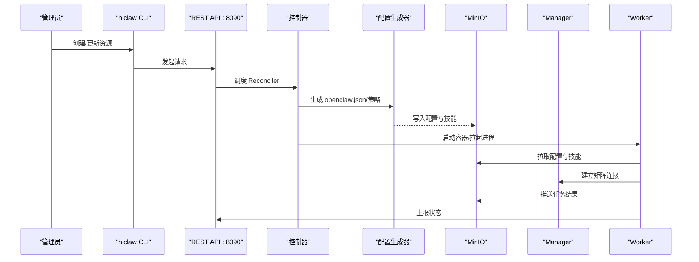
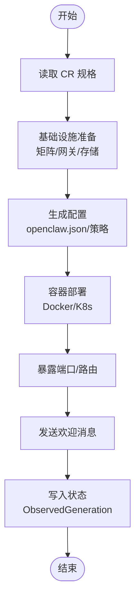
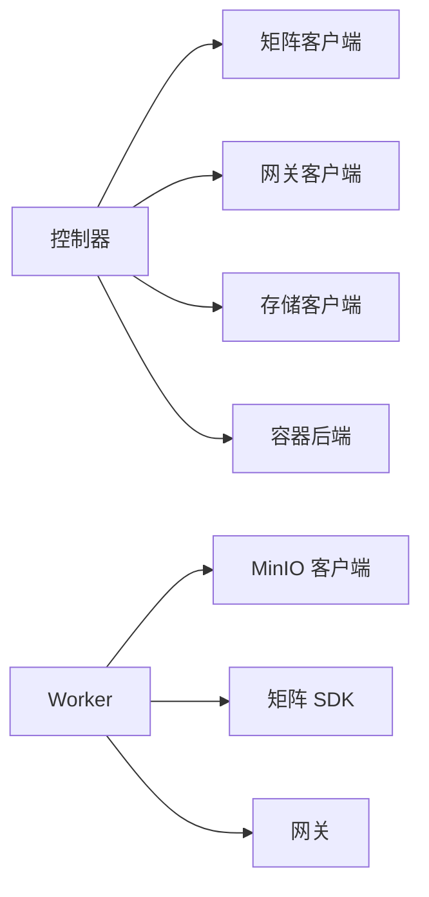

# OpenClaw 运行时

<cite>
**本文引用的文件**
- [README.md](file://README.md)
- [docs/quickstart.md](file://docs/quickstart.md)
- [docs/architecture.md](file://docs/architecture.md)
- [hiclaw-controller/cmd/hiclaw/main.go](file://hiclaw-controller/cmd/hiclaw/main.go)
- [hiclaw-controller/internal/app/app.go](file://hiclaw-controller/internal/app/app.go)
- [hiclaw-controller/internal/controller/manager_controller.go](file://hiclaw-controller/internal/controller/manager_controller.go)
- [hiclaw-controller/internal/controller/worker_controller.go](file://hiclaw-controller/internal/controller/worker_controller.go)
- [hiclaw-controller/internal/agentconfig/generator.go](file://hiclaw-controller/internal/agentconfig/generator.go)
- [hiclaw-controller/api/v1beta1/types.go](file://hiclaw-controller/api/v1beta1/types.go)
- [copaw/src/copaw_worker/cli.py](file://copaw/src/copaw_worker/cli.py)
- [copaw/src/copaw_worker/worker.py](file://copaw/src/copaw_worker/worker.py)
- [copaw/src/copaw_worker/config.py](file://copaw/src/copaw_worker/config.py)
- [hermes/src/hermes_worker/cli.py](file://hermes/src/hermes_worker/cli.py)
- [hermes/src/hermes_worker/worker.py](file://hermes/src/hermes_worker/worker.py)
- [hermes/src/hermes_worker/config.py](file://hermes/src/hermes_worker/config.py)
- [manager/agent/worker-agent/AGENTS.md](file://manager/agent/worker-agent/AGENTS.md)
- [manager/configs/manager-openclaw.json.tmpl](file://manager/configs/manager-openclaw.json.tmpl)
</cite>

## 目录
1. [简介](#简介)
2. [项目结构](#项目结构)
3. [核心组件](#核心组件)
4. [架构总览](#架构总览)
5. [详细组件分析](#详细组件分析)
6. [依赖关系分析](#依赖关系分析)
7. [性能考虑](#性能考虑)
8. [故障排查指南](#故障排查指南)
9. [结论](#结论)
10. [附录](#附录)

## 简介
本文件面向 OpenClaw（以及与之协同的 QwenPaw、Hermes）运行时，系统性阐述 HiClaw 多代理协作平台的架构设计、运行机制与最佳实践。重点覆盖以下方面：
- 任务编排与工具调用：通过矩阵房间与统一网关，实现人类可审计、可干预的多代理协作；OpenClaw/QwenPaw 在任务分解与协调上具备优势，Hermes 在自主编码与工具调用上具备优势。
- 工作原理：消息处理、任务调度、状态管理、配置生成与同步、容器生命周期管理。
- 安装与配置：单机安装、Kubernetes 部署、环境变量、启动参数、权限与安全模型。
- 使用示例：创建与管理智能体、任务分配与监控、跨 Worker 协作与 MCP 权限控制。
- 性能优化与故障排查：日志导出、调试流程、常见问题定位。

## 项目结构
HiClaw 采用“控制器 + 多运行时 Worker”的分布式架构。核心由以下部分组成：
- 控制器层（hiclaw-controller）：负责资源声明式管理（Worker/Team/Manager/Human）、基础设施（网关、矩阵、对象存储）与容器后端（Docker/Kubernetes）的编排。
- 网关与通信：Higress 或 AI Gateway 提供 LLM 与 MCP 路由；Matrix（Tuwunel）提供 IM 通道。
- 对象存储：MinIO（或兼容 OSS）作为共享工作区与任务工件的持久化介质。
- 运行时 Worker：OpenClaw（Node.js）、QwenPaw（Python）、Hermes（Python），均以轻量容器运行，通过 MinIO 同步配置与技能。

```mermaid
graph TB
subgraph "基础设施"
GW["Higress/AI Gateway"]
MX["Tuwunel Matrix"]
FS["MinIO 对象存储"]
end
subgraph "控制平面"
CTRL["hiclaw-controller"]
API["REST API :8090"]
end
subgraph "运行时"
MGR["Manager Agent<br/>OpenClaw/QwenPaw"]
W1["Worker A<br/>OpenClaw/QwenPaw/Hermes"]
W2["Worker B<br/>OpenClaw/QwenPaw/Hermes"]
end
MX <- --> MGR
MX <- --> W1
MX <- --> W2
API --> CTRL
CTRL --> GW
CTRL --> FS
MGR --> GW
W1 --> GW
W2 --> GW
MGR --> FS
W1 --> FS
W2 --> FS
```

图表来源
- [docs/architecture.md:23-82](file://docs/architecture.md#L23-L82)
- [hiclaw-controller/internal/app/app.go:190-262](file://hiclaw-controller/internal/app/app.go#L190-L262)

章节来源
- [README.md:13-50](file://README.md#L13-L50)
- [docs/architecture.md:1-17](file://docs/architecture.md#L1-L17)

## 核心组件
- 控制器（hiclaw-controller）
  - 负责 Worker/Team/Manager/Human 的声明式资源管理与生命周期编排。
  - 提供 REST API 与 CLI（hiclaw）用于资源操作。
  - 通过服务层（Provisioner/Deployer）对接矩阵、网关、对象存储与容器后端。
- 网关（Higress/AI Gateway）
  - 统一路由 LLM 与 MCP 服务，基于消费者密钥进行身份与权限控制。
- 矩阵（Tuwunel）
  - 提供人类与代理之间的可见、可干预通信通道。
- 对象存储（MinIO/OSS）
  - 作为 Worker 工作区与共享任务目录的持久化层，支持镜像同步与增量推送。
- 运行时 Worker
  - OpenClaw（Node.js）：通用代理，擅长任务编排与工具调用。
  - QwenPaw（Python）：轻量运行时，适合浏览器自动化与快速任务。
  - Hermes（Python）：自主编码代理，具备终端沙箱与持续学习能力。

章节来源
- [hiclaw-controller/internal/app/app.go:1-108](file://hiclaw-controller/internal/app/app.go#L1-L108)
- [hiclaw-controller/cmd/hiclaw/main.go:9-34](file://hiclaw-controller/cmd/hiclaw/main.go#L9-L34)
- [docs/architecture.md:140-177](file://docs/architecture.md#L140-L177)

## 架构总览
下图展示了从资源声明到运行时执行的关键路径：控制器根据 CRD 声明，生成 Worker 配置并通过 MinIO 推送；运行时 Worker 拉取配置、建立矩阵连接、执行任务并通过 MCP 访问外部工具。



图表来源
- [hiclaw-controller/internal/controller/worker_controller.go:110-151](file://hiclaw-controller/internal/controller/worker_controller.go#L110-L151)
- [hiclaw-controller/internal/agentconfig/generator.go:25-203](file://hiclaw-controller/internal/agentconfig/generator.go#L25-L203)
- [docs/architecture.md:165-177](file://docs/architecture.md#L165-L177)

章节来源
- [docs/architecture.md:165-177](file://docs/architecture.md#L165-L177)

## 详细组件分析

### 控制器与资源编排
- 资源模型
  - Worker/Team/Manager/Human 采用 CRD 定义，包含模型、运行时、镜像、技能、暴露端口、通道策略、期望状态与访问条目等字段。
- Reconciler 流程
  - ManagerReconciler/WorkerReconciler/TeamReconciler 分别负责各自资源的声明式收敛：基础设施、配置、容器生命周期与欢迎消息。
  - 状态写回遵循“成功才写入 ObservedGeneration”，避免无限重试循环。
- 服务层
  - Provisioner：矩阵用户、房间、消费者凭证与欢迎消息。
  - Deployer：根据后端（Docker/K8s）创建 Pod/容器，注入环境与配置。
  - EnvBuilder：构建 Worker 环境变量与挂载点。
- 配置生成
  - 生成 openclaw.json（网关、模型、通道、会话、插件、心跳等），并应用通道策略覆盖。



图表来源
- [hiclaw-controller/internal/controller/manager_controller.go:126-160](file://hiclaw-controller/internal/controller/manager_controller.go#L126-L160)
- [hiclaw-controller/internal/controller/worker_controller.go:110-151](file://hiclaw-controller/internal/controller/worker_controller.go#L110-L151)
- [hiclaw-controller/internal/agentconfig/generator.go:25-203](file://hiclaw-controller/internal/agentconfig/generator.go#L25-L203)

章节来源
- [hiclaw-controller/api/v1beta1/types.go:63-146](file://hiclaw-controller/api/v1beta1/types.go#L63-L146)
- [hiclaw-controller/internal/controller/manager_controller.go:72-160](file://hiclaw-controller/internal/controller/manager_controller.go#L72-L160)
- [hiclaw-controller/internal/controller/worker_controller.go:57-151](file://hiclaw-controller/internal/controller/worker_controller.go#L57-L151)
- [hiclaw-controller/internal/agentconfig/generator.go:25-203](file://hiclaw-controller/internal/agentconfig/generator.go#L25-L203)

### OpenClaw 运行时（Node.js）
- 配置模板
  - Manager 端提供 openclaw.json 模板，定义网关模式、模型列表、通道策略、会话重置、插件加载与心跳提示。
- Worker 行为
  - 通过 MinIO 同步 openclaw.json、SOUL.md、AGENTS.md、技能与 mcporter 配置。
  - 建立 Matrix 通道，按需刷新设备令牌以保持端到端加密稳定。
  - 支持后台拉取/推送循环，确保配置变更与任务结果的实时同步。
- 任务执行
  - 严格遵循“仅 @mention 协调员”“阶段性里程碑 @mention”“结果立即推送”等协议，降低令牌消耗与环路风险。

章节来源
- [manager/configs/manager-openclaw.json.tmpl:1-145](file://manager/configs/manager-openclaw.json.tmpl#L1-L145)
- [manager/agent/worker-agent/AGENTS.md:1-178](file://manager/agent/worker-agent/AGENTS.md#L1-L178)

### QwenPaw 运行时（Python）
- CLI 入口
  - 提供命令行参数解析，初始化 WorkerConfig 并启动 Worker。
- Worker 生命周期
  - 自动下载 mc 客户端、全量镜像 MinIO 内容、桥接 openclaw.json 到 CoPaw 工作区、安装 Matrix 通道、同步技能。
  - 后台定时拉取与变更触发推送，保持本地与云端一致。
- 通道策略热更新
  - 在不重启的情况下热更新允许列表，避免中断正在进行的 LLM 请求。

章节来源
- [copaw/src/copaw_worker/cli.py:21-69](file://copaw/src/copaw_worker/cli.py#L21-L69)
- [copaw/src/copaw_worker/worker.py:65-178](file://copaw/src/copaw_worker/worker.py#L65-L178)
- [copaw/src/copaw_worker/config.py:7-29](file://copaw/src/copaw_worker/config.py#L7-L29)

### Hermes 运行时（Python）
- CLI 入口
  - 解析参数，构造 WorkerConfig，启动 Worker。
- Worker 生命周期
  - 自动下载 mc 客户端、镜像 MinIO 内容、桥接 openclaw.json 到 Hermes Home、同步技能与 mcporter 配置。
  - 启动网关运行器，加载适配器与配置，进入代理循环。
- 热更新与环境注入
  - 重新桥接配置后加载 .env，使新环境变量在当前进程中生效。

章节来源
- [hermes/src/hermes_worker/cli.py:21-72](file://hermes/src/hermes_worker/cli.py#L21-L72)
- [hermes/src/hermes_worker/worker.py:86-166](file://hermes/src/hermes_worker/worker.py#L86-L166)
- [hermes/src/hermes_worker/config.py:7-40](file://hermes/src/hermes_worker/config.py#L7-L40)

### 消息处理与任务调度
- 消息处理
  - 仅 @mention 协调员的消息才会唤醒代理；历史上下文仅参考当前消息段。
  - 进度与中间结果无需 @mention，里程碑式完成必须 @mention 协调员。
- 任务调度
  - Manager 通过心跳扫描任务元数据，主动询问 Worker 进度；Worker 完成后更新元数据状态。
  - 任务目录结构清晰，中间产物集中存放，完成后统一推送至共享目录。

章节来源
- [manager/agent/worker-agent/AGENTS.md:84-178](file://manager/agent/worker-agent/AGENTS.md#L84-L178)

### 状态管理与配置生成
- 状态写回
  - 成功时才更新 ObservedGeneration，失败时保留旧阶段，避免误判健康状态。
- 配置生成
  - 生成 openclaw.json 时固定网关端口与控制界面参数，确保 UI 可达且令牌稳定，避免频繁重启。
  - 应用通道策略覆盖，支持组与私聊允许列表的增删。

章节来源
- [hiclaw-controller/internal/controller/worker_controller.go:294-309](file://hiclaw-controller/internal/controller/worker_controller.go#L294-L309)
- [hiclaw-controller/internal/agentconfig/generator.go:103-203](file://hiclaw-controller/internal/agentconfig/generator.go#L103-L203)

## 依赖关系分析
- 控制器依赖
  - 矩阵客户端：用于用户与房间管理、欢迎消息与轮询。
  - 网关客户端：用于消费者凭证与路由管理。
  - 存储客户端：用于配置与技能的上传下载。
  - 容器后端：Docker/Kubernetes 后端用于 Pod/容器创建与生命周期管理。
- 运行时 Worker 依赖
  - MinIO 客户端（mc）：用于镜像与推送。
  - 矩阵 SDK：用于消息收发与房间加入。
  - 网关：用于模型推理与 MCP 工具调用。



图表来源
- [hiclaw-controller/internal/app/app.go:190-262](file://hiclaw-controller/internal/app/app.go#L190-L262)
- [copaw/src/copaw_worker/worker.py:293-337](file://copaw/src/copaw_worker/worker.py#L293-L337)
- [hermes/src/hermes_worker/worker.py:283-330](file://hermes/src/hermes_worker/worker.py#L283-L330)

章节来源
- [hiclaw-controller/internal/app/app.go:190-262](file://hiclaw-controller/internal/app/app.go#L190-L262)

## 性能考虑
- 令牌与成本控制
  - 共享文件系统减少多代理协作中的重复传输与上下文开销。
  - 严格的任务里程碑 @mention 与中间结果非 @mention，降低无效对话与令牌浪费。
- 同步策略
  - 定时拉取与变更触发推送相结合，平衡实时性与网络负载。
  - 仅对共享目录与工作区进行增量同步，避免不必要的带宽占用。
- 资源隔离与并发
  - 通过 CRD 的并发限制与队列策略，控制代理并发与子代理并发，避免资源争用。
- 网络与路由
  - 固定网关端口与令牌，避免频繁重启导致的会话抖动与任务中断。

## 故障排查指南
- 日志导出与分析
  - 使用脚本导出矩阵消息与代理会话日志，并结合代码库进行交叉分析，快速定位根因。
- 常见问题
  - 矩阵 E2EE 断连：Worker 启动时自动刷新访问令牌与设备 ID，确保跨重启的加密一致性。
  - 任务无响应：检查是否正确 @mention 协调员；确认任务元数据状态与共享目录推送。
  - MCP 权限被撤销：通过控制器动态调整消费者权限，验证 Worker 是否能再次访问目标 MCP 服务器。
- 调试步骤
  - 检查控制器 REST API 与 CLI 的返回状态。
  - 查看 Worker 的 MinIO 同步日志与配置差异。
  - 核对矩阵房间成员与通道策略覆盖是否符合预期。

章节来源
- [README.md:355-379](file://README.md#L355-L379)
- [copaw/src/copaw_worker/worker.py:210-287](file://copaw/src/copaw_worker/worker.py#L210-L287)
- [hermes/src/hermes_worker/worker.py:197-277](file://hermes/src/hermes_worker/worker.py#L197-L277)

## 结论
OpenClaw 运行时在 HiClaw 平台上实现了“可审计、可干预、可扩展”的多代理协作范式。通过统一的控制器、矩阵通道与对象存储，OpenClaw/QwenPaw/Hermes 各司其职：前者擅长任务编排与工具调用，后者在自主编码与工具调用上表现突出。配合声明式资源管理与稳定的配置生成机制，平台在企业级场景中具备高可用与强安全特性。

## 附录

### 安装与配置指南
- 单机安装（Docker）
  - 使用安装脚本选择 LLM 提供商与 API Key，配置网络模式与对外访问。
  - 登录 Element Web，查看控制器、网关、MinIO 与管理 UI 的可达性。
- Kubernetes（Helm）
  - 通过 Helm Chart 部署，设置凭据、默认模型、公开 URL 与运行时类型。
  - 支持多区域镜像仓库加速拉取。
- 环境变量与启动参数
  - 控制器：HICLAW_CONTROLLER_URL、HICLAW_AUTH_TOKEN、HICLAW_AUTH_TOKEN_FILE。
  - Worker：--name/--fs/--fs-key/--fs-secret/--fs-bucket/--sync-interval/--install-dir/--console-port（OpenClaw/QwenPaw）；Hermes 还有 HERMES_HOME。
- 安全模型
  - Worker 仅持有消费级令牌；真实凭据由网关集中管理，降低泄露风险。

章节来源
- [README.md:54-110](file://README.md#L54-L110)
- [README.md:110-238](file://README.md#L110-L238)
- [hiclaw-controller/cmd/hiclaw/main.go:16-20](file://hiclaw-controller/cmd/hiclaw/main.go#L16-L20)
- [copaw/src/copaw_worker/cli.py:24-44](file://copaw/src/copaw_worker/cli.py#L24-L44)
- [hermes/src/hermes_worker/cli.py:24-48](file://hermes/src/hermes_worker/cli.py#L24-L48)

### 使用示例
- 快速入门
  - 安装后登录 Element Web，与 Manager 私聊创建 Worker，随后分配任务并观察进度。
- 多 Worker 协作
  - 在房间内分配前端与后端任务，通过共享文件进行协调，最终分别提交 PR。
- 动态权限控制
  - 临时撤销 Worker 的 MCP 访问权限，验证 403 错误；恢复后再次成功调用。

章节来源
- [docs/quickstart.md:13-356](file://docs/quickstart.md#L13-L356)