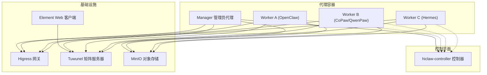
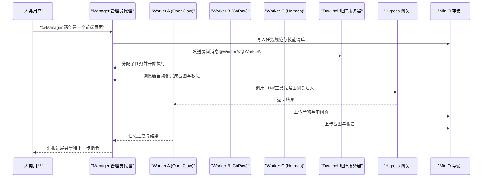
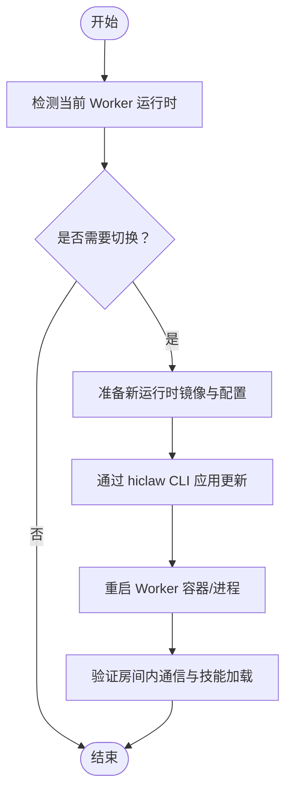
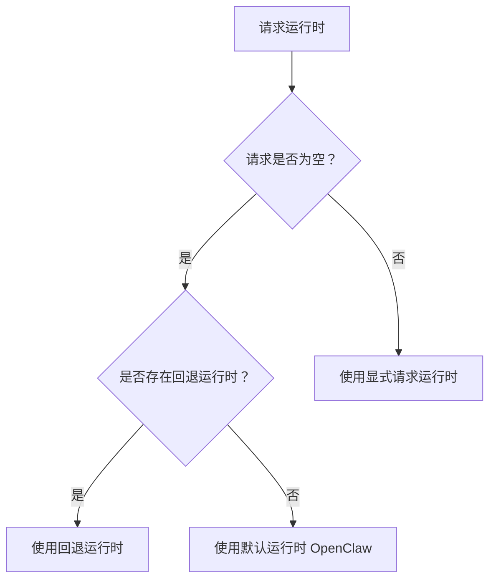
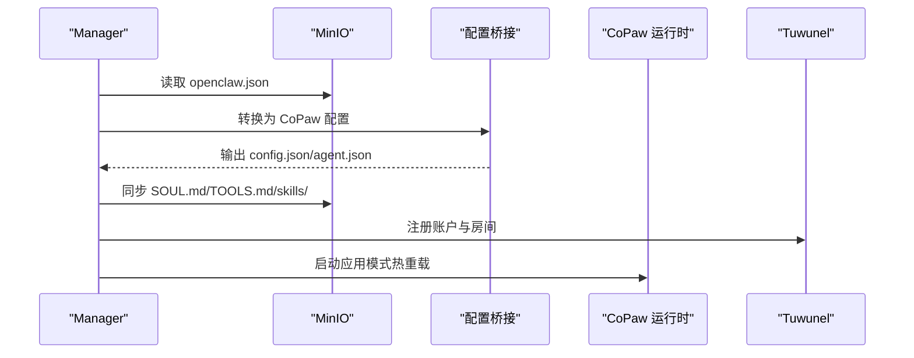
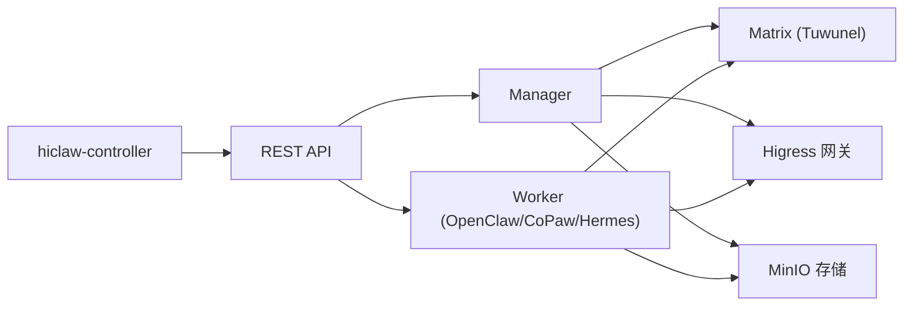

# 多运行时协作

<cite>
**本文引用的文件**
- [README.md](file://README.md)
- [README.zh-CN.md](file://README.zh-CN.md)
- [docs/k8s-native-agent-orch.md](file://docs/k8s-native-agent-orch.md)
- [docs/architecture.md](file://docs/architecture.md)
- [manager/README.md](file://manager/README.md)
- [manager/scripts/init/start-copaw-manager.sh](file://manager/scripts/init/start-copaw-manager.sh)
- [copaw/README.md](file://copaw/README.md)
- [copaw/src/copaw_worker/cli.py](file://copaw/src/copaw_worker/cli.py)
- [hermes/README.md](file://hermes/README.md)
- [hermes/src/hermes_worker/cli.py](file://hermes/src/hermes_worker/cli.py)
- [hiclaw-controller/cmd/hiclaw/main.go](file://hiclaw-controller/cmd/hiclaw/main.go)
- [hiclaw-controller/internal/backend/interface_test.go](file://hiclaw-controller/internal/backend/interface_test.go)
</cite>

## 目录
1. [简介](#简介)
2. [项目结构](#项目结构)
3. [核心组件](#核心组件)
4. [架构总览](#架构总览)
5. [详细组件分析](#详细组件分析)
6. [依赖分析](#依赖分析)
7. [性能考量](#性能考量)
8. [故障排查指南](#故障排查指南)
9. [结论](#结论)
10. [附录](#附录)

## 简介
本篇文档围绕 HiClaw 的“多运行时协作”能力展开，系统介绍 OpenClaw、QwenPaw（CoPaw）与 Hermes 三种 Worker 运行时的特点、适用场景与协作方式，并说明如何在同一 IM 房间中实现消息传递、任务分配与资源共享；同时提供运行时切换的操作示例与最佳实践建议。

HiClaw 的核心思想是：以 Manager-Workers 架构为中心，通过 Matrix 即时通讯协议实现“人类在环”的可见与可干预，借助 Higress AI Gateway 实现凭据隔离与细粒度策略控制，利用 MinIO 提供共享状态与低令牌消耗的协作通道。三种运行时可在同一房间内协同工作，按任务特性选择最优执行体。

## 项目结构
从整体上看，HiClaw 将基础设施（Higress、Tuwunel、MinIO、Element Web）与业务层（Manager、Worker）解耦，控制器负责资源编排与生命周期管理，Manager/Worker 则专注于任务编排与执行。

图表来源
- [docs/architecture.md:24-82](file://docs/architecture.md#L24-L82)
- [docs/k8s-native-agent-orch.md:197-228](file://docs/k8s-native-agent-orch.md#L197-L228)

章节来源
- [docs/architecture.md:1-235](file://docs/architecture.md#L1-L235)
- [docs/k8s-native-agent-orch.md:1-524](file://docs/k8s-native-agent-orch.md#L1-L524)

## 核心组件
- 运行时类型与职责
  - OpenClaw（Node.js）：通用 Agent，具备丰富的技能生态，适合任务编排与工具调用。
  - QwenPaw（Python，亦称 CoPaw）：轻量级运行时，适合浏览器自动化与快速任务。
  - Hermes（基于 hermes-agent）：自主编码 Agent，具备终端沙箱、自学习技能与持久记忆，适合复杂代码执行与迭代。
- 协作基础
  - 同一 IM 房间内的 m.mentions 通信，确保所有交互对人类可见且可干预。
  - 共享对象存储（MinIO）承载配置、技能与任务工件，降低跨 Agent 通信成本。
  - Higress 网关统一接入 LLM/MCP，凭据隔离与动态策略控制由消费者令牌与路由白名单实现。

章节来源
- [README.md:290-303](file://README.md#L290-L303)
- [README.zh-CN.md:338-343](file://README.zh-CN.md#L338-L343)
- [docs/architecture.md:140-162](file://docs/architecture.md#L140-L162)

## 架构总览
下图展示了多运行时在控制平面与基础设施之间的交互关系，以及 Manager 与多个 Worker 在 Matrix 上的协作路径。

图表来源
- [docs/k8s-native-agent-orch.md:355-392](file://docs/k8s-native-agent-orch.md#L355-L392)
- [docs/architecture.md:119-137](file://docs/architecture.md#L119-L137)

章节来源
- [docs/k8s-native-agent-orch.md:355-392](file://docs/k8s-native-agent-orch.md#L355-L392)
- [docs/architecture.md:119-137](file://docs/architecture.md#L119-L137)

## 详细组件分析

### 运行时特性与适用场景
- OpenClaw（Node.js）
  - 特点：通用性强、技能生态丰富、适合复杂任务编排与工具调用。
  - 场景：作为 Leader 进行任务拆分、协调不同 Worker、处理外部系统集成。
- QwenPaw（CoPaw，Python）
  - 特点：轻量、易部署、适合浏览器自动化与快速任务。
  - 场景：承担 UI/UX 验证、截图与简单脚本执行等。
- Hermes（Python + hermes-agent）
  - 特点：终端沙箱、自学习技能、持久记忆，适合复杂代码编写与持续优化。
  - 场景：承接需要深度编程与迭代的任务，如算法实现、框架搭建、自动化脚本维护。

章节来源
- [README.md:292-298](file://README.md#L292-L298)
- [README.zh-CN.md:338-343](file://README.zh-CN.md#L338-L343)

### 同一 IM 房间的协作机制
- 消息传递
  - 所有 Agent 与人类均通过 Matrix 房间进行沟通，使用 @mentions 触发目标 Worker。
  - 房间历史可审计，便于人类监督与干预。
- 任务分配
  - Manager/Leader 将大任务拆分为子任务，@ 指定具体 Worker 执行。
  - Worker 执行完成后在房间汇报进度与结果，Leader/Manager 汇总并反馈。
- 资源共享
  - MinIO 提供统一的对象存储，Worker 可读取共享任务树与个人工作区，减少重复传输与令牌消耗。

章节来源
- [docs/k8s-native-agent-orch.md:355-392](file://docs/k8s-native-agent-orch.md#L355-L392)
- [docs/architecture.md:127-131](file://docs/architecture.md#L127-L131)

### 运行时切换操作示例
- 原地切换 Worker 运行时
  - 使用 hiclaw CLI 更新 Worker 的 runtime 字段，即可在不丢失配置与状态的前提下切换到新的运行时镜像。
  - 切换后 Worker 会以新运行时的启动流程加载配置与技能，继续在相同房间内协作。

图表来源
- [README.md:300-303](file://README.md#L300-L303)
- [hiclaw-controller/cmd/hiclaw/main.go:9-34](file://hiclaw-controller/cmd/hiclaw/main.go#L9-L34)

章节来源
- [README.md:300-303](file://README.md#L300-L303)
- [hiclaw-controller/cmd/hiclaw/main.go:9-34](file://hiclaw-controller/cmd/hiclaw/main.go#L9-L34)

### 运行时解析与有效性校验
- 运行时解析规则
  - 显式请求优先于回退值；若未指定则使用回退运行时；若两者为空则默认使用 OpenClaw。
- 有效性校验
  - 支持的运行时集合包含 openclaw、copaw、hermes；未知值将被视为无效。

图表来源
- [hiclaw-controller/internal/backend/interface_test.go:5-27](file://hiclaw-controller/internal/backend/interface_test.go#L5-L27)

章节来源
- [hiclaw-controller/internal/backend/interface_test.go:5-46](file://hiclaw-controller/internal/backend/interface_test.go#L5-L46)

### Manager 与 Worker 的启动与桥接
- Manager（CoPaw 模式）
  - 将 OpenClaw 风格的工作区转换为 CoPaw 工作区，同步提示词与技能，自动识别 DM 房间并配置自动回复，最后以应用模式启动。
- Worker（CoPaw/Hermes）
  - CLI 接收 Worker 名称、MinIO 端点与凭证、同步间隔等参数，初始化 Worker 并连接 Matrix。

图表来源
- [manager/scripts/init/start-copaw-manager.sh:48-155](file://manager/scripts/init/start-copaw-manager.sh#L48-L155)
- [copaw/src/copaw_worker/cli.py:21-68](file://copaw/src/copaw_worker/cli.py#L21-L68)

章节来源
- [manager/scripts/init/start-copaw-manager.sh:1-217](file://manager/scripts/init/start-copaw-manager.sh#L1-L217)
- [copaw/src/copaw_worker/cli.py:1-69](file://copaw/src/copaw_worker/cli.py#L1-L69)
- [hermes/src/hermes_worker/cli.py:1-72](file://hermes/src/hermes_worker/cli.py#L1-L72)

### 运行时差异与选择建议
- 选择 OpenClaw 的情形
  - 需要强大的工具链与复杂编排；对技能生态要求高；需要与多种 MCP 服务交互。
- 选择 CoPaw 的情形
  - 需要快速执行浏览器自动化或轻量任务；希望以 Python 生态为主；对资源占用敏感。
- 选择 Hermes 的情形
  - 需要自主编码与持续改进；任务涉及终端操作与文件系统；需要持久记忆与自学习能力。

章节来源
- [README.md:292-298](file://README.md#L292-L298)
- [README.zh-CN.md:338-343](file://README.zh-CN.md#L338-L343)

## 依赖分析
- 组件耦合
  - 控制器与 Manager/Worker 通过 REST API 交互，实现资源声明与生命周期管理。
  - Manager/Worker 与基础设施通过矩阵、网关与存储三类通道交互，形成清晰的边界。
- 外部依赖
  - Higress 提供统一的 AI/MCP 凭据注入与路由控制。
  - Tuwunel 提供 Matrix 即时通讯服务。
  - MinIO 提供对象存储与双向同步能力。

图表来源
- [docs/architecture.md:19-82](file://docs/architecture.md#L19-L82)

章节来源
- [docs/architecture.md:19-82](file://docs/architecture.md#L19-L82)

## 性能考量
- 令牌与带宽
  - 通过 MinIO 共享状态与工件，避免重复传输与长上下文，显著降低令牌消耗。
- 资源占用
  - CoPaw 轻量部署适合快速任务；Hermes 沙箱与自学习能力带来更高计算开销，适合复杂任务。
- 动态策略
  - 通过 Higress 的消费者令牌与路由白名单实现细粒度访问控制，避免频繁重建环境带来的性能损耗。

章节来源
- [docs/architecture.md:127-137](file://docs/architecture.md#L127-L137)
- [docs/k8s-native-agent-orch.md:333-354](file://docs/k8s-native-agent-orch.md#L333-L354)

## 故障排查指南
- 日志导出
  - 使用调试脚本导出矩阵消息与代理会话日志，结合代码库进行根因分析。
- 常见问题定位
  - 检查 Manager/Worker 是否正确注册到 Matrix 与 MinIO。
  - 核对 Higress 消费者令牌与路由白名单配置。
  - 确认 Worker 运行时镜像与配置桥接是否成功。

章节来源
- [README.md:367-378](file://README.md#L367-L378)

## 结论
HiClaw 的多运行时协作以“可见、可控、可扩展”为核心设计：通过 Matrix 实现透明的人机协同，通过 Higress 实现凭据隔离与策略控制，通过 MinIO 实现低令牌消耗的共享状态。OpenClaw/QwenPaw 适合作为任务领导者与工具调用执行者，Hermes 适合自主编码与持续优化。借助 hiclaw CLI，可在不中断协作的前提下灵活切换运行时，满足不同任务的性能与能力需求。

## 附录
- 快速参考
  - 运行时切换命令：hiclaw update worker --runtime hermes
  - Manager 运行时选择：HICLAW_MANAGER_RUNTIME=openclaw 或 copaw
  - CoPaw Worker 启动参数：名称、MinIO 端点与凭证、同步间隔等
  - Hermes Worker 启动参数：名称、MinIO 端点与凭证、同步间隔等

章节来源
- [README.md:300-303](file://README.md#L300-L303)
- [manager/README.md:12-18](file://manager/README.md#L12-L18)
- [copaw/README.md:1-18](file://copaw/README.md#L1-L18)
- [hermes/README.md:1-82](file://hermes/README.md#L1-L82)
- [copaw/src/copaw_worker/cli.py:21-68](file://copaw/src/copaw_worker/cli.py#L21-L68)
- [hermes/src/hermes_worker/cli.py:21-72](file://hermes/src/hermes_worker/cli.py#L21-L72)