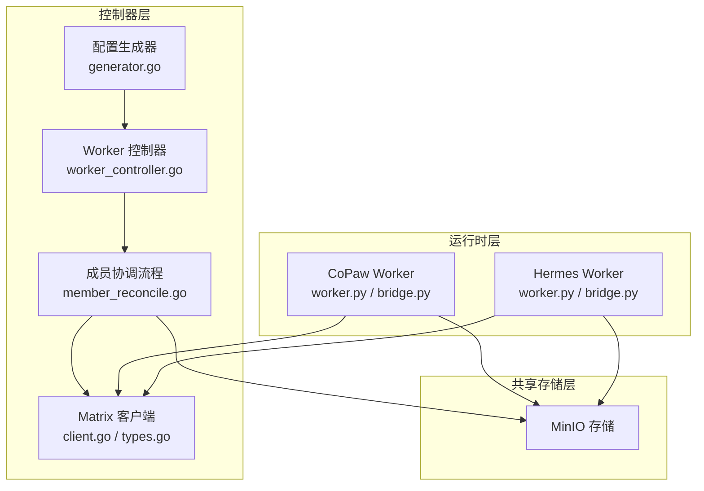
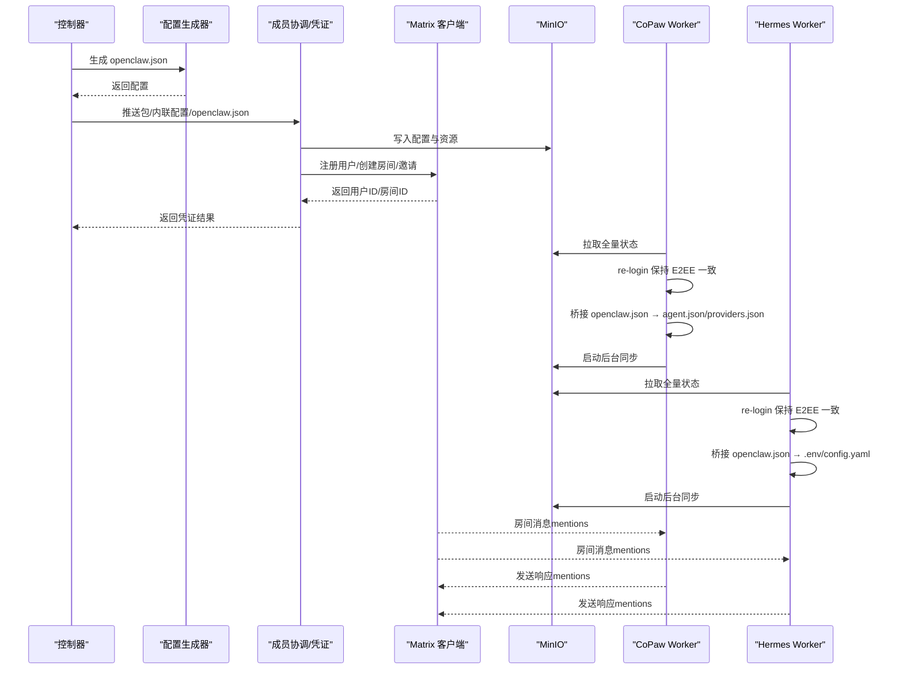
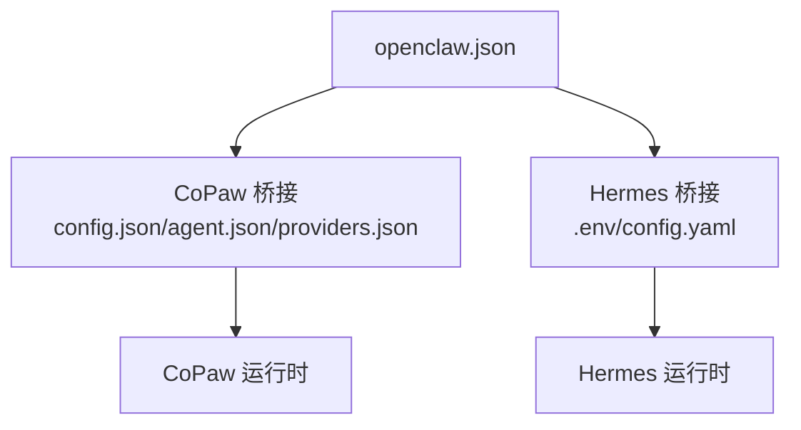
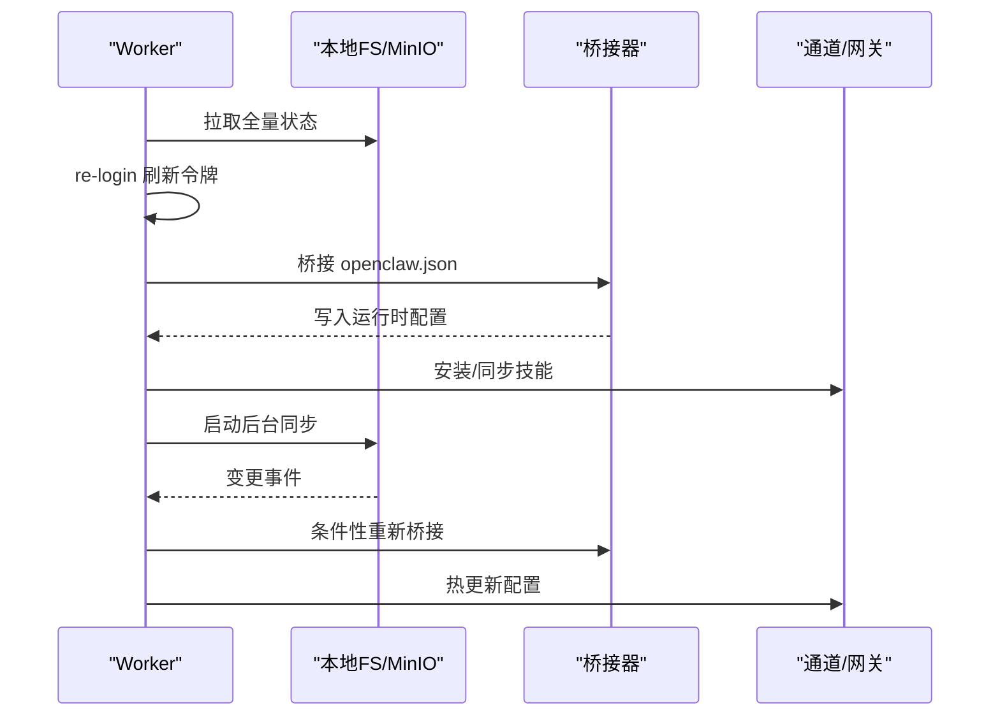
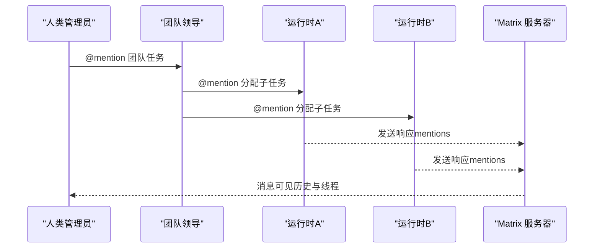
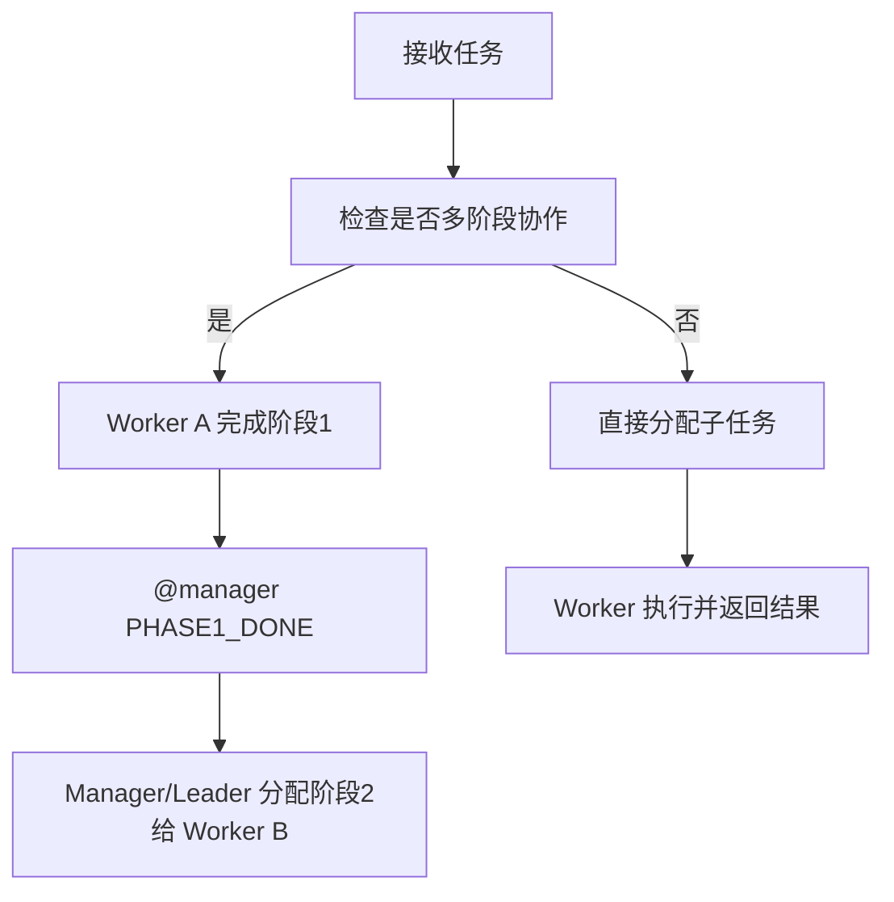
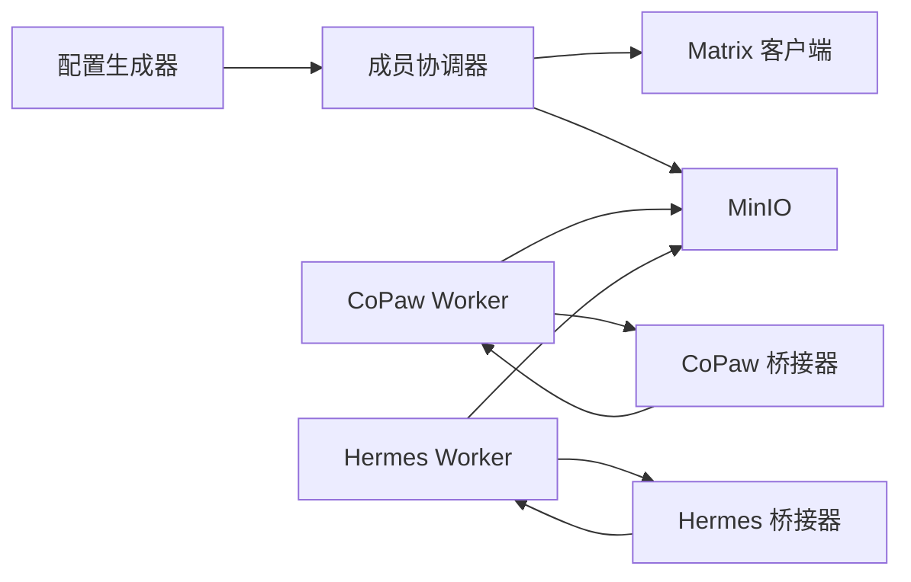

# 运行时协作机制

<cite>
**本文引用的文件**
- [hiclaw-controller/internal/agentconfig/generator.go](file://hiclaw-controller/internal/agentconfig/generator.go)
- [hiclaw-controller/internal/controller/worker_controller.go](file://hiclaw-controller/internal/controller/worker_controller.go)
- [hiclaw-controller/internal/controller/member_reconcile.go](file://hiclaw-controller/internal/controller/member_reconcile.go)
- [hiclaw-controller/internal/matrix/client.go](file://hiclaw-controller/internal/matrix/client.go)
- [hiclaw-controller/internal/matrix/types.go](file://hiclaw-controller/internal/matrix/types.go)
- [copaw/src/copaw_worker/bridge.py](file://copaw/src/copaw_worker/bridge.py)
- [copaw/src/copaw_worker/worker.py](file://copaw/src/copaw_worker/worker.py)
- [copaw/src/copaw_worker/config.py](file://copaw/src/copaw_worker/config.py)
- [hermes/src/hermes_worker/bridge.py](file://hermes/src/hermes_worker/bridge.py)
- [hermes/src/hermes_worker/worker.py](file://hermes/src/hermes_worker/worker.py)
- [hermes/src/hermes_worker/config.py](file://hermes/src/hermes_worker/config.py)
- [manager/agent/skills/project-management/references/task-lifecycle.md](file://manager/agent/skills/project-management/references/task-lifecycle.md)
- [manager/agent/team-leader-agent/skills/team-task-management/references/worker-selection.md](file://manager/agent/team-leader-agent/skills/team-task-management/references/worker-selection.md)
- [README.ja-JP.md](file://README.ja-JP.md)
- [tests/test-06-multi-worker.sh](file://tests/test-06-multi-worker.sh)
- [tests/test-14-git-collab.sh](file://tests/test-14-git-collab.sh)
</cite>

## 目录
1. [引言](#引言)
2. [项目结构](#项目结构)
3. [核心组件](#核心组件)
4. [架构总览](#架构总览)
5. [详细组件分析](#详细组件分析)
6. [依赖关系分析](#依赖关系分析)
7. [性能考虑](#性能考虑)
8. [故障排查指南](#故障排查指南)
9. [结论](#结论)
10. [附录](#附录)

## 引言
本文件系统性阐述 HiClaw 在同一 IM（Matrix）房间内实现多运行时（OpenClaw、Hermes 等）协同工作的机制与实践。重点覆盖以下方面：
- 消息路由与分发：基于 Matrix 的 mentions 与房间权限控制，确保跨运行时可见与可控。
- 消息格式与优先级：统一 openclaw.json 配置桥接，保证运行时对消息与行为的一致理解。
- 负载均衡与任务分配：通过控制器与团队领导者的协调，结合运行时能力与技能进行智能匹配。
- 共享资源与隔离：以 MinIO 作为共享存储，运行时在各自工作空间内隔离，避免互相干扰。
- 协作配置示例：如何在多运行时环境中进行配置与部署。
- 故障转移与容错：凭据刷新、容器重建、暴露端口管理与回退路径。
- 性能监控与调优：同步间隔、并发限制、日志级别与可观测性。

## 项目结构
HiClaw 将“控制器层”“运行时层”“IM 层”“共享存储层”解耦：
- 控制器层：生成 openclaw.json，管理成员生命周期（Worker/Team），协调矩阵房间与凭证。
- 运行时层：CoPaw Worker 与 Hermes Worker 分别桥接 openclaw.json 到各自运行时配置，并从 MinIO 同步状态。
- IM 层：Matrix 客户端抽象，提供用户注册、房间创建/加入/离开、消息发送与成员列表查询。
- 共享存储层：MinIO 提供 openclaw.json、SOUL/AGENTS/HEARTBEAT 文档、技能包与 mcporter 配置的镜像与增量同步。

图示来源
- [hiclaw-controller/internal/agentconfig/generator.go:25-203](file://hiclaw-controller/internal/agentconfig/generator.go#L25-L203)
- [hiclaw-controller/internal/controller/worker_controller.go:110-151](file://hiclaw-controller/internal/controller/worker_controller.go#L110-L151)
- [hiclaw-controller/internal/controller/member_reconcile.go:145-240](file://hiclaw-controller/internal/controller/member_reconcile.go#L145-L240)
- [hiclaw-controller/internal/matrix/client.go:16-87](file://hiclaw-controller/internal/matrix/client.go#L16-L87)
- [copaw/src/copaw_worker/worker.py:65-177](file://copaw/src/copaw_worker/worker.py#L65-L177)
- [hermes/src/hermes_worker/worker.py:86-165](file://hermes/src/hermes_worker/worker.py#L86-L165)

章节来源
- [hiclaw-controller/internal/agentconfig/generator.go:25-203](file://hiclaw-controller/internal/agentconfig/generator.go#L25-L203)
- [hiclaw-controller/internal/controller/worker_controller.go:110-151](file://hiclaw-controller/internal/controller/worker_controller.go#L110-L151)
- [hiclaw-controller/internal/controller/member_reconcile.go:145-240](file://hiclaw-controller/internal/controller/member_reconcile.go#L145-L240)
- [hiclaw-controller/internal/matrix/client.go:16-87](file://hiclaw-controller/internal/matrix/client.go#L16-L87)

## 核心组件
- 配置生成器：按运行时与策略生成 openclaw.json，注入 Matrix 通道、模型提供者、心跳与内存搜索等关键字段。
- 成员协调流程：统一处理基础设施（账号/房间/凭证）、服务账号、配置推送、容器生命周期与暴露端口。
- 运行时桥接器：将 openclaw.json 映射到各运行时的本地配置文件（CoPaw 的 agent.json/providers.json；Hermes 的 .env/config.yaml）。
- 运行时启动器：拉取 MinIO 全量状态，执行 re-login 保持 E2EE 设备一致性，桥接配置，安装技能，启动后台同步与网关/通道。
- Matrix 客户端：提供用户注册、房间管理、消息收发、成员查询与管理员命令通道。

章节来源
- [hiclaw-controller/internal/agentconfig/generator.go:25-203](file://hiclaw-controller/internal/agentconfig/generator.go#L25-L203)
- [hiclaw-controller/internal/controller/member_reconcile.go:145-240](file://hiclaw-controller/internal/controller/member_reconcile.go#L145-L240)
- [copaw/src/copaw_worker/bridge.py:155-211](file://copaw/src/copaw_worker/bridge.py#L155-L211)
- [hermes/src/hermes_worker/bridge.py:400-538](file://hermes/src/hermes_worker/bridge.py#L400-L538)
- [copaw/src/copaw_worker/worker.py:65-177](file://copaw/src/copaw_worker/worker.py#L65-L177)
- [hermes/src/hermes_worker/worker.py:86-165](file://hermes/src/hermes_worker/worker.py#L86-L165)
- [hiclaw-controller/internal/matrix/client.go:16-87](file://hiclaw-controller/internal/matrix/client.go#L16-L87)

## 架构总览
多运行时在同一 IM 房间内的协作遵循“控制器生成配置 → 运行时桥接并启动 → 共享存储驱动状态同步”的闭环。控制器负责：
- 生成 openclaw.json（含 Matrix 通道、模型提供者、默认并发、心跳、内存搜索等）。
- 为每个成员（Worker/Team Leader/Team Worker）准备 Matrix 用户、房间与凭证。
- 推送包、内联配置与 openclaw.json 至 MinIO，供运行时拉取。
- 统一管理容器生命周期与暴露端口。

运行时负责：
- 从 MinIO 拉取 openclaw.json 与系统提示文档，执行 re-login 以维持 E2EE 设备一致性。
- 将 openclaw.json 桥接到各自运行时的配置文件。
- 安装/同步技能，启动后台同步循环，热更新配置变更。
- 通过 Matrix 通道接收/发送消息，使用 mentions 实现跨运行时协作。

图示来源
- [hiclaw-controller/internal/agentconfig/generator.go:25-203](file://hiclaw-controller/internal/agentconfig/generator.go#L25-L203)
- [hiclaw-controller/internal/controller/member_reconcile.go:206-240](file://hiclaw-controller/internal/controller/member_reconcile.go#L206-L240)
- [hiclaw-controller/internal/matrix/client.go:131-225](file://hiclaw-controller/internal/matrix/client.go#L131-L225)
- [copaw/src/copaw_worker/worker.py:65-177](file://copaw/src/copaw_worker/worker.py#L65-L177)
- [hermes/src/hermes_worker/worker.py:86-165](file://hermes/src/hermes_worker/worker.py#L86-L165)

## 详细组件分析

### 配置生成与桥接（跨运行时一致性）
- 配置生成器：
  - 生成 gateway、channels.matrix、models、agents.defaults、session、plugins 等关键块。
  - 注入 Matrix 服务器地址、访问令牌、加密开关、允许列表、自动加入策略与网络策略等。
  - 可选注入心跳与嵌入模型用于记忆检索。
- CoPaw 桥接器：
  - 将 openclaw.json 中的 Matrix/模型/运行参数映射到 config.json、agent.json、providers.json。
  - 使用“创建阶段 + 重启覆盖策略”分离默认值与受控字段，确保用户自定义不被覆盖。
- Hermes 桥接器：
  - 将 openclaw.json 映射到 .env（MATRIX_*、OPENAI_*、HERMES_DEFAULT_MODEL）与 config.yaml（model、matrix、auxiliary.vision、logging、platforms.matrix）。
  - 对桥接拥有的键进行重写，保留用户侧未拥有的键，实现最小侵入式更新。

图示来源
- [hiclaw-controller/internal/agentconfig/generator.go:103-203](file://hiclaw-controller/internal/agentconfig/generator.go#L103-L203)
- [copaw/src/copaw_worker/bridge.py:155-211](file://copaw/src/copaw_worker/bridge.py#L155-L211)
- [hermes/src/hermes_worker/bridge.py:400-538](file://hermes/src/hermes_worker/bridge.py#L400-L538)

章节来源
- [hiclaw-controller/internal/agentconfig/generator.go:25-203](file://hiclaw-controller/internal/agentconfig/generator.go#L25-L203)
- [copaw/src/copaw_worker/bridge.py:155-211](file://copaw/src/copaw_worker/bridge.py#L155-L211)
- [hermes/src/hermes_worker/bridge.py:400-538](file://hermes/src/hermes_worker/bridge.py#L400-L538)

### 运行时启动与状态同步
- 启动流程：
  - 确保 mc 命令可用，拉取 MinIO 全量状态，读取 openclaw.json 并执行 re-login 以刷新 Matrix 访问令牌与设备 ID。
  - 桥接配置至运行时工作目录，安装技能，启动后台同步循环（拉取/推送）。
- 热更新：
  - 当 openclaw.json 或技能发生变化时，运行时重新桥接配置或同步技能，部分运行时支持热更新（如 CoPaw 的 MatrixChannel 允许列表）。

图示来源
- [copaw/src/copaw_worker/worker.py:65-177](file://copaw/src/copaw_worker/worker.py#L65-L177)
- [hermes/src/hermes_worker/worker.py:86-165](file://hermes/src/hermes_worker/worker.py#L86-L165)
- [copaw/src/copaw_worker/bridge.py:155-211](file://copaw/src/copaw_worker/bridge.py#L155-L211)
- [hermes/src/hermes_worker/bridge.py:400-538](file://hermes/src/hermes_worker/bridge.py#L400-L538)

章节来源
- [copaw/src/copaw_worker/worker.py:65-177](file://copaw/src/copaw_worker/worker.py#L65-L177)
- [hermes/src/hermes_worker/worker.py:86-165](file://hermes/src/hermes_worker/worker.py#L86-L165)

### 消息路由与分发（基于 Matrix 的 mentions）
- 房间与权限：
  - 控制器为每个 Worker 创建专用 DM 房间，设置 groupAllowFrom/dm.allowFrom 等白名单，确保仅允许授权用户/房间参与。
  - 自动加入策略与网络策略允许运行时访问内部服务（如本地域名解析）。
- mentions 与可见性：
  - 运行时通过 Matrix 通道监听房间消息，使用 mentions（@manager/@team-leader/@worker）触发跨运行时协作。
  - 多运行时在同一房间内可见，便于人类介入与审计。
- 消息格式：
  - openclaw.json 中的 channels.matrix.* 字段（如 requireMention、autoThread、free_response_rooms 等）统一影响消息行为与线程策略。

图示来源
- [hiclaw-controller/internal/agentconfig/generator.go:205-265](file://hiclaw-controller/internal/agentconfig/generator.go#L205-L265)
- [hiclaw-controller/internal/matrix/client.go:254-332](file://hiclaw-controller/internal/matrix/client.go#L254-L332)
- [README.ja-JP.md:290-303](file://README.ja-JP.md#L290-L303)

章节来源
- [hiclaw-controller/internal/agentconfig/generator.go:205-265](file://hiclaw-controller/internal/agentconfig/generator.go#L205-L265)
- [hiclaw-controller/internal/matrix/client.go:254-332](file://hiclaw-controller/internal/matrix/client.go#L254-L332)
- [README.ja-JP.md:290-303](file://README.ja-JP.md#L290-L303)

### 任务分配策略与协作模式
- 多阶段协作：
  - 项目任务可拆分为多阶段，Worker 完成后通过 @manager PHASE{N}_DONE 触发下一阶段分配，避免流程停滞。
- 团队内分配：
  - 团队领导根据 Worker 空闲状态、角色与技能进行匹配，优先空闲 Worker，必要时等待当前任务完成或拆分。
- 协作配置要点：
  - 在 openclaw.json 中配置 agents.defaults.maxConcurrent、subagents.maxConcurrent 等并发参数，平衡吞吐与稳定性。
  - 使用 channels.matrix.requireMention/autoThread 等行为开关，确保明确的协作边界与线程化交互。

图示来源
- [manager/agent/skills/project-management/references/task-lifecycle.md:1-51](file://manager/agent/skills/project-management/references/task-lifecycle.md#L1-L51)
- [manager/agent/team-leader-agent/skills/team-task-management/references/worker-selection.md:1-23](file://manager/agent/team-leader-agent/skills/team-task-management/references/worker-selection.md#L1-L23)
- [tests/test-14-git-collab.sh:83-97](file://tests/test-14-git-collab.sh#L83-L97)

章节来源
- [manager/agent/skills/project-management/references/task-lifecycle.md:1-51](file://manager/agent/skills/project-management/references/task-lifecycle.md#L1-L51)
- [manager/agent/team-leader-agent/skills/team-task-management/references/worker-selection.md:1-23](file://manager/agent/team-leader-agent/skills/team-task-management/references/worker-selection.md#L1-L23)
- [tests/test-14-git-collab.sh:83-97](file://tests/test-14-git-collab.sh#L83-L97)

### 共享资源与隔离机制
- 共享资源：
  - MinIO 作为统一存储，存放 openclaw.json、SOUL/AGENTS/HEARTBEAT 文档、技能包与 mcporter 配置。
  - 运行时通过 mc 客户端进行全量镜像与增量同步，确保配置与资源一致。
- 隔离机制：
  - 运行时工作空间隔离：CoPaw 在 .copaw/workspaces/default 下维护 agent.json/providers.json；Hermes 在 HERMES_HOME 下维护 .env/config.yaml。
  - 凭证隔离：Matrix 密码保存于 MinIO，运行时按需读取并执行 re-login，避免明文落盘。
  - 端口暴露：控制器统一管理暴露端口，避免冲突。

章节来源
- [copaw/src/copaw_worker/worker.py:65-177](file://copaw/src/copaw_worker/worker.py#L65-L177)
- [hermes/src/hermes_worker/worker.py:86-165](file://hermes/src/hermes_worker/worker.py#L86-L165)
- [hiclaw-controller/internal/controller/member_reconcile.go:404-417](file://hiclaw-controller/internal/controller/member_reconcile.go#L404-L417)

### 协作配置示例（多运行时环境）
- 生成 openclaw.json：
  - 设置 gateway.mode/port/bind/auth/remote/controlUi，确保与控制器暴露端口一致。
  - 配置 channels.matrix.homeserver、userId、accessToken、encryption、dm/groupAllowFrom、groups 等。
  - 配置 models.providers（含 baseUrl/apiKey/api）与 agents.defaults.model.primary。
- 运行时桥接：
  - CoPaw：bridge 将 openclaw.json 写入 config.json/agent.json/providers.json。
  - Hermes：bridge 将 openclaw.json 写入 .env 与 config.yaml。
- 启动与同步：
  - 运行时拉取 MinIO 全量状态，re-login，桥接配置，安装技能，启动后台同步。

章节来源
- [hiclaw-controller/internal/agentconfig/generator.go:103-203](file://hiclaw-controller/internal/agentconfig/generator.go#L103-L203)
- [copaw/src/copaw_worker/bridge.py:519-648](file://copaw/src/copaw_worker/bridge.py#L519-L648)
- [hermes/src/hermes_worker/bridge.py:400-538](file://hermes/src/hermes_worker/bridge.py#L400-L538)
- [copaw/src/copaw_worker/worker.py:65-177](file://copaw/src/copaw_worker/worker.py#L65-L177)
- [hermes/src/hermes_worker/worker.py:86-165](file://hermes/src/hermes_worker/worker.py#L86-L165)

### 故障转移与容错
- 凭据刷新与恢复：
  - 成员协调流程在刷新凭证时同时恢复 AI 路由授权，避免因路由表重置导致 403。
- 容器重建与状态恢复：
  - 当 spec 变更或容器处于异常状态时，控制器删除旧容器并按新配置重建；Docker 后端支持启动/停止。
- 房间清理与别名释放：
  - 删除成员时离开所有房间、删除房间、释放房间别名，确保未来复用房间别名时不会冲突。
- 端口暴露回退：
  - 暴露端口协调失败时记录错误并保留当前状态，避免误删已存在的暴露配置。

章节来源
- [hiclaw-controller/internal/controller/member_reconcile.go:145-192](file://hiclaw-controller/internal/controller/member_reconcile.go#L145-L192)
- [hiclaw-controller/internal/controller/member_reconcile.go:244-340](file://hiclaw-controller/internal/controller/member_reconcile.go#L244-L340)
- [hiclaw-controller/internal/controller/member_reconcile.go:420-484](file://hiclaw-controller/internal/controller/member_reconcile.go#L420-L484)

## 依赖关系分析
- 控制器依赖：
  - 配置生成器：生成 openclaw.json。
  - 成员协调器：统一处理基础设施、配置推送、容器生命周期。
  - Matrix 客户端：提供用户/房间/消息操作。
- 运行时依赖：
  - MinIO：全量镜像与增量同步。
  - 桥接器：将 openclaw.json 映射到运行时配置。
  - 通道/网关：通过 Matrix 通道进行消息收发。

图示来源
- [hiclaw-controller/internal/agentconfig/generator.go:25-203](file://hiclaw-controller/internal/agentconfig/generator.go#L25-L203)
- [hiclaw-controller/internal/controller/member_reconcile.go:145-240](file://hiclaw-controller/internal/controller/member_reconcile.go#L145-L240)
- [hiclaw-controller/internal/matrix/client.go:16-87](file://hiclaw-controller/internal/matrix/client.go#L16-L87)
- [copaw/src/copaw_worker/bridge.py:155-211](file://copaw/src/copaw_worker/bridge.py#L155-L211)
- [hermes/src/hermes_worker/bridge.py:400-538](file://hermes/src/hermes_worker/bridge.py#L400-L538)

章节来源
- [hiclaw-controller/internal/agentconfig/generator.go:25-203](file://hiclaw-controller/internal/agentconfig/generator.go#L25-L203)
- [hiclaw-controller/internal/controller/member_reconcile.go:145-240](file://hiclaw-controller/internal/controller/member_reconcile.go#L145-L240)
- [hiclaw-controller/internal/matrix/client.go:16-87](file://hiclaw-controller/internal/matrix/client.go#L16-L87)

## 性能考虑
- 同步策略：
  - MinIO 同步间隔可配置，默认 300 秒；技能与 mcporter 配置变更采用更短周期（5 秒）的推送循环。
- 并发与资源：
  - agents.defaults.maxConcurrent/subagents.maxConcurrent 控制任务并发度，避免过载。
  - 模型上下文窗口与视觉输入能力由 active model 决定，影响消息长度与处理成本。
- 日志与调试：
  - Hermes 支持通过 HICLAW_MATRIX_DEBUG 将日志级别提升至 DEBUG，便于定位问题。
- 端口与网络：
  - 控制器统一暴露端口，避免端口冲突；Matrix 网络策略允许访问内部服务，减少外向请求延迟。

章节来源
- [copaw/src/copaw_worker/config.py:16-28](file://copaw/src/copaw_worker/config.py#L16-L28)
- [hermes/src/hermes_worker/config.py:16-28](file://hermes/src/hermes_worker/config.py#L16-L28)
- [hiclaw-controller/internal/agentconfig/generator.go:134-147](file://hiclaw-controller/internal/agentconfig/generator.go#L134-L147)
- [hermes/src/hermes_worker/bridge.py:383-394](file://hermes/src/hermes_worker/bridge.py#L383-L394)

## 故障排查指南
- 配置未生效：
  - 检查 openclaw.json 是否成功写入 MinIO，运行时是否拉取到最新版本。
  - CoPaw：确认 bridge 是否成功写入 agent.json/providers.json；Hermes：确认 .env/config.yaml 是否更新。
- Matrix 无法登录/E2EE 不工作：
  - 执行 re-login 流程，确保 access_token 与 device_id 更新；检查密码是否存在于 MinIO。
- 房间权限问题：
  - 核查 groupAllowFrom/dm.allowFrom 是否包含 @manager/@team-leader/@worker。
  - 使用 ListRoomMembers 确认成员状态。
- 容器异常：
  - 查看控制器日志与容器状态；必要时删除旧容器并重建。
- 端口暴露失败：
  - 检查暴露端口协调日志，确认是否存在冲突；失败时保留当前状态，避免误删。

章节来源
- [copaw/src/copaw_worker/worker.py:210-287](file://copaw/src/copaw_worker/worker.py#L210-L287)
- [hermes/src/hermes_worker/worker.py:197-277](file://hermes/src/hermes_worker/worker.py#L197-L277)
- [hiclaw-controller/internal/matrix/client.go:510-553](file://hiclaw-controller/internal/matrix/client.go#L510-L553)
- [hiclaw-controller/internal/controller/member_reconcile.go:404-417](file://hiclaw-controller/internal/controller/member_reconcile.go#L404-L417)

## 结论
HiClaw 通过“控制器生成 openclaw.json + 运行时桥接 + MinIO 共享 + Matrix mentions 协作”的架构，在同一 IM 房间内实现了多运行时的高效协同。该机制在保证配置一致性的同时，提供了灵活的任务分配、资源隔离与可观测性，适用于复杂项目的多阶段协作与团队编排场景。

## 附录
- 多运行时推荐模式：决策类 Agent（OpenClaw/QwenPaw）负责任务分解与分配，Hermes 负责自主编码执行，所有运行时通过 mentions 透明协作。
- 测试验证：集成测试覆盖多运行时协作、Git 协作与阶段性任务流转，确保跨运行时一致性与稳定性。

章节来源
- [README.ja-JP.md:290-303](file://README.ja-JP.md#L290-L303)
- [tests/test-06-multi-worker.sh:63-88](file://tests/test-06-multi-worker.sh#L63-L88)
- [tests/test-14-git-collab.sh:83-97](file://tests/test-14-git-collab.sh#L83-L97)