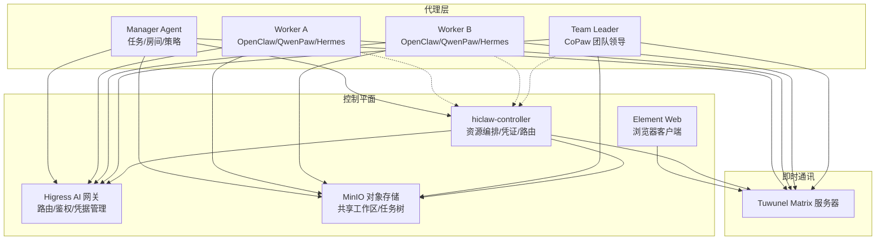
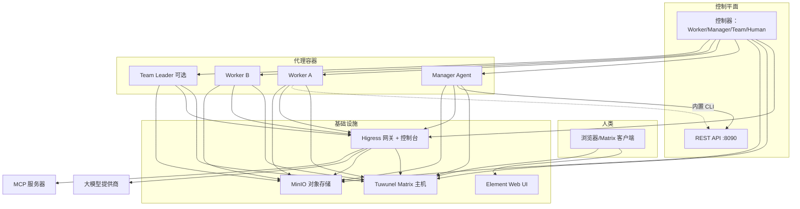
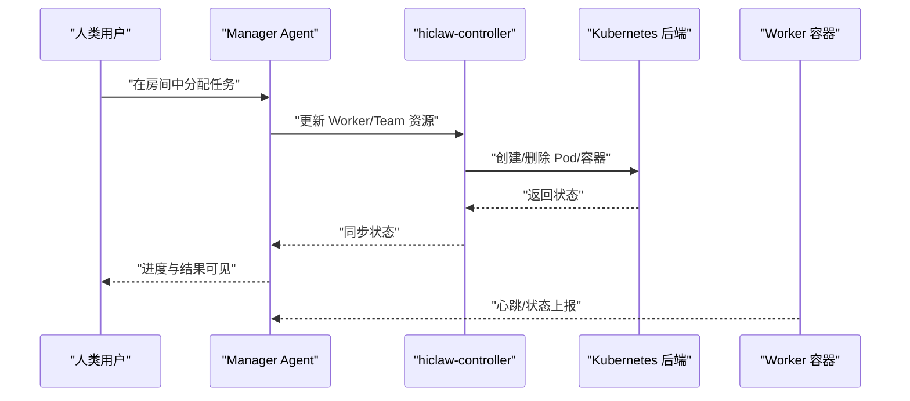
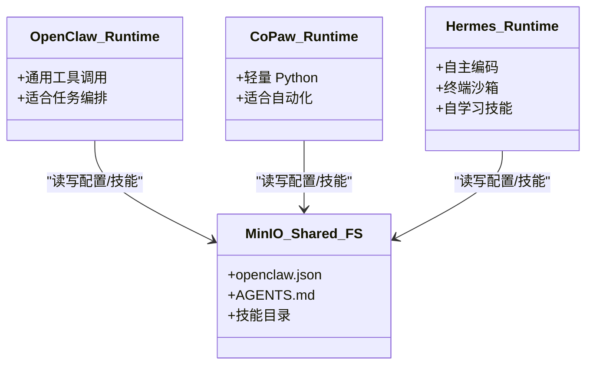
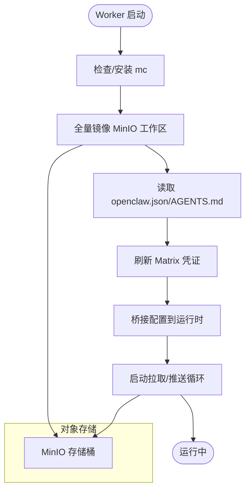
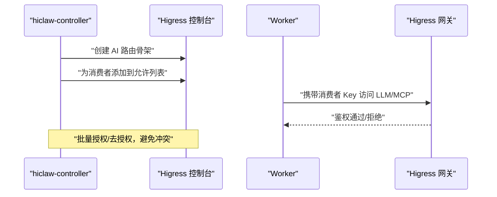
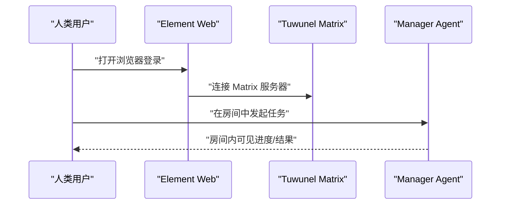
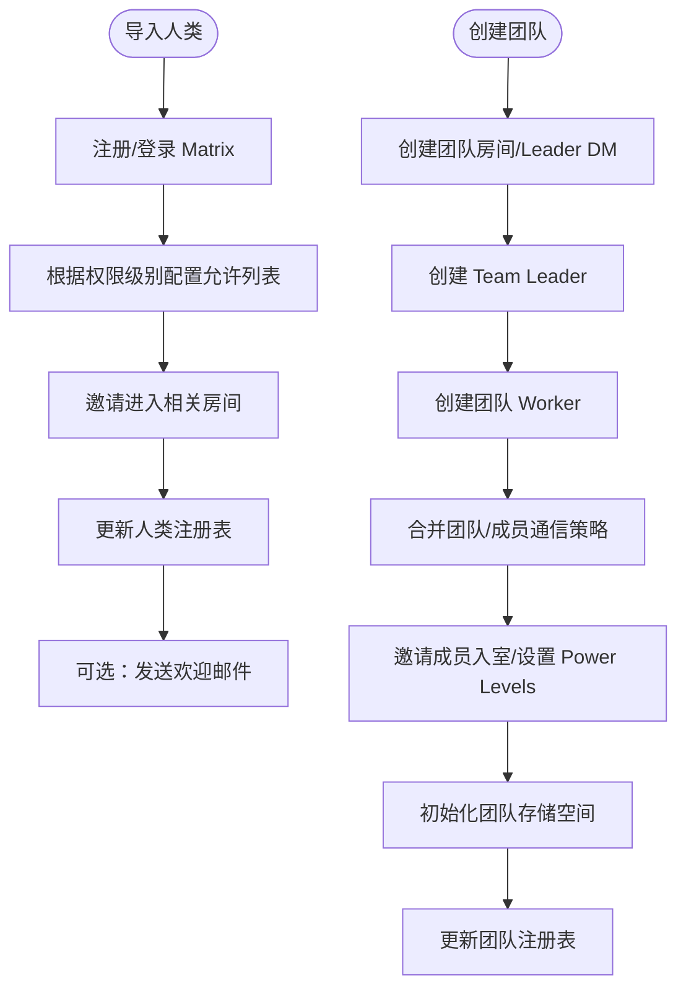
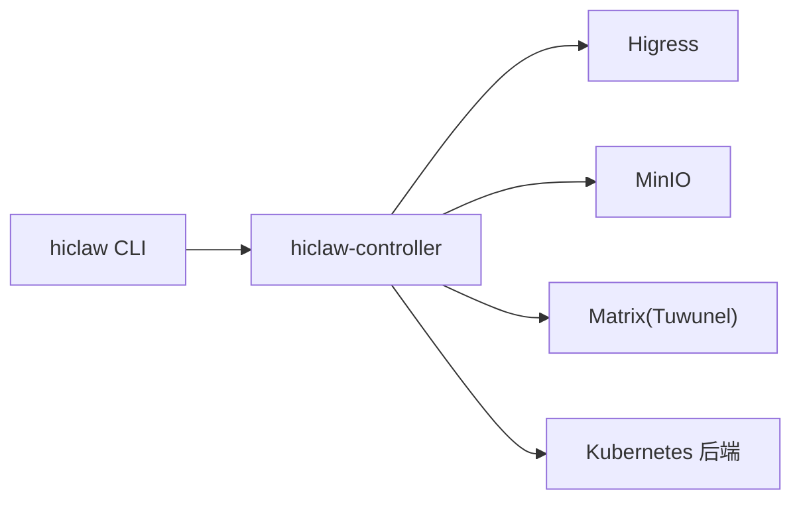

# 核心功能特性

<cite>
**本文引用的文件**
- [README.md](file://README.md)
- [架构总览.md](file://docs/architecture.md)
- [hiclaw-controller 内网网关实现](file://hiclaw-controller/internal/gateway/higress.go)
- [MinIO 存储客户端](file://hiclaw-controller/internal/oss/minio.go)
- [CoPaw Worker 启动流程](file://copaw/src/copaw_worker/worker.py)
- [Hermes Worker 启动流程](file://hermes/src/hermes_worker/worker.py)
- [Matrix 客户端（Tuwunel）](file://hiclaw-controller/internal/matrix/client.go)
- [人类用户导入脚本](file://manager/agent/skills/human-management/scripts/create-human.sh)
- [团队创建脚本](file://manager/agent/skills/team-management/scripts/create-team.sh)
- [Kubernetes 后端实现](file://hiclaw-controller/internal/backend/kubernetes.go)
- [Helm 部署参数](file://helm/hiclaw/values.yaml)
- [hiclaw CLI 命令入口](file://hiclaw-controller/cmd/hiclaw/main.go)
- [Agent 配置类型定义](file://hiclaw-controller/internal/agentconfig/types.go)
</cite>

## 目录
1. [引言](#引言)
2. [项目结构](#项目结构)
3. [核心组件](#核心组件)
4. [架构总览](#架构总览)
5. [详细组件分析](#详细组件分析)
6. [依赖关系分析](#依赖关系分析)
7. [性能考量](#性能考量)
8. [故障排查指南](#故障排查指南)
9. [结论](#结论)
10. [附录](#附录)

## 引言
HiClaw 是一个面向企业与团队协作的多智能体运行时平台，采用“Manager-Workers 架构”，通过集中化的 Manager 协调多个 Worker，结合 Matrix 即时通讯协议、Higress AI 网关与 MinIO 共享存储，实现“人类可审计、可干预”的多智能体协同。其五大核心能力包括：
- Manager-Workers 架构：以 Manager 统一编排 Worker，避免人工逐个运维 Worker。
- 多运行时协作：OpenClaw、CoPaw、Hermes 三类运行时在同一房间共存，互补优势。
- MinIO 共享文件系统：统一工作空间与共享任务树，显著降低多智能体协作中的令牌消耗。
- Higress AI 网关：集中化流量管理与凭据治理，降低凭据泄露风险。
- Element IM 客户端 + Tuwunel IM 服务器：零配置即时通讯体验，消除企业审批与集成成本。

## 项目结构
HiClaw 由控制器（hiclaw-controller）、Manager、Worker、Helm Chart、以及基础设施（Higress、Tuwunel、MinIO、Element Web）组成。控制器负责资源编排、凭证注入、路由与消费者管理；Manager 作为协调者在 Matrix 房间中分配任务；Worker 执行具体任务并通过 MinIO 进行状态持久化与共享；Helm Chart 提供一键部署与参数化配置。

图表来源
- [架构总览.md:23-82](file://docs/architecture.md#L23-L82)
- [Helm 部署参数:166-263](file://helm/hiclaw/values.yaml#L166-L263)

章节来源
- [README.md:13-50](file://README.md#L13-L50)
- [架构总览.md:1-17](file://docs/architecture.md#L1-L17)

## 核心组件
- 控制器（hiclaw-controller）
  - 负责 Worker/Manager/Team/Human 资源的声明式编排，提供 REST API 与 CLI（hiclaw）。
  - 管理 Higress 消费者、AI 路由与 MCP 服务暴露，维护矩阵房间与成员权限。
- Higress AI 网关
  - 提供基于 Key-Auth 的消费者鉴权，统一接入 LLM、MCP 与对象存储访问。
  - 支持 AI 路由批量授权/去授权，避免凭据泄露与越权访问。
- Tuwunel Matrix 服务器
  - 自托管 Matrix Homeserver，支持 E2EE、注册令牌、管理员命令等。
  - 通过客户端接口实现用户注册、房间创建、消息发送与成员管理。
- MinIO 对象存储
  - 作为共享工作区与任务树的统一存储，Worker 通过 mc 客户端进行镜像同步。
  - 支持静态/动态凭据模式，兼容外部 OSS（STS）。
- Manager 与 Worker
  - Manager 在房间中进行任务编排与可见性管理；Worker 通过 MinIO 恢复配置与技能，按需执行任务。
  - 支持多种运行时（OpenClaw、CoPaw、Hermes），在同房内协作。

章节来源
- [hiclaw-controller 内网网关实现:17-32](file://hiclaw-controller/internal/gateway/higress.go#L17-L32)
- [MinIO 存储客户端:13-29](file://hiclaw-controller/internal/oss/minio.go#L13-L29)
- [Matrix 客户端（Tuwunel）:16-87](file://hiclaw-controller/internal/matrix/client.go#L16-L87)
- [架构总览.md:19-82](file://docs/architecture.md#L19-L82)

## 架构总览
下图展示 HiClaw 的逻辑与部署形态，涵盖本地单机与 Kubernetes 两种模式：

图表来源
- [架构总览.md:23-82](file://docs/architecture.md#L23-L82)

章节来源
- [架构总览.md:19-82](file://docs/architecture.md#L19-L82)

## 详细组件分析

### Manager-Workers 架构
- 设计目标：以 Manager 为中心，统一编排 Worker，实现“无需人工介入单个 Worker”的自动化协作。
- 关键机制：
  - 声明式资源（Worker/Team/Manager/Human）通过 CRD 与控制器编排。
  - Matrix 房间提供人类可见性与干预点，所有交互可审计。
  - Worker 生命周期由后端（Docker/Kubernetes）或控制器直接管理，支持动态扩缩容。
- 价值体现：
  - 降低运维复杂度，提升协作透明度与可控性。
  - 支持团队化协作（Team Leader + 多 Worker），任务分解与执行分离。

图表来源
- [Kubernetes 后端实现:151-313](file://hiclaw-controller/internal/backend/kubernetes.go#L151-L313)
- [架构总览.md:104-116](file://docs/architecture.md#L104-L116)

章节来源
- [架构总览.md:104-116](file://docs/architecture.md#L104-L116)
- [Kubernetes 后端实现:151-313](file://hiclaw-controller/internal/backend/kubernetes.go#L151-L313)

### 多运行时协作（OpenClaw / CoPaw / Hermes）
- 运行时分工：
  - OpenClaw（Node.js）：通用 Agent，工具调用丰富，适合任务编排与协调。
  - CoPaw（Python）：轻量运行时，适合浏览器自动化与快速任务。
  - Hermes（hermes-agent）：自主编码 Agent，具备终端沙箱、自学习技能与持久记忆。
- 协作方式：
  - 同一 Matrix 房间内通过 @ 提及进行任务分派与进度汇报。
  - 通过 MinIO 共享 openclaw.json、AGENTS.md、技能目录，确保跨运行时一致性。
- 优势：
  - 不同运行时各司其职，互补短板；统一通信与存储，降低集成成本。

图表来源
- [README.md:290-304](file://README.md#L290-L304)
- [CoPaw Worker 启动流程:45-177](file://copaw/src/copaw_worker/worker.py#L45-L177)
- [Hermes Worker 启动流程:59-165](file://hermes/src/hermes_worker/worker.py#L59-L165)

章节来源
- [README.md:290-304](file://README.md#L290-L304)
- [CoPaw Worker 启动流程:45-177](file://copaw/src/copaw_worker/worker.py#L45-L177)
- [Hermes Worker 启动流程:59-165](file://hermes/src/hermes_worker/worker.py#L59-L165)

### MinIO 共享文件系统
- 设计要点：
  - 使用 mc 客户端进行对象存储操作，支持静态/动态凭据模式。
  - Worker 启动时全量镜像 MinIO 中的工作区与技能，运行时增量同步。
  - 支持删除前缀、列举对象、排除模式等高级镜像选项。
- 令牌消耗降低机制：
  - 将配置、技能与中间产物从内存态迁移到对象存储，减少 LLM 调用中的上下文长度与重复传输。
  - 多 Worker 并行协作时，共享缓存与任务树，避免重复计算与重复请求。
- 安全与兼容：
  - 动态凭据模式用于外部 OSS（STS），控制器在每次 mc 调用时注入临时凭据。
  - 支持自定义 Endpoint 与安全令牌传递，适配阿里云 OSS 等。

图表来源
- [MinIO 存储客户端:73-167](file://hiclaw-controller/internal/oss/minio.go#L73-L167)
- [CoPaw Worker 启动流程:88-177](file://copaw/src/copaw_worker/worker.py#L88-L177)
- [Hermes Worker 启动流程:108-165](file://hermes/src/hermes_worker/worker.py#L108-L165)

章节来源
- [MinIO 存储客户端:13-268](file://hiclaw-controller/internal/oss/minio.go#L13-L268)
- [CoPaw Worker 启动流程:65-177](file://copaw/src/copaw_worker/worker.py#L65-L177)
- [Hermes Worker 启动流程:86-165](file://hermes/src/hermes_worker/worker.py#L86-L165)

### Higress AI 网关
- 能力范围：
  - AI 路由骨架创建与鉴权框架启用，消费者白名单由控制器动态维护。
  - 支持域、服务源、静态服务源与路由的创建/删除。
  - 提供会话登录、密码变更与健康检查，保障控制台可用性。
- 安全与治理：
  - 基于 Key-Auth 的消费者鉴权，避免 Worker 直接持有真实密钥。
  - 通过“先骨架、后授权”的设计，避免并发重试导致的 403 与授权丢失。
- 流程示意：

图表来源
- [hiclaw-controller 内网网关实现:137-300](file://hiclaw-controller/internal/gateway/higress.go#L137-L300)
- [hiclaw-controller 内网网关实现:359-448](file://hiclaw-controller/internal/gateway/higress.go#L359-L448)

章节来源
- [hiclaw-controller 内网网关实现:137-300](file://hiclaw-controller/internal/gateway/higress.go#L137-L300)
- [hiclaw-controller 内网网关实现:359-448](file://hiclaw-controller/internal/gateway/higress.go#L359-L448)

### Element IM 客户端 + Tuwunel IM 服务器
- 零配置体验：
  - 内置 Element Web 与 Tuwunel，无需 Bot 应用与审批流程，即可通过浏览器或任意 Matrix 客户端接入。
- 安全与隐私：
  - Matrix 为去中心化协议，可自建/联邦，避免厂商锁定与数据采集。
- 管理与可见性：
  - 所有任务与进度在房间中可见，支持人类随时干预与回溯。

图表来源
- [架构总览.md:119-137](file://docs/architecture.md#L119-L137)
- [Matrix 客户端（Tuwunel）:131-225](file://hiclaw-controller/internal/matrix/client.go#L131-L225)

章节来源
- [架构总览.md:119-137](file://docs/architecture.md#L119-L137)
- [Matrix 客户端（Tuwunel）:131-225](file://hiclaw-controller/internal/matrix/client.go#L131-L225)

### 人类与团队管理（零配置 IM 的实践）
- 人类导入：
  - 自动注册 Matrix 账号，基于权限级别（1/2/3）自动配置允许列表与房间邀请。
  - 支持 SMTP 发送欢迎邮件，简化初始上手。
- 团队创建：
  - 自动创建团队房间与 Leader DM，设置合适的 Power Levels，并在 Leader 初始化后补全团队上下文。
  - 支持团队级与成员级通信策略合并，确保协作边界清晰。

图表来源
- [人类用户导入脚本:88-154](file://manager/agent/skills/human-management/scripts/create-human.sh#L88-L154)
- [团队创建脚本:170-227](file://manager/agent/skills/team-management/scripts/create-team.sh#L170-L227)
- [团队创建脚本:290-354](file://manager/agent/skills/team-management/scripts/create-team.sh#L290-L354)
- [团队创建脚本:437-451](file://manager/agent/skills/team-management/scripts/create-team.sh#L437-L451)

章节来源
- [人类用户导入脚本:88-154](file://manager/agent/skills/human-management/scripts/create-human.sh#L88-L154)
- [团队创建脚本:170-227](file://manager/agent/skills/team-management/scripts/create-team.sh#L170-L227)
- [团队创建脚本:290-354](file://manager/agent/skills/team-management/scripts/create-team.sh#L290-L354)
- [团队创建脚本:437-451](file://manager/agent/skills/team-management/scripts/create-team.sh#L437-L451)

## 依赖关系分析
- 控制器对基础设施的依赖：
  - Higress：消费者/路由管理、AI 路由骨架与鉴权框架。
  - MinIO：对象存储与 mc 客户端交互。
  - Matrix：用户注册、房间管理、消息发送与成员管理。
- 控制器对后端的依赖：
  - Kubernetes：Pod 创建/删除/状态查询，SA 注入与 Token 投影。
- CLI 与控制器：
  - hiclaw CLI 通过环境变量与控制器 REST API 交互，提供资源管理能力。

图表来源
- [hiclaw-controller 内网网关实现:137-300](file://hiclaw-controller/internal/gateway/higress.go#L137-L300)
- [MinIO 存储客户端:73-167](file://hiclaw-controller/internal/oss/minio.go#L73-L167)
- [Matrix 客户端（Tuwunel）:131-225](file://hiclaw-controller/internal/matrix/client.go#L131-L225)
- [Kubernetes 后端实现:151-313](file://hiclaw-controller/internal/backend/kubernetes.go#L151-L313)
- [hiclaw CLI 命令入口:9-34](file://hiclaw-controller/cmd/hiclaw/main.go#L9-L34)

章节来源
- [hiclaw-controller 内网网关实现:137-300](file://hiclaw-controller/internal/gateway/higress.go#L137-L300)
- [MinIO 存储客户端:73-167](file://hiclaw-controller/internal/oss/minio.go#L73-L167)
- [Matrix 客户端（Tuwunel）:131-225](file://hiclaw-controller/internal/matrix/client.go#L131-L225)
- [Kubernetes 后端实现:151-313](file://hiclaw-controller/internal/backend/kubernetes.go#L151-L313)
- [hiclaw CLI 命令入口:9-34](file://hiclaw-controller/cmd/hiclaw/main.go#L9-L34)

## 性能考量
- MinIO 共享存储显著降低令牌消耗：
  - 通过对象存储承载配置与中间产物，减少 LLM 上下文长度与重复传输。
  - 增量同步与镜像策略（覆盖/排除）优化带宽与延迟。
- Higress 路由与鉴权：
  - 消费者鉴权与 AI 路由骨架预置，避免频繁鉴权失败与重试。
  - 批量授权/去授权减少并发冲突与 403 风险。
- Kubernetes 后端资源：
  - 默认资源限制与请求合理配置，支持多 Worker 并发运行。
  - Pod 模板叠加与 SA 注入减少启动开销。

## 故障排查指南
- 常见问题定位：
  - 控制器日志：通过容器日志查看控制器状态与错误。
  - 调试导出：使用调试脚本导出 Matrix 消息与 Agent 会话日志，辅助根因分析。
- 建议步骤：
  - 检查 Higress 控制台登录与密码收敛流程。
  - 核对 MinIO 凭据与 mc 镜像同步是否成功。
  - 确认 Matrix 房间权限与成员状态。
  - 使用 hiclaw CLI 获取资源状态与版本信息。

章节来源
- [README.md:355-379](file://README.md#L355-L379)
- [hiclaw-controller 内网网关实现:35-84](file://hiclaw-controller/internal/gateway/higress.go#L35-L84)

## 结论
HiClaw 通过“Manager-Workers 架构 + 多运行时协作 + MinIO 共享文件系统 + Higress AI 网关 + Element IM 客户端 + Tuwunel IM 服务器”的组合，构建了企业级、可审计、可干预的多智能体协作平台。其核心价值在于：
- 降低运维复杂度与凭据风险；
- 提升协作透明度与可扩展性；
- 通过共享存储与集中网关显著降低令牌消耗；
- 以零配置 IM 与人类可见性提升用户体验与落地效率。

## 附录
- 使用场景与效果对比（示例）
  - 场景 A：跨团队任务编排
    - 传统：多工具链集成、凭据分散、人类难以全程可见。
    - HiClaw：Manager 在房间中统一编排，Worker 通过 MinIO 共享任务树，Higress 集中鉴权，人类全程可见与干预。
  - 场景 B：多运行时混合执行
    - 传统：不同运行时独立部署，集成成本高。
    - HiClaw：OpenClaw/QwenPaw/Hermes 在同一房间协作，统一配置与技能分发，降低集成与运维成本。
  - 场景 C：大规模 Worker 扩缩容
    - 传统：手动扩缩容，易出错。
    - HiClaw：控制器统一管理 Worker 生命周期，Kubernetes 后端自动调度与资源隔离。

章节来源
- [README.md:19-30](file://README.md#L19-L30)
- [架构总览.md:140-162](file://docs/architecture.md#L140-L162)
- [Helm 部署参数:166-263](file://helm/hiclaw/values.yaml#L166-L263)
- [Agent 配置类型定义:36-53](file://hiclaw-controller/internal/agentconfig/types.go#L36-L53)