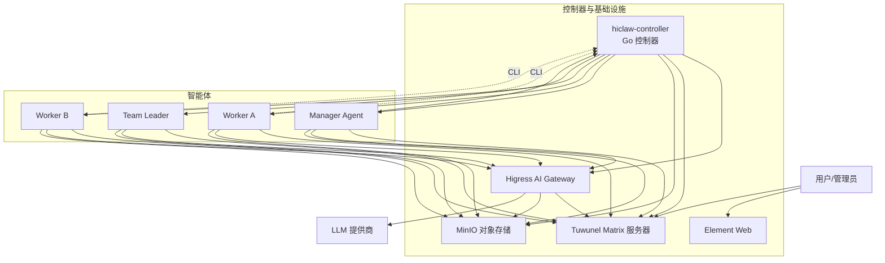
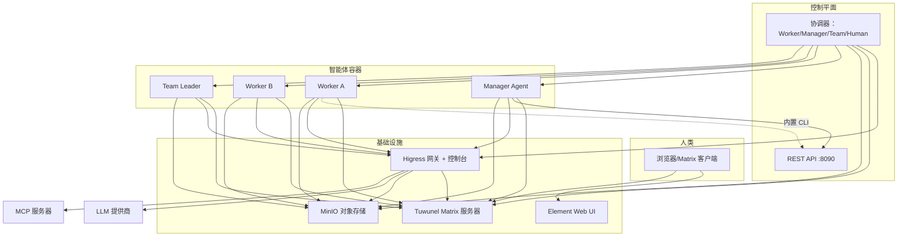
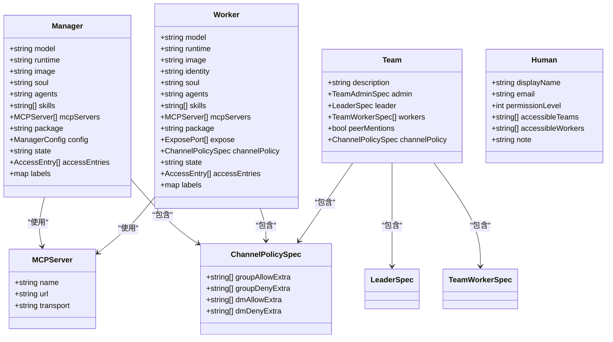
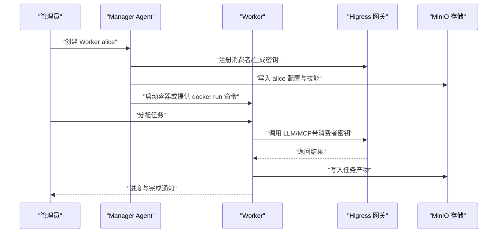
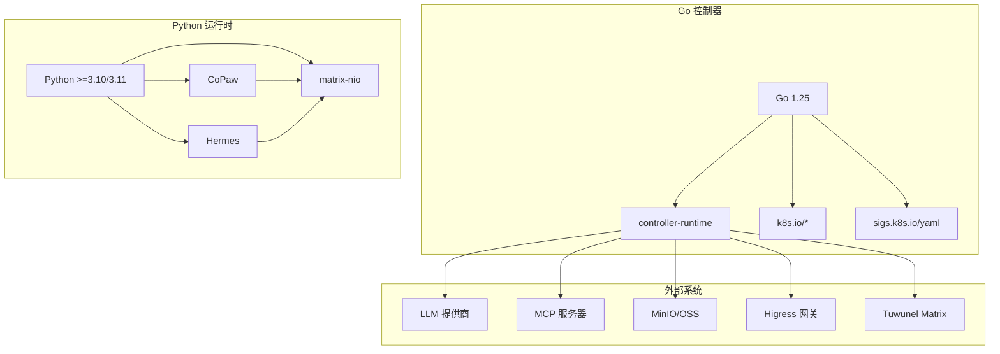

# 项目概述

<cite>
**本文引用的文件**   
- [README.md](file://README.md)
- [docs/architecture.md](file://docs/architecture.md)
- [docs/quickstart.md](file://docs/quickstart.md)
- [docs/manager-guide.md](file://docs/manager-guide.md)
- [docs/worker-guide.md](file://docs/worker-guide.md)
- [hiclaw-controller/cmd/controller/main.go](file://hiclaw-controller/cmd/controller/main.go)
- [hiclaw-controller/api/v1beta1/types.go](file://hiclaw-controller/api/v1beta1/types.go)
- [hiclaw-controller/config/crd/managers.hiclaw.io.yaml](file://hiclaw-controller/config/crd/managers.hiclaw.io.yaml)
- [hiclaw-controller/go.mod](file://hiclaw-controller/go.mod)
- [copaw/README.md](file://copaw/README.md)
- [copaw/pyproject.toml](file://copaw/pyproject.toml)
- [hermes/README.md](file://hermes/README.md)
- [hermes/pyproject.toml](file://hermes/pyproject.toml)
- [changelog/current.md](file://changelog/current.md)
</cite>

## 目录
1. [引言](#引言)
2. [项目结构](#项目结构)
3. [核心组件](#核心组件)
4. [架构总览](#架构总览)
5. [详细组件分析](#详细组件分析)
6. [依赖关系分析](#依赖关系分析)
7. [性能考量](#性能考量)
8. [故障排查指南](#故障排查指南)
9. [结论](#结论)
10. [附录](#附录)

## 引言
HiClaw 是一个开源的多智能体协作运行时平台，旨在让多个智能体在受控且可审计的“房间”中协同工作，并在整个过程中保持人类可见与干预能力。平台采用“Manager-Workers”架构：由 Manager 统一编排多个 Worker，聚焦于“人与智能体之间、以及智能体之间的协作场景”。平台不直接实现智能体逻辑，而是通过容器化的方式编排多个智能体容器（包括 Manager 与大量 Worker），并提供企业级安全、完全私有化部署与“人在回路”的机制。

- 核心价值主张
  - 以 Manager-Workers 架构消除对单个 Worker 的人工运维负担，让智能体管理智能体。
  - 多运行时协作：OpenClaw、QwenPaw 与 Hermes Worker 可在同一 IM 房间共存，各司其职。
  - 中央化共享文件系统（MinIO）降低多智能体协作中的 token 消耗。
  - 集中式 AI 网关（Higress）统一流量与凭证管理，降低安全风险。
  - 基于 Matrix 协议的 IM 客户端与服务器，零配置快速上手，支持移动端。

- 设计理念
  - 以“房间”为最小协作单元，所有任务与进度在房间内可见、可干预。
  - 凭证隔离：Worker 仅持有消费级 token，真实密钥由网关集中管理。
  - 轻量化与可替换性：Worker 无状态，持久化数据存放于对象存储，便于扩缩容与替换。
  - 企业级安全：零凭证暴露、按需授权、动态权限控制、审计日志与会话重置策略。

- 平台特性
  - 一键安装：curl | bash 即可完成 AI 网关、Matrix 服务、文件存储、Web 客户端与 Manager 的部署。
  - 零配置 IM：内置 Matrix 服务器，无需机器人应用与审批流程。
  - 技能生态：从社区技能库按需拉取，Worker 不接触真实凭证。
  - 多运行时协作：Deterministic Agent（OpenClaw/QwenPaw）作为领导者分解任务，Hermes Worker 自主执行代码，互通全可见、全可干预。

**章节来源**
- [README.md:13-51](file://README.md#L13-L51)

## 项目结构
HiClaw 仓库采用模块化组织方式，围绕“控制器（hiclaw-controller）+ Manager + Worker 运行时 + 文档与示例 + Helm 图表 + 工具脚本”展开。核心目录与职责如下：
- hiclaw-controller：Kubernetes 原生控制平面，负责 Worker/Manager/Team/Human 等资源的声明式编排、生命周期管理、凭证注入与网关路由。
- manager：Manager Agent 的工作空间与技能集合，包含多种内置技能与配置模板。
- worker：通用 Worker 容器入口与脚本。
- copaw / hermes：基于不同运行时（CoPaw、Hermes）的 Worker 实现与适配层。
- docs：架构、快速开始、管理员与 Worker 使用指南等文档。
- helm/hiclaw：官方 Helm Chart，支持在任意 Kubernetes 集群上进行共享/生产级部署。
- install：本地安装与卸载脚本，支持嵌入式控制器一键启动。
- tests：集成测试与调试工具，覆盖多 Worker、GitHub MCP、权限控制等场景。

**图表来源**
- [docs/architecture.md:23-82](file://docs/architecture.md#L23-L82)

**章节来源**
- [docs/architecture.md:7-101](file://docs/architecture.md#L7-L101)

## 核心组件
- hiclaw-controller（Go）
  - 作为 Kubernetes 原生控制平面，负责 Worker/Manager/Team/Human 等 CRD 的协调与生命周期管理；提供 REST API 与 CLI；在本地模式下以嵌入式方式运行 Higress、Tuwunel、MinIO 与 Element Web。
  - 关键点：使用 controller-runtime，内置认证鉴权、凭证提供器、网关与存储后端对接、代理与安全策略、服务编排与环境变量注入等。

- Manager Agent
  - 作为“AI 主管”，负责与管理员与 Worker 在 Matrix 房间中沟通，编排任务、团队与人员，维护会话上下文与心跳检查，提供可观测性与审计能力。
  - 支持两种运行时：OpenClaw（Node.js）与 CoPaw（Python），Hermes 作为 Worker 运行时。

- Worker（多运行时）
  - OpenClaw：通用 Agent，技能生态丰富，适合任务编排与工具调用。
  - QwenPaw：轻量运行时，适合浏览器自动化与快速任务。
  - Hermes：自主编码 Agent，具备终端沙箱、自学习技能与持久记忆。
  - 各运行时通过 Matrix mentions 共享房间通信，统一策略与加密。

- 分布式基础设施
  - Higress：AI 网关与 API 网关，统一 LLM 流量与 MCP 服务器路由，消费者密钥认证。
  - Tuwunel：基于 conduwuit 家族的 Matrix 服务器，支持房间策略、加密与自由回复房间。
  - MinIO：共享对象存储，Worker 无状态，配置与工件均存放于桶中。
  - Element Web：零配置浏览器客户端。

**章节来源**
- [docs/architecture.md:9-16](file://docs/architecture.md#L9-L16)
- [docs/manager-guide.md:37-40](file://docs/manager-guide.md#L37-L40)
- [docs/worker-guide.md:22-29](file://docs/worker-guide.md#L22-L29)
- [README.md:29, 30:29-30](file://README.md#L29-L30)

## 架构总览
HiClaw 的体系分为三层：基础设施层（Higress、Tuwunel、MinIO、Element Web）、控制平面层（hiclaw-controller）与智能体层（Manager、Worker、Team Leader）。通信机制包括 Matrix（房间与消息）、MinIO（共享存储镜像与同步）、Higress（LLM 与 MCP 路由）。

**图表来源**
- [docs/architecture.md:23-82](file://docs/architecture.md#L23-L82)

**章节来源**
- [docs/architecture.md:19-82](file://docs/architecture.md#L19-L82)

## 详细组件分析

### 控制器（hiclaw-controller）与 CRD
- 控制器入口
  - 控制器通过 main.go 初始化日志、信号处理与配置，随后启动应用实例并常驻运行。
- CRD 与资源模型
  - Worker/Manager/Team/Human 的 CRD 定义了声明式资源规范，包括模型、运行时、镜像、技能、MCP 服务器、暴露端口、通道策略、生命周期状态与访问条目等。
  - 控制器负责根据 CRD 规范生成与更新基础设施（矩阵账号、Higress 消费者、配置文件、房间与存储同步），并驱动 Worker/Manager/Team 的生命周期。
- 运行时与镜像选择
  - Helm Chart 与安装脚本根据 runtime（openclaw/copaw/hermes）自动选择对应镜像，控制器解析有效运行时与镜像后创建 Pod 或 Docker 容器。

**图表来源**
- [hiclaw-controller/api/v1beta1/types.go:63-149](file://hiclaw-controller/api/v1beta1/types.go#L63-L149)
- [hiclaw-controller/api/v1beta1/types.go:159-273](file://hiclaw-controller/api/v1beta1/types.go#L159-L273)
- [hiclaw-controller/api/v1beta1/types.go:331-363](file://hiclaw-controller/api/v1beta1/types.go#L331-L363)
- [hiclaw-controller/api/v1beta1/types.go:369-447](file://hiclaw-controller/api/v1beta1/types.go#L369-L447)

**章节来源**
- [hiclaw-controller/cmd/controller/main.go:16-36](file://hiclaw-controller/cmd/controller/main.go#L16-L36)
- [hiclaw-controller/api/v1beta1/types.go:42-57](file://hiclaw-controller/api/v1beta1/types.go#L42-L57)
- [hiclaw-controller/config/crd/managers.hiclaw.io.yaml:14-100](file://hiclaw-controller/config/crd/managers.hiclaw.io.yaml#L14-L100)

### Manager-Workers 架构与多运行时协作
- Manager-Workers 架构
  - Manager 作为“Chief of Staff”，负责创建 Worker、分配任务、监控进度与人类干预；Worker 专注于执行任务，彼此通过 Matrix 房间协作。
- 多运行时协作
  - OpenClaw（Node.js）：通用 Agent，适合任务编排与工具调用。
  - QwenPaw（Python）：轻量运行时，适合浏览器自动化与快速任务。
  - Hermes（Python）：自主编码 Agent，具备终端沙箱、自学习技能与持久记忆。
  - 各运行时在相同房间内通过 mentions 互通，策略与加密一致，Operator 行为一致。

**图表来源**
- [docs/quickstart.md:80-141](file://docs/quickstart.md#L80-L141)
- [docs/worker-guide.md:137-147](file://docs/worker-guide.md#L137-L147)

**章节来源**
- [README.md:290-304](file://README.md#L290-L304)
- [docs/quickstart.md:80-141](file://docs/quickstart.md#L80-L141)

### 企业级安全与“人在回路”
- 凭证隔离与零暴露
  - Worker 仅持有消费级 token；真实密钥（如 LLM API Key、GitHub PAT）由 Higress 网关集中管理，Worker 无法看到真实凭证。
- 动态权限控制
  - 通过 Higress 控制台对 MCP 服务器进行授权与撤销，Manager 可在房间内动态调整 Worker 权限。
- 人类在回路
  - 所有任务与进度在 Matrix 房间内可见，管理员可随时介入与纠正。
- 会话与审计
  - Manager/Worker 使用类型化会话策略，每日重置；任务历史与进度日志保存在共享存储中，支持恢复与审计。

**章节来源**
- [README.md:42-48](file://README.md#L42-L48)
- [docs/manager-guide.md:158-177](file://docs/manager-guide.md#L158-L177)
- [docs/quickstart.md:301-331](file://docs/quickstart.md#L301-L331)

### Kubernetes 原生与声明式资源管理
- 声明式资源
  - Worker/Manager/Team/Human 通过 CRD 描述，支持 YAML 驱动的创建、更新与状态查询。
- 控制器行为
  - 根据 CRD 规范生成基础设施与配置，协调生命周期与状态，注入凭证与环境变量。
- Helm 部署
  - 官方 Helm Chart 将 Higress、Tuwunel、MinIO、Element Web 与控制器打包为子图，支持多区域镜像仓库与默认值覆盖。

**章节来源**
- [docs/architecture.md:165-177](file://docs/architecture.md#L165-L177)
- [docs/architecture.md:112-116](file://docs/architecture.md#L112-L116)
- [README.md:110-238](file://README.md#L110-L238)

## 依赖关系分析
- 技术栈概览
  - Go：控制器与内部服务（hiclaw-controller），使用 controller-runtime、k8s API、etcd/kine 等。
  - Python：CoPaw 与 Hermes Worker 运行时，依赖 matrix-nio、markdown-it-py、typer、httpx 等。
  - Kubernetes：CRD、控制器运行时、Helm Chart。
  - 容器与编排：Docker/Podman、Helm、Makefile。
- 外部依赖
  - LLM 提供商（OpenAI 兼容、Qwen 等）。
  - MCP 服务器（GitHub 等）。
  - 对象存储（MinIO/OSS）。
  - 网关（Higress）。
  - IM 服务器（Tuwunel）。

**图表来源**
- [hiclaw-controller/go.mod:3-19](file://hiclaw-controller/go.mod#L3-L19)
- [copaw/pyproject.toml:12-17](file://copaw/pyproject.toml#L12-L17)
- [hermes/pyproject.toml:12-25](file://hermes/pyproject.toml#L12-L25)

**章节来源**
- [hiclaw-controller/go.mod:3-19](file://hiclaw-controller/go.mod#L3-L19)
- [copaw/pyproject.toml:12-17](file://copaw/pyproject.toml#L12-L17)
- [hermes/pyproject.toml:12-25](file://hermes/pyproject.toml#L12-L25)

## 性能考量
- 轻量化与可替换性
  - Worker 无状态，配置与工件存放在 MinIO，便于弹性扩缩容与快速替换。
- 文件同步与缓存
  - 通过 mc mirror 实现实时双向同步，减少网络抖动与延迟影响。
- 会话与任务恢复
  - 会话重置策略与任务历史/进度日志确保在上下文丢失后仍可恢复任务。
- 网络与路由
  - Higress 统一路由与限流，避免直连带来的复杂性与安全风险。

[本节为通用指导，无需具体文件分析]

## 故障排查指南
- 日志定位
  - v1.1.0+ 嵌入式安装：Higress、Tuwunel、MinIO 运行在控制器容器内；Manager Agent 日志位于 hiclaw-manager；OpenClaw 运行时日志可通过临时路径查看。
- 健康检查
  - 通过 curl 访问内部健康端点（Matrix/Tuwunel/MinIO/Higress 控制台）确认服务可用。
- 常见问题
  - Worker 启动失败：检查 openclaw.json 是否生成、mc 命令是否存在、端口是否暴露。
  - 无法连接 Matrix：验证域名解析与端口可达性，核对 openclaw.json 中的 Matrix 配置。
  - 无法访问 LLM：核对消费者密钥与路由授权，必要时在 Higress 控制台添加。
  - 无法访问 MCP：使用 mcporter 测试连通性与授权，确认 MCP 服务器已授权该消费者。
- 重置与重建
  - 删除 Worker 容器不会丢失数据；通过 Manager 重新创建即可恢复。

**章节来源**
- [docs/manager-guide.md:158-177](file://docs/manager-guide.md#L158-L177)
- [docs/worker-guide.md:61-123](file://docs/worker-guide.md#L61-L123)

## 结论
HiClaw 通过“Manager-Workers”架构与多运行时协作，为企业提供了可控、可观测、可审计的多智能体协作平台。平台以企业级安全为核心设计原则，结合 Kubernetes 原生控制平面与声明式资源管理，实现了从安装、编排到运维的全链路自动化。凭借零配置 IM、共享文件系统与动态权限控制，HiClaw 既适合初学者快速上手，也为经验丰富的工程师提供了深入定制与扩展的空间。

[本节为总结，无需具体文件分析]

## 附录
- 发展历程与关键里程碑
  - v1.1.0：Kubernetes 原生控制面、Hermes 自主编码 Agent 运行时、镜像瘦身、hiclaw CLI 替代 Shell 脚本。
  - v1.0.9：Kubernetes 风格的声明式资源管理（YAML 管理 Worker/Team/Human）、Worker 模板市场、Manager CoPaw 运行时、Nacos 技能注册中心。
  - v1.0.6：企业级 MCP 服务器管理、零凭证暴露。
  - v1.0.4：CoPaw Worker 支持、内存占用降低 80%。
  - v1.0.0：开源发布。
- 未来规划（基于当前变更记录）
  - 优化控制器对 CR 类型的子资源与终末器处理，改进冲突重试与幂等性。
  - 重构 Worker/Manager/Team CRD 的 mcpServers 字段结构，简化控制器侧 MCP 授权逻辑，由 CRD 直接生成 mcporter-servers.json。

**章节来源**
- [README.md:31-38](file://README.md#L31-L38)
- [changelog/current.md:7-11](file://changelog/current.md#L7-L11)