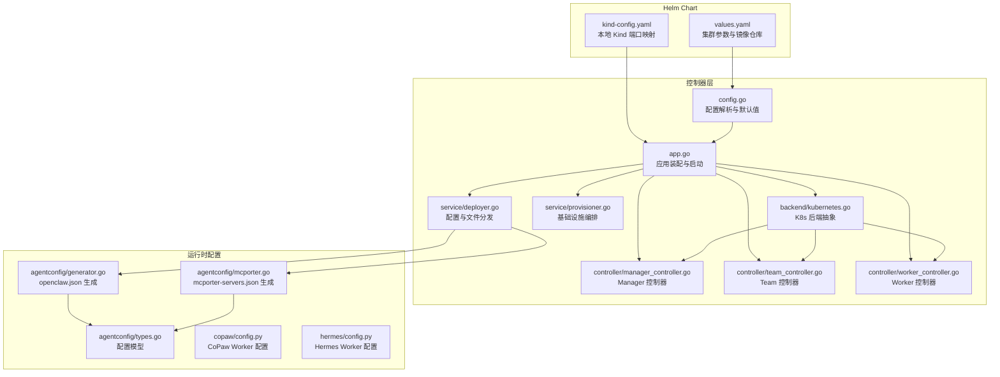
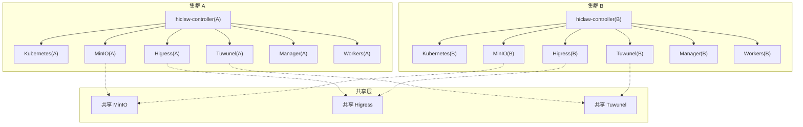
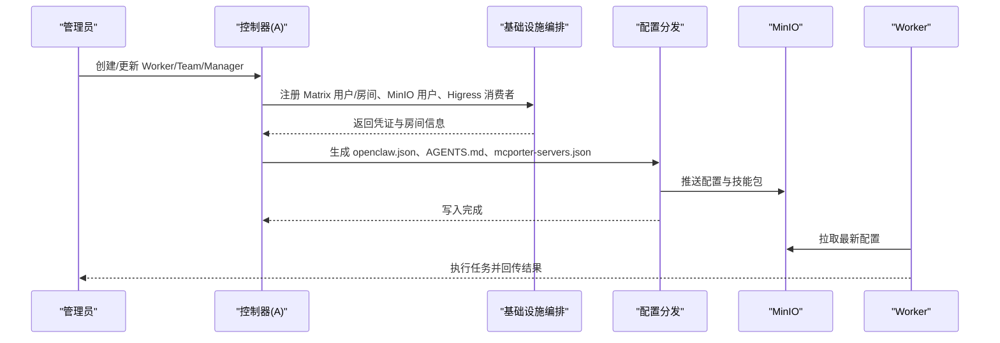
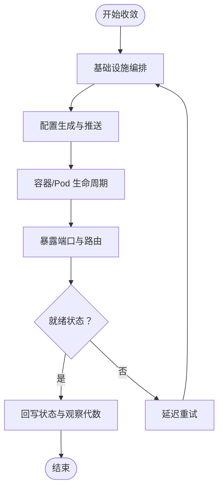
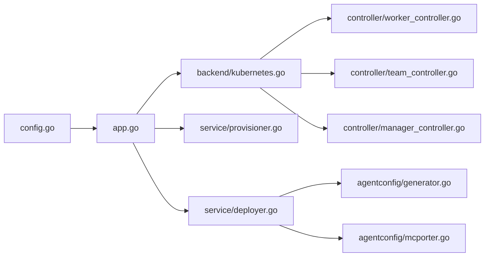

# 多集群部署

<cite>
**本文引用的文件**
- [README.md](file://README.md)
- [docs/k8s-native-agent-orch.md](file://docs/k8s-native-agent-orch.md)
- [helm/hiclaw/values.yaml](file://helm/helm/values.yaml)
- [hack/kind-config.yaml](file://hack/kind-config.yaml)
- [hiclaw-controller/internal/app/app.go](file://hiclaw-controller/internal/app/app.go)
- [hiclaw-controller/internal/config/config.go](file://hiclaw-controller/internal/config/config.go)
- [hiclaw-controller/internal/backend/kubernetes.go](file://hiclaw-controller/internal/backend/kubernetes.go)
- [hiclaw-controller/internal/service/provisioner.go](file://hiclaw-controller/internal/service/provisioner.go)
- [hiclaw-controller/internal/service/deployer.go](file://hiclaw-controller/internal/service/deployer.go)
- [hiclaw-controller/internal/controller/manager_controller.go](file://hiclaw-controller/internal/controller/manager_controller.go)
- [hiclaw-controller/internal/controller/team_controller.go](file://hiclaw-controller/internal/controller/team_controller.go)
- [hiclaw-controller/internal/controller/worker_controller.go](file://hiclaw-controller/internal/controller/worker_controller.go)
- [hiclaw-controller/internal/agentconfig/types.go](file://hiclaw-controller/internal/agentconfig/types.go)
- [hiclaw-controller/internal/agentconfig/generator.go](file://hiclaw-controller/internal/agentconfig/generator.go)
- [hiclaw-controller/internal/agentconfig/mcporter.go](file://hiclaw-controller/internal/agentconfig/mcporter.go)
- [copaw/src/copaw_worker/config.py](file://copaw/src/copaw_worker/config.py)
- [hermes/src/hermes_worker/config.py](file://hermes/src/hermes_worker/config.py)
</cite>

## 目录
1. [简介](#简介)
2. [项目结构](#项目结构)
3. [核心组件](#核心组件)
4. [架构总览](#架构总览)
5. [详细组件分析](#详细组件分析)
6. [依赖关系分析](#依赖关系分析)
7. [性能考量](#性能考量)
8. [故障排查指南](#故障排查指南)
9. [结论](#结论)
10. [附录](#附录)

## 简介
本文件面向在多集群环境中部署与运行 HiClaw 的工程团队，系统性阐述跨集群部署策略与实现方式，覆盖以下主题：
- 多集群架构设计：主从集群模式、联邦部署、数据同步机制
- 集群配置指南：网络拓扑、负载均衡、故障转移
- 跨集群协调机制：资源同步、状态一致性、冲突解决
- 数据复制与备份策略：增量同步、全量备份、灾难恢复
- 具体部署示例：不同场景下的配置方法
- 监控与运维最佳实践：健康检查、性能优化、容量规划
- 安全考虑与访问控制：多集群下的安全边界与权限治理

HiClaw 基于 Kubernetes 原生的声明式控制平面，通过 CRD（Worker/Team/Manager/Human）实现多智能体协作编排，并以 Higress 网关、Tuwunel Matrix、MinIO 存储为核心基础设施，形成“控制器 + 网关 + 即时通讯 + 对象存储”的统一能力底座。

## 项目结构
HiClaw 的多集群部署由 Helm Chart 提供标准化打包，控制器在集群内以 CRD 驱动资源生命周期，同时支持嵌入式与云原生两种后端（Docker/Kubernetes）。下图给出与多集群部署直接相关的模块关系：

**图表来源**
- [helm/hiclaw/values.yaml:1-263](file://helm/hiclaw/values.yaml#L1-L263)
- [hack/kind-config.yaml:1-17](file://hack/kind-config.yaml#L1-L17)
- [hiclaw-controller/internal/app/app.go:1-716](file://hiclaw-controller/internal/app/app.go#L1-L716)
- [hiclaw-controller/internal/config/config.go:1-680](file://hiclaw-controller/internal/config/config.go#L1-L680)
- [hiclaw-controller/internal/backend/kubernetes.go:1-569](file://hiclaw-controller/internal/backend/kubernetes.go#L1-L569)
- [hiclaw-controller/internal/service/provisioner.go:1-1155](file://hiclaw-controller/internal/service/provisioner.go#L1-L1155)
- [hiclaw-controller/internal/service/deployer.go:1-678](file://hiclaw-controller/internal/service/deployer.go#L1-L678)
- [hiclaw-controller/internal/controller/manager_controller.go:1-189](file://hiclaw-controller/internal/controller/manager_controller.go#L1-L189)
- [hiclaw-controller/internal/controller/team_controller.go:1-1003](file://hiclaw-controller/internal/controller/team_controller.go#L1-L1003)
- [hiclaw-controller/internal/controller/worker_controller.go:1-407](file://hiclaw-controller/internal/controller/worker_controller.go#L1-L407)
- [hiclaw-controller/internal/agentconfig/types.go:1-75](file://hiclaw-controller/internal/agentconfig/types.go#L1-L75)
- [hiclaw-controller/internal/agentconfig/generator.go:1-493](file://hiclaw-controller/internal/agentconfig/generator.go#L1-L493)
- [hiclaw-controller/internal/agentconfig/mcporter.go:1-53](file://hiclaw-controller/internal/agentconfig/mcporter.go#L1-L53)
- [copaw/src/copaw_worker/config.py:1-29](file://copaw/src/copaw_worker/config.py#L1-L29)
- [hermes/src/hermes_worker/config.py:1-40](file://hermes/src/hermes_worker/config.py#L1-L40)

**章节来源**
- [README.md:110-238](file://README.md#L110-L238)
- [docs/k8s-native-agent-orch.md:491-524](file://docs/k8s-native-agent-orch.md#L491-L524)

## 核心组件
- 控制器应用装配与启动：负责初始化基础设施客户端、构建后端注册表、注册控制器、启动 HTTP 服务等。
- 配置系统：集中解析环境变量与 Helm values，生成矩阵、网关、对象存储、观测性等配置。
- 后端抽象：统一管理 Docker/Kubernetes 等 Worker 后端；在多集群场景中，通常选择 Kubernetes 后端。
- 基础设施编排：按 Worker/Team/Manager 规格创建 Matrix 用户与房间、MinIO 用户与策略、Higress 消费者与路由、K8s ServiceAccount 等。
- 配置与文件分发：生成 openclaw.json、SOUL.md、AGENTS.md、技能包与 mcporter-servers.json，并推送到 MinIO。
- 控制器：Worker/Team/Manager 三类资源的声明式收敛逻辑，确保基础设施、配置与容器生命周期一致。

**章节来源**
- [hiclaw-controller/internal/app/app.go:1-716](file://hiclaw-controller/internal/app/app.go#L1-L716)
- [hiclaw-controller/internal/config/config.go:1-680](file://hiclaw-controller/internal/config/config.go#L1-L680)
- [hiclaw-controller/internal/backend/kubernetes.go:1-569](file://hiclaw-controller/internal/backend/kubernetes.go#L1-L569)
- [hiclaw-controller/internal/service/provisioner.go:1-1155](file://hiclaw-controller/internal/service/provisioner.go#L1-L1155)
- [hiclaw-controller/internal/service/deployer.go:1-678](file://hiclaw-controller/internal/service/deployer.go#L1-L678)
- [hiclaw-controller/internal/controller/worker_controller.go:1-407](file://hiclaw-controller/internal/controller/worker_controller.go#L1-L407)
- [hiclaw-controller/internal/controller/team_controller.go:1-1003](file://hiclaw-controller/internal/controller/team_controller.go#L1-L1003)
- [hiclaw-controller/internal/controller/manager_controller.go:1-189](file://hiclaw-controller/internal/controller/manager_controller.go#L1-L189)

## 架构总览
下图展示多集群部署的总体架构：每个集群运行一套 HiClaw 控制器与基础设施，通过共享的对象存储与网关实现跨集群协作；控制器之间通过 CRD 与命名空间隔离，避免相互干扰。

**图表来源**
- [hiclaw-controller/internal/app/app.go:569-631](file://hiclaw-controller/internal/app/app.go#L569-L631)
- [hiclaw-controller/internal/config/config.go:446-457](file://hiclaw-controller/internal/config/config.go#L446-L457)
- [hiclaw-controller/internal/backend/kubernetes.go:687-715](file://hiclaw-controller/internal/backend/kubernetes.go#L687-L715)
- [docs/k8s-native-agent-orch.md:478-490](file://docs/k8s-native-agent-orch.md#L478-L490)

## 详细组件分析

### 多集群架构设计
- 主从集群模式：一个集群作为“主集群”，承载全局 Manager 与共享基础设施；其他集群作为“从集群”，仅运行 Worker/Team，通过共享 MinIO/Higress/Tuwunel 实现跨集群通信与状态共享。
- 联邦部署：通过 Helm values 的镜像仓库与区域配置，实现多区域镜像拉取与就近部署；使用共享 MinIO 与 Higress，确保跨集群访问的一致性。
- 数据同步机制：配置与技能包通过 MinIO 统一存储，控制器在每次收敛时将最新配置写入 MinIO，Worker 侧通过定时同步或事件触发拉取更新。

**图表来源**
- [hiclaw-controller/internal/service/provisioner.go:283-456](file://hiclaw-controller/internal/service/provisioner.go#L283-L456)
- [hiclaw-controller/internal/service/deployer.go:135-258](file://hiclaw-controller/internal/service/deployer.go#L135-L258)
- [hiclaw-controller/internal/agentconfig/generator.go:25-203](file://hiclaw-controller/internal/agentconfig/generator.go#L25-L203)

**章节来源**
- [docs/k8s-native-agent-orch.md:40-196](file://docs/k8s-native-agent-orch.md#L40-L196)

### 集群配置指南
- 网络拓扑
  - 使用 Helm values 中的 gateway.publicURL 指定对外访问地址；在本地开发可参考 kind-config.yaml 将 NodePort 映射到宿主机端口。
  - 在多集群场景中，建议为每个集群配置独立的 Ingress/LoadBalancer 或 DNS 记录，指向各自集群的 Higress 服务。
- 负载均衡
  - Higress 作为统一入口，支持多副本与就近路由；结合云厂商负载均衡器实现跨可用区高可用。
- 故障转移
  - 控制器启用 leader election，多副本部署时自动选举主实例；当主实例故障时，其他副本接管；Worker 后端采用 Kubernetes Pod 重启与健康检查保障可用性。

**章节来源**
- [helm/hiclaw/values.yaml:60-71](file://helm/hiclaw/values.yaml#L60-L71)
- [hack/kind-config.yaml:1-17](file://hack/kind-config.yaml#L1-L17)
- [hiclaw-controller/internal/app/app.go:569-631](file://hiclaw-controller/internal/app/app.go#L569-L631)

### 跨集群协调机制
- 资源同步：控制器通过 CRD 驱动，确保 Worker/Team/Manager 的基础设施、配置与容器生命周期一致；每次收敛都会将 openclaw.json 等配置写入 MinIO，保证各集群 Worker 获取一致配置。
- 状态一致性：通过字段哈希（SpecChanged）与状态回写（ObservedGeneration）机制，避免不必要的重建；对 Team 成员变更进行去重与幂等处理。
- 冲突解决：通过标签选择器与缓存过滤，避免多个控制器实例互相干扰；对同名资源的并发操作采用最终一致性策略。

**图表来源**
- [hiclaw-controller/internal/controller/team_controller.go:108-305](file://hiclaw-controller/internal/controller/team_controller.go#L108-L305)
- [hiclaw-controller/internal/controller/worker_controller.go:106-151](file://hiclaw-controller/internal/controller/worker_controller.go#L106-L151)

**章节来源**
- [hiclaw-controller/internal/controller/team_controller.go:769-787](file://hiclaw-controller/internal/controller/team_controller.go#L769-L787)
- [hiclaw-controller/internal/controller/worker_controller.go:57-104](file://hiclaw-controller/internal/controller/worker_controller.go#L57-L104)

### 数据复制与备份策略
- 增量同步：Worker 侧通过定时同步或事件触发从 MinIO 拉取最新配置；openclaw.json 等关键文件在每次收敛时写入 MinIO，避免磁盘状态漂移。
- 全量备份：共享 MinIO 支持快照与对象版本控制；建议定期导出 MinIO 中 agents/ 与 teams/ 目录，作为全量备份。
- 灾难恢复：当某集群出现故障时，可在其他集群重新创建 Worker/Team/Manager CR，控制器会自动重建基础设施并拉取最新配置，实现快速恢复。

**章节来源**
- [hiclaw-controller/internal/service/deployer.go:135-258](file://hiclaw-controller/internal/service/deployer.go#L135-L258)
- [hiclaw-controller/internal/backend/kubernetes.go:151-313](file://hiclaw-controller/internal/backend/kubernetes.go#L151-L313)

### 具体部署示例
- 场景一：主从集群（单租户）
  - 在主集群部署 Manager 与共享 MinIO/Higress/Tuwunel；从集群仅部署 Worker/Team，通过共享 MinIO 获取配置。
  - 关键参数：HICLAW_CONTROLLER_NAME、HICLAW_FS_BUCKET、HICLAW_AI_GATEWAY_URL、HICLAW_MATRIX_URL。
- 场景二：联邦集群（多租户）
  - 每个集群独立部署控制器与基础设施，使用共享 MinIO/Higress/Tuwunel；通过 Helm values 的 imageRegistry 与 region 参数实现多区域镜像与就近访问。
  - 关键参数：global.imageRegistry、HICLAW_REGION、gateway.aiGateway.*、storage.oss.*。
- 场景三：本地开发（Kind）
  - 使用 kind-config.yaml 将 Higress 的 NodePort 30080 映射到宿主机 18080；通过 gateway.publicURL=http://localhost:18080 暴露服务。

**章节来源**
- [helm/hiclaw/values.yaml:8-263](file://helm/hiclaw/values.yaml#L8-L263)
- [hack/kind-config.yaml:1-17](file://hack/kind-config.yaml#L1-L17)
- [hiclaw-controller/internal/config/config.go:236-257](file://hiclaw-controller/internal/config/config.go#L236-L257)

### 监控与运维最佳实践
- 健康检查：控制器内置 HTTP 服务器与指标端点；Kubernetes 后端通过 Pod Phase 判断 Worker 状态；建议结合探针与告警策略。
- 性能优化：合理设置 Worker/Manager 资源请求与限制；对象存储与网关的副本数与资源配额应满足峰值流量。
- 容量规划：根据 Worker 数量与并发任务规模估算 MinIO 存储与 Higress 并发连接数；预留 20%-30% 缓冲。

**章节来源**
- [hiclaw-controller/internal/app/app.go:499-513](file://hiclaw-controller/internal/app/app.go#L499-L513)
- [hiclaw-controller/internal/backend/kubernetes.go:348-363](file://hiclaw-controller/internal/backend/kubernetes.go#L348-L363)
- [hiclaw-controller/internal/config/config.go:396-404](file://hiclaw-controller/internal/config/config.go#L396-L404)

### 安全考虑与访问控制
- 多集群安全边界：每个集群的控制器通过 HICLAW_CONTROLLER_NAME 与标签选择器隔离；跨集群访问通过共享 MinIO/Higress/Tuwunel 的凭据与路由策略控制。
- 访问控制：Higress 通过消费者令牌与 allowedConsumers 实现细粒度授权；Matrix 房间通过邀请列表与权限级别控制可见性。
- 凭据管理：在云原生场景启用 credential-provider sidecar，控制器与 Worker 通过 STS 获取临时凭据；避免长期密钥泄露风险。

**章节来源**
- [hiclaw-controller/internal/app/app.go:338-357](file://hiclaw-controller/internal/app/app.go#L338-L357)
- [hiclaw-controller/internal/config/config.go:416-421](file://hiclaw-controller/internal/config/config.go#L416-L421)
- [hiclaw-controller/internal/service/provisioner.go:577-613](file://hiclaw-controller/internal/service/provisioner.go#L577-L613)

## 依赖关系分析
控制器层依赖关系如下：

**图表来源**
- [hiclaw-controller/internal/config/config.go:1-680](file://hiclaw-controller/internal/config/config.go#L1-L680)
- [hiclaw-controller/internal/app/app.go:1-716](file://hiclaw-controller/internal/app/app.go#L1-L716)
- [hiclaw-controller/internal/backend/kubernetes.go:1-569](file://hiclaw-controller/internal/backend/kubernetes.go#L1-L569)
- [hiclaw-controller/internal/service/provisioner.go:1-1155](file://hiclaw-controller/internal/service/provisioner.go#L1-L1155)
- [hiclaw-controller/internal/service/deployer.go:1-678](file://hiclaw-controller/internal/service/deployer.go#L1-L678)
- [hiclaw-controller/internal/agentconfig/generator.go:1-493](file://hiclaw-controller/internal/agentconfig/generator.go#L1-L493)
- [hiclaw-controller/internal/agentconfig/mcporter.go:1-53](file://hiclaw-controller/internal/agentconfig/mcporter.go#L1-L53)
- [hiclaw-controller/internal/controller/worker_controller.go:1-407](file://hiclaw-controller/internal/controller/worker_controller.go#L1-L407)
- [hiclaw-controller/internal/controller/team_controller.go:1-1003](file://hiclaw-controller/internal/controller/team_controller.go#L1-L1003)
- [hiclaw-controller/internal/controller/manager_controller.go:1-189](file://hiclaw-controller/internal/controller/manager_controller.go#L1-L189)

**章节来源**
- [hiclaw-controller/internal/app/app.go:432-497](file://hiclaw-controller/internal/app/app.go#L432-L497)

## 性能考量
- 控制器收敛周期：默认每 5 分钟收敛一次，可根据集群规模调整；大规模集群建议增加副本与资源配额。
- Worker 后端性能：Kubernetes 后端通过资源请求/限制与节点亲和性提升调度效率；对象存储与网关的副本数与带宽应满足峰值吞吐。
- 配置生成与同步：openclaw.json 等文件在每次收敛时写入 MinIO，建议启用对象版本控制与压缩以降低存储成本。

[本节为通用指导，不直接分析具体文件]

## 故障排查指南
- 控制器启动失败：检查 HICLAW_CONTROLLER_NAME 是否为空（incluster 模式必须设置）；确认 leader election 命名空间与缓存标签选择器配置正确。
- Worker 不在线：查看 Pod Phase 与事件日志；确认 Higress 消费者已授权且 allowedConsumers 包含目标消费者；检查 MinIO 凭据是否正确。
- 配置未生效：确认 openclaw.json 已写入 MinIO；检查 Worker 侧同步间隔与错误重试；核对 mcporter-servers.json 的 Authorization 头是否正确注入。
- 网络连通性：验证 gateway.publicURL 与 Ingress/LoadBalancer 配置；确认 Higress 路由与证书配置正确。

**章节来源**
- [hiclaw-controller/internal/app/app.go:569-631](file://hiclaw-controller/internal/app/app.go#L569-L631)
- [hiclaw-controller/internal/backend/kubernetes.go:348-363](file://hiclaw-controller/internal/backend/kubernetes.go#L348-L363)
- [hiclaw-controller/internal/service/provisioner.go:427-447](file://hiclaw-controller/internal/service/provisioner.go#L427-L447)
- [hiclaw-controller/internal/service/deployer.go:135-258](file://hiclaw-controller/internal/service/deployer.go#L135-L258)

## 结论
HiClaw 的多集群部署以 Kubernetes 原生控制平面为核心，结合 Higress、Tuwunel 与 MinIO，提供了主从与联邦两种典型模式。通过共享基础设施与统一配置中心，实现了跨集群的资源同步、状态一致与冲突最小化。配合 Helm Chart 的参数化配置与控制器的声明式收敛机制，能够在多集群环境下实现高可用、可观测与可审计的多智能体协作平台。

[本节为总结性内容，不直接分析具体文件]

## 附录
- 参考文档：Kubernetes 原生多智能体协作编排、Helm Chart 参数说明、Kind 本地开发配置。
- 常用命令：helm install、kubectl apply、hiclaw apply、kubectl port-forward。

**章节来源**
- [docs/k8s-native-agent-orch.md:491-524](file://docs/k8s-native-agent-orch.md#L491-L524)
- [helm/hiclaw/values.yaml:1-263](file://helm/hiclaw/values.yaml#L1-L263)
- [hack/kind-config.yaml:1-17](file://hack/kind-config.yaml#L1-L17)