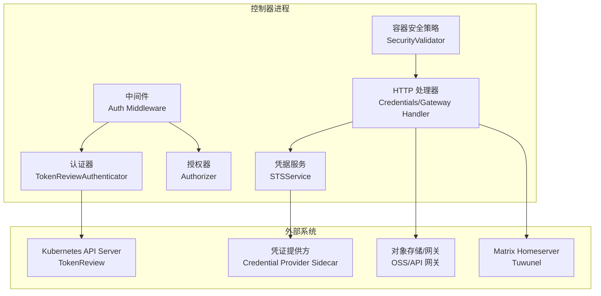
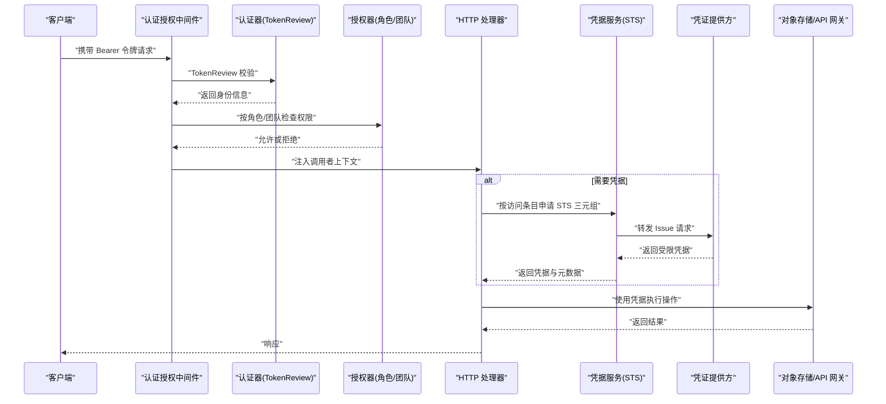
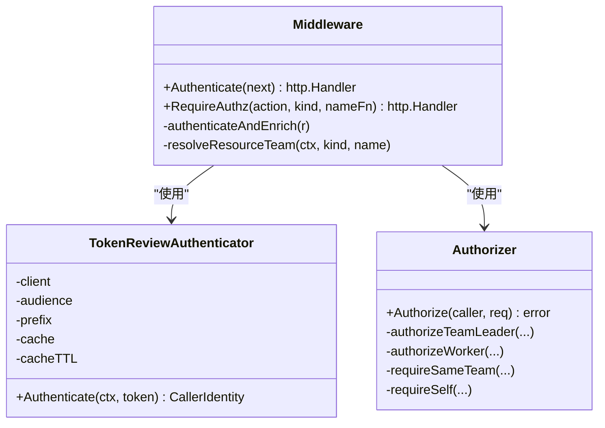
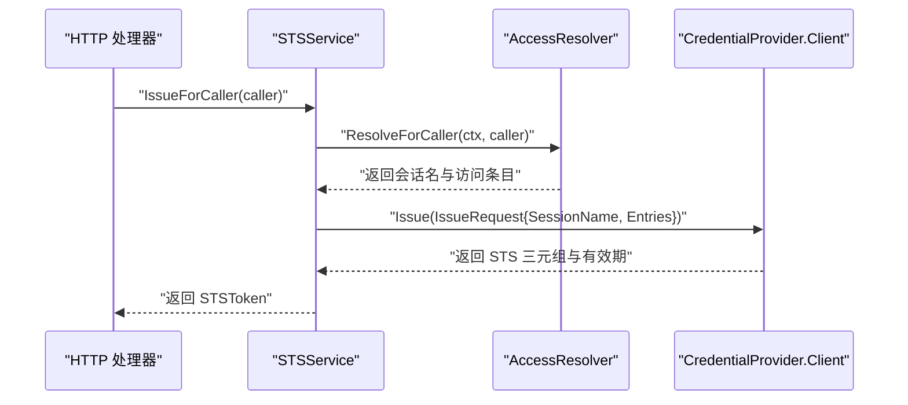
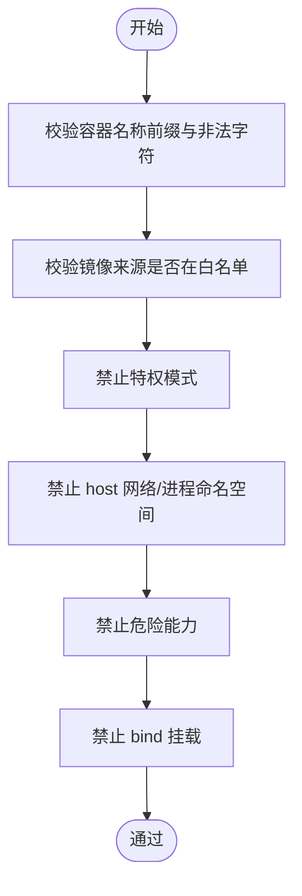
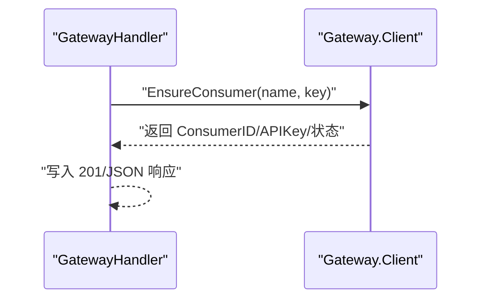
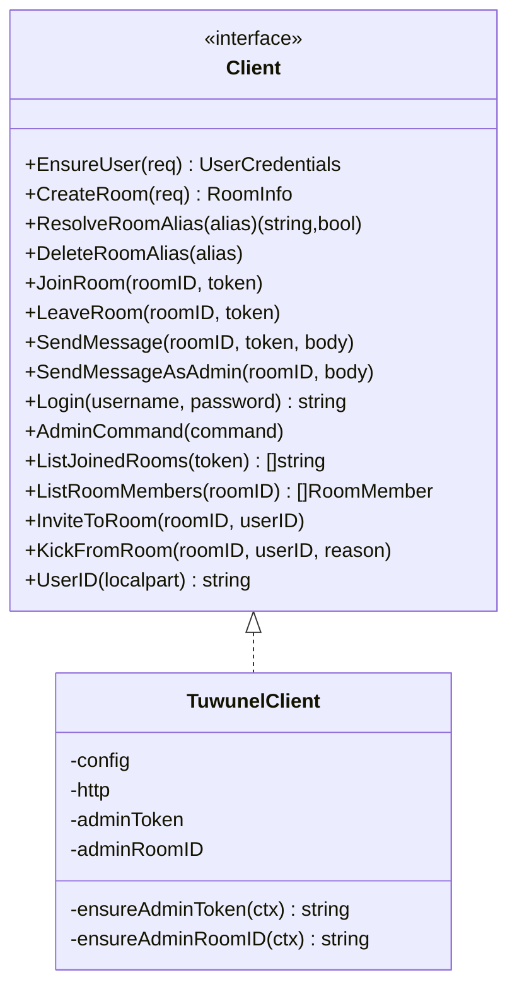
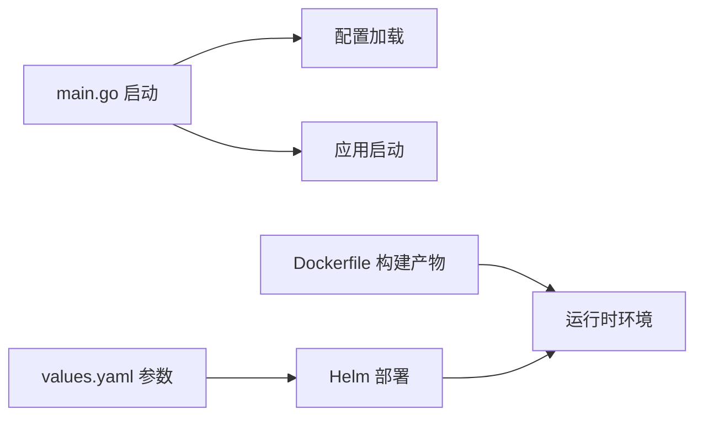

# 安全加固

<cite>
**本文引用的文件**
- [hiclaw-controller/internal/auth/authenticator.go](file://hiclaw-controller/internal/auth/authenticator.go)
- [hiclaw-controller/internal/auth/authorizer.go](file://hiclaw-controller/internal/auth/authorizer.go)
- [hiclaw-controller/internal/auth/middleware.go](file://hiclaw-controller/internal/auth/middleware.go)
- [hiclaw-controller/internal/credentials/sts.go](file://hiclaw-controller/internal/credentials/sts.go)
- [hiclaw-controller/internal/credprovider/tokenmanager.go](file://hiclaw-controller/internal/credprovider/tokenmanager.go)
- [hiclaw-controller/internal/proxy/security.go](file://hiclaw-controller/internal/proxy/security.go)
- [hiclaw-controller/internal/server/credentials_handler.go](file://hiclaw-controller/internal/server/credentials_handler.go)
- [hiclaw-controller/internal/server/gateway_handler.go](file://hiclaw-controller/internal/server/gateway_handler.go)
- [hiclaw-controller/internal/oss/minio.go](file://hiclaw-controller/internal/oss/minio.go)
- [hiclaw-controller/internal/matrix/client.go](file://hiclaw-controller/internal/matrix/client.go)
- [hiclaw-controller/cmd/controller/main.go](file://hiclaw-controller/cmd/controller/main.go)
- [hiclaw-controller/Dockerfile](file://hiclaw-controller/Dockerfile)
- [helm/hiclaw/values.yaml](file://helm/hiclaw/values.yaml)
</cite>

## 目录
1. [简介](#简介)
2. [项目结构](#项目结构)
3. [核心组件](#核心组件)
4. [架构总览](#架构总览)
5. [详细组件分析](#详细组件分析)
6. [依赖分析](#依赖分析)
7. [性能考虑](#性能考虑)
8. [故障排查指南](#故障排查指南)
9. [结论](#结论)
10. [附录](#附录)

## 简介
本文件面向 HiClaw 的安全加固与合规实践，聚焦高级安全配置与防护措施，覆盖网络安全加固（防火墙与隔离、流量加密）、访问控制增强（细粒度权限、多因素认证、审计日志）、凭据安全管理（轮换与最小权限）、应用安全防护（输入校验、注入防护、XSS 防护）、安全监控与告警（异常检测、入侵防护、事件响应），以及合规性与最佳实践（数据保护、隐私合规、审计跟踪）与漏洞评估修复指南。内容基于代码库中的认证授权、凭据服务、容器安全策略、存储与网关接口等实现进行提炼与扩展。

## 项目结构
HiClaw 的控制器模块由 Go 编写，采用分层设计：认证授权中间件、资源访问授权、凭据服务（STS）、容器安全策略、存储与矩阵客户端、HTTP 服务端口与路由。部署通过 Helm Chart 提供可配置的云原生参数，支持本地与云环境（阿里云 OSS/APIG）。

图示来源
- [hiclaw-controller/internal/auth/authenticator.go:46-112](file://hiclaw-controller/internal/auth/authenticator.go#L46-L112)
- [hiclaw-controller/internal/auth/authorizer.go:34-58](file://hiclaw-controller/internal/auth/authorizer.go#L34-L58)
- [hiclaw-controller/internal/auth/middleware.go:31-118](file://hiclaw-controller/internal/auth/middleware.go#L31-L118)
- [hiclaw-controller/internal/credentials/sts.go:41-89](file://hiclaw-controller/internal/credentials/sts.go#L41-L89)
- [hiclaw-controller/internal/proxy/security.go:59-159](file://hiclaw-controller/internal/proxy/security.go#L59-L159)
- [hiclaw-controller/internal/server/credentials_handler.go:12-42](file://hiclaw-controller/internal/server/credentials_handler.go#L12-L42)
- [hiclaw-controller/internal/server/gateway_handler.go:12-96](file://hiclaw-controller/internal/server/gateway_handler.go#L12-L96)

章节来源
- [hiclaw-controller/cmd/controller/main.go:16-36](file://hiclaw-controller/cmd/controller/main.go#L16-L36)
- [hiclaw-controller/Dockerfile:39-61](file://hiclaw-controller/Dockerfile#L39-L61)
- [helm/hiclaw/values.yaml:1-263](file://helm/hiclaw/values.yaml#L1-L263)

## 核心组件
- 认证与授权链路：基于 Kubernetes TokenReview 的 Bearer 令牌认证，结合角色与团队维度的授权矩阵，中间件在请求进入时完成鉴权与上下文注入。
- 凭据服务：面向调用者按其访问条目解析生成受限 STS 三元组，支持动态刷新与缓存，保障最小权限与轮换。
- 容器安全策略：镜像白名单、禁止特权模式与危险能力、限制挂载与网络模式，确保工作负载运行安全。
- 存储与网关：通过 mc 客户端与凭证源集成，支持静态与动态凭据；网关消费者管理接口用于 AI 路由授权。
- 矩阵通信：封装用户注册、房间管理、消息发送等操作，支持管理员令牌缓存与错误处理。

章节来源
- [hiclaw-controller/internal/auth/authenticator.go:35-140](file://hiclaw-controller/internal/auth/authenticator.go#L35-L140)
- [hiclaw-controller/internal/auth/authorizer.go:31-155](file://hiclaw-controller/internal/auth/authorizer.go#L31-L155)
- [hiclaw-controller/internal/auth/middleware.go:31-169](file://hiclaw-controller/internal/auth/middleware.go#L31-L169)
- [hiclaw-controller/internal/credentials/sts.go:29-90](file://hiclaw-controller/internal/credentials/sts.go#L29-L90)
- [hiclaw-controller/internal/credprovider/tokenmanager.go:10-78](file://hiclaw-controller/internal/credprovider/tokenmanager.go#L10-L78)
- [hiclaw-controller/internal/proxy/security.go:59-182](file://hiclaw-controller/internal/proxy/security.go#L59-L182)
- [hiclaw-controller/internal/server/credentials_handler.go:12-43](file://hiclaw-controller/internal/server/credentials_handler.go#L12-L43)
- [hiclaw-controller/internal/server/gateway_handler.go:12-96](file://hiclaw-controller/internal/server/gateway_handler.go#L12-L96)
- [hiclaw-controller/internal/oss/minio.go:13-268](file://hiclaw-controller/internal/oss/minio.go#L13-L268)
- [hiclaw-controller/internal/matrix/client.go:16-724](file://hiclaw-controller/internal/matrix/client.go#L16-L724)

## 架构总览
下图展示从客户端到控制器、再到外部系统的调用链与安全控制点。

图示来源
- [hiclaw-controller/internal/auth/middleware.go:51-118](file://hiclaw-controller/internal/auth/middleware.go#L51-L118)
- [hiclaw-controller/internal/auth/authenticator.go:78-112](file://hiclaw-controller/internal/auth/authenticator.go#L78-L112)
- [hiclaw-controller/internal/auth/authorizer.go:38-58](file://hiclaw-controller/internal/auth/authorizer.go#L38-L58)
- [hiclaw-controller/internal/server/credentials_handler.go:21-42](file://hiclaw-controller/internal/server/credentials_handler.go#L21-L42)
- [hiclaw-controller/internal/credentials/sts.go:63-89](file://hiclaw-controller/internal/credentials/sts.go#L63-L89)

## 详细组件分析

### 认证与授权中间件
- 认证：从 Authorization 头提取 Bearer 令牌，调用 TokenReview API 进行验证，并对结果进行缓存以降低 API 压力。
- 授权：根据调用者角色（admin、manager、team-leader、worker）与目标资源类型/动作进行细粒度授权，团队级访问控制通过资源注解解析实现。
- 中间件：提供仅认证与认证+授权两种包装，统一错误处理与上下文注入。

图示来源
- [hiclaw-controller/internal/auth/authenticator.go:35-140](file://hiclaw-controller/internal/auth/authenticator.go#L35-L140)
- [hiclaw-controller/internal/auth/authorizer.go:31-155](file://hiclaw-controller/internal/auth/authorizer.go#L31-L155)
- [hiclaw-controller/internal/auth/middleware.go:31-169](file://hiclaw-controller/internal/auth/middleware.go#L31-L169)

章节来源
- [hiclaw-controller/internal/auth/authenticator.go:78-112](file://hiclaw-controller/internal/auth/authenticator.go#L78-L112)
- [hiclaw-controller/internal/auth/authorizer.go:38-155](file://hiclaw-controller/internal/auth/authorizer.go#L38-L155)
- [hiclaw-controller/internal/auth/middleware.go:51-118](file://hiclaw-controller/internal/auth/middleware.go#L51-L118)

### 凭据服务与令牌管理
- STS 服务：根据调用者身份解析访问条目，向凭证提供方发起 Issue 请求，返回受限凭据与元数据（含 OSS 端点与桶名）。
- 令牌管理：对固定 IssueRequest 的 STS 令牌进行缓存与自动刷新，支持自定义刷新边界，避免过期导致的调用失败。
- 最小权限：凭据提供方负责基于调用者访问条目生成内联策略，控制器不持有持久密钥。

图示来源
- [hiclaw-controller/internal/server/credentials_handler.go:21-42](file://hiclaw-controller/internal/server/credentials_handler.go#L21-L42)
- [hiclaw-controller/internal/credentials/sts.go:63-89](file://hiclaw-controller/internal/credentials/sts.go#L63-L89)
- [hiclaw-controller/internal/credprovider/tokenmanager.go:52-69](file://hiclaw-controller/internal/credprovider/tokenmanager.go#L52-L69)

章节来源
- [hiclaw-controller/internal/credentials/sts.go:29-90](file://hiclaw-controller/internal/credentials/sts.go#L29-L90)
- [hiclaw-controller/internal/credprovider/tokenmanager.go:10-78](file://hiclaw-controller/internal/credprovider/tokenmanager.go#L10-L78)
- [hiclaw-controller/internal/server/credentials_handler.go:12-43](file://hiclaw-controller/internal/server/credentials_handler.go#L12-L43)

### 容器安全策略
- 镜像白名单：允许本地镜像、localhost、Higress 官方镜像仓库与显式配置的额外仓库前缀。
- 运行限制：禁止特权模式、主机网络/进程命名空间、危险能力（如 SYS_ADMIN、NET_ADMIN 等），禁止 bind mount。
- 名称前缀：强制容器名称前缀，防止越权命名。

图示来源
- [hiclaw-controller/internal/proxy/security.go:107-182](file://hiclaw-controller/internal/proxy/security.go#L107-L182)

章节来源
- [hiclaw-controller/internal/proxy/security.go:59-182](file://hiclaw-controller/internal/proxy/security.go#L59-L182)

### 存储与网关接口
- 存储：通过 mc 客户端与凭证源集成，支持静态与动态凭据模式；动态模式在每次调用时注入临时凭据环境变量，避免持久化密钥。
- 网关：提供消费者创建、绑定与删除接口，用于 AI 路由授权；对无效 JSON、缺失字段等情况进行明确错误响应。

图示来源
- [hiclaw-controller/internal/server/gateway_handler.go:21-53](file://hiclaw-controller/internal/server/gateway_handler.go#L21-L53)
- [hiclaw-controller/internal/server/gateway_handler.go:55-74](file://hiclaw-controller/internal/server/gateway_handler.go#L55-L74)
- [hiclaw-controller/internal/server/gateway_handler.go:76-96](file://hiclaw-controller/internal/server/gateway_handler.go#L76-L96)

章节来源
- [hiclaw-controller/internal/oss/minio.go:13-268](file://hiclaw-controller/internal/oss/minio.go#L13-L268)
- [hiclaw-controller/internal/server/gateway_handler.go:12-96](file://hiclaw-controller/internal/server/gateway_handler.go#L12-L96)

### 矩阵通信与安全
- 用户与房间：提供用户注册/登录、房间创建/别名解析/删除、加入/离开、成员列表、邀请/踢出等操作。
- 安全要点：管理员令牌缓存并在鉴权失败时清空；消息发送使用事务 ID；URL 路径对特殊字符进行编码。

图示来源
- [hiclaw-controller/internal/matrix/client.go:16-87](file://hiclaw-controller/internal/matrix/client.go#L16-L87)
- [hiclaw-controller/internal/matrix/client.go:89-112](file://hiclaw-controller/internal/matrix/client.go#L89-L112)

章节来源
- [hiclaw-controller/internal/matrix/client.go:118-252](file://hiclaw-controller/internal/matrix/client.go#L118-L252)
- [hiclaw-controller/internal/matrix/client.go:254-332](file://hiclaw-controller/internal/matrix/client.go#L254-L332)
- [hiclaw-controller/internal/matrix/client.go:430-490](file://hiclaw-controller/internal/matrix/client.go#L430-L490)
- [hiclaw-controller/internal/matrix/client.go:645-692](file://hiclaw-controller/internal/matrix/client.go#L645-L692)

## 依赖分析
- 控制器入口：启动日志初始化、信号处理、配置加载与应用启动。
- 镜像与工具：构建阶段引入 mc、kube-apiserver 与 Higress 官方镜像，运行时提供 CLI 与 CRD 配置。
- Helm 参数：提供矩阵、网关、存储、凭据提供方、控制器等可配置项，支持本地与云环境切换。

图示来源
- [hiclaw-controller/cmd/controller/main.go:16-36](file://hiclaw-controller/cmd/controller/main.go#L16-L36)
- [hiclaw-controller/Dockerfile:39-61](file://hiclaw-controller/Dockerfile#L39-L61)
- [helm/hiclaw/values.yaml:1-263](file://helm/hiclaw/values.yaml#L1-L263)

章节来源
- [hiclaw-controller/cmd/controller/main.go:16-36](file://hiclaw-controller/cmd/controller/main.go#L16-L36)
- [hiclaw-controller/Dockerfile:1-61](file://hiclaw-controller/Dockerfile#L1-L61)
- [helm/hiclaw/values.yaml:1-263](file://helm/hiclaw/values.yaml#L1-L263)

## 性能考虑
- 认证缓存：TokenReview 结果按令牌哈希缓存，减少重复调用；建议结合实际规模评估 TTL 与失效策略。
- 令牌刷新：TokenManager 在剩余有效期低于阈值时刷新，避免频繁阻塞；可按场景调整刷新边界。
- 容器策略：白名单与禁令在请求早期判定，避免后续流程开销。
- 存储调用：动态凭据模式在每次 mc 调用注入凭据，避免持久化密钥带来的额外开销。

## 故障排查指南
- 认证失败
  - 现象：返回未授权错误。
  - 排查：确认 Authorization 头格式、令牌有效性与 Audience；查看中间件日志；必要时清空认证缓存。
  - 参考路径
    - [hiclaw-controller/internal/auth/middleware.go:137-156](file://hiclaw-controller/internal/auth/middleware.go#L137-L156)
    - [hiclaw-controller/internal/auth/authenticator.go:78-112](file://hiclaw-controller/internal/auth/authenticator.go#L78-L112)
- 授权拒绝
  - 现象：返回禁止访问错误。
  - 排查：核对调用者角色与目标资源团队；检查资源注解与团队解析逻辑。
  - 参考路径
    - [hiclaw-controller/internal/auth/authorizer.go:38-58](file://hiclaw-controller/internal/auth/authorizer.go#L38-L58)
    - [hiclaw-controller/internal/auth/middleware.go:120-135](file://hiclaw-controller/internal/auth/middleware.go#L120-L135)
- 凭据问题
  - 现象：凭据服务不可用或签发失败。
  - 排查：确认凭据提供方已启用与可达；检查访问条目解析与 Issue 请求；观察令牌管理器刷新日志。
  - 参考路径
    - [hiclaw-controller/internal/server/credentials_handler.go:21-42](file://hiclaw-controller/internal/server/credentials_handler.go#L21-L42)
    - [hiclaw-controller/internal/credentials/sts.go:63-89](file://hiclaw-controller/internal/credentials/sts.go#L63-L89)
    - [hiclaw-controller/internal/credprovider/tokenmanager.go:52-69](file://hiclaw-controller/internal/credprovider/tokenmanager.go#L52-L69)
- 容器创建被拒
  - 现象：容器创建失败，提示镜像/挂载/能力等违规。
  - 排查：检查镜像来源是否在白名单；移除 bind mount 与危险能力；确认容器名称前缀。
  - 参考路径
    - [hiclaw-controller/internal/proxy/security.go:107-182](file://hiclaw-controller/internal/proxy/security.go#L107-L182)
- 存储/网关错误
  - 现象：mc 调用失败或网关消费者管理接口报错。
  - 排查：核对凭据环境变量构建、Endpoint 规范与凭据提供方返回；检查请求体与必填字段。
  - 参考路径
    - [hiclaw-controller/internal/oss/minio.go:203-226](file://hiclaw-controller/internal/oss/minio.go#L203-L226)
    - [hiclaw-controller/internal/server/gateway_handler.go:27-53](file://hiclaw-controller/internal/server/gateway_handler.go#L27-L53)

## 结论
HiClaw 的安全体系围绕“最小权限凭据、严格容器策略、细粒度授权与审计”展开。通过 TokenReview 认证、角色/团队授权矩阵、STS 动态凭据与缓存刷新、镜像白名单与运行时限制，有效降低了攻击面。建议在生产环境中结合网络策略、TLS 终端、审计日志与合规扫描，持续完善安全运营闭环。

## 附录

### 网络安全加固
- 防火墙与隔离
  - 使用集群网络策略限制控制器与工作负载的入站/出站流量，仅放行必要的端口（如 8090、9000/9001、80/443）。
  - 将凭据提供方、对象存储与网关置于受控子网，必要时启用云厂商安全组。
- 流量加密
  - 对外暴露的网关与 UI 使用 TLS 终止；内部组件间通信可通过 mTLS 或双向 TLS（如启用网格）。
  - 证书轮换与吊销策略需纳入运维流程。

### 访问控制增强
- 细粒度权限管理
  - 基于角色与团队维度的授权矩阵已覆盖常见场景；建议在新增资源类型时补充授权规则。
  - 参考路径
    - [hiclaw-controller/internal/auth/authorizer.go:38-155](file://hiclaw-controller/internal/auth/authorizer.go#L38-L155)
- 多因素认证（MFA）
  - 当前基于 Bearer 令牌；建议在入口网关或 API 层接入 MFA（如 OIDC/JWT 验证）后，再交由控制器进行令牌校验。
- 审计日志
  - 在中间件与处理器中记录请求上下文（调用者、动作、资源、时间戳、结果），并输出到集中式日志系统。
  - 参考路径
    - [hiclaw-controller/internal/auth/middleware.go:137-156](file://hiclaw-controller/internal/auth/middleware.go#L137-L156)
    - [hiclaw-controller/internal/server/credentials_handler.go:34-42](file://hiclaw-controller/internal/server/credentials_handler.go#L34-L42)

### 凭据安全管理
- 凭据轮换
  - 通过 STS 动态凭据与 TokenManager 刷新机制，避免长期密钥驻留；建议缩短凭据有效期并定期轮换。
  - 参考路径
    - [hiclaw-controller/internal/credprovider/tokenmanager.go:52-69](file://hiclaw-controller/internal/credprovider/tokenmanager.go#L52-L69)
- 访问令牌管理
  - 令牌仅在内存与必要时注入环境变量，避免落盘；令牌回收与失效清理纳入运维流程。
- 最小权限原则
  - 凭据提供方按访问条目生成内联策略；控制器不持有持久密钥。
  - 参考路径
    - [hiclaw-controller/internal/credentials/sts.go:63-89](file://hiclaw-controller/internal/credentials/sts.go#L63-L89)

### 应用安全防护
- 输入验证
  - 对 JSON 请求体与路径参数进行严格校验，缺失字段与格式错误返回明确错误码。
  - 参考路径
    - [hiclaw-controller/internal/server/gateway_handler.go:27-53](file://hiclaw-controller/internal/server/gateway_handler.go#L27-L53)
- SQL 注入防护
  - 控制器不直接执行 SQL；如涉及数据库，请使用参数化查询与只读连接。
- XSS 防护
  - 对用户输入进行转义与内容安全策略（CSP）设置；前端 UI（Element Web）需配合 CSP 与安全头。

### 安全监控与告警
- 异常检测
  - 监控认证失败率、授权拒绝次数、凭据刷新失败与超时、容器创建拒绝事件。
- 入侵防护
  - 结合 WAF/IPS 与入口网关策略，封禁可疑 IP 与异常请求模式。
- 安全事件响应
  - 建立事件分级与处置流程，包含令牌撤销、凭据轮换、容器隔离与调查取证。

### 合规性与最佳实践
- 数据保护
  - 对敏感配置与凭据进行加密存储；传输中启用 TLS；生命周期管理遵循最小保留原则。
- 隐私合规
  - 明确数据处理目的与范围，提供数据主体权利（访问、更正、删除）的实现路径。
- 审计跟踪
  - 记录所有关键操作的完整审计日志，确保可追溯与不可抵赖。

### 安全漏洞评估与修复指南
- 评估清单
  - 认证链路：令牌有效性、Audience 一致性、缓存一致性。
  - 授权链路：角色/团队边界、资源注解解析、动作与资源匹配。
  - 凭据链路：凭据提供方可用性、访问条目解析、令牌刷新与过期。
  - 容器链路：镜像白名单命中、挂载与能力限制、网络模式约束。
  - 存储链路：Endpoint 规范、凭据环境变量构建、mc 错误码映射。
- 修复建议
  - 针对高危风险（如特权容器、危险能力、未授权访问）立即阻断并修复。
  - 对低风险（如缓存 TTL、刷新边界）进行参数优化与监控告警。