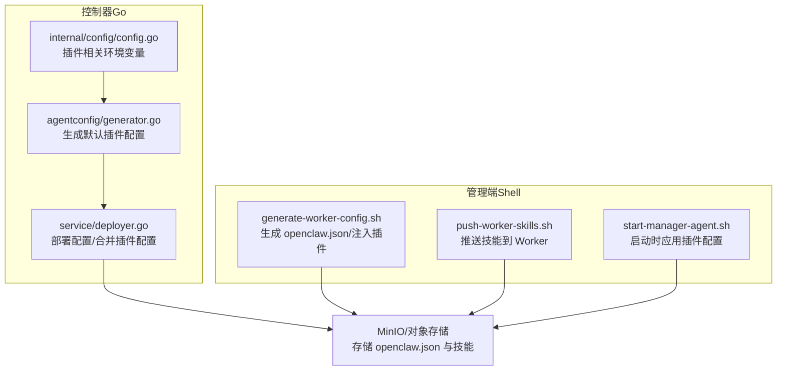
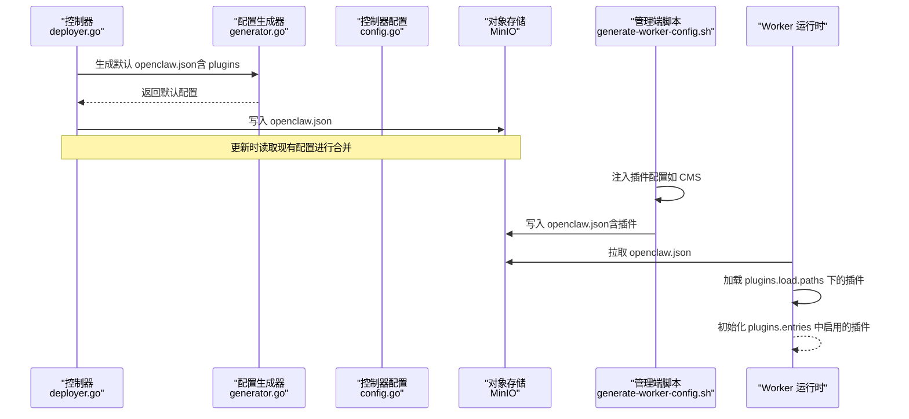
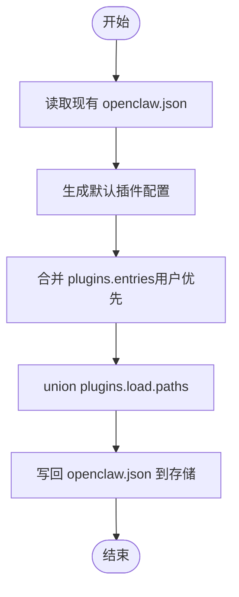
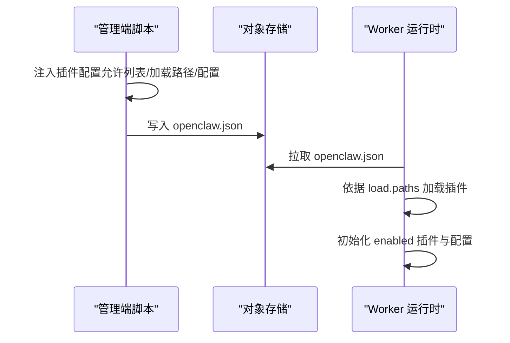
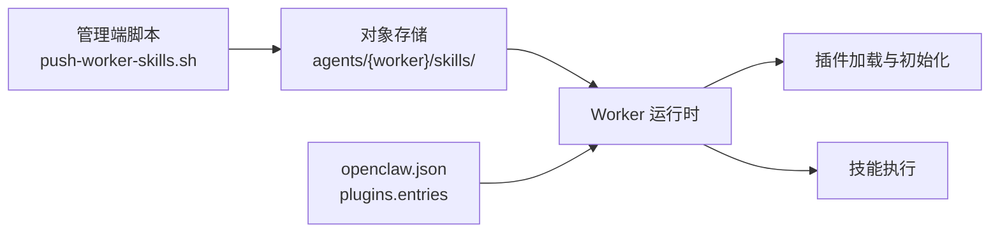
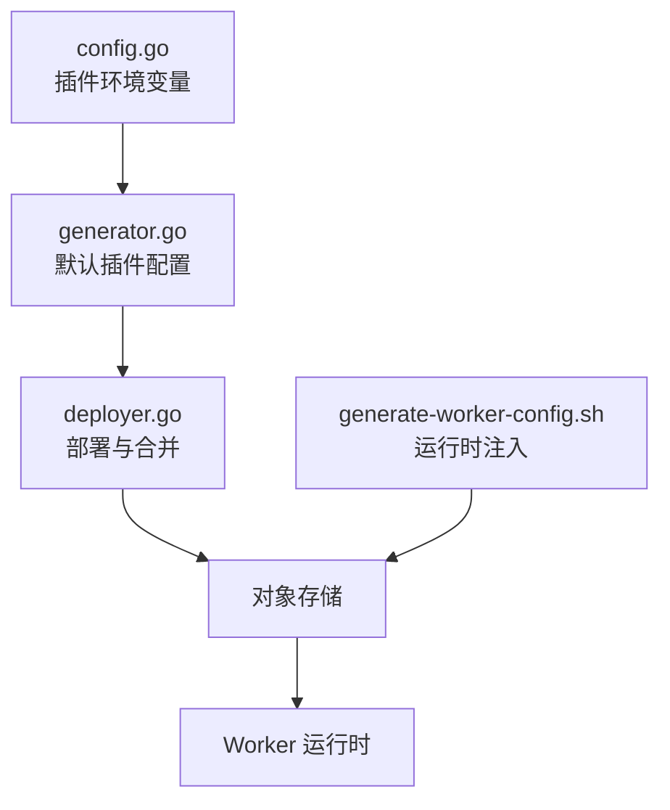

# 插件系统扩展

<cite>
**本文档引用的文件**
- [README.md](file://README.md)
- [deployer.go](file://hiclaw-controller/internal/service/deployer.go)
- [generator.go](file://hiclaw-controller/internal/agentconfig/generator.go)
- [config.go](file://hiclaw-controller/internal/config/config.go)
- [generate-worker-config.sh](file://manager/agent/skills/worker-management/scripts/generate-worker-config.sh)
- [push-worker-skills.sh](file://manager/agent/skills/worker-management/scripts/push-worker-skills.sh)
- [deployer_merge_test.go](file://hiclaw-controller/internal/service/deployer_merge_test.go)
- [start-manager-agent.sh](file://manager/scripts/init/start-manager-agent.sh)
</cite>

## 目录
1. [简介](#简介)
2. [项目结构](#项目结构)
3. [核心组件](#核心组件)
4. [架构总览](#架构总览)
5. [详细组件分析](#详细组件分析)
6. [依赖关系分析](#依赖关系分析)
7. [性能考虑](#性能考虑)
8. [故障排除指南](#故障排除指南)
9. [结论](#结论)
10. [附录](#附录)

## 简介
本文件面向 HiClaw 的插件系统扩展，系统化阐述插件架构设计、接口规范、生命周期管理与依赖注入机制；提供从项目结构、配置文件到 API 接口的完整开发指南；详解插件注册与发现、动态加载、版本管理与兼容性检查；说明插件间通信与数据共享机制；给出可操作的开发示例与最佳实践，并覆盖社区插件生态的管理与贡献流程。

HiClaw 基于 Manager-Workers 架构，通过控制器在运行时生成并下发 Worker 的 openclaw.json 配置，其中内置 plugins 字段用于声明插件加载路径与默认启用项。插件的动态加载、版本管理与兼容性由控制器与脚本共同保障，确保用户自定义配置在升级过程中得以保留，同时允许默认插件条目按需注入。

## 项目结构
围绕插件系统的关键目录与文件如下：
- 控制器侧（Go）：负责生成 openclaw.json、合并用户自定义插件配置、推送内置技能与文件
  - hiclaw-controller/internal/agentconfig/generator.go：生成 openclaw.json 的默认插件配置（plugins.load、plugins.entries）
  - hiclaw-controller/internal/service/deployer.go：部署 Worker 配置，包含插件配置合并逻辑
  - hiclaw-controller/internal/config/config.go：控制器配置，包含插件相关环境变量与传播
- 管理端（Shell 脚本）：负责生成 Worker openclaw.json、注入 CMS 插件配置、推送技能
  - manager/agent/skills/worker-management/scripts/generate-worker-config.sh：生成 openclaw.json 并注入插件配置
  - manager/agent/skills/worker-management/scripts/push-worker-skills.sh：基于 workers-registry.json 推送技能到 Worker
  - manager/scripts/init/start-manager-agent.sh：启动时应用插件配置

**图表来源**
- [generator.go:154-170](file://hiclaw-controller/internal/agentconfig/generator.go#L154-L170)
- [deployer.go:184-197](file://hiclaw-controller/internal/service/deployer.go#L184-L197)
- [config.go:314-334](file://hiclaw-controller/internal/config/config.go#L314-L334)
- [generate-worker-config.sh:118-146](file://manager/agent/skills/worker-management/scripts/generate-worker-config.sh#L118-L146)
- [push-worker-skills.sh:103-144](file://manager/agent/skills/worker-management/scripts/push-worker-skills.sh#L103-L144)
- [start-manager-agent.sh:838-860](file://manager/scripts/init/start-manager-agent.sh#L838-L860)

**章节来源**
- [README.md:1-404](file://README.md#L1-L404)
- [generator.go:154-170](file://hiclaw-controller/internal/agentconfig/generator.go#L154-L170)
- [deployer.go:184-197](file://hiclaw-controller/internal/service/deployer.go#L184-L197)
- [config.go:314-334](file://hiclaw-controller/internal/config/config.go#L314-L334)
- [generate-worker-config.sh:118-146](file://manager/agent/skills/worker-management/scripts/generate-worker-config.sh#L118-L146)
- [push-worker-skills.sh:103-144](file://manager/agent/skills/worker-management/scripts/push-worker-skills.sh#L103-L144)
- [start-manager-agent.sh:838-860](file://manager/scripts/init/start-manager-agent.sh#L838-L860)

## 核心组件
- 插件配置模型
  - plugins.load.paths：插件扩展目录集合，支持用户添加自定义路径
  - plugins.entries：插件条目集合，键为插件名称，值为 enabled 与 config
  - plugins.allow：显式允许的插件清单（用于安全控制）
- 默认插件
  - matrix：矩阵通道插件，默认启用
  - memory-core：记忆核心插件，默认启用，支持 dreaming 子配置
- 插件合并策略
  - 生成配置提供默认条目；现有配置中的用户自定义条目优先级更高
  - 合并深度递归，子配置覆盖冲突字段
  - 合并后 union 插件加载路径，确保用户自定义扩展目录不丢失

**章节来源**
- [generator.go:154-170](file://hiclaw-controller/internal/agentconfig/generator.go#L154-L170)
- [deployer.go:561-621](file://hiclaw-controller/internal/service/deployer.go#L561-L621)
- [deployer_merge_test.go:8-114](file://hiclaw-controller/internal/service/deployer_merge_test.go#L8-L114)

## 架构总览
下图展示了插件系统在不同阶段的交互：控制器生成默认配置、合并用户自定义配置、写入对象存储；管理端脚本在运行时进一步注入特定插件（如 CMS），并通过技能推送机制分发给 Worker。

**图表来源**
- [deployer.go:184-197](file://hiclaw-controller/internal/service/deployer.go#L184-L197)
- [generator.go:154-170](file://hiclaw-controller/internal/agentconfig/generator.go#L154-L170)
- [config.go:314-334](file://hiclaw-controller/internal/config/config.go#L314-L334)
- [generate-worker-config.sh:177-239](file://manager/agent/skills/worker-management/scripts/generate-worker-config.sh#L177-L239)

## 详细组件分析

### 组件一：插件配置生成与合并
- 生成阶段
  - 生成器为 openclaw.json 注入默认插件配置（plugins.load.paths、plugins.entries）
  - 支持根据环境变量与运行模式调整插件行为
- 合并阶段（更新时）
  - 读取现有 openclaw.json，与新生成的配置进行深度合并
  - 用户自定义的 plugins.entries 优先于默认条目
  - plugins.load.paths union 后写回，保证用户自定义扩展目录不丢失

**图表来源**
- [deployer.go:561-621](file://hiclaw-controller/internal/service/deployer.go#L561-L621)
- [deployer_merge_test.go:8-114](file://hiclaw-controller/internal/service/deployer_merge_test.go#L8-L114)

**章节来源**
- [generator.go:154-170](file://hiclaw-controller/internal/agentconfig/generator.go#L154-L170)
- [deployer.go:184-197](file://hiclaw-controller/internal/service/deployer.go#L184-L197)
- [deployer_merge_test.go:8-114](file://hiclaw-controller/internal/service/deployer_merge_test.go#L8-L114)

### 组件二：插件注入与运行时加载
- 管理端脚本在生成 openclaw.json 时，可按需注入第三方插件（如 CMS 插件），并设置允许列表与加载路径
- Worker 运行时从对象存储拉取 openclaw.json，按 plugins.load.paths 动态加载插件
- 插件初始化遵循 enabled 与 config 字段，确保最小权限与可配置性

**图表来源**
- [generate-worker-config.sh:177-239](file://manager/agent/skills/worker-management/scripts/generate-worker-config.sh#L177-L239)
- [start-manager-agent.sh:838-860](file://manager/scripts/init/start-manager-agent.sh#L838-L860)

**章节来源**
- [generate-worker-config.sh:177-239](file://manager/agent/skills/worker-management/scripts/generate-worker-config.sh#L177-L239)
- [start-manager-agent.sh:838-860](file://manager/scripts/init/start-manager-agent.sh#L838-L860)

### 组件三：技能与插件的关系
- 技能（skills）与插件（plugins）在概念上互补：技能是可执行的业务能力，插件是运行时扩展框架
- 管理端通过 push-worker-skills.sh 将技能推送到 Worker 的对象存储中，Worker 可在运行时加载
- 插件配置（plugins.entries）可与技能协同工作，例如通过插件增强消息处理或可观测性

**图表来源**
- [push-worker-skills.sh:103-144](file://manager/agent/skills/worker-management/scripts/push-worker-skills.sh#L103-L144)
- [generate-worker-config.sh:118-146](file://manager/agent/skills/worker-management/scripts/generate-worker-config.sh#L118-L146)

**章节来源**
- [push-worker-skills.sh:103-144](file://manager/agent/skills/worker-management/scripts/push-worker-skills.sh#L103-L144)
- [generate-worker-config.sh:118-146](file://manager/agent/skills/worker-management/scripts/generate-worker-config.sh#L118-L146)

## 依赖关系分析
- 控制器配置（config.go）提供插件相关的环境变量（如 CMS 开关、端点、密钥等），并在 Worker 环境中传播
- 生成器（generator.go）与部署器（deployer.go）共同决定 openclaw.json 的最终形态
- 管理端脚本（generate-worker-config.sh）在运行时对 openclaw.json 进行二次注入
- 对象存储（MinIO）作为统一的数据源，承载 openclaw.json 与技能资源

**图表来源**
- [config.go:314-334](file://hiclaw-controller/internal/config/config.go#L314-L334)
- [generator.go:154-170](file://hiclaw-controller/internal/agentconfig/generator.go#L154-L170)
- [deployer.go:184-197](file://hiclaw-controller/internal/service/deployer.go#L184-L197)
- [generate-worker-config.sh:177-239](file://manager/agent/skills/worker-management/scripts/generate-worker-config.sh#L177-L239)

**章节来源**
- [config.go:314-334](file://hiclaw-controller/internal/config/config.go#L314-L334)
- [generator.go:154-170](file://hiclaw-controller/internal/agentconfig/generator.go#L154-L170)
- [deployer.go:184-197](file://hiclaw-controller/internal/service/deployer.go#L184-L197)
- [generate-worker-config.sh:177-239](file://manager/agent/skills/worker-management/scripts/generate-worker-config.sh#L177-L239)

## 性能考虑
- 插件加载路径 union 操作仅在更新时发生，避免频繁 IO
- 合并策略采用深度递归，复杂度与配置层级成正比，建议保持插件配置简洁
- 对象存储的镜像同步（mc mirror）在推送技能时批量传输，减少往返次数
- 控制器写入 openclaw.json 时尽量保持字节稳定，避免不必要的重启

[本节为通用指导，无需具体文件引用]

## 故障排除指南
- 插件未生效
  - 检查 openclaw.json 中 plugins.allow 是否包含目标插件名
  - 确认 plugins.load.paths 包含插件所在目录
  - 核对 Worker 是否成功拉取最新 openclaw.json
- 自定义配置丢失
  - 更新流程会保留用户自定义的 plugins.entries 与 load.paths，若丢失，检查合并逻辑是否被覆盖
- 技能推送失败
  - 检查 workers-registry.json 中 worker 的房间 ID 与权限
  - 确认对象存储端点与凭据正确

**章节来源**
- [deployer.go:561-621](file://hiclaw-controller/internal/service/deployer.go#L561-L621)
- [push-worker-skills.sh:149-186](file://manager/agent/skills/worker-management/scripts/push-worker-skills.sh#L149-L186)

## 结论
HiClaw 的插件系统以 openclaw.json 的 plugins 字段为核心，结合控制器的生成与合并机制、管理端脚本的运行时注入以及对象存储的统一分发，实现了插件的动态加载、版本管理与兼容性保障。通过明确的接口规范与生命周期管理，开发者可以安全地扩展 Worker 的能力，同时确保用户自定义配置在升级过程中得到保留。

[本节为总结，无需具体文件引用]

## 附录

### 插件开发指南（步骤与要点）
- 项目结构
  - 插件目录放置于 plugins.load.paths 指定的路径下
  - 在 openclaw.json 中通过 plugins.entries 声明插件名称、enabled 与 config
- 配置文件
  - 默认配置由生成器提供；更新时由控制器合并用户自定义配置
  - 管理端脚本可在运行时注入额外插件配置（如 CMS）
- API 接口
  - 插件通过对象存储的 openclaw.json 与技能目录进行交互
  - 技能推送通过 push-worker-skills.sh 与 workers-registry.json 协同完成
- 生命周期
  - 加载：Worker 启动时读取 openclaw.json，按 load.paths 加载插件
  - 初始化：根据 entries 中的 enabled 与 config 初始化插件
  - 更新：控制器合并用户自定义配置，写回 openclaw.json
- 依赖注入
  - 控制器配置（config.go）提供环境变量，传播至 Worker
  - 管理端脚本在运行时注入插件配置，确保与控制器生成的配置一致

**章节来源**
- [generator.go:154-170](file://hiclaw-controller/internal/agentconfig/generator.go#L154-L170)
- [deployer.go:184-197](file://hiclaw-controller/internal/service/deployer.go#L184-L197)
- [config.go:314-334](file://hiclaw-controller/internal/config/config.go#L314-L334)
- [generate-worker-config.sh:177-239](file://manager/agent/skills/worker-management/scripts/generate-worker-config.sh#L177-L239)
- [push-worker-skills.sh:103-144](file://manager/agent/skills/worker-management/scripts/push-worker-skills.sh#L103-L144)

### 插件注册与发现机制
- 注册：通过 plugins.allow 显式声明允许的插件
- 发现：Worker 依据 plugins.load.paths 自动发现并加载插件
- 版本管理与兼容性
  - 生成器提供默认条目；用户自定义优先
  - 合并逻辑确保新增默认条目不会覆盖用户已有配置
  - 测试用例验证了用户自定义 dreaming 配置、自定义插件与扩展路径的保留

**章节来源**
- [deployer.go:561-621](file://hiclaw-controller/internal/service/deployer.go#L561-L621)
- [deployer_merge_test.go:8-114](file://hiclaw-controller/internal/service/deployer_merge_test.go#L8-L114)

### 插件间通信与数据共享
- 通信：通过 Matrix 通道与消息提及（mentions）实现跨插件可见的协作
- 数据共享：通过对象存储（MinIO）共享 openclaw.json 与技能资源，确保多插件访问一致性

**章节来源**
- [README.md:290-304](file://README.md#L290-L304)

### 插件测试、部署与维护最佳实践
- 测试
  - 使用控制器提供的合并逻辑测试用例，验证用户自定义配置的保留与默认条目的注入
- 部署
  - 通过控制器生成 openclaw.json 并写入对象存储；管理端脚本在运行时注入插件配置
- 维护
  - 保持 plugins.entries 的最小化变更；通过 plugins.load.paths 添加扩展目录
  - 定期校验对象存储中的 openclaw.json 与技能目录，确保一致性

**章节来源**
- [deployer_merge_test.go:8-114](file://hiclaw-controller/internal/service/deployer_merge_test.go#L8-L114)
- [deployer.go:184-197](file://hiclaw-controller/internal/service/deployer.go#L184-L197)
- [generate-worker-config.sh:177-239](file://manager/agent/skills/worker-management/scripts/generate-worker-config.sh#L177-L239)

### 社区插件生态管理与贡献指南
- 生态管理
  - 通过 skills.sh 提供的技能生态，Worker 可按需拉取技能
  - 管理端脚本 push-worker-skills.sh 统一推送与通知
- 贡献流程
  - 在社区仓库提交插件或技能，遵循 openclaw.plugin.json 规范
  - 在管理端脚本中注入插件配置，确保与控制器生成的配置一致

**章节来源**
- [README.md:52-53](file://README.md#L52-L53)
- [push-worker-skills.sh:103-144](file://manager/agent/skills/worker-management/scripts/push-worker-skills.sh#L103-L144)