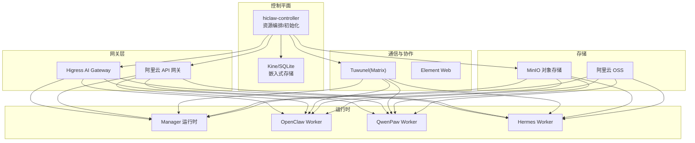
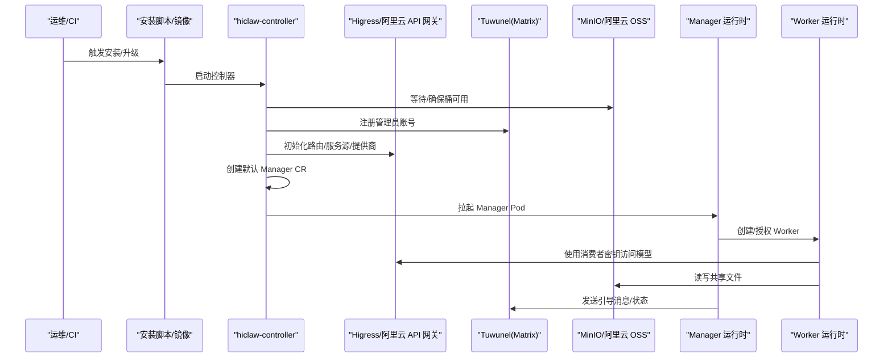
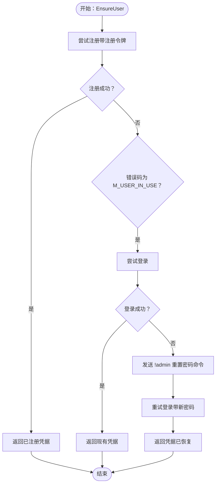
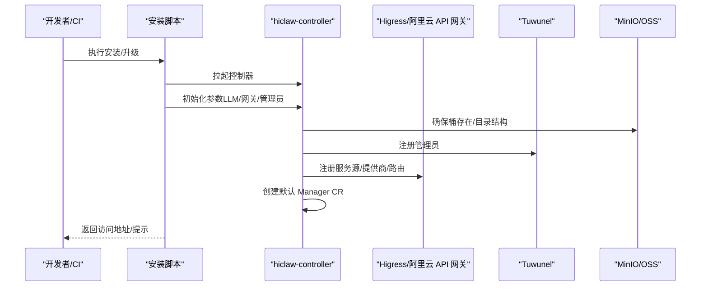
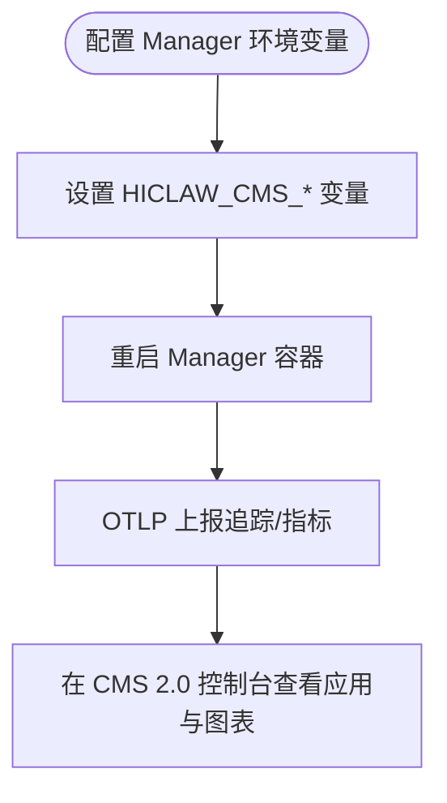
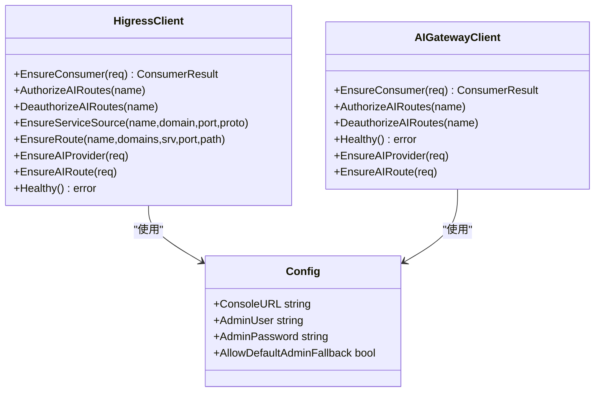
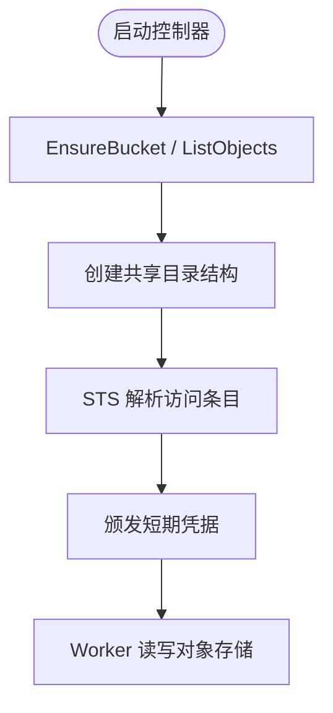
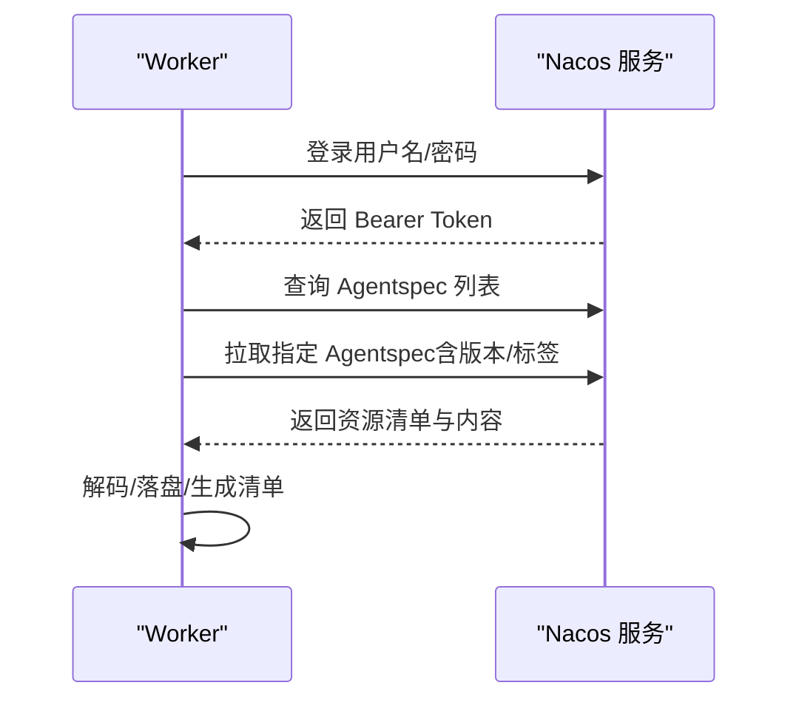
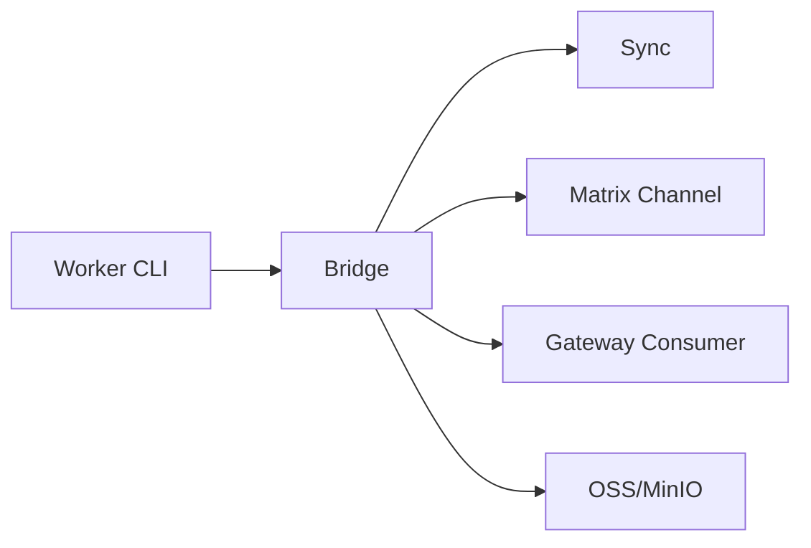
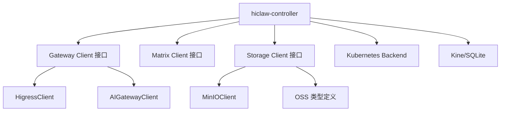

# 系统集成

<cite>
**本文引用的文件**
- [README.md](file://README.md)
- [docs/cms-integration.md](file://docs/cms-integration.md)
- [hiclaw-controller/internal/gateway/types.go](file://hiclaw-controller/internal/gateway/types.go)
- [hiclaw-controller/internal/gateway/aigateway.go](file://hiclaw-controller/internal/gateway/aigateway.go)
- [hiclaw-controller/internal/gateway/higress.go](file://hiclaw-controller/internal/gateway/higress.go)
- [hiclaw-controller/internal/initializer/initializer.go](file://hiclaw-controller/internal/initializer/initializer.go)
- [hiclaw-controller/internal/migration/registry_migration.go](file://hiclaw-controller/internal/migration/registry_migration.go)
- [hiclaw-controller/internal/backend/kubernetes.go](file://hiclaw-controller/internal/backend/kubernetes.go)
- [hiclaw-controller/internal/matrix/client.go](file://hiclaw-controller/internal/matrix/client.go)
- [hiclaw-controller/internal/matrix/types.go](file://hiclaw-controller/internal/matrix/types.go)
- [hiclaw-controller/internal/oss/minio.go](file://hiclaw-controller/internal/oss/minio.go)
- [hiclaw-controller/internal/oss/types.go](file://hiclaw-controller/internal/oss/types.go)
- [hiclaw-controller/internal/executor/nacos_agentspec.go](file://hiclaw-controller/internal/executor/nacos_agentspec.go)
- [hiclaw-controller/internal/proxy/proxy.go](file://hiclaw-controller/internal/proxy/proxy.go)
- [hiclaw-controller/internal/store/kine.go](file://hiclaw-controller/internal/store/kine.go)
- [hiclaw-controller/internal/credentials/sts.go](file://hiclaw-controller/internal/credentials/sts.go)
- [manager/scripts/init/setup-higress.sh](file://manager/scripts/init/setup-higress.sh)
- [manager/scripts/lib/gateway-api.sh](file://manager/scripts/lib/gateway-api.sh)
- [manager/docker-legacy/Dockerfile.copaw-all-in-one](file://manager/docker-legacy/Dockerfile.copaw-all-in-one)
- [copaw/src/copaw_worker/cli.py](file://copaw/src/copaw_worker/cli.py)
- [copaw/src/copaw_worker/bridge.py](file://copaw/src/copaw_worker/bridge.py)
- [copaw/src/copaw_worker/worker.py](file://copaw/src/copaw_worker/worker.py)
- [copaw/src/copaw_worker/sync.py](file://copaw/src/copaw_worker/sync.py)
- [copaw/src/matrix/channel.py](file://copaw/src/matrix/channel.py)
- [copaw/src/matrix/config.py](file://copaw/src/matrix/config.py)
- [hermes/src/hermes_worker/cli.py](file://hermes/src/hermes_worker/cli.py)
- [hermes/src/hermes_worker/bridge.py](file://hermes/src/hermes_worker/bridge.py)
- [hermes/src/hermes_worker/worker.py](file://hermes/src/hermes_worker/worker.py)
- [hermes/src/hermes_worker/sync.py](file://hermes/src/hermes_worker/sync.py)
- [tests/lib/test-helpers.sh](file://tests/lib/test-helpers.sh)
- [tests/lib/matrix-client.sh](file://tests/lib/matrix-client.sh)
- [tests/lib/minio-client.sh](file://tests/lib/minio-client.sh)
- [tests/lib/higress-client.sh](file://tests/lib/higress-client.sh)
- [scripts/export-debug-log.py](file://scripts/export-debug-log.py)
</cite>

## 目录
1. [简介](#简介)
2. [项目结构](#项目结构)
3. [核心组件](#核心组件)
4. [架构总览](#架构总览)
5. [详细组件分析](#详细组件分析)
6. [依赖关系分析](#依赖关系分析)
7. [性能考虑](#性能考虑)
8. [故障排查指南](#故障排查指南)
9. [结论](#结论)
10. [附录](#附录)

## 简介
本文件面向系统集成工程师与平台运维人员，系统性梳理 HiClaw 与外部系统的集成方案，覆盖内容管理与协作（Matrix）、CI/CD 流水线（安装脚本与容器镜像）、监控观测（CMS 2.0）、企业身份与安全（LDAP/AD 单点登录思路）、API 网关（Higress 与阿里云 API 网关）、数据库与对象存储（Kine/SQLite、MinIO/阿里云 OSS）等。文档同时提供集成测试与验证方法、故障排查步骤，帮助在生产环境稳定落地。

## 项目结构
HiClaw 采用“控制器 + 多运行时 Worker + 网关 + IM + 存储”的分布式架构。控制器负责资源编排与基础设施初始化；网关统一接入与鉴权；IM 基于 Matrix；存储支持 MinIO 与阿里云 OSS；多运行时 Worker（OpenClaw/QwenPaw/Hermes）协同工作。

图表来源
- [hiclaw-controller/internal/initializer/initializer.go:69-134](file://hiclaw-controller/internal/initializer/initializer.go#L69-L134)
- [hiclaw-controller/internal/gateway/higress.go:137-165](file://hiclaw-controller/internal/gateway/higress.go#L137-L165)
- [hiclaw-controller/internal/matrix/client.go:131-225](file://hiclaw-controller/internal/matrix/client.go#L131-L225)
- [hiclaw-controller/internal/oss/minio.go:13-40](file://hiclaw-controller/internal/oss/minio.go#L13-L40)

章节来源
- [README.md:305-333](file://README.md#L305-L333)

## 核心组件
- 控制器与初始化：负责等待并初始化 OSS/IM 网关，注册管理员账号，创建默认 Manager 资源，并在嵌入式模式下进行 v1.0.9 注册表到 CR 的迁移。
- 网关：支持自建 Higress 与阿里云 API 网关两种模式，统一消费者（Worker）鉴权与路由。
- IM 与消息通道：基于 Matrix/Tuwunel，提供房间管理、成员邀请/踢出、消息发送等能力。
- 存储：MinIO 客户端封装 mc 命令，支持静态与动态凭据注入；支持 OSS 前缀与策略生成。
- 运行时：Manager 与多种 Worker（OpenClaw/QwenPaw/Hermes），通过技能市场与 MCP 服务器协同。

章节来源
- [hiclaw-controller/internal/initializer/initializer.go:69-134](file://hiclaw-controller/internal/initializer/initializer.go#L69-L134)
- [hiclaw-controller/internal/gateway/higress.go:137-165](file://hiclaw-controller/internal/gateway/higress.go#L137-L165)
- [hiclaw-controller/internal/matrix/client.go:131-225](file://hiclaw-controller/internal/matrix/client.go#L131-L225)
- [hiclaw-controller/internal/oss/minio.go:13-40](file://hiclaw-controller/internal/oss/minio.go#L13-L40)

## 架构总览
下图展示从安装到运行的关键路径：安装脚本/容器镜像 → 控制器初始化 → 网关与 IM 初始化 → Manager/Worker 生命周期管理 → 数据与日志持久化。

图表来源
- [hiclaw-controller/internal/initializer/initializer.go:69-134](file://hiclaw-controller/internal/initializer/initializer.go#L69-L134)
- [hiclaw-controller/internal/gateway/higress.go:340-398](file://hiclaw-controller/internal/gateway/higress.go#L340-L398)
- [hiclaw-controller/internal/matrix/client.go:187-193](file://hiclaw-controller/internal/matrix/client.go#L187-L193)
- [hiclaw-controller/internal/backend/kubernetes.go:151-313](file://hiclaw-controller/internal/backend/kubernetes.go#L151-L313)

## 详细组件分析

### 内容管理与协作（Matrix）
- 用户与房间管理：提供注册/登录、房间创建/别名解析/删除、加入/离开、成员列表、邀请/踢出、消息发送等接口。
- 管理员命令：通过“!admin”指令向管理机器人房间投递命令，实现系统级操作。
- 安全与幂等：房间别名用于避免并发重复创建；用户注册支持令牌登录与孤儿恢复。

图表来源
- [hiclaw-controller/internal/matrix/client.go:131-225](file://hiclaw-controller/internal/matrix/client.go#L131-L225)

章节来源
- [hiclaw-controller/internal/matrix/client.go:18-87](file://hiclaw-controller/internal/matrix/client.go#L18-L87)
- [hiclaw-controller/internal/matrix/types.go:5-13](file://hiclaw-controller/internal/matrix/types.go#L5-L13)

### CI/CD 集成
- 安装与升级：提供 curl | bash 一键安装脚本与 PowerShell 版本，支持选择 LLM 提供商、API Key、网络模式等参数。
- 容器镜像：多运行时镜像（Manager/OpenClaw/QwenPaw/Hermes），支持 Copaw 全量镜像与 Legacy 配置。
- 升级与卸载：通过 Helm 或安装脚本进行版本升级与卸载，保留数据卷与网络配置。

图表来源
- [README.md:110-238](file://README.md#L110-L238)
- [manager/docker-legacy/Dockerfile.copaw-all-in-one](file://manager/docker-legacy/Dockerfile.copaw-all-in-one)

章节来源
- [README.md:60-108](file://README.md#L60-L108)
- [README.md:110-238](file://README.md#L110-L238)

### 监控系统集成（CMS 2.0）
- 支持通过 OpenTelemetry 协议将请求追踪与指标上报至 CMS 2.0，覆盖 Manager/Worker 的调用链路与任务执行路径。
- 配置项包括端点、LicenseKey、项目名、工作区标识、服务名等；支持公有云与 VPC 场景。
- 验证方式：在 Element Web 中与 Manager/Worker 交互后，在 CMS 2.0 控制台查看应用列表与可视化面板。

图表来源
- [docs/cms-integration.md:66-108](file://docs/cms-integration.md#L66-L108)

章节来源
- [docs/cms-integration.md:1-124](file://docs/cms-integration.md#L1-L124)

### 企业系统集成（LDAP/Active Directory、单点登录）
- 当前代码库未直接实现 LDAP/AD 集成或 SSO 组件。建议通过以下方式扩展：
  - 网关层：在 Higress/阿里云 API 网关侧启用 OIDC/SAML 策略，由网关统一处理认证与授权。
  - IM 层：在 Tuwunel/Matrix 侧结合企业身份目录（如通过 LDAP 同步），实现用户生命周期管理。
  - 控制器层：通过环境变量或 Secret 注入企业认证所需的客户端凭据与策略。
- 注意：具体实现需结合企业环境与合规要求，建议以网关与 IM 的企业版能力为基础进行二次开发。

（本节为概念性说明，不直接分析具体文件）

### API 网关集成（路由、负载均衡、流量控制）
- Higress 自托管：支持会话登录、消费者管理、AI 路由骨架、服务源、域名与路由创建/删除。
- 阿里云 API 网关：仅支持消费者与授权规则管理，路由/提供商等基础设施由平台外置。
- 负载均衡与流量控制：通过服务源权重、AI 路由模型映射、键认证框架实现细粒度控制。

图表来源
- [hiclaw-controller/internal/gateway/higress.go:18-32](file://hiclaw-controller/internal/gateway/higress.go#L18-L32)
- [hiclaw-controller/internal/gateway/aigateway.go:55-84](file://hiclaw-controller/internal/gateway/aigateway.go#L55-L84)
- [hiclaw-controller/internal/gateway/types.go:3-9](file://hiclaw-controller/internal/gateway/types.go#L3-L9)

章节来源
- [hiclaw-controller/internal/gateway/higress.go:137-448](file://hiclaw-controller/internal/gateway/higress.go#L137-L448)
- [hiclaw-controller/internal/gateway/aigateway.go:104-250](file://hiclaw-controller/internal/gateway/aigateway.go#L104-L250)
- [hiclaw-controller/internal/gateway/types.go:25-61](file://hiclaw-controller/internal/gateway/types.go#L25-L61)

### 数据库与对象存储集成
- 嵌入式存储：Kine/SQLite 提供 etcd 兼容接口，适合嵌入式或小规模场景。
- 对象存储：MinIO 客户端封装 mc CLI，支持静态与动态凭据注入；支持桶/目录结构初始化、镜像同步、策略生成。
- 凭据管理：STS 服务根据访问条目解析并颁发短期凭据，降低密钥泄露风险。

图表来源
- [hiclaw-controller/internal/initializer/initializer.go:136-173](file://hiclaw-controller/internal/initializer/initializer.go#L136-L173)
- [hiclaw-controller/internal/oss/minio.go:193-201](file://hiclaw-controller/internal/oss/minio.go#L193-L201)
- [hiclaw-controller/internal/oss/types.go:46-53](file://hiclaw-controller/internal/oss/types.go#L46-L53)
- [hiclaw-controller/internal/credentials/sts.go:63-89](file://hiclaw-controller/internal/credentials/sts.go#L63-L89)

章节来源
- [hiclaw-controller/internal/store/kine.go:28-55](file://hiclaw-controller/internal/store/kine.go#L28-L55)
- [hiclaw-controller/internal/oss/minio.go:13-40](file://hiclaw-controller/internal/oss/minio.go#L13-L40)
- [hiclaw-controller/internal/oss/types.go:5-14](file://hiclaw-controller/internal/oss/types.go#L5-L14)
- [hiclaw-controller/internal/credentials/sts.go:29-53](file://hiclaw-controller/internal/credentials/sts.go#L29-L53)

### 运行时与技能注册中心（Nacos）
- 支持从 Nacos 获取 Agent 规格清单，按命名空间/标签/版本拉取资源并解码写入本地目录。
- 登录机制兼容 v1/v3，自动续期与过期处理，失败时返回可诊断的 HTTP 错误信息。

图表来源
- [hiclaw-controller/internal/executor/nacos_agentspec.go:142-183](file://hiclaw-controller/internal/executor/nacos_agentspec.go#L142-L183)
- [hiclaw-controller/internal/executor/nacos_agentspec.go:276-326](file://hiclaw-controller/internal/executor/nacos_agentspec.go#L276-L326)

章节来源
- [hiclaw-controller/internal/executor/nacos_agentspec.go:1-531](file://hiclaw-controller/internal/executor/nacos_agentspec.go#L1-L531)

### Worker 与桥接（CoPaw/Hermes）
- Worker 通过 CLI/桥接/同步模块与控制器/网关/IM/存储交互。
- 支持技能同步、文件同步、提及通知、欢迎消息等。

图表来源
- [copaw/src/copaw_worker/cli.py](file://copaw/src/copaw_worker/cli.py)
- [copaw/src/copaw_worker/bridge.py](file://copaw/src/copaw_worker/bridge.py)
- [copaw/src/copaw_worker/sync.py](file://copaw/src/copaw_worker/sync.py)
- [hermes/src/hermes_worker/cli.py](file://hermes/src/hermes_worker/cli.py)
- [hermes/src/hermes_worker/bridge.py](file://hermes/src/hermes_worker/bridge.py)
- [hermes/src/hermes_worker/sync.py](file://hermes/src/hermes_worker/sync.py)

章节来源
- [copaw/src/copaw_worker/cli.py](file://copaw/src/copaw_worker/cli.py)
- [copaw/src/copaw_worker/bridge.py](file://copaw/src/copaw_worker/bridge.py)
- [copaw/src/copaw_worker/sync.py](file://copaw/src/copaw_worker/sync.py)
- [hermes/src/hermes_worker/cli.py](file://hermes/src/hermes_worker/cli.py)
- [hermes/src/hermes_worker/bridge.py](file://hermes/src/hermes_worker/bridge.py)
- [hermes/src/hermes_worker/sync.py](file://hermes/src/hermes_worker/sync.py)

## 依赖关系分析
- 控制器对网关、IM、存储的依赖通过接口抽象解耦，便于替换不同提供商。
- 网关层区分自托管与云托管模式，职责清晰：自托管负责路由/消费者/提供商；云托管负责消费者授权。
- 运行时通过技能注册中心与 MCP 服务器协同，Worker 与控制器通过键认证对接网关。

图表来源
- [hiclaw-controller/internal/gateway/higress.go:18-32](file://hiclaw-controller/internal/gateway/higress.go#L18-L32)
- [hiclaw-controller/internal/gateway/aigateway.go:55-84](file://hiclaw-controller/internal/gateway/aigateway.go#L55-L84)
- [hiclaw-controller/internal/matrix/client.go:16-17](file://hiclaw-controller/internal/matrix/client.go#L16-L17)
- [hiclaw-controller/internal/oss/minio.go:13-40](file://hiclaw-controller/internal/oss/minio.go#L13-L40)
- [hiclaw-controller/internal/backend/kubernetes.go:47-59](file://hiclaw-controller/internal/backend/kubernetes.go#L47-L59)
- [hiclaw-controller/internal/store/kine.go:13-21](file://hiclaw-controller/internal/store/kine.go#L13-L21)

章节来源
- [hiclaw-controller/internal/gateway/types.go:3-61](file://hiclaw-controller/internal/gateway/types.go#L3-L61)
- [hiclaw-controller/internal/matrix/types.go:5-13](file://hiclaw-controller/internal/matrix/types.go#L5-L13)
- [hiclaw-controller/internal/oss/types.go:5-14](file://hiclaw-controller/internal/oss/types.go#L5-L14)

## 性能考虑
- 网关路由与消费者授权：批量修改 AI 路由时引入重试与冲突处理，避免并发写入导致的 409。
- 存储访问：MinIO 客户端通过 mc 命令进行镜像同步与列举，注意排除模式与覆盖策略以减少带宽与 IO。
- Worker 资源：Kubernetes 后端支持资源限制与请求合并，建议结合业务峰值合理配置 CPU/内存。
- 日志与调试：提供导出调试日志脚本，便于定位问题与性能瓶颈。

（本节为通用指导，不直接分析具体文件）

## 故障排查指南
- 网关健康检查：Higress/阿里云 API 网关均提供健康探测，失败时检查登录态与会话 Cookie 清理逻辑。
- OSS/存储：确认桶存在、目录结构初始化完成、凭据正确；必要时使用 mc 命令手动验证。
- IM 服务：确认 Matrix 服务可达，管理员账号存在；房间别名冲突会导致重复创建，应使用别名保证幂等。
- Worker 生命周期：通过代理处理器限制 Docker API 操作白名单，避免越权行为；检查容器创建参数与名称。
- 调试工具：使用导出日志脚本收集 Matrix 消息与 Agent 会话，结合代码库进行根因分析。

章节来源
- [hiclaw-controller/internal/gateway/higress.go:450-459](file://hiclaw-controller/internal/gateway/higress.go#L450-L459)
- [hiclaw-controller/internal/gateway/aigateway.go:289-303](file://hiclaw-controller/internal/gateway/aigateway.go#L289-L303)
- [hiclaw-controller/internal/oss/minio.go:100-136](file://hiclaw-controller/internal/oss/minio.go#L100-L136)
- [hiclaw-controller/internal/matrix/client.go:175-184](file://hiclaw-controller/internal/matrix/client.go#L175-L184)
- [hiclaw-controller/internal/proxy/proxy.go:54-88](file://hiclaw-controller/internal/proxy/proxy.go#L54-L88)
- [scripts/export-debug-log.py](file://scripts/export-debug-log.py)

## 结论
HiClaw 提供了开箱即用的企业级多 Agent 协作平台，通过控制器统一编排、网关统一鉴权与路由、IM 协作与对象存储共享，形成完整的系统集成基座。结合本文档的集成方案与故障排查方法，可在企业环境中快速落地并持续演进。

## 附录
- 集成测试与验证
  - 端到端测试：通过测试脚本集合验证 Manager 启动、Worker 创建、任务委派、心跳、多人协作等场景。
  - 网关与存储测试：使用网关与存储客户端脚本进行连通性与权限验证。
  - 日志导出：使用调试日志导出脚本，辅助问题定位与回归分析。

章节来源
- [tests/lib/test-helpers.sh](file://tests/lib/test-helpers.sh)
- [tests/lib/matrix-client.sh](file://tests/lib/matrix-client.sh)
- [tests/lib/minio-client.sh](file://tests/lib/minio-client.sh)
- [tests/lib/higress-client.sh](file://tests/lib/higress-client.sh)
- [scripts/export-debug-log.py](file://scripts/export-debug-log.py)