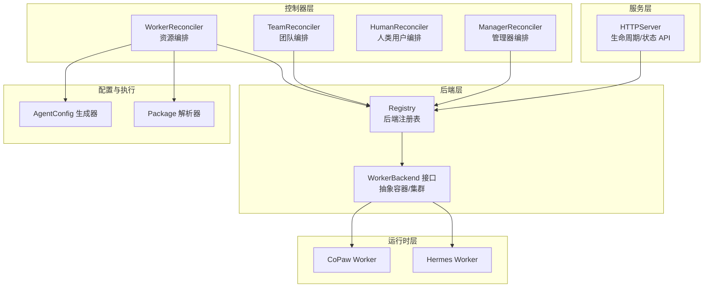
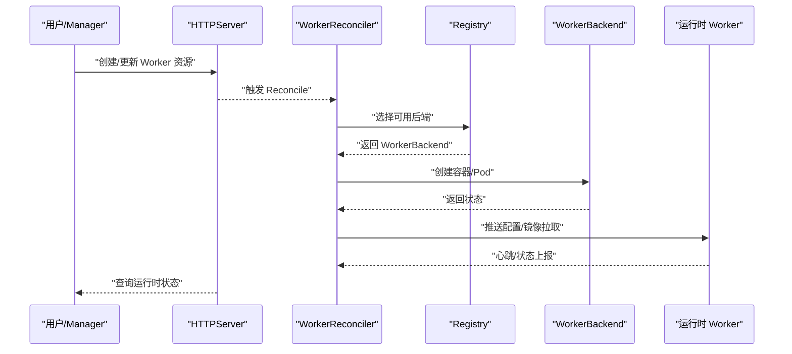
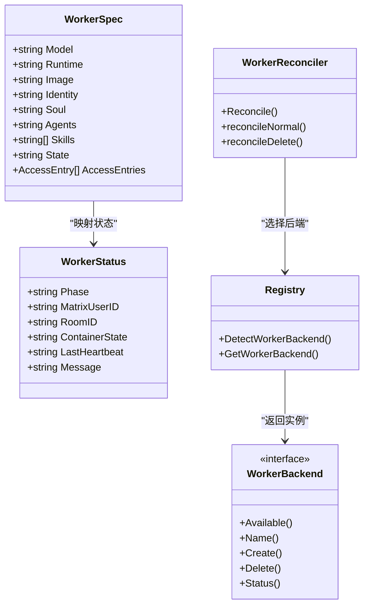
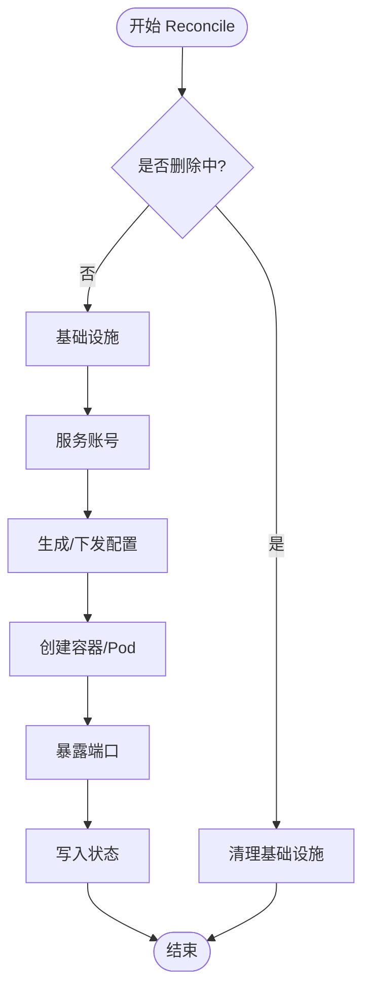
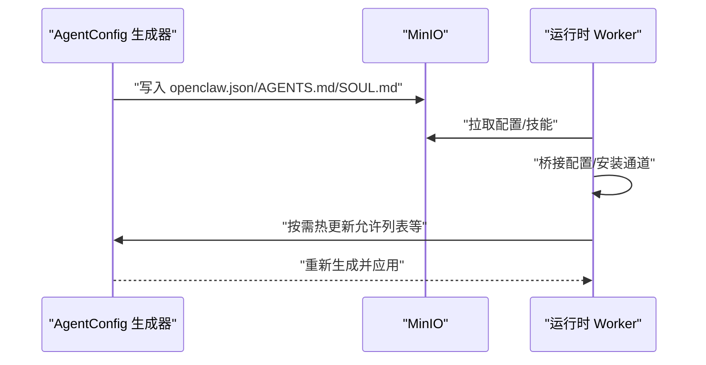
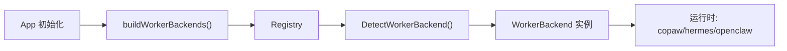
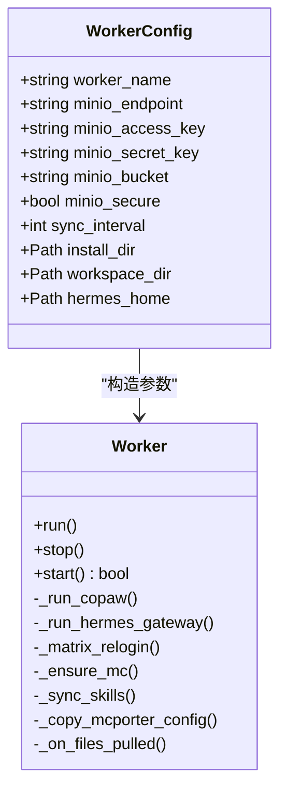
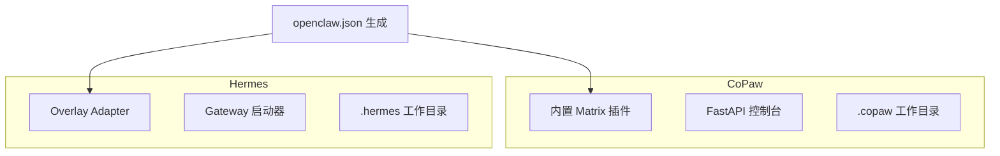
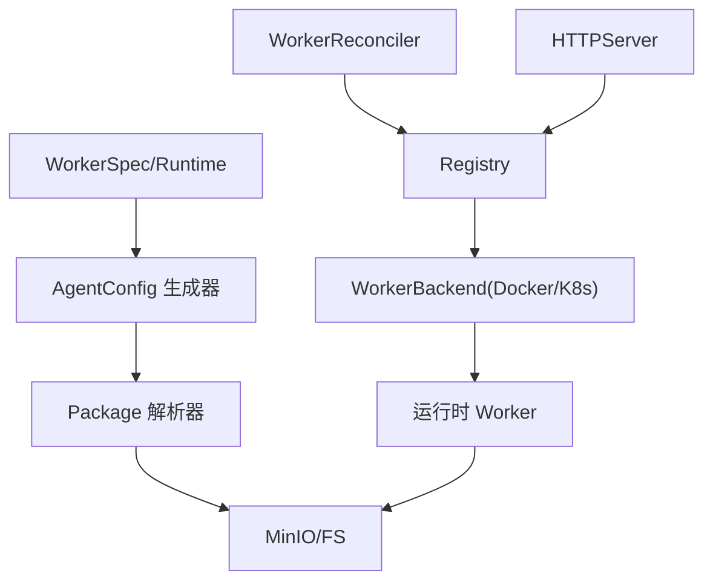

# 自定义运行时开发

<cite>
**本文档引用的文件**
- [main.go](file://hiclaw-controller/cmd/controller/main.go)
- [types.go](file://hiclaw-controller/api/v1beta1/types.go)
- [worker_controller.go](file://hiclaw-controller/internal/controller/worker_controller.go)
- [registry.go](file://hiclaw-controller/internal/backend/registry.go)
- [interface.go](file://hiclaw-controller/internal/backend/interface.go)
- [generator.go](file://hiclaw-controller/internal/agentconfig/generator.go)
- [package.go](file://hiclaw-controller/internal/executor/package.go)
- [app.go](file://hiclaw-controller/internal/app/app.go)
- [lifecycle_handler.go](file://hiclaw-controller/internal/server/lifecycle_handler.go)
- [worker.py](file://copaw/src/copaw_worker/worker.py)
- [config.py](file://copaw/src/copaw_worker/config.py)
- [cli.py](file://copaw/src/copaw_worker/cli.py)
- [worker.py](file://hermes/src/hermes_worker/worker.py)
- [config.py](file://hermes/src/hermes_worker/config.py)
- [cli.py](file://hermes/src/hermes_worker/cli.py)
</cite>

## 目录
1. [简介](#简介)
2. [项目结构](#项目结构)
3. [核心组件](#核心组件)
4. [架构总览](#架构总览)
5. [详细组件分析](#详细组件分析)
6. [依赖关系分析](#依赖关系分析)
7. [性能考虑](#性能考虑)
8. [故障排查指南](#故障排查指南)
9. [结论](#结论)
10. [附录](#附录)

## 简介
本指南面向希望在 HiClaw 中开发自定义 Worker 运行时的开发者。HiClaw 提供了统一的控制器与后端抽象，允许通过标准接口接入新的运行时（如 CoPaw、Hermes）。本文将系统讲解运行时接口规范、生命周期管理、消息处理机制、注册流程、开发与测试方法，并给出与现有运行时的对比与迁移建议。

## 项目结构
HiClaw 采用分层清晰的模块化设计：
- 控制器层：负责 Worker/Team/Manager 资源的编排与状态同步
- 后端层：抽象容器/集群后端，支持 Docker/Kubernetes
- 运行时层：具体 Worker 实现（CoPaw、Hermes 等）
- 配置生成层：根据 CR 与环境生成各运行时所需的配置文件
- 执行器层：包解析、部署与同步逻辑
- HTTP 服务层：对外提供生命周期与状态查询等 API

**图表来源**
- [worker_controller.go:30-55](file://hiclaw-controller/internal/controller/worker_controller.go#L30-L55)
- [registry.go:14-26](file://hiclaw-controller/internal/backend/registry.go#L14-L26)
- [interface.go:28-39](file://hiclaw-controller/internal/backend/interface.go#L28-L39)
- [generator.go:25-203](file://hiclaw-controller/internal/agentconfig/generator.go#L25-L203)
- [package.go:28-125](file://hiclaw-controller/internal/executor/package.go#L28-L125)
- [app.go:432-497](file://hiclaw-controller/internal/app/app.go#L432-L497)
- [lifecycle_handler.go:176-205](file://hiclaw-controller/internal/server/lifecycle_handler.go#L176-L205)

**章节来源**
- [main.go:16-36](file://hiclaw-controller/cmd/controller/main.go#L16-L36)
- [types.go:63-112](file://hiclaw-controller/api/v1beta1/types.go#L63-L112)
- [worker_controller.go:30-55](file://hiclaw-controller/internal/controller/worker_controller.go#L30-L55)

## 核心组件
- Worker 资源模型：定义运行时类型、镜像、期望状态、通道策略、权限等
- WorkerReconciler：协调 Worker 生命周期，调用后端创建/删除容器，更新状态
- Registry/WorkerBackend：后端注册与检测，支持 Docker/K8s
- AgentConfig 生成器：按运行时生成 openclaw.json、矩阵通道配置等
- Package 解析器：支持 file/http/https/nacos/oss 等包来源，标准化部署
- HTTP 服务：提供运行时状态查询与生命周期控制 API

**章节来源**
- [types.go:71-112](file://hiclaw-controller/api/v1beta1/types.go#L71-L112)
- [worker_controller.go:110-151](file://hiclaw-controller/internal/controller/worker_controller.go#L110-L151)
- [registry.go:23-57](file://hiclaw-controller/internal/backend/registry.go#L23-L57)
- [generator.go:25-203](file://hiclaw-controller/internal/agentconfig/generator.go#L25-L203)
- [package.go:28-125](file://hiclaw-controller/internal/executor/package.go#L28-L125)
- [lifecycle_handler.go:176-205](file://hiclaw-controller/internal/server/lifecycle_handler.go#L176-L205)

## 架构总览
下图展示了从资源变更到运行时启动的完整流程，以及运行时与控制器之间的交互：

**图表来源**
- [worker_controller.go:110-151](file://hiclaw-controller/internal/controller/worker_controller.go#L110-L151)
- [registry.go:28-57](file://hiclaw-controller/internal/backend/registry.go#L28-L57)
- [lifecycle_handler.go:176-205](file://hiclaw-controller/internal/server/lifecycle_handler.go#L176-L205)

## 详细组件分析

### 运行时接口规范
- 支持的运行时枚举：openclaw/copaw/hermes
- Worker 生命周期：Running/Sleeping/Stopped；控制器根据 DesiredState 协调后端
- 配置生成：控制器基于模板生成 openclaw.json、矩阵通道配置、模型列表等
- 包部署：支持 file/http/https/nacos/oss 等来源，标准化到 MinIO/FS

**图表来源**
- [types.go:71-140](file://hiclaw-controller/api/v1beta1/types.go#L71-L140)
- [worker_controller.go:30-55](file://hiclaw-controller/internal/controller/worker_controller.go#L30-L55)
- [registry.go:14-26](file://hiclaw-controller/internal/backend/registry.go#L14-L26)
- [interface.go:28-39](file://hiclaw-controller/internal/backend/interface.go#L28-L39)

**章节来源**
- [types.go:71-112](file://hiclaw-controller/api/v1beta1/types.go#L71-L112)
- [interface.go:28-39](file://hiclaw-controller/internal/backend/interface.go#L28-L39)

### 生命周期管理
- DesiredState 决策：控制器读取 WorkerSpec.State 或默认 "Running"
- Reconcile 流程：基础设施→服务账号→配置→容器→暴露端口→应用状态
- 删除流程：清理基础设施，回滚旧配置（兼容模式）

**图表来源**
- [worker_controller.go:110-151](file://hiclaw-controller/internal/controller/worker_controller.go#L110-L151)

**章节来源**
- [worker_controller.go:110-151](file://hiclaw-controller/internal/controller/worker_controller.go#L110-L151)

### 消息处理机制
- 矩阵通道配置：控制器生成 openclaw.json 的 channels.matrix 字段，含 homeserver、token、策略等
- 允许列表：默认允许 Manager/Admin；团队场景允许 Leader/Admin
- 心跳与 E2EE：运行时在重启后刷新 Matrix 设备 ID，确保端到端加密连续性

**图表来源**
- [generator.go:25-203](file://hiclaw-controller/internal/agentconfig/generator.go#L25-L203)
- [worker.py:136-177](file://copaw/src/copaw_worker/worker.py#L136-L177)
- [worker.py:136-165](file://hermes/src/hermes_worker/worker.py#L136-L165)

**章节来源**
- [generator.go:205-265](file://hiclaw-controller/internal/agentconfig/generator.go#L205-L265)
- [worker.py:210-287](file://copaw/src/copaw_worker/worker.py#L210-L287)
- [worker.py:197-277](file://hermes/src/hermes_worker/worker.py#L197-L277)

### 运行时注册机制
- 后端注册：应用启动时构建 WorkerBackend 列表（Docker/K8s），Registry 维护并检测可用后端
- 运行时选择：WorkerSpec.runtime 为空时由后端解析默认值；ValidRuntime 校验运行时名称
- HTTP API：/api/v1/workers/{name}/status 聚合 CR 与后端状态

**图表来源**
- [app.go:687-715](file://hiclaw-controller/internal/app/app.go#L687-L715)
- [registry.go:28-57](file://hiclaw-controller/internal/backend/registry.go#L28-L57)
- [interface.go:28-39](file://hiclaw-controller/internal/backend/interface.go#L28-L39)
- [lifecycle_handler.go:176-205](file://hiclaw-controller/internal/server/lifecycle_handler.go#L176-L205)

**章节来源**
- [app.go:687-715](file://hiclaw-controller/internal/app/app.go#L687-L715)
- [registry.go:28-57](file://hiclaw-controller/internal/backend/registry.go#L28-L57)
- [lifecycle_handler.go:176-205](file://hiclaw-controller/internal/server/lifecycle_handler.go#L176-L205)

### 开发指南：实现新的 Worker 运行时

#### 1) 项目结构与依赖
- 运行时入口：提供 CLI 与 Worker 类，负责启动、停止、配置同步
- 配置对象：封装 MinIO 端点、密钥、工作目录、同步间隔等参数
- 同步与桥接：首次全量镜像拉取，后续增量同步；将 openclaw.json 桥接到运行时本地配置

**图表来源**
- [config.py:7-29](file://copaw/src/copaw_worker/config.py#L7-L29)
- [config.py:7-40](file://hermes/src/hermes_worker/config.py#L7-L40)
- [worker.py:32-177](file://copaw/src/copaw_worker/worker.py#L32-L177)
- [worker.py:44-165](file://hermes/src/hermes_worker/worker.py#L44-L165)

**章节来源**
- [config.py:7-29](file://copaw/src/copaw_worker/config.py#L7-L29)
- [config.py:7-40](file://hermes/src/hermes_worker/config.py#L7-L40)
- [cli.py:21-69](file://copaw/src/copaw_worker/cli.py#L21-L69)
- [cli.py:21-72](file://hermes/src/hermes_worker/cli.py#L21-L72)

#### 2) 核心接口与生命周期
- 必须实现：
  - run()/stop()：异步生命周期管理
  - start()：初始化流程（下载 mc、镜像拉取、配置桥接、技能同步、后台同步任务）
  - 文件变更回调：_on_files_pulled，用于按需重桥接或热更新
- 生命周期阶段：
  - 启动：start() 成功后进入运行态
  - 停止：取消任务、释放资源
  - 同步：后台循环拉取/推送，保持本地与 MinIO 一致

**章节来源**
- [worker.py:45-177](file://copaw/src/copaw_worker/worker.py#L45-L177)
- [worker.py:59-165](file://hermes/src/hermes_worker/worker.py#L59-L165)

#### 3) 配置生成与部署
- 配置生成：根据 WorkerSpec 生成 openclaw.json，包含网关、模型、通道、插件、会话等
- 包部署：支持多来源，标准化到 MinIO/FS；写入 SOUL/AGENTS/技能等
- 内联覆盖：运行时特定的 IDENTITY/SOUL/AGENTS 合并策略

**章节来源**
- [generator.go:25-203](file://hiclaw-controller/internal/agentconfig/generator.go#L25-L203)
- [package.go:127-256](file://hiclaw-controller/internal/executor/package.go#L127-L256)
- [package.go:330-378](file://hiclaw-controller/internal/executor/package.go#L330-L378)

#### 4) 构建与运行
- Dockerfile：将运行时可执行文件与依赖打包
- 入口脚本：设置环境变量（MinIO 端点、密钥、桶名、同步间隔等）
- 容器健康检查：通过 HTTP/WS 端口探测，配合控制器状态判断 Ready

**章节来源**
- [copaw/Dockerfile](file://copaw/Dockerfile)
- [hermes/Dockerfile](file://hermes/Dockerfile)
- [copaw/scripts](file://copaw/scripts)
- [hermes/scripts](file://hermes/scripts)

### 与现有运行时（CoPaw、Hermes）的对比与迁移

#### 对比维度
- 配置生成方式：两者均使用 openclaw.json，但字段细节与默认值不同
- 通道实现：CoPaw 使用内置 Matrix 插件；Hermes 通过 overlay adapter 注入
- 技能同步：均支持 MinIO 技能镜像与去重
- 端到端加密：均在重启后刷新设备 ID，保证 E2EE 连续性

**图表来源**
- [worker.py:183-205](file://copaw/src/copaw_worker/worker.py#L183-L205)
- [worker.py:171-191](file://hermes/src/hermes_worker/worker.py#L171-L191)

**章节来源**
- [worker.py:183-205](file://copaw/src/copaw_worker/worker.py#L183-L205)
- [worker.py:171-191](file://hermes/src/hermes_worker/worker.py#L171-L191)

#### 迁移步骤
- 保留 openclaw.json 结构：确保字段与控制器生成一致
- 替换通道适配：将 Matrix 插件替换为运行时 overlay
- 保持同步语义：维持 MinIO 镜像拉取与增量同步
- 适配内联配置：遵循写入顺序与覆盖规则（IDENTITY 合并到 SOUL 等）

**章节来源**
- [generator.go:25-203](file://hiclaw-controller/internal/agentconfig/generator.go#L25-L203)
- [package.go:330-378](file://hiclaw-controller/internal/executor/package.go#L330-L378)

## 依赖关系分析

**图表来源**
- [types.go:71-112](file://hiclaw-controller/api/v1beta1/types.go#L71-L112)
- [generator.go:25-203](file://hiclaw-controller/internal/agentconfig/generator.go#L25-L203)
- [package.go:28-125](file://hiclaw-controller/internal/executor/package.go#L28-L125)
- [worker_controller.go:110-151](file://hiclaw-controller/internal/controller/worker_controller.go#L110-L151)
- [registry.go:28-57](file://hiclaw-controller/internal/backend/registry.go#L28-L57)

**章节来源**
- [types.go:71-112](file://hiclaw-controller/api/v1beta1/types.go#L71-L112)
- [worker_controller.go:110-151](file://hiclaw-controller/internal/controller/worker_controller.go#L110-L151)
- [registry.go:28-57](file://hiclaw-controller/internal/backend/registry.go#L28-L57)

## 性能考虑
- 同步频率：合理设置 sync_interval，避免频繁拉取造成带宽与 CPU 压力
- 技能去重：避免重复安装内置与自定义技能，减少磁盘与加载开销
- 端到端加密：设备 ID 刷新仅在必要时进行，降低 Matrix 登录开销
- 后端选择：优先选择可用后端，避免无效尝试导致的延迟

## 故障排查指南
- 状态查询：通过 /api/v1/workers/{name}/status 获取控制器与后端聚合状态
- 错误分类：ErrNotFound/ErrConflict 映射到 404/409，其他 500
- 常见问题：
  - 网络私有地址访问：确保允许私有网络访问（控制器已注入相关标志）
  - 邀请接受策略：自动接受邀请以保证房间加入
  - 端口绑定：控制器固定网关端口为 18799，确保容器映射正确

**章节来源**
- [lifecycle_handler.go:176-205](file://hiclaw-controller/internal/server/lifecycle_handler.go#L176-L205)
- [lifecycle_handler.go:225-234](file://hiclaw-controller/internal/server/lifecycle_handler.go#L225-L234)
- [generator.go:238-262](file://hiclaw-controller/internal/agentconfig/generator.go#L238-L262)

## 结论
HiClaw 通过统一的控制器、后端抽象与配置生成机制，为新增运行时提供了清晰的扩展路径。开发者只需实现运行时 Worker 的生命周期与同步逻辑，并遵循配置生成与部署规范，即可无缝接入现有编排体系。迁移现有运行时时，重点在于通道适配与配置字段对齐，同时保持同步与 E2EE 行为一致。

## 附录

### 运行时开发清单
- 实现 Worker.run()/start()/stop() 与文件变更回调
- 提供 CLI 入口与 WorkerConfig 参数解析
- 编写 Dockerfile 与启动脚本
- 在控制器中注册后端（如需）
- 编写最小化测试用例（状态、同步、配置变更）

### 测试与验证建议
- 单元测试：覆盖 WorkerConfig、同步循环、配置桥接
- 集成测试：通过 HTTP API 验证生命周期与状态
- 端到端测试：创建 Worker 资源，观察控制器编排与后端状态变化