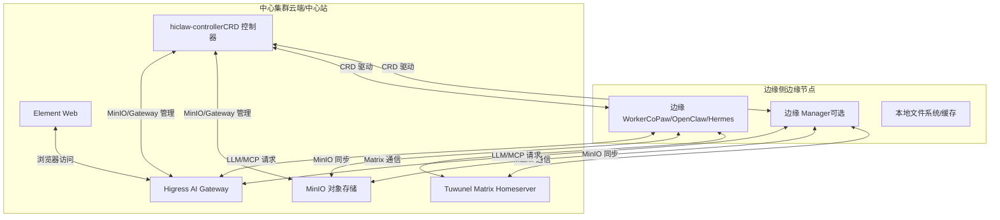
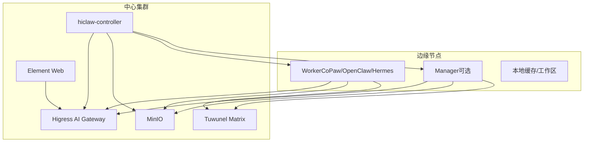
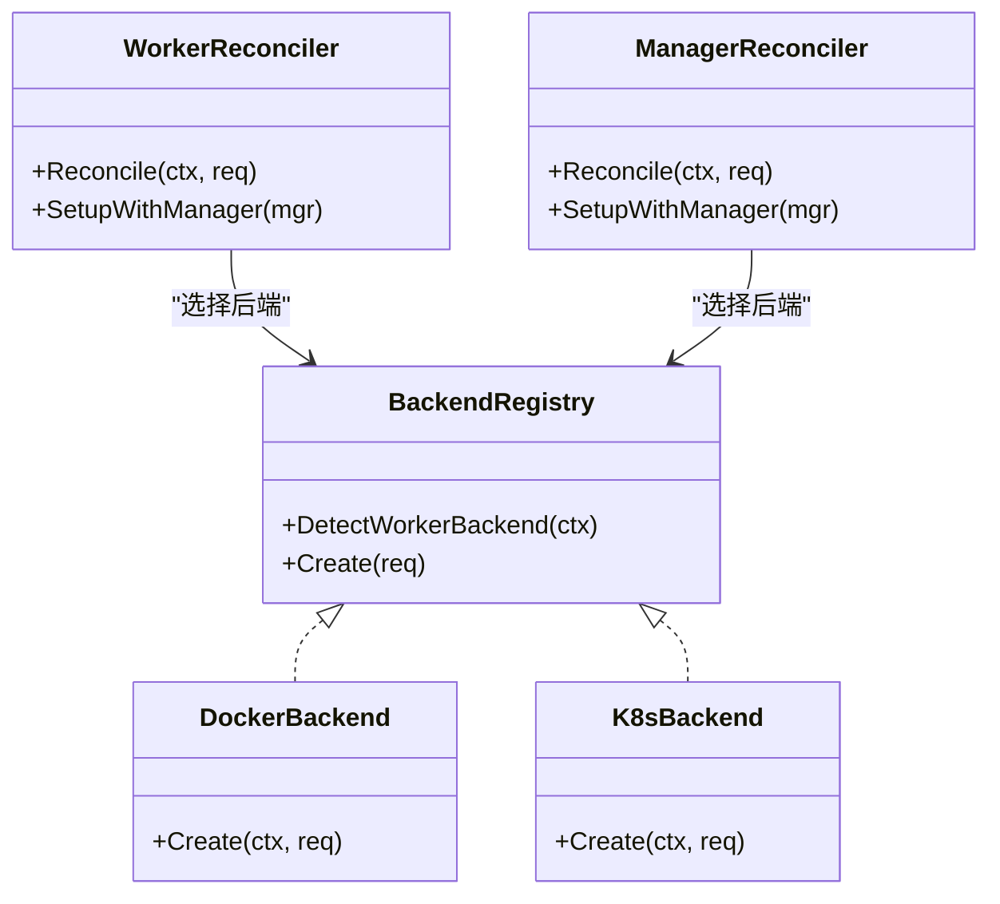
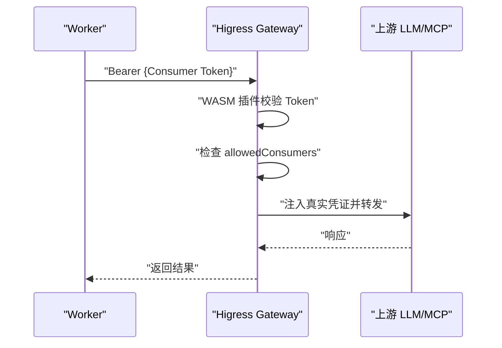
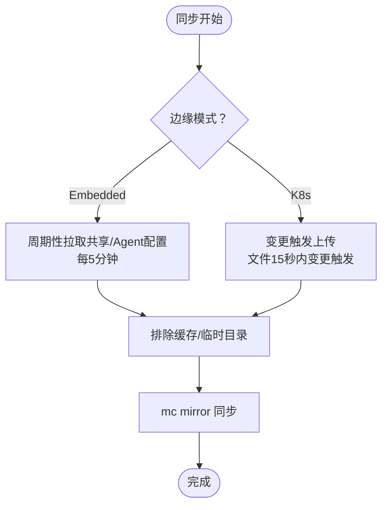
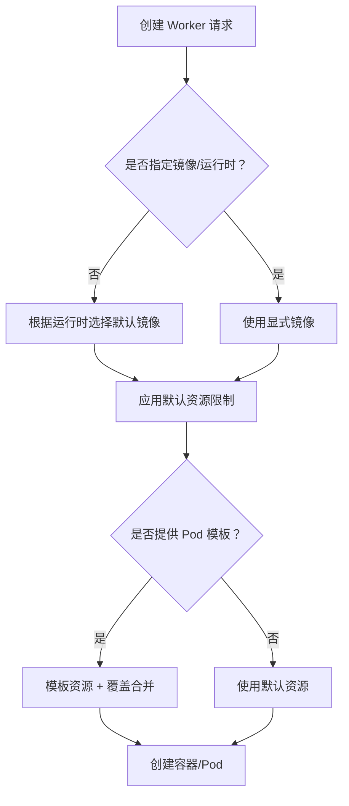
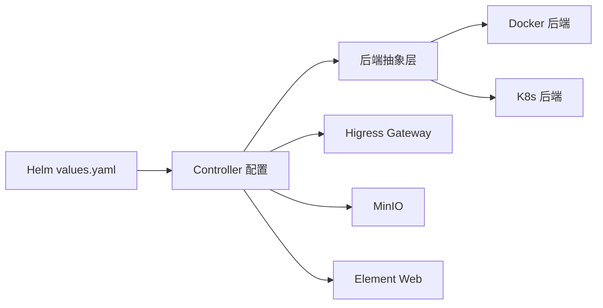

# 边缘计算支持

<cite>
**本文引用的文件**
- [README.md](file://README.md)
- [docs/zh-cn/k8s-native-agent-orch.md](file://docs/zh-cn/k8s-native-agent-orch.md)
- [docs/k8s-native-agent-orch.md](file://docs/k8s-native-agent-orch.md)
- [docs/manager-guide.md](file://docs/manager-guide.md)
- [blog/zh-cn/hiclaw-1.0.4-release.md](file://blog/zh-cn/hiclaw-1.0.4-release.md)
- [blog/hiclaw-1.0.6-release.md](file://blog/hiclaw-1.0.6-release.md)
- [copaw/src/copaw_worker/config.py](file://copaw/src/copaw_worker/config.py)
- [hermes/src/hermes_worker/config.py](file://hermes/src/hermes_worker/config.py)
- [hiclaw-controller/internal/backend/interface.go](file://hiclaw-controller/internal/backend/interface.go)
- [hiclaw-controller/internal/backend/docker.go](file://hiclaw-controller/internal/backend/docker.go)
- [hiclaw-controller/internal/backend/kubernetes.go](file://hiclaw-controller/internal/backend/kubernetes.go)
- [hiclaw-controller/internal/backend/agent_pod_template.go](file://hiclaw-controller/internal/backend/agent_pod_template.go)
- [hiclaw-controller/internal/controller/worker_controller.go](file://hiclaw-controller/internal/controller/worker_controller.go)
- [hiclaw-controller/internal/controller/manager_controller.go](file://hiclaw-controller/internal/controller/manager_controller.go)
- [hiclaw-controller/internal/proxy/security_test.go](file://hiclaw-controller/internal/proxy/security_test.go)
- [hiclaw-controller/internal/credprovider/types.go](file://hiclaw-controller/internal/credprovider/types.go)
- [helm/hiclaw/values.yaml](file://helm/hiclaw/values.yaml)
- [helm/hiclaw/Chart.yaml](file://helm/hiclaw/Chart.yaml)
- [helm/hiclaw/templates/element-web/deployment.yaml](file://helm/hiclaw/templates/element-web/deployment.yaml)
- [manager/scripts/init/start-manager-agent.sh](file://manager/scripts/init/start-manager-agent.sh)
</cite>

## 目录
1. [简介](#简介)
2. [项目结构](#项目结构)
3. [核心组件](#核心组件)
4. [架构总览](#架构总览)
5. [详细组件分析](#详细组件分析)
6. [依赖分析](#依赖分析)
7. [性能考虑](#性能考虑)
8. [故障排查指南](#故障排查指南)
9. [结论](#结论)
10. [附录](#附录)

## 简介
本文件面向在边缘侧部署与运行 HiClaw 的工程团队，提供边缘计算支持文档。内容涵盖：
- 边缘部署的架构设计与控制面（控制器）能力
- 边缘节点管理、资源调度与网络优化
- 轻量化容器镜像与资源限制、启动优化
- 边缘节点的本地存储、缓存策略与离线处理
- 边缘与中心集群的数据同步机制（增量更新、冲突解决、带宽优化）
- 不同边缘场景的部署示例与最佳实践
- 边缘环境下的监控与运维（远程诊断、自动修复、性能调优）
- 边缘计算的安全与合规要求

## 项目结构
HiClaw 采用“Manager-Workers”架构，并提供 Kubernetes 原生的控制平面（CRD + Controller），支持在边缘侧以轻量容器运行 Worker，同时通过 Higress AI Gateway、Tuwunel Matrix Homeserver、MinIO 对象存储等组件实现安全、可观测、可协作的多 Agent 系统。

图表来源
- [docs/zh-cn/k8s-native-agent-orch.md](file://docs/zh-cn/k8s-native-agent-orch.md)
- [docs/k8s-native-agent-orch.md](file://docs/k8s-native-agent-orch.md)
- [README.md](file://README.md)

章节来源
- [README.md](file://README.md)
- [docs/zh-cn/k8s-native-agent-orch.md](file://docs/zh-cn/k8s-native-agent-orch.md)
- [docs/k8s-native-agent-orch.md](file://docs/k8s-native-agent-orch.md)

## 核心组件
- 控制器（hiclaw-controller）：负责 Worker/Team/Manager/Human 等资源的声明式编排与持续收敛，支持 Docker 与 Kubernetes 两种后端。
- 网关（Higress AI Gateway）：统一 LLM/MCP 请求代理与消费者鉴权，保障凭证不下发至 Worker。
- 矩阵（Tuwunel + Element Web）：去中心化 IM 协议，支持人类旁观与介入。
- 存储（MinIO）：对象存储，Worker 无状态，配置与共享状态均来自 MinIO。
- Worker 运行时：OpenClaw、CoPaw（轻量）、Hermes（自主编码）等，满足不同任务场景。

章节来源
- [docs/zh-cn/k8s-native-agent-orch.md](file://docs/zh-cn/k8s-native-agent-orch.md)
- [docs/k8s-native-agent-orch.md](file://docs/k8s-native-agent-orch.md)
- [README.md](file://README.md)

## 架构总览
下图展示边缘侧与中心集群的交互关系，强调“凭证不落地、通信可审计、状态可共享”的设计原则。

图表来源
- [docs/zh-cn/k8s-native-agent-orch.md](file://docs/zh-cn/k8s-native-agent-orch.md)
- [docs/k8s-native-agent-orch.md](file://docs/k8s-native-agent-orch.md)
- [README.md](file://README.md)

## 详细组件分析

### 控制器与资源编排（边缘侧）
- 控制器通过 CRD 驱动 Worker/Team/Manager/Human 的生命周期，支持两种后端：
  - Docker 后端：适用于边缘节点本地容器运行
  - Kubernetes 后端：适用于云上集群
- 控制器负责基础设施（Matrix 账号、房间、MinIO 用户与 Bucket、Gateway Consumer 与路由）与配置部署（openclaw.json、SOUL/AGENTS、技能推送）。
- 资源请求/限制默认值与模板合并策略由后端抽象层统一处理，确保边缘侧资源可控。

图表来源
- [hiclaw-controller/internal/controller/worker_controller.go](file://hiclaw-controller/internal/controller/worker_controller.go)
- [hiclaw-controller/internal/controller/manager_controller.go](file://hiclaw-controller/internal/controller/manager_controller.go)
- [hiclaw-controller/internal/backend/interface.go](file://hiclaw-controller/internal/backend/interface.go)
- [hiclaw-controller/internal/backend/docker.go](file://hiclaw-controller/internal/backend/docker.go)

章节来源
- [hiclaw-controller/internal/controller/worker_controller.go](file://hiclaw-controller/internal/controller/worker_controller.go)
- [hiclaw-controller/internal/controller/manager_controller.go](file://hiclaw-controller/internal/controller/manager_controller.go)
- [hiclaw-controller/internal/backend/interface.go](file://hiclaw-controller/internal/backend/interface.go)
- [hiclaw-controller/internal/backend/docker.go](file://hiclaw-controller/internal/backend/docker.go)

### 网络与安全（边缘与中心）
- 凭证不落地：Worker 仅持有 Consumer Token，真实密钥由 Higress Gateway 注入并代理请求。
- MCP Server 集中托管：通过 Gateway 对外暴露标准 MCP 端点，按 Consumer 授权访问。
- 边缘侧网络策略：容器能力白名单、网络模式限制、桥接网络允许等安全校验，避免高危能力暴露。

图表来源
- [docs/zh-cn/k8s-native-agent-orch.md](file://docs/zh-cn/k8s-native-agent-orch.md)
- [blog/hiclaw-1.0.6-release.md](file://blog/hiclaw-1.0.6-release.md)
- [hiclaw-controller/internal/proxy/security_test.go](file://hiclaw-controller/internal/proxy/security_test.go)

章节来源
- [docs/zh-cn/k8s-native-agent-orch.md](file://docs/zh-cn/k8s-native-agent-orch.md)
- [blog/hiclaw-1.0.6-release.md](file://blog/hiclaw-1.0.6-release.md)
- [hiclaw-controller/internal/proxy/security_test.go](file://hiclaw-controller/internal/proxy/security_test.go)

### 存储与同步（边缘与中心）
- MinIO 作为共享存储，Worker 无状态，配置与共享状态均来自 MinIO。
- 边缘侧 Manager/Worker 通过 mc mirror 实现本地与 MinIO 的增量同步（周期拉取与变更触发上传）。
- 同步策略包含时间窗口与排除规则，减少带宽与 IO 压力。

图表来源
- [manager/scripts/init/start-manager-agent.sh](file://manager/scripts/init/start-manager-agent.sh)
- [docs/zh-cn/k8s-native-agent-orch.md](file://docs/zh-cn/k8s-native-agent-orch.md)

章节来源
- [manager/scripts/init/start-manager-agent.sh](file://manager/scripts/init/start-manager-agent.sh)
- [docs/zh-cn/k8s-native-agent-orch.md](file://docs/zh-cn/k8s-native-agent-orch.md)

### 资源调度与轻量化运行
- 默认资源请求/限制：Worker 默认 CPU/内存请求与限制可按 Helm values.yaml 调整；Kubernetes 后端支持 Pod 模板与覆盖合并。
- 轻量运行时：CoPaw Worker 基于 Python slim 镜像，内存占用显著降低，适合边缘侧大量并发 Worker。
- 容器安全基线：拒绝危险 Linux 能力与可疑容器命名，仅允许桥接网络与安全能力。

图表来源
- [hiclaw-controller/internal/backend/docker.go](file://hiclaw-controller/internal/backend/docker.go)
- [hiclaw-controller/internal/backend/kubernetes.go](file://hiclaw-controller/internal/backend/kubernetes.go)
- [hiclaw-controller/internal/backend/agent_pod_template.go](file://hiclaw-controller/internal/backend/agent_pod_template.go)
- [helm/hiclaw/values.yaml](file://helm/hiclaw/values.yaml)

章节来源
- [hiclaw-controller/internal/backend/docker.go](file://hiclaw-controller/internal/backend/docker.go)
- [hiclaw-controller/internal/backend/kubernetes.go](file://hiclaw-controller/internal/backend/kubernetes.go)
- [hiclaw-controller/internal/backend/agent_pod_template.go](file://hiclaw-controller/internal/backend/agent_pod_template.go)
- [helm/hiclaw/values.yaml](file://helm/hiclaw/values.yaml)

### 边缘部署指南（不同场景）
- 场景一：边缘节点仅运行 Worker（CoPaw）
  - 使用 CoPaw Worker（Python slim 镜像），内存占用低，适合大量并发
  - 通过 Helm values.yaml 调整 worker.resources 与 runtime
- 场景二：边缘节点运行 Manager + Worker
  - Manager 作为协调者，Worker 专注任务执行
  - 通过 CRD 驱动 Manager/Worker 生命周期，确保状态与配置来自 MinIO
- 场景三：混合模式（部分 Worker 在边缘，部分在中心）
  - 通过不同后端（Docker/K8s）与资源限制区分边缘与中心 Worker
  - 使用 MCP Server 与 Gateway 统一访问外部服务，避免凭证泄露

章节来源
- [blog/zh-cn/hiclaw-1.0.4-release.md](file://blog/zh-cn/hiclaw-1.0.4-release.md)
- [docs/zh-cn/k8s-native-agent-orch.md](file://docs/zh-cn/k8s-native-agent-orch.md)
- [helm/hiclaw/values.yaml](file://helm/hiclaw/values.yaml)

### 监控与运维（边缘）
- 可观测性：通过 Element Web 与 Matrix 房间实现人类旁观与介入；Higress 控制台支持 MCP 工具管理与权限动态调整。
- 远程诊断：Manager/Worker 日志与调试工具，支持导出调试日志并与代码库交叉分析。
- 自动修复：控制器持续收敛，异常状态自动重试与回滚；容器健康探针与资源限制保障稳定性。
- 性能调优：合理设置资源请求/限制、同步间隔、缓存目录排除，平衡延迟与带宽。

章节来源
- [docs/manager-guide.md](file://docs/manager-guide.md)
- [README.md](file://README.md)
- [helm/hiclaw/templates/element-web/deployment.yaml](file://helm/hiclaw/templates/element-web/deployment.yaml)

### 安全与合规
- 凭证隔离：Worker 仅持有 Consumer Token，真实凭证由 Gateway 注入并代理请求
- 细粒度授权：基于 allowedConsumers 的消费者授权，支持动态撤销
- MCP Server 集中管理：统一 MCP 端点与权限控制，避免凭证分散
- 容器安全基线：拒绝高危 Linux 能力，仅允许桥接网络与安全能力
- 合规建议：最小权限原则、定期轮换 Consumer Token、审计日志留存、网络策略与访问控制

章节来源
- [docs/zh-cn/k8s-native-agent-orch.md](file://docs/zh-cn/k8s-native-agent-orch.md)
- [blog/hiclaw-1.0.6-release.md](file://blog/hiclaw-1.0.6-release.md)
- [hiclaw-controller/internal/proxy/security_test.go](file://hiclaw-controller/internal/proxy/security_test.go)
- [hiclaw-controller/internal/credprovider/types.go](file://hiclaw-controller/internal/credprovider/types.go)

## 依赖分析
- 控制器依赖后端抽象层（Docker/K8s），通过统一接口创建与管理 Worker/Manager
- 网关与存储通过 Controller 管理 Consumer 与 Bucket，Worker 仅通过 Gateway 访问外部服务
- Helm Chart 定义了默认镜像、资源、存储与网关参数，便于边缘侧快速部署

图表来源
- [helm/hiclaw/values.yaml](file://helm/hiclaw/values.yaml)
- [helm/hiclaw/Chart.yaml](file://helm/hiclaw/Chart.yaml)
- [hiclaw-controller/internal/backend/interface.go](file://hiclaw-controller/internal/backend/interface.go)

章节来源
- [helm/hiclaw/values.yaml](file://helm/hiclaw/values.yaml)
- [helm/hiclaw/Chart.yaml](file://helm/hiclaw/Chart.yaml)
- [hiclaw-controller/internal/backend/interface.go](file://hiclaw-controller/internal/backend/interface.go)

## 性能考虑
- 资源限制：根据任务类型选择合适运行时（CoPaw 更轻量），并按 Helm values.yaml 调整 CPU/内存请求与限制
- 同步策略：边缘侧使用增量同步与变更触发上传，减少带宽与 IO 压力
- 网络代理：通过 Higress 统一路由与限流，避免直连外部服务带来的不稳定
- 缓存策略：合理排除缓存与临时目录，避免不必要的同步与磁盘占用

## 故障排查指南
- 导出调试日志：使用调试脚本导出 Matrix 消息与 Agent 会话日志，辅助定位问题
- 查看控制器状态：确认 Worker/Manager CR 的状态与消息字段，定位失败原因
- 检查容器健康：关注 Pod 生命周期事件与探针状态
- 网络与凭证：确认 Consumer Token 是否在 allowedConsumers 列表，MCP 工具权限是否正确

章节来源
- [README.md](file://README.md)
- [hiclaw-controller/internal/controller/worker_controller.go](file://hiclaw-controller/internal/controller/worker_controller.go)
- [hiclaw-controller/internal/controller/manager_controller.go](file://hiclaw-controller/internal/controller/manager_controller.go)

## 结论
HiClaw 在边缘侧提供了可扩展、安全、可观测的多 Agent 协作平台。通过控制器抽象、Higress 网关与 MinIO 存储，边缘节点可以以轻量容器运行 Worker，实现低延迟、低带宽、高安全的协同作业。配合合理的资源调度、同步策略与监控运维，可在复杂边缘环境中稳定运行。

## 附录
- 边缘部署清单
  - 选择运行时：CoPaw（轻量）或 OpenClaw/Hermes（功能更全）
  - 设置资源：参考 Helm values.yaml 的 worker.resources
  - 启用同步：使用 mc mirror 的周期拉取与变更触发上传
  - 安全加固：启用 Consumer Token 与 allowedConsumers，拒绝高危容器能力
- 参考文档
  - Kubernetes 原生多 Agent 协作编排：[docs/zh-cn/k8s-native-agent-orch.md](file://docs/zh-cn/k8s-native-agent-orch.md)
  - 项目快速入门与架构：[README.md](file://README.md)