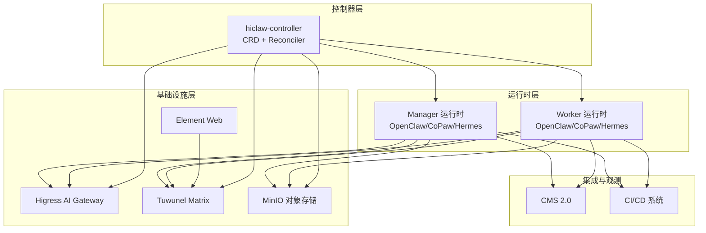
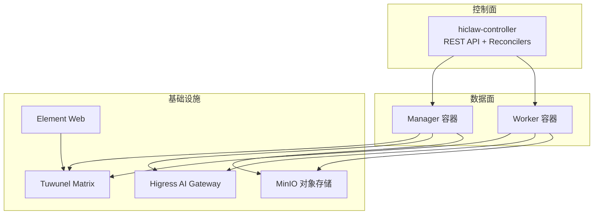
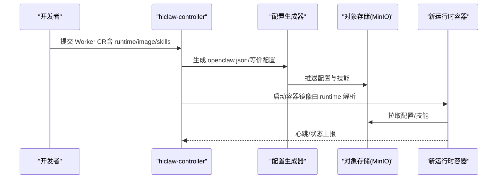
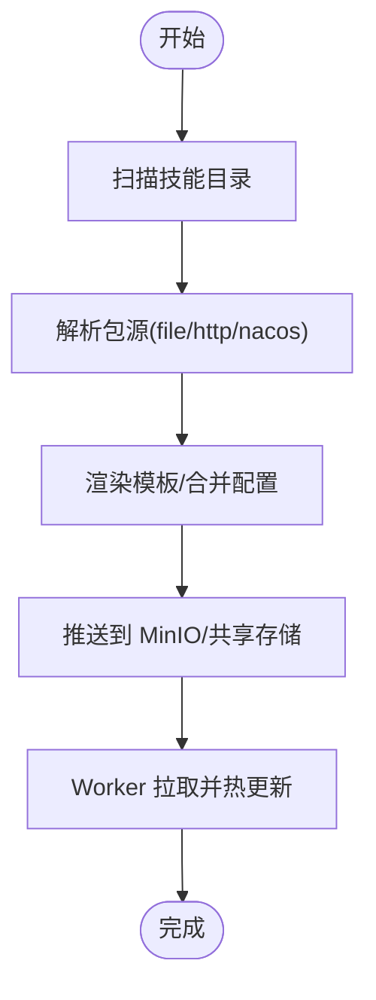
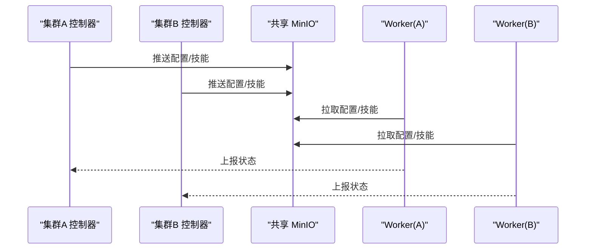
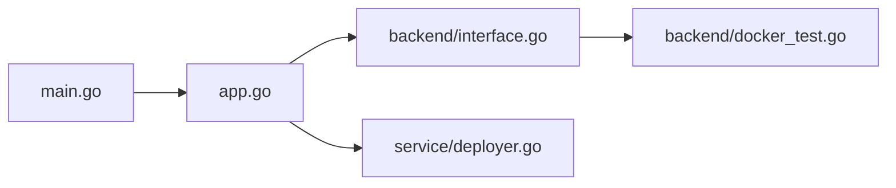

# 高级主题

<cite>
**本文引用的文件**
- [README.md](file://README.md)
- [docs/architecture.md](file://docs/architecture.md)
- [docs/k8s-native-agent-orch.md](file://docs/k8s-native-agent-orch.md)
- [docs/cms-integration.md](file://docs/cms-integration.md)
- [hiclaw-controller/cmd/controller/main.go](file://hiclaw-controller/cmd/controller/main.go)
- [hiclaw-controller/internal/app/app.go](file://hiclaw-controller/internal/app/app.go)
- [hiclaw-controller/api/v1beta1/types.go](file://hiclaw-controller/api/v1beta1/types.go)
- [hiclaw-controller/internal/backend/interface.go](file://hiclaw-controller/internal/backend/interface.go)
- [hiclaw-controller/internal/backend/docker_test.go](file://hiclaw-controller/internal/backend/docker_test.go)
- [hiclaw-controller/internal/service/deployer.go](file://hiclaw-controller/internal/service/deployer.go)
- [copaw/README.md](file://copaw/README.md)
- [hermes/README.md](file://hermes/README.md)
- [manager/README.md](file://manager/README.md)
- [worker/README.md](file://worker/README.md)
- [copaw/AGENTS.md](file://copaw/AGENTS.md)
- [hiclaw-controller/internal/proxy/security.go](file://hiclaw-controller/internal/proxy/security.go)
- [hiclaw-controller/internal/proxy/security_test.go](file://hiclaw-controller/internal/proxy/security_test.go)
- [changelog/v1.0.9.md](file://changelog/v1.0.9.md)
</cite>

## 目录
1. [简介](#简介)
2. [项目结构](#项目结构)
3. [核心组件](#核心组件)
4. [架构总览](#架构总览)
5. [详细组件分析](#详细组件分析)
6. [依赖分析](#依赖分析)
7. [性能考虑](#性能考虑)
8. [故障排查指南](#故障排查指南)
9. [结论](#结论)
10. [附录](#附录)

## 简介
本高级主题文档面向需要在企业级环境中深度定制与扩展 HiClaw 的工程与平台团队，覆盖以下重点方向：
- 自定义运行时的开发方法：运行时接口规范、集成步骤与测试验证
- 插件/技能系统的扩展机制：开发、注册与管理
- 多集群部署策略与跨集群协调、数据同步
- 边缘计算支持的配置与优化
- 安全加固高级技巧：网络隔离、访问控制、审计日志
- 与外部系统集成：CMS、CI/CD 等
- 大规模部署的架构设计与性能调优建议

HiClaw 采用“Manager-Workers 架构”，以 Kubernetes 原生的 CRD 与控制器作为编排平面，结合 Higress AI Gateway、Tuwunel Matrix、MinIO 共享存储与 Element Web 客户端，形成“声明式资源 + 即时协作 + 可审计”的多智能体协同操作系统。

章节来源
- [README.md: 13-404:13-404](file://README.md#L13-L404)

## 项目结构
HiClaw 的高级主题涉及多个子系统：
- 控制器层：hiclaw-controller（Go + controller-runtime），负责 Worker/Team/Manager/Human 四类 CR 的编排与生命周期管理
- 运行时层：Manager 与 Worker 支持多种运行时（OpenClaw、CoPaw、Hermes），通过统一的配置桥接与共享存储实现跨运行时一致性
- 基础设施层：Higress AI Gateway、Tuwunel Matrix、MinIO、Element Web
- 集成与观测：CMS 2.0、CI/CD 工具链

图示来源
- [docs/architecture.md: 19-82:19-82](file://docs/architecture.md#L19-L82)
- [docs/k8s-native-agent-orch.md: 464-477:464-477](file://docs/k8s-native-agent-orch.md#L464-L477)

章节来源
- [docs/architecture.md: 1-235:1-235](file://docs/architecture.md#L1-L235)
- [docs/k8s-native-agent-orch.md: 1-524:1-524](file://docs/k8s-native-agent-orch.md#L1-L524)

## 核心组件
- 控制器与应用容器
  - 控制器入口与生命周期管理：[hiclaw-controller/cmd/controller/main.go:1-37](file://hiclaw-controller/cmd/controller/main.go#L1-L37)
  - 应用装配与依赖注入：[hiclaw-controller/internal/app/app.go:81-175](file://hiclaw-controller/internal/app/app.go#L81-L175)
- 声明式资源与状态机
  - CRD 类型定义（Worker/Team/Manager/Human）：[hiclaw-controller/api/v1beta1/types.go:63-448](file://hiclaw-controller/api/v1beta1/types.go#L63-L448)
- 运行时与后端抽象
  - 运行时枚举与校验：[hiclaw-controller/internal/backend/interface.go:28-39](file://hiclaw-controller/internal/backend/interface.go#L28-L39)
  - Docker/K8s 后端选择与镜像解析测试：[hiclaw-controller/internal/backend/docker_test.go:431-454](file://hiclaw-controller/internal/backend/docker_test.go#L431-L454)
- 配置下发与技能系统
  - 部署器职责与模板渲染：[hiclaw-controller/internal/service/deployer.go:72-319](file://hiclaw-controller/internal/service/deployer.go#L72-L319)
- 运行时镜像与环境
  - Manager 运行时选择与环境变量：[manager/README.md:12-94](file://manager/README.md#L12-L94)
  - Worker 运行时镜像与环境变量：[worker/README.md:1-63](file://worker/README.md#L1-L63)
  - CoPaw Worker 与 Hermes Worker 运行时说明：[copaw/README.md:1-18](file://copaw/README.md#L1-L18)、[hermes/README.md:1-82](file://hermes/README.md#L1-L82)

章节来源
- [hiclaw-controller/cmd/controller/main.go: 16-36:16-36](file://hiclaw-controller/cmd/controller/main.go#L16-L36)
- [hiclaw-controller/internal/app/app.go: 81-L175:81-175](file://hiclaw-controller/internal/app/app.go#L81-L175)
- [hiclaw-controller/api/v1beta1/types.go: 63-L448:63-448](file://hiclaw-controller/api/v1beta1/types.go#L63-L448)
- [hiclaw-controller/internal/backend/interface.go: 28-L39:28-39](file://hiclaw-controller/internal/backend/interface.go#L28-L39)
- [hiclaw-controller/internal/backend/docker_test.go: 431-L454:431-454](file://hiclaw-controller/internal/backend/docker_test.go#L431-L454)
- [hiclaw-controller/internal/service/deployer.go: 72-L319:72-319](file://hiclaw-controller/internal/service/deployer.go#L72-L319)
- [manager/README.md: 12-L94:12-94](file://manager/README.md#L12-L94)
- [worker/README.md: 1-L63:1-63](file://worker/README.md#L1-L63)
- [copaw/README.md: 1-L18:1-18](file://copaw/README.md#L1-L18)
- [hermes/README.md: 1-L82:1-82](file://hermes/README.md#L1-L82)

## 架构总览
下图展示控制器、运行时与基础设施之间的交互关系，以及声明式资源在 Kubernetes 原生控制平面中的落地方式。

图示来源
- [docs/architecture.md: 23-L82:23-82](file://docs/architecture.md#L23-L82)
- [docs/k8s-native-agent-orch.md: 197-L228:197-228](file://docs/k8s-native-agent-orch.md#L197-L228)

章节来源
- [docs/architecture.md: 1-L235:1-235](file://docs/architecture.md#L1-L235)
- [docs/k8s-native-agent-orch.md: 1-L524:1-524](file://docs/k8s-native-agent-orch.md#L1-L524)

## 详细组件分析

### 自定义运行时开发指南
目标：在不修改控制器核心的前提下，新增一个 Worker 运行时或替换 Manager 运行时，确保配置桥接、矩阵策略与共享存储一致。

- 运行时接口规范
  - 运行时枚举与有效性校验：[hiclaw-controller/internal/backend/interface.go:28-39](file://hiclaw-controller/internal/backend/interface.go#L28-L39)
  - 镜像解析与回退策略（Docker 后端测试）：[hiclaw-controller/internal/backend/docker_test.go:431-454](file://hiclaw-controller/internal/backend/docker_test.go#L431-L454)
  - 运行时选择与默认值（Manager/Worker）：[manager/README.md:12-18](file://manager/README.md#L12-L18)、[worker/README.md:50-63](file://worker/README.md#L50-L63)

- 集成步骤
  - 配置桥接：将新运行时的配置格式映射到 openclaw.json 或其等价物（参考 Hermes 的桥接说明）：[hermes/README.md:54-72](file://hermes/README.md#L54-L72)
  - 矩阵策略对齐：确保新运行时遵循 CoPaw/Hermes 的矩阵策略（允许列表、@提及、加密、分组/私聊拆分等）：[hermes/README.md:73-82](file://hermes/README.md#L73-L82)
  - 共享存储接入：通过 MinIO/HTTP 文件系统进行配置与技能同步（Manager/Worker 均可复用）：[worker/README.md:9-9](file://worker/README.md#L9-L9)

- 测试验证
  - 运行时解析与镜像选择回归测试：[hiclaw-controller/internal/backend/docker_test.go:431-454](file://hiclaw-controller/internal/backend/docker_test.go#L431-L454)
  - 安全策略校验（容器命名前缀、危险能力集、网络模式等）：[hiclaw-controller/internal/proxy/security.go:107-115](file://hiclaw-controller/internal/proxy/security.go#L107-L115)、[hiclaw-controller/internal/proxy/security_test.go:22-319](file://hiclaw-controller/internal/proxy/security_test.go#L22-L319)

图示来源
- [hiclaw-controller/internal/service/deployer.go: 72-L319:72-319](file://hiclaw-controller/internal/service/deployer.go#L72-L319)
- [hiclaw-controller/internal/backend/docker_test.go: 431-L454:431-454](file://hiclaw-controller/internal/backend/docker_test.go#L431-L454)
- [hermes/README.md: 54-L72:54-72](file://hermes/README.md#L54-L72)

章节来源
- [hiclaw-controller/internal/backend/interface.go: 28-L39:28-39](file://hiclaw-controller/internal/backend/interface.go#L28-L39)
- [hiclaw-controller/internal/backend/docker_test.go: 431-L454:431-454](file://hiclaw-controller/internal/backend/docker_test.go#L431-L454)
- [manager/README.md: 12-L18:12-18](file://manager/README.md#L12-L18)
- [worker/README.md: 9-L63:9-63](file://worker/README.md#L9-L63)
- [hermes/README.md: 54-L82:54-82](file://hermes/README.md#L54-L82)
- [hiclaw-controller/internal/proxy/security.go: 107-L115:107-115](file://hiclaw-controller/internal/proxy/security.go#L107-L115)
- [hiclaw-controller/internal/proxy/security_test.go: 22-L319:22-319](file://hiclaw-controller/internal/proxy/security_test.go#L22-L319)

### 插件/技能系统扩展机制
- 技能生态与加载路径
  - Manager 技能清单与布局：[docs/architecture.md: 180-L221:180-221](file://docs/architecture.md#L180-L221)
  - Worker 内置技能与按需分发：[docs/architecture.md: 207-L211:207-211](file://docs/architecture.md#L207-L211)
  - Team Leader 技能集合：[docs/architecture.md: 212-L220:212-220](file://docs/architecture.md#L212-L220)

- 开发与注册流程
  - 技能目录结构与脚本/引用文件组织：[manager/agent/skills/worker-management/SKILL.md:20-30](file://manager/agent/skills/worker-management/SKILL.md#L20-L30)
  - CoPaw 调试注意事项（日志、重桥接、授权限制等）：[copaw/AGENTS.md:381-403](file://copaw/AGENTS.md#L381-L403)

- 管理与分发
  - 部署器负责包解析、openclaw.json 生成、技能推送与 OSS 同步：[hiclaw-controller/internal/service/deployer.go:72-319](file://hiclaw-controller/internal/service/deployer.go#L72-L319)

图示来源
- [hiclaw-controller/internal/service/deployer.go: 72-L319:72-319](file://hiclaw-controller/internal/service/deployer.go#L72-L319)

章节来源
- [docs/architecture.md: 180-L221:180-221](file://docs/architecture.md#L180-L221)
- [manager/agent/skills/worker-management/SKILL.md: 20-L30:20-30](file://manager/agent/skills/worker-management/SKILL.md#L20-L30)
- [copaw/AGENTS.md: 381-L403:381-403](file://copaw/AGENTS.md#L381-L403)
- [hiclaw-controller/internal/service/deployer.go: 72-L319:72-319](file://hiclaw-controller/internal/service/deployer.go#L72-L319)

### 多集群部署策略与跨集群协调
- 声明式资源与控制器
  - Worker/Team/Manager/Human CRD 与控制器：[docs/k8s-native-agent-orch.md: 69-L196:69-196](file://docs/k8s-native-agent-orch.md#L69-L196)
  - 控制器架构与部署模式（Embedded/In-cluster）：[docs/k8s-native-agent-orch.md: 197-L243:197-243](file://docs/k8s-native-agent-orch.md#L197-L243)

- 跨集群协调与数据同步
  - 使用共享 MinIO 作为跨集群的数据中台，Worker/Manager 通过 mc/mcporter 同步配置与工件：[docs/architecture.md: 127-L131:127-131](file://docs/architecture.md#L127-L131)
  - 通过 Higress Gateway 统一暴露 Worker 服务（expose 字段）：[docs/k8s-native-agent-orch.md: 302-L312:302-312](file://docs/k8s-native-agent-orch.md#L302-L312)

图示来源
- [docs/architecture.md: 127-L131:127-131](file://docs/architecture.md#L127-L131)
- [docs/k8s-native-agent-orch.md: 302-L312:302-312](file://docs/k8s-native-agent-orch.md#L302-L312)

章节来源
- [docs/k8s-native-agent-orch.md: 69-L196:69-196](file://docs/k8s-native-agent-orch.md#L69-L196)
- [docs/k8s-native-agent-orch.md: 197-L243:197-243](file://docs/k8s-native-agent-orch.md#L197-L243)
- [docs/architecture.md: 127-L131:127-131](file://docs/architecture.md#L127-L131)

### 边缘计算支持的配置与优化
- 边缘侧最小化部署
  - Embedded 模式（单机容器）：Higress/Tuwunel/MinIO/Element Web 与控制器同容器，适合边缘节点快速体验与小规模团队：[docs/architecture.md: 106-L111:106-111](file://docs/architecture.md#L106-L111)
  - In-cluster 模式（Kubernetes）：Helm Chart 将各组件解耦为独立 Pod，便于边缘节点按需裁剪与弹性伸缩：[docs/architecture.md: 112-L116:112-116](file://docs/architecture.md#L112-L116)

- 性能优化要点
  - 使用共享 MinIO 减少令牌消耗与网络往返：[docs/architecture.md: 25-L29:25-29](file://docs/architecture.md#L25-L29)
  - 通过 Higress 统一路由与消费者鉴权，降低 Agent 直接暴露真实密钥的风险：[docs/architecture.md: 132-L137:132-137](file://docs/architecture.md#L132-L137)

章节来源
- [docs/architecture.md: 106-L116:106-116](file://docs/architecture.md#L106-L116)
- [docs/architecture.md: 25-L29:25-29](file://docs/architecture.md#L25-L29)
- [docs/architecture.md: 132-L137:132-137](file://docs/architecture.md#L132-L137)

### 安全加固高级技巧
- 网络隔离与容器安全
  - 容器创建安全校验（名称前缀、危险能力集、网络模式等）：[hiclaw-controller/internal/proxy/security.go:66-115](file://hiclaw-controller/internal/proxy/security.go#L66-L115)、[hiclaw-controller/internal/proxy/security_test.go:22-319](file://hiclaw-controller/internal/proxy/security_test.go#L22-L319)
  - CoPaw 运行时调试注意事项（日志级别、通道静默、授权限制等）：[copaw/AGENTS.md:381-403](file://copaw/AGENTS.md#L381-L403)

- 访问控制与审计
  - Higress 消费者令牌与 per-Worker MCP/LLM 路由授权：[docs/architecture.md: 223-L227:223-227](file://docs/architecture.md#L223-L227)
  - 通过 CRD 的 AccessEntries 与 allowedConsumers 实现细粒度授权与动态撤销：[hiclaw-controller/api/v1beta1/types.go:22-57](file://hiclaw-controller/api/v1beta1/types.go#L22-L57)

- 审计日志
  - Matrix 房间历史持久化与人类可审计性：[docs/architecture.md: 120-L126:120-126](file://docs/architecture.md#L120-L126)

章节来源
- [hiclaw-controller/internal/proxy/security.go: 66-L115:66-115](file://hiclaw-controller/internal/proxy/security.go#L66-L115)
- [hiclaw-controller/internal/proxy/security_test.go: 22-L319:22-319](file://hiclaw-controller/internal/proxy/security_test.go#L22-L319)
- [copaw/AGENTS.md: 381-L403:381-403](file://copaw/AGENTS.md#L381-L403)
- [docs/architecture.md: 223-L227:223-227](file://docs/architecture.md#L223-L227)
- [hiclaw-controller/api/v1beta1/types.go: 22-L57:22-57](file://hiclaw-controller/api/v1beta1/types.go#L22-L57)
- [docs/architecture.md: 120-L126:120-126](file://docs/architecture.md#L120-L126)

### 与外部系统集成方案
- CMS 2.0 观测性集成
  - 通过 OpenTelemetry 协议上报 Trace/Metrics，支持公有云/专有网络两种连接方式：[docs/cms-integration.md:1-124](file://docs/cms-integration.md#L1-L124)
  - Manager/Worker 环境变量配置与传播：[docs/cms-integration.md: 66-L98:66-98](file://docs/cms-integration.md#L66-L98)

- CI/CD 集成思路
  - 使用 hiclaw CLI 与 REST API 实现自动化流水线中的 Worker/Team/Human 生命周期管理（参考 CRD 与控制器架构）：[docs/k8s-native-agent-orch.md: 197-L228:197-228](file://docs/k8s-native-agent-orch.md#L197-L228)

章节来源
- [docs/cms-integration.md: 1-L124:1-124](file://docs/cms-integration.md#L1-L124)
- [docs/k8s-native-agent-orch.md: 197-L228:197-228](file://docs/k8s-native-agent-orch.md#L197-L228)

### 大规模部署的架构设计与性能调优
- 架构设计
  - 三层组织（Admin/Manager/Team/Worker）与委托边界，避免 Manager 成为瓶颈：[docs/k8s-native-agent-orch.md: 42-L68:42-68](file://docs/k8s-native-agent-orch.md#L42-L68)
  - 声明式资源与控制器 reconcile 循环，保证状态收敛与一致性：[docs/k8s-native-agent-orch.md: 197-L228:197-228](file://docs/k8s-native-agent-orch.md#L197-L228)

- 性能调优
  - 使用共享 MinIO 降低令牌消耗与网络开销：[docs/architecture.md: 25-L29:25-29](file://docs/architecture.md#L25-L29)
  - 通过 Higress 统一路由与消费者鉴权，减少 Agent 直连上游带来的安全与性能负担：[docs/architecture.md: 132-L137:132-137](file://docs/architecture.md#L132-L137)
  - v1.0.9 引入的服务发布（Worker Expose）、DAG 协作与模板市场等能力，进一步提升复杂任务的吞吐与可维护性：[changelog/v1.0.9.md: 7-L40:7-40](file://changelog/v1.0.9.md#L7-L40)

章节来源
- [docs/k8s-native-agent-orch.md: 42-L68:42-68](file://docs/k8s-native-agent-orch.md#L42-L68)
- [docs/k8s-native-agent-orch.md: 197-L228:197-228](file://docs/k8s-native-agent-orch.md#L197-L228)
- [docs/architecture.md: 25-L29:25-29](file://docs/architecture.md#L25-L29)
- [docs/architecture.md: 132-L137:132-137](file://docs/architecture.md#L132-L137)
- [changelog/v1.0.9.md: 7-L40:7-40](file://changelog/v1.0.9.md#L7-L40)

## 依赖分析
- 控制器依赖关系
  - 控制器入口依赖应用装配模块，应用装配模块负责构建 Scheme、基础设施客户端、后端注册表、服务层与 HTTP 服务器：[hiclaw-controller/cmd/controller/main.go:16-36](file://hiclaw-controller/cmd/controller/main.go#L16-L36)、[hiclaw-controller/internal/app/app.go:81-175](file://hiclaw-controller/internal/app/app.go#L81-L175)
- 运行时与后端
  - 运行时枚举与镜像解析：[hiclaw-controller/internal/backend/interface.go:28-39](file://hiclaw-controller/internal/backend/interface.go#L28-L39)、[hiclaw-controller/internal/backend/docker_test.go:431-454](file://hiclaw-controller/internal/backend/docker_test.go#L431-L454)
- 配置与技能
  - 部署器负责包解析、配置渲染与 OSS 同步：[hiclaw-controller/internal/service/deployer.go:72-319](file://hiclaw-controller/internal/service/deployer.go#L72-L319)

图示来源
- [hiclaw-controller/cmd/controller/main.go: 16-L36:16-36](file://hiclaw-controller/cmd/controller/main.go#L16-L36)
- [hiclaw-controller/internal/app/app.go: 81-L175:81-175](file://hiclaw-controller/internal/app/app.go#L81-L175)
- [hiclaw-controller/internal/backend/interface.go: 28-L39:28-39](file://hiclaw-controller/internal/backend/interface.go#L28-L39)
- [hiclaw-controller/internal/backend/docker_test.go: 431-L454:431-454](file://hiclaw-controller/internal/backend/docker_test.go#L431-L454)
- [hiclaw-controller/internal/service/deployer.go: 72-L319:72-319](file://hiclaw-controller/internal/service/deployer.go#L72-L319)

章节来源
- [hiclaw-controller/cmd/controller/main.go: 16-L36:16-36](file://hiclaw-controller/cmd/controller/main.go#L16-L36)
- [hiclaw-controller/internal/app/app.go: 81-L175:81-175](file://hiclaw-controller/internal/app/app.go#L81-L175)
- [hiclaw-controller/internal/backend/interface.go: 28-L39:28-39](file://hiclaw-controller/internal/backend/interface.go#L28-L39)
- [hiclaw-controller/internal/backend/docker_test.go: 431-L454:431-454](file://hiclaw-controller/internal/backend/docker_test.go#L431-L454)
- [hiclaw-controller/internal/service/deployer.go: 72-L319:72-319](file://hiclaw-controller/internal/service/deployer.go#L72-L319)

## 性能考虑
- 通过共享存储与对象同步减少重复传输与上下文切换
- 利用 Higress 统一路由与消费者鉴权，降低 Agent 直连上游的延迟与失败率
- 使用 DAG 执行与服务发布能力，提升复杂任务的并发与可观测性
- 在多集群场景中，合理规划共享存储与网络带宽，避免热点与拥塞

## 故障排查指南
- 容器安全策略
  - 检查容器名称前缀、网络模式与危险能力集是否被拒绝：[hiclaw-controller/internal/proxy/security.go:107-115](file://hiclaw-controller/internal/proxy/security.go#L107-L115)、[hiclaw-controller/internal/proxy/security_test.go:22-319](file://hiclaw-controller/internal/proxy/security_test.go#L22-L319)
- 运行时与镜像解析
  - 核对 runtime 与镜像解析逻辑，确认 fallback 与显式指定优先级：[hiclaw-controller/internal/backend/docker_test.go:431-454](file://hiclaw-controller/internal/backend/docker_test.go#L431-L454)
- CoPaw 调试要点
  - 关注每 5 分钟重桥接、通道静默、授权限制等已知问题：[copaw/AGENTS.md:381-403](file://copaw/AGENTS.md#L381-L403)
- 观测与审计
  - 使用 CMS 2.0 验证 Telemetry 是否正常上报，核对许可证与端点配置：[docs/cms-integration.md:66-98](file://docs/cms-integration.md#L66-L98)

章节来源
- [hiclaw-controller/internal/proxy/security.go: 107-L115:107-115](file://hiclaw-controller/internal/proxy/security.go#L107-L115)
- [hiclaw-controller/internal/proxy/security_test.go: 22-L319:22-319](file://hiclaw-controller/internal/proxy/security_test.go#L22-L319)
- [hiclaw-controller/internal/backend/docker_test.go: 431-L454:431-454](file://hiclaw-controller/internal/backend/docker_test.go#L431-L454)
- [copaw/AGENTS.md: 381-L403:381-403](file://copaw/AGENTS.md#L381-L403)
- [docs/cms-integration.md: 66-L98:66-98](file://docs/cms-integration.md#L66-L98)

## 结论
HiClaw 通过 Kubernetes 原生的声明式 API 与控制器模式，提供了可扩展、可观测、可审计的多智能体协作平台。针对高级用户，本文档从运行时扩展、技能系统、多集群与边缘部署、安全加固、外部系统集成与大规模性能优化等方面给出了系统化的实践指南。依托共享存储、统一网关与矩阵通信，HiClaw 能够在复杂企业场景中实现稳定、可控且高效率的多 Agent 协作。

## 附录
- 相关变更记录与能力演进：[changelog/v1.0.9.md:7-40](file://changelog/v1.0.9.md#L7-L40)
- 运行时镜像与环境变量参考：
  - Manager：[manager/README.md:12-94](file://manager/README.md#L12-L94)
  - Worker：[worker/README.md:1-63](file://worker/README.md#L1-L63)
  - CoPaw Worker：[copaw/README.md:1-18](file://copaw/README.md#L1-L18)
  - Hermes Worker：[hermes/README.md:1-82](file://hermes/README.md#L1-L82)